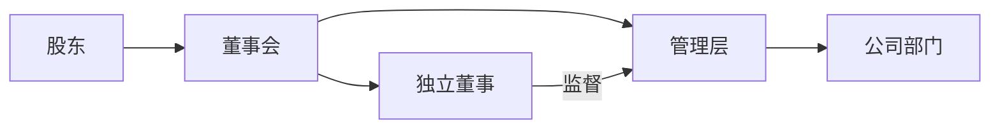
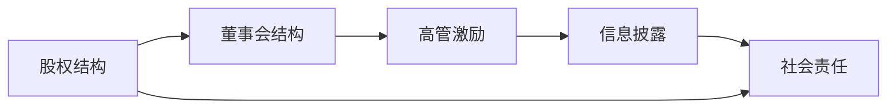
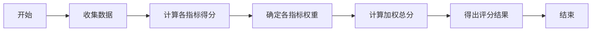

                 

# 第二章: 价值投资中的公司治理框架

## 2.1 公司治理的结构与功能

### 2.1.1 股东、董事会、管理层的关系

公司治理的核心在于股东、董事会和管理层之间的关系。股东是公司的所有者，董事会是代表股东行使监督和指导职能的机构，而管理层则是执行公司日常运营的管理团队。三者之间的关系需要清晰界定，以确保公司高效运作和股东利益的最大化。

- **股东**：作为公司的所有者，股东有权参与公司重大决策，监督公司管理层，并通过股息或资本增值获得回报。
- **董事会**：董事会是股东选举的决策机构，负责制定公司战略、监督高管、确保公司合规运营，并代表股东利益。
- **管理层**：管理层由CEO、 CFO 等高管组成，负责日常运营，执行董事会的决策，并向董事会汇报。

### 2.1.2 公司治理的三大支柱

公司治理通常由三个主要支柱构成：

1. **股权结构**：股权结构决定了股东的权力分配。合理的股权结构可以防止一股独大，确保股东之间权力制衡，避免决策集中化带来的风险。
2. **董事会结构**：董事会的独立性和多样性是公司治理的重要组成部分。独立董事的引入可以提供外部视角，避免利益冲突，提高决策的客观性。
3. **高管激励机制**：高管的激励机制直接影响其行为。有效的激励机制应与公司绩效挂钩，确保高管的行为与股东利益一致。

### 2.1.3 公司治理的功能与作用

公司治理不仅关乎内部管理，还影响公司的市场价值和投资吸引力。有效的公司治理可以：

- 提高公司透明度和信任度
- 降低代理成本，避免管理层与股东利益冲突
- 提升公司决策的科学性和有效性
- 增强投资者信心，提升公司股价

### 2.1.4 公司治理的结构图（Mermaid）

## 2.2 价值投资中的公司治理考量维度

### 2.2.1 股权结构与控制权

股权结构是公司治理的核心要素之一。投资者需要关注以下方面：

- **股权分散度**：股权过于集中可能导致控股股东滥用权力，损害中小股东利益。
- **股东类型**：机构投资者和战略投资者的引入可以提高公司治理的专业性和透明度。
- **投票权分配**：不同的股权结构可能赋予股东不同的投票权，影响董事会决策。

### 2.2.2 董事会结构与独立性

董事会的结构和独立性直接影响公司治理的有效性。

- **董事会规模**：合理的董事会规模应确保决策的多样性和效率，避免规模过大导致决策迟缓。
- **独立董事比例**：独立董事的比例越高，董事会的独立性和客观性越强。
- **董事会职责**：董事会应明确战略制定、风险管理和高管监督的职责，避免角色模糊。

### 2.2.3 高管激励与职业道德

高管的激励机制是公司治理的重要组成部分。

- **激励方式**：股票期权、限制性股票等长期激励工具可以将高管利益与股东利益绑定。
- **激励效果**：激励机制应与公司绩效挂钩，避免短期行为，促进长期发展。
- **职业道德**：高管的职业道德和诚信是公司治理的关键因素，影响公司的长期发展和投资者信任。

### 2.2.4 信息披露与透明度

透明的信息披露是公司治理的重要保障。

- **披露内容**：公司应披露财务信息、战略规划、风险因素等关键信息。
- **披露频率**：定期披露（如季度报告、半年报、年报）有助于投资者及时了解公司动态。
- **披露渠道**：通过公司官网、投资者关系平台等多渠道披露，确保信息广泛传播。

### 2.2.5 社会责任与可持续发展

社会责任和可持续发展越来越受到投资者的重视。

- **环境保护**：公司应减少对环境的负面影响，推动绿色生产。
- **社会责任**：公司应关注员工福利、社区发展等社会责任，提升企业形象。
- **可持续发展**：制定长期可持续发展战略，确保公司长期稳定发展。

### 2.2.6 公司治理考量维度的对比表

| 维度               | 关注点                               | 影响因素                                 |
|--------------------|------------------------------------|----------------------------------------|
| 股权结构           | 股东权力分配、股权分散度           | 股东类型、股权比例                       |
| 董事会结构         | 独立董事比例、董事会规模           | 董事会职责、独立董事的专业性             |
| 高管激励           | 激励方式、激励效果                 | 高管行为、公司绩效                       |
| 信息披露           | 信息披露内容、披露频率             | 信息透明度、投资者信任                   |
| 社会责任           | 环境保护、社会责任                 | 公司形象、可持续发展                     |

### 2.2.7 公司治理考量维度的关系图（Mermaid）

## 2.3 公司治理评价指标与模型

### 2.3.1 公司治理评价指标的选择

选择合适的评价指标是构建公司治理模型的关键。常用指标包括：

- **独立董事比例**：衡量董事会独立性。
- **董事会会议次数**：反映董事会对公司的关注程度。
- **高管持股比例**：衡量高管与股东的利益一致性。
- **信息披露及时性**：反映公司透明度。
- **股东诉讼数量**：反映公司治理风险。

### 2.3.2 公司治理评价的数学模型

构建一个简单的公司治理评分模型，通过加权评分法进行评价。

#### 模型公式：

$$
\text{公司治理评分} = \sum (\text{权重}_i \times \text{指标得分}_i)
$$

其中，权重之和为1：

$$
\sum \text{权重}_i = 1
$$

#### 指标得分计算：

每个指标按五级评分（1-5分），权重根据重要性确定。

例如：

- 独立董事比例：权重0.2，得分范围1-5
- 高管持股比例：权重0.3，得分范围1-5
- 信息披露及时性：权重0.1，得分范围1-5
- 葡萄牙肯定

### 2.3.3 公司治理评价流程图（Mermaid）

## 2.4 本章小结

本章详细探讨了公司治理的结构与功能，分析了价值投资中公司治理考量的维度，包括股权结构、董事会结构、高管激励、信息披露和社会责任等方面。同时，构建了一个简单的公司治理评价模型，为投资者提供了评估公司治理状况的参考工具。通过这些分析，投资者可以更好地识别和评估公司治理风险，做出更明智的投资决策。

在接下来的章节中，我们将通过实际案例分析，进一步验证公司治理在价值投资中的重要性，并探讨如何将公司治理因素整合到投资策略中，以实现长期稳健的回报。

