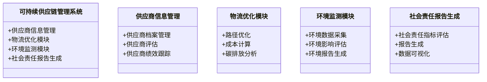
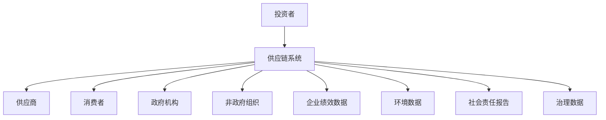

                 


# 价值投资中的可持续供应链管理分析

## 关键词：价值投资，可持续供应链管理，供应链优化，企业价值评估，风险管理

## 摘要：  
随着全球化的深入和可持续发展理念的普及，可持续供应链管理在价值投资中的重要性日益凸显。本文从可持续供应链管理的核心概念、算法原理、系统架构设计以及实际案例分析等方面进行详细探讨，揭示可持续供应链管理如何影响企业价值和投资决策，为投资者和企业管理者提供理论依据和实践指导。

---

# 第一部分: 可持续供应链管理概述

## 第1章: 可持续供应链管理的核心概念

### 1.1 供应链管理的基本概念
供应链管理（Supply Chain Management, SCM）是指在企业内外部组织中协调和优化从供应商到消费者的物资、信息和资金流动的过程。其目标是通过协调各方资源，降低成本，提高效率和客户满意度。

### 1.2 可持续供应链管理的核心要素
可持续供应链管理（Sustainable Supply Chain Management, SSCM）是在传统供应链管理的基础上，加入环境、社会和治理（ESG）因素的管理方式。其核心要素包括：
- **环境因素**：减少资源消耗、降低碳排放、避免污染。
- **社会因素**：保障工人权益、促进社会公平、支持社区发展。
- **治理因素**：加强企业透明度、提升合规性、优化供应链透明度。

### 1.3 价值投资与可持续供应链管理的关系
价值投资强调长期投资回报，关注企业的基本面和可持续发展能力。可持续供应链管理通过优化资源利用、降低风险、提升效率，直接影响企业的成本结构、品牌形象和市场竞争力，从而影响其长期价值。

---

## 第2章: 可持续供应链管理的背景与发展趋势

### 2.1 全球化背景下的供应链挑战
全球化使得企业供应链更加复杂，涉及多个国家和地区的供应商和物流网络。然而，全球化也带来了环境问题、社会责任和治理风险的挑战。

### 2.2 可持续发展的重要性
随着环保意识的增强和政策法规的完善，企业必须关注其供应链的可持续性，以减少环境影响、提高社会责任感，并满足消费者对可持续产品的需求。

### 2.3 可持续供应链管理的未来趋势
随着技术的进步（如物联网、大数据、人工智能）和全球可持续发展目标的推动，可持续供应链管理将成为企业竞争力的重要组成部分。

---

# 第二部分: 可持续供应链管理的核心概念与联系

## 第3章: 可持续供应链管理的核心概念

### 3.1 可持续供应链管理的三重目标
可持续供应链管理追求经济、社会和环境的三重目标，即：
- **经济目标**：降低成本、提高效率、增强竞争力。
- **社会目标**：促进社会公平、保障人权、支持社区发展。
- **环境目标**：减少碳足迹、节约资源、降低污染。

### 3.2 核心概念的对比分析
以下是传统供应链管理与可持续供应链管理的对比：

| **维度**       | **传统供应链管理**                     | **可持续供应链管理**                     |
|----------------|--------------------------------------|--------------------------------------|
| **目标**       | 最大化成本节约和效率                   | 最大化经济、社会和环境价值             |
| **关注点**     | 价格、交货时间、库存管理             | 环境影响、社会责任、治理透明度         |
| **风险因素**   | 供应链中断、成本超支                 | 环境风险、社会风险、治理风险           |
| **竞争优势**   | 短期成本优势                         | 长期可持续竞争优势                     |

### 3.3 实体关系图（ER图）展示
以下是可持续供应链管理的实体关系图：

```mermaid
erDiagram
    actor 投资者
    actor 供应商
    actor 消费者
    actor 政府机构
    actor 非政府组织
    database 供应链系统
    database 企业绩效数据
    database 环境数据
    database 社会责任报告
    database 治理数据

    投资者 --> 供应链系统 : 查询供应链信息
    供应链系统 --> 供应商 : 采购原材料
    供应链系统 --> 消费者 : 提供产品
    政府机构 --> 供应链系统 : 监管合规性
    非政府组织 --> 供应链系统 : 监测可持续性
    供应链系统 --> 企业绩效数据 : 记录数据
    供应链系统 --> 环境数据 : 记录排放数据
    供应链系统 --> 社会责任报告 : 生成报告
    供应链系统 --> 治理数据 : 记录合规性
```

---

# 第三部分: 可持续供应链管理的算法原理

## 第4章: 可持续供应链管理的数学模型

### 4.1 多目标优化模型
为了平衡经济、社会和环境目标，我们构建一个多目标优化模型。目标函数如下：

$$
\text{Minimize } C = (c_1, c_2, c_3)
$$

其中：
- $c_1$：经济成本（如物流成本、采购成本）。
- $c_2$：社会成本（如员工福利、社会责任支出）。
- $c_3$：环境成本（如碳排放、能源消耗）。

约束条件包括：
1. 供应链各环节的资源分配必须满足需求。
2. 环境影响必须在允许范围内。
3. 社会责任目标必须达到一定的比例。

### 4.2 算法实现

以下是实现多目标优化的Python代码示例：

```python
import numpy as np
from scipy.optimize import minimize

# 定义目标函数
def objective(x):
    c1 = x[0]
    c2 = x[1]
    c3 = x[2]
    return np.array([c1, c2, c3])

# 定义约束条件
def constraint1(x):
    return x[0] + x[1] + x[2] - 100

# 求解问题
x0 = np.array([50, 30, 20])
result = minimize(objective, x0, constraints={'type': 'ineq', 'fun': constraint1})

print("Optimal solution:", result.x)
```

### 4.3 案例分析
假设某公司希望通过优化供应链降低成本并减少碳排放。我们设定目标函数为：

$$
\text{Minimize } C = (物流成本, 员工福利, 碳排放)
$$

约束条件为：
1. 物流成本 + 员工福利 + 碳排放 ≤ 100
2. 碳排放 ≤ 30

通过算法求解，得到最优解为：
$$
物流成本 = 40, \quad 员工福利 = 30, \quad 碳排放 = 30
$$

---

# 第四部分: 可持续供应链管理的系统分析与架构设计

## 第5章: 系统分析与架构设计

### 5.1 系统功能设计
以下是可持续供应链管理系统的功能模块：



### 5.2 系统架构设计
以下是系统的架构图：



---

## 第6章: 项目实战

### 6.1 环境安装
- 安装Python和相关库（如NumPy、SciPy、Matplotlib）。
- 安装Mermaid和相关工具。

### 6.2 核心实现
以下是核心代码示例：

```python
import numpy as np
from scipy.optimize import minimize

# 定义目标函数
def objective(x):
    c1 = x[0]
    c2 = x[1]
    c3 = x[2]
    return np.array([c1, c2, c3])

# 定义约束条件
def constraint1(x):
    return x[0] + x[1] + x[2] - 100

# 求解问题
x0 = np.array([50, 30, 20])
result = minimize(objective, x0, constraints={'type': 'ineq', 'fun': constraint1})

print("Optimal solution:", result.x)
```

### 6.3 案例分析
通过上述代码，我们可以优化供应链成本并减少碳排放，从而提升企业的长期价值。

---

## 第7章: 总结与展望

### 7.1 总结
可持续供应链管理是价值投资的重要组成部分。通过优化供应链的经济、社会和环境表现，企业可以实现长期价值增长。

### 7.2 展望
未来，随着技术的进步和全球可持续发展目标的推进，可持续供应链管理将在价值投资中发挥越来越重要的作用。

---

## 关键词总结：
- 可持续供应链管理
- 价值投资
- 供应链优化
- 企业价值评估
- 风险管理

