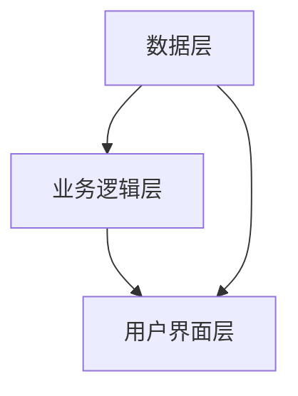
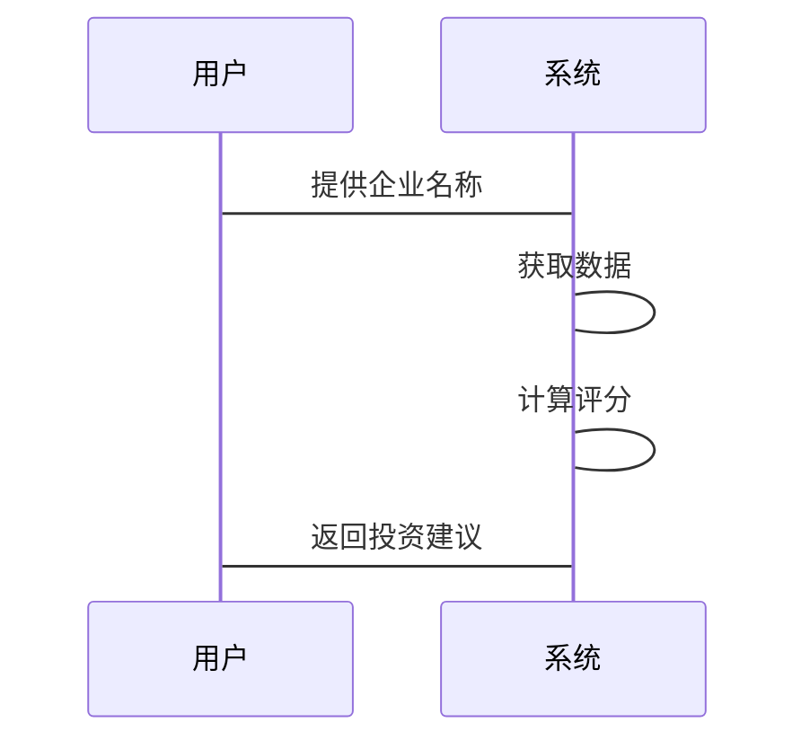

                 

# 《价值投资中的可持续发展因素》

---

## 关键词：
- 价值投资
- 可持续发展
- ESG
- 投资策略
- 风险评估

---

## 摘要：
随着全球对可持续发展的关注日益增加，投资者越来越意识到环境、社会和治理（ESG）因素对长期投资价值的重要性。本文探讨了可持续发展因素如何影响价值投资决策，分析了ESG指标对投资组合的影响，并提出了基于ESG的量化评估模型。通过实际案例分析，本文展示了如何将ESG因素整合到投资分析中，以实现长期稳健的投资回报。

---

## 第1章: 可持续发展与价值投资的背景

### 1.1 可持续发展的概念与内涵

#### 1.1.1 可持续发展的定义与特征
可持续发展是指在满足当前需求的同时，不损害未来 generations 满足其需求的能力。其核心特征包括：
- **长期性**：关注长期利益而非短期收益。
- **综合性**：涵盖经济、社会和环境三个方面。
- **系统性**：强调各因素的相互关联和协同作用。

#### 1.1.2 可持续发展与经济发展的关系
可持续发展不仅是环境保护的需要，更是经济长期稳定发展的基础。通过减少资源浪费、优化社会结构和提高治理效率，可持续发展能够降低企业的经营风险，提升其长期竞争力。

#### 1.1.3 可持续发展在投资领域的应用
在投资领域，可持续发展因素（ESG）已成为投资者评估企业价值的重要指标。越来越多的投资者意识到，忽视这些因素可能导致投资组合面临更大的风险和更低的回报。

---

### 1.2 价值投资的核心理念

#### 1.2.1 价值投资的基本概念
价值投资是一种投资策略，旨在通过分析企业的基本面（如财务状况、盈利能力、行业地位等）找到被市场低估的投资标的。其核心在于寻找具有长期竞争优势和稳定回报潜力的企业。

#### 1.2.2 价值投资与可持续发展的结合
可持续发展因素为企业提供了额外的评估维度。例如，一家具有优秀环境表现和良好社会责任记录的企业，可能在长期更具竞争优势，从而提升其投资价值。

#### 1.2.3 可持续发展因素对投资决策的影响
可持续发展因素能够帮助投资者识别潜在风险和机会。例如，一家高碳排放的企业可能面临政策风险，而一家在社会责任方面表现优异的企业可能更容易获得社会支持。

---

## 第2章: 可持续发展因素在价值投资中的重要性

### 2.1 可持续发展因素对投资价值的影响

#### 2.1.1 环境因素对投资价值的影响
环境因素包括企业的碳排放、能源使用效率、环保合规性等。这些因素不仅影响企业的运营成本，还可能对企业的声誉和市场准入造成影响。

**案例分析**：假设一家制造企业因环保违规被罚款，这将直接影响其净利润，进而影响其股票价值。

#### 2.1.2 社会因素对投资价值的影响
社会因素包括企业对员工的待遇、社会责任履行情况、社区关系等。良好的社会形象能够提升企业的品牌价值和客户忠诚度。

**案例分析**：一家积极参与社会责任的企业可能更容易获得消费者的青睐，从而提升市场份额和盈利能力。

#### 2.1.3 治理因素对投资价值的影响
治理因素包括公司治理结构、管理层素质、内部控制等。高效的治理结构能够提升企业的运营效率和风险管理能力。

**案例分析**：一家治理结构混乱的企业可能面临管理层决策失误的风险，从而影响企业的长期发展。

---

### 2.2 可持续发展因素与企业长期价值的关系

#### 2.2.1 企业可持续发展能力与股价的关系
企业的可持续发展能力直接影响其长期盈利能力和股价表现。研究表明，具有优秀ESG表现的企业往往能够获得更高的估值。

**数学模型**：
$$
\text{企业价值} = \text{财务价值} + \text{ESG价值}
$$

#### 2.2.2 可持续发展因素对企业风险的影响
可持续发展因素能够降低企业的经营风险。例如，优秀的环境表现可以降低政策风险，良好的社会形象可以降低声誉风险。

#### 2.2.3 可持续发展因素对企业竞争优势的影响
可持续发展因素能够增强企业的核心竞争力。例如，绿色生产技术可以降低生产成本，同时满足环保要求。

---

## 第3章: 可持续发展因素的量化分析

### 3.1 环境因素的量化分析

#### 3.1.1 碳排放量的计算与分析
碳排放量是衡量企业环境表现的重要指标。通过计算企业的碳排放强度，可以评估其环境表现。

**公式**：
$$
\text{碳排放强度} = \frac{\text{总碳排放}}{\text{收入}}
$$

#### 3.1.2 能源使用效率的评估
能源使用效率可以通过单位产品能耗来衡量。较低的单位产品能耗意味着更高的能源使用效率。

**公式**：
$$
\text{单位产品能耗} = \frac{\text{总能源消耗}}{\text{产品数量}}
$$

#### 3.1.3 环境合规性与风险评估
环境合规性是指企业是否符合相关环保法规。合规性差的企业可能面临更高的环境风险。

---

### 3.2 社会因素的量化分析

#### 3.2.1 社会责任履行情况的评估
社会责任履行情况可以通过企业对员工、社区和社会公益事业的投入来衡量。

**公式**：
$$
\text{社会责任指数} = \frac{\text{社会责任支出}}{\text{收入}}
$$

#### 3.2.2 员工关系与企业稳定性分析
员工关系是企业社会稳定的重要因素。良好的员工关系可以降低员工流失率，提升企业稳定性。

**公式**：
$$
\text{员工流失率} = \frac{\text{年度离职员工数}}{\text{员工总数}}
$$

#### 3.2.3 社会影响力与品牌价值评估
社会影响力是衡量企业品牌价值的重要因素。具有较高社会影响力的企业通常能够获得更高的品牌溢价。

---

### 3.3 治理因素的量化分析

#### 3.3.1 公司治理结构的优化评估
公司治理结构的优化可以通过董事会结构、管理层素质和股东权利保护等方面来衡量。

**公式**：
$$
\text{治理评分} = \text{董事会独立性评分} + \text{管理层素质评分} + \text{股东权利保护评分}
$$

#### 3.3.2 管理层素质与决策能力分析
管理层素质是企业治理的重要因素。高素质的管理层能够制定更科学的决策，提升企业绩效。

#### 3.3.3 内部控制与风险管理评估
内部控制是企业风险管理的重要手段。有效的内部控制能够降低企业的经营风险。

---

## 第4章: 可持续发展因素的综合评估模型

### 4.1 综合评估模型的构建

#### 4.1.1 模型构建的理论基础
综合评估模型基于ESG指标，结合企业财务数据，构建一个综合评分系统。

**公式**：
$$
\text{综合评分} = \alpha \times \text{环境评分} + \beta \times \text{社会评分} + \gamma \times \text{治理评分}
$$

其中，$\alpha$、$\beta$、$\gamma$为各因素的权重系数。

#### 4.1.2 模型的输入变量与输出结果
输入变量包括企业的环境、社会和治理评分，输出结果为企业的综合评分。

#### 4.1.3 模型的适用范围与限制
该模型适用于上市公司，但需要根据具体行业特点调整权重系数。

---

### 4.2 综合评估模型的实现

#### 4.2.1 数据收集与处理
数据来源包括企业公开披露的ESG报告、财务报表等。

#### 4.2.2 模型参数的设定
根据行业特点和投资目标，设定各因素的权重系数。

---

## 第5章: 系统架构与实现

### 5.1 问题场景介绍
本章将构建一个基于ESG的综合评估系统，帮助投资者量化企业的可持续发展能力。

### 5.2 系统功能设计

#### 5.2.1 数据采集模块
负责采集企业的环境、社会和治理数据。

#### 5.2.2 模型训练模块
负责计算企业的综合评分。

#### 5.2.3 评估与优化模块
负责根据评分结果生成投资建议。

### 5.3 系统架构设计
使用分层架构，包括数据层、业务逻辑层和用户界面层。

**系统架构图**：

### 5.4 系统接口设计
定义接口：获取企业数据、计算评分、生成报告。

### 5.5 系统交互设计
**交互流程**：
1. 用户输入企业名称。
2. 系统获取企业数据。
3. 系统计算企业评分。
4. 系统生成投资建议。

**交互图**：

---

## 第6章: 项目实战

### 6.1 环境影响分析
以某制造企业为例，计算其碳排放强度。

### 6.2 社会风险评估
评估企业社会责任履行情况。

### 6.3 治理结构优化
提出优化公司治理结构的建议。

### 6.4 投资策略建议
基于ESG评分，生成投资组合建议。

---

## 第7章: 总结与展望

### 7.1 总结
本文探讨了可持续发展因素对价值投资的影响，提出了基于ESG的量化评估模型，并通过实际案例验证了模型的有效性。

### 7.2 投资策略建议
投资者应将ESG因素纳入投资分析，以实现长期稳健的投资回报。

### 7.3 未来研究方向
未来可以研究人工智能在ESG分析中的应用，以及动态调整模型权重的方法。

---

## 小结

通过本文的分析，我们可以看到，可持续发展因素在价值投资中的重要性日益增加。投资者应充分考虑这些因素，以提升投资决策的科学性和前瞻性。

