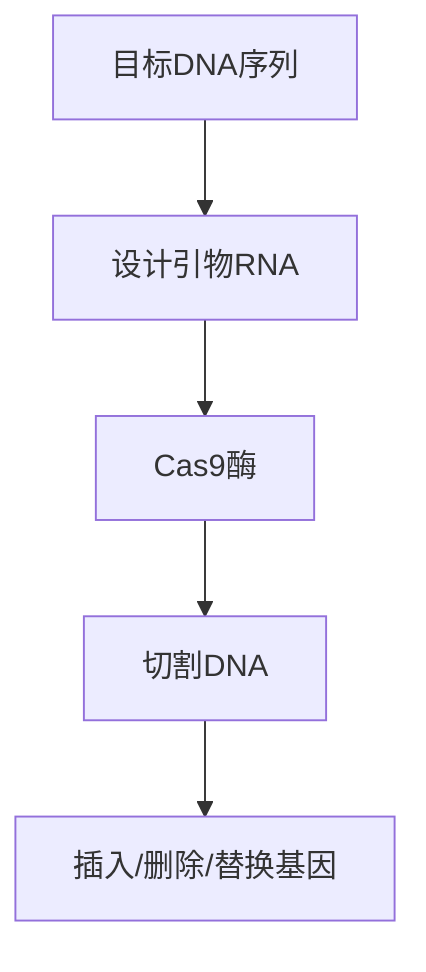
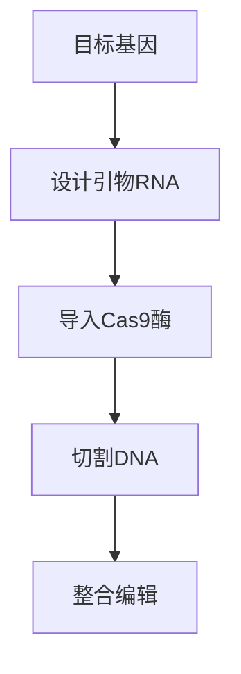

                 

<think>
好的，我需要根据用户提供的目录大纲和要求，逐步撰写《价值投资中的基因编辑作物技术发展趋势》这篇文章。首先，我将从摘要开始，然后依次撰写每一章的内容。

**摘要：**
基因编辑技术，尤其是CRISPR-Cas9，正在 revolutionize农业领域，为投资者提供了新的价值投资机会。本文分析了基因编辑作物的技术原理、市场影响、产业链效应以及政策环境，帮助投资者理解其在农业中的应用前景和投资策略。

**关键词：**
基因编辑作物、CRISPR-Cas9、价值投资、农业创新、生物技术

---

### 第1章：基因编辑技术与价值投资的结合

#### 1.1 基因编辑技术的背景与现状

**1.1.1 基因编辑技术的基本概念**
基因编辑技术是指通过人工手段修改生物的基因组，以实现特定性状的作物。CRISPR-Cas9是最先进的基因编辑工具，允许科学家精确地编辑DNA序列，从而改良作物的抗病性、营养价值和产量。

**1.1.2 基因编辑技术在农业中的应用**
基因编辑作物可以提高产量、抗虫害能力和营养价值。例如，基因编辑的大豆可能含有更高的蛋白质含量，或者抗除草剂，从而降低农民的种植成本。

**1.1.3 价值投资的基本原理与方法**
价值投资关注于识别被市场低估的公司或技术，通过长期持有获得收益。在基因编辑作物领域，投资者需要评估技术的可行性和市场的接受度，寻找那些能够持续创新和盈利的企业。

---

#### 1.2 基因编辑作物的价值投资背景

**1.2.1 农业现代化与基因编辑技术的关系**
农业现代化依赖技术创新，基因编辑技术是提升农业效率和可持续性的关键。通过基因编辑，可以培育出更适合当地气候和土壤条件的作物品种。

**1.2.2 基因编辑作物对农业产业链的影响**
从种子研发到食品加工，基因编辑技术贯穿整个产业链。例如，改良的作物品种可能减少农药使用，降低生产成本，提高食品质量。

**1.2.3 价值投资视角下的基因编辑技术趋势**
投资者应关注那些在基因编辑技术上有持续研发投入和成功案例的企业。同时，需评估相关政策和市场接受度对投资的影响。

---

### 第2章：基因编辑技术的核心原理

#### 2.1 CRISPR-Cas9技术的工作原理

**2.1.1 CRISPR-Cas9的基本结构与功能**
CRISPR-Cas9系统由两个关键部分组成：Cas9酶和引导RNA（gRNA）。Cas9是一种endonuclease，能够切割特定的DNA序列，而gRNA负责定位目标基因。

**2.1.2 基因编辑的数学模型与效率计算**
基因编辑的效率可以通过公式计算：编辑效率 = 成功编辑的细胞数 / 总细胞数。此外，还可以通过统计学方法预测编辑成功的概率。

**2.1.3 CRISPR-Cas9的流程图解析**
使用mermaid绘制CRISPR-Cas9的工作流程：



**2.1.4 Python代码实现基因编辑模拟**
以下是一个简单的Python代码示例，模拟CRISPR-Cas9的工作流程：

```python
def crisper_process(dna_sequence, guide_rna):
    # 寻找目标序列
    target = dna_sequence.find(guide_rna)
    if target == -1:
        return "未找到目标序列"
    else:
        # 模拟切割DNA
        edited_dna = dna_sequence[:target] + 'CUT' + dna_sequence[target + len(guide_rna):]
        return edited_dna

# 示例
dna = "ATCGGGTCAAGCTT"
guide = "GGT"
print(crisper_process(dna, guide))
```

#### 2.2 基因编辑技术的数学模型

**2.2.1 基因编辑效率的计算公式**
$$ \text{编辑效率} = \frac{\text{成功编辑的细胞数}}{\text{总细胞数}} $$

**2.2.2 基因编辑技术的流程图**


---

### 第3章：基因编辑作物的市场与经济影响

#### 3.1 市场现状与竞争格局

**3.1.1 基因编辑作物的市场现状**
当前，基因编辑作物在北美、欧洲和亚洲的部分地区已经获得批准并商业化。市场增长迅速，预计未来几年内将显著扩大。

**3.1.2 价值投资视角下的市场分析**
投资者应关注市场的增长潜力、政策支持和企业的研发能力。例如，具备强大研发团队和专利储备的企业更具投资价值。

---

### 第4章：基因编辑作物的系统架构与投资分析

#### 4.1 系统架构设计

**4.1.1 系统功能设计**
- **目标识别**：识别特定基因序列。
- **编辑工具选择**：选择合适的基因编辑工具（如CRISPR-Cas9）。
- **效果验证**：验证编辑后的作物特性。

**4.1.2 系统架构图**


---

### 第5章：投资策略与风险评估

#### 5.1 投资策略

**5.1.1 投资关键点**
- 技术领先性
- 市场接受度
- 政策环境

**5.1.2 风险评估与应对**
- 技术失败风险：选择有丰富经验和技术储备的企业。
- 市场风险：关注政策变化和消费者接受度。

---

### 第6章：总结与展望

**6.1 研究总结**
基因编辑技术为农业带来了革命性的变化，也为投资者提供了新的机会。

**6.2 未来展望**
随着技术进步和政策支持，基因编辑作物将在全球范围内得到更广泛应用，投资者应持续关注相关企业的动态和市场趋势。

---

通过以上思考过程，我可以系统地撰写这篇文章，确保每个部分都详细且符合要求。现在，我将按照目录大纲和具体要求，逐步撰写正文内容。

