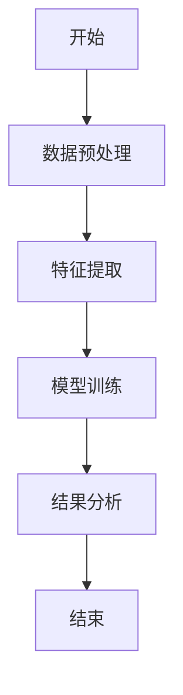
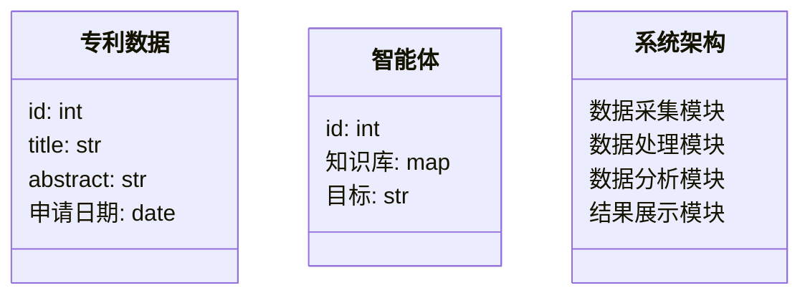
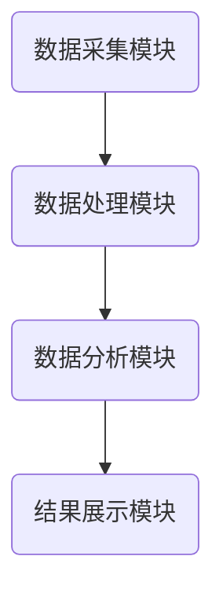
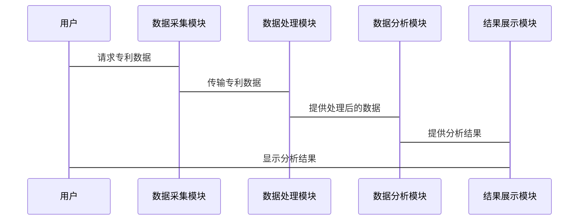

                 


```markdown
# 价值投资中的多智能体AI专利分析系统

## 关键词：价值投资，多智能体AI，专利分析，系统架构，算法原理

## 摘要：本文深入探讨了多智能体人工智能技术在专利分析系统中的应用，特别是在价值投资领域。通过构建一个多智能体AI系统，我们能够更高效地分析专利数据，识别市场趋势，评估技术风险，从而辅助投资决策。文章从系统背景、核心概念、算法原理、系统架构到项目实战，全面阐述了多智能体AI专利分析系统的构建与应用，为读者提供了理论与实践相结合的深度解析。

---

## 第一部分: 价值投资中的多智能体AI专利分析系统概述

### 第1章: 背景介绍

#### 1.1 价值投资与专利分析的结合
##### 1.1.1 价值投资的核心理念
价值投资是一种长期投资策略，强调通过深入分析企业的基本面，如财务状况、市场地位、管理团队等，来识别被市场低估的投资机会。在科技领域，专利是企业技术创新的核心体现，能够反映企业的研发能力、技术储备和竞争优势。

##### 1.1.2 专利分析在价值投资中的作用
专利分析可以帮助投资者评估企业的技术创新能力、技术布局、技术风险以及潜在的技术竞争优势。通过分析专利的数量、质量、技术领域分布、专利引用情况等指标，投资者可以更全面地评估企业的技术实力和市场竞争力。

##### 1.1.3 多智能体AI技术的应用背景
随着科技的进步，专利数据量急剧增长，传统的专利分析方法难以满足高效、精准的需求。多智能体AI技术通过分布式协作和知识共享，能够更高效地处理大规模专利数据，提供更精准的分析结果。

---

#### 1.2 多智能体AI的基本概念
##### 1.2.1 多智能体AI的定义
多智能体AI是指由多个相互作用的智能体组成的系统，每个智能体都有自己的目标、知识和能力，通过协作和竞争来实现整体目标。与传统单智能体AI相比，多智能体AI能够更好地处理复杂问题，尤其是在需要分布式计算和协作的场景中。

##### 1.2.2 多智能体AI的特点
1. **分布式计算**：多个智能体协同工作，任务分解到各个智能体。
2. **协作与竞争**：智能体之间可以协作完成任务，也可以通过竞争优化结果。
3. **自主性**：每个智能体都有一定的自主决策能力。
4. **动态性**：系统能够适应动态变化的环境。

##### 1.2.3 多智能体AI与传统AI的区别
| 特性                | 多智能体AI                                | 传统AI                                  |
|---------------------|-----------------------------------------|-----------------------------------------|
| 结构                | 分布式结构，多个智能体协作               | 集中式结构，单个智能体处理             |
| 任务处理            | 适合复杂、大规模的任务                  | 适合简单、单任务的场景                |
| 知识共享            | 支持知识共享和协作                       | 知识仅限于单个智能体                   |
| 应用场景            | 适用于需要分布式计算和协作的场景         | 适用于简单任务或小规模数据处理       |

---

#### 1.3 专利分析系统的核心要素
##### 1.3.1 专利数据的来源与处理
专利数据主要来源于专利数据库（如USPTO、EPO、WIPO等）。数据处理包括数据清洗、预处理和特征提取，确保数据的准确性和可用性。

##### 1.3.2 专利分析的关键指标
1. **专利数量**：反映企业的技术创新活跃度。
2. **专利质量**：包括专利的引用次数、技术领域的影响力等。
3. **技术领域分布**：反映企业的技术布局和研发重点。
4. **专利生命周期**：分析专利的申请、授权、维持和失效情况。

##### 1.3.3 专利分析系统的功能架构
1. **数据采集模块**：从专利数据库中获取专利数据。
2. **数据处理模块**：清洗、转换和预处理数据。
3. **数据分析模块**：运用多智能体AI算法进行分析和建模。
4. **结果展示模块**：以可视化的方式呈现分析结果。

---

### 第2章: 多智能体AI与专利分析的核心概念

#### 2.1 多智能体AI的原理
##### 2.1.1 多智能体AI的协作机制
多智能体AI通过分布式计算和协作学习，能够在不同智能体之间共享知识和信息，从而提高整体的分析效率和准确性。

##### 2.1.2 多智能体AI的通信协议
智能体之间需要通过特定的通信协议进行信息交换，常见的通信协议包括基于消息队列的通信和基于共享数据库的通信。

##### 2.1.3 多智能体AI的决策模型
每个智能体都有自己的决策模型，能够根据接收到的信息做出决策，并与其他智能体协作完成任务。

---

#### 2.2 专利分析系统的结构
##### 2.2.1 数据采集模块
数据采集模块负责从专利数据库中获取专利数据，并进行初步清洗和预处理。

##### 2.2.2 数据处理模块
数据处理模块对专利数据进行特征提取和数据转换，为后续的分析提供高质量的数据。

##### 2.2.3 数据分析模块
数据分析模块运用多智能体AI算法对专利数据进行建模和分析，生成有价值的分析结果。

##### 2.2.4 结果展示模块
结果展示模块以可视化的方式呈现分析结果，帮助用户更好地理解和应用分析结果。

---

#### 2.3 多智能体AI与专利分析的关联
##### 2.3.1 多智能体AI在专利数据处理中的应用
多智能体AI可以通过分布式计算高效处理大规模专利数据，提升数据处理效率和准确性。

##### 2.3.2 多智能体AI在专利分析中的优势
多智能体AI能够从多个角度分析专利数据，提供更全面的分析结果，帮助投资者做出更精准的投资决策。

##### 2.3.3 多智能体AI与传统专利分析方法的对比
| 特性                | 多智能体AI专利分析系统                  | 传统专利分析方法                    |
|---------------------|----------------------------------------|----------------------------------------|
| 分析效率            | 高，分布式计算能力强                   | 低，依赖单个计算单元                 |
| 分析深度            | 深，能够从多个维度进行分析              | 浅，分析维度有限                     |
| 可扩展性            | 好，能够处理大规模数据                 | 一般，处理大规模数据能力有限         |

---

### 第3章: 多智能体AI专利分析系统的算法原理

#### 3.1 多智能体AI的核心算法
##### 3.1.1 强化学习算法
强化学习是一种通过智能体与环境交互，不断优化决策策略的算法。在多智能体AI中，强化学习可以用于智能体之间的协作与竞争。

##### 3.1.2 协作学习算法
协作学习是一种通过多个智能体协作完成任务的算法。在专利分析中，协作学习可以用于不同智能体之间的知识共享和协作分析。

##### 3.1.3 聚类算法
聚类算法是一种无监督学习算法，用于将相似的数据点分组。在专利分析中，聚类算法可以用于识别技术领域的分布和趋势。

---

#### 3.2 专利分析的算法实现
##### 3.2.1 专利分类算法
专利分类算法用于将专利按照技术领域进行分类。常用的算法包括K-means、层次聚类等。

##### 3.2.2 专利相似度计算算法
专利相似度计算算法用于衡量不同专利之间的相似性。常用的算法包括余弦相似度、Jaccard相似度等。

##### 3.2.3 专利趋势预测算法
专利趋势预测算法用于预测未来专利的申请趋势。常用的算法包括时间序列分析、ARIMA模型等。

---

#### 3.3 算法流程图


#### 3.4 算法实现代码示例
```python
import numpy as np
from sklearn.cluster import KMeans

# 示例数据：专利文本表示为向量
X = np.array([[1, 2], [3, 4], [5, 6], [7, 8]])

# 使用K-means算法进行聚类
kmeans = KMeans(n_clusters=2, random_state=0)
kmeans.fit(X)

# 获取聚类结果
labels = kmeans.labels_
print(labels)
```

---

### 第4章: 系统分析与架构设计

#### 4.1 系统工作流程
1. 数据采集：从专利数据库中获取专利数据。
2. 数据处理：清洗、预处理和特征提取。
3. 数据分析：运用多智能体AI算法进行分析和建模。
4. 结果展示：以可视化的方式呈现分析结果。

---

#### 4.2 系统架构设计
##### 4.2.1 领域模型类图


##### 4.2.2 系统架构图


##### 4.2.3 系统交互序列图


---

### 第5章: 项目实战

#### 5.1 环境安装
1. 安装Python和相关库（如numpy、pandas、scikit-learn等）。
2. 安装专利数据库访问工具（如USPTO API）。

#### 5.2 核心代码实现
```python
import requests
from sklearn.decomposition import PCA

# 示例代码：从USPTO API获取专利数据
url = "https://api.uspto.gov/patents/search"
params = {
    "q": "IPC/A",
    "offset": 0,
    "limit": 10
}
response = requests.get(url, params=params)
data = response.json()

# 数据预处理
patents = data['results']
X = []
for patent in patents:
    X.append([patent['id'], patent['filingDate'], patent['title']])

# 使用PCA进行特征降维
pca = PCA(n_components=2)
pca.fit(X)
transformed_X = pca.transform(X)

# 可视化结果
import matplotlib.pyplot as plt
plt.scatter(transformed_X[:, 0], transformed_X[:, 1])
plt.xlabel('Principal Component 1')
plt.ylabel('Principal Component 2')
plt.show()
```

#### 5.3 案例分析
以某科技公司为例，分析其专利申请趋势、技术领域分布和专利质量，评估其技术竞争力和投资价值。

---

## 第六章: 总结与展望

### 6.1 总结
本文详细介绍了多智能体AI在专利分析系统中的应用，探讨了其在价值投资中的潜力和优势。通过构建一个多智能体AI专利分析系统，投资者能够更高效、精准地分析专利数据，做出更明智的投资决策。

### 6.2 展望
未来，随着多智能体AI技术的不断发展，专利分析系统将更加智能化和高效化。同时，结合自然语言处理和大数据分析技术，专利分析系统将能够提供更全面、更深入的分析结果，为价值投资提供更有力的支持。

---

## 关键词：价值投资，多智能体AI，专利分析，系统架构，算法原理

## 摘要：本文深入探讨了多智能体人工智能技术在专利分析系统中的应用，特别是在价值投资领域。通过构建一个多智能体AI系统，我们能够更高效地分析专利数据，识别市场趋势，评估技术风险，从而辅助投资决策。文章从系统背景、核心概念、算法原理、系统架构到项目实战，全面阐述了多智能体AI专利分析系统的构建与应用，为读者提供了理论与实践相结合的深度解析。
```

