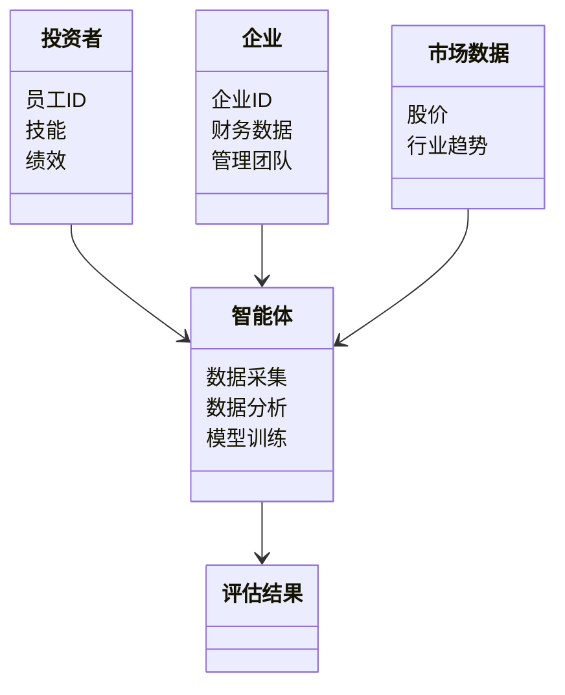
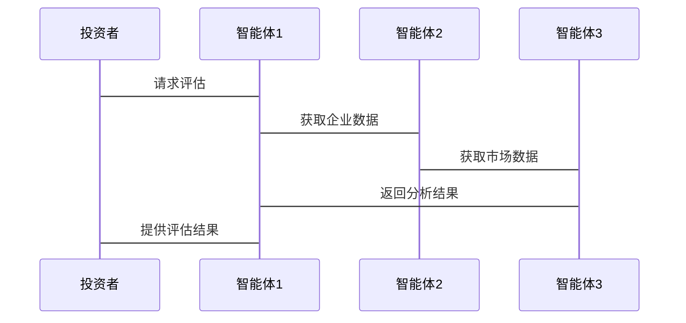

                 


# 价值投资中的多智能体AI人力资本评估系统

> 关键词：价值投资、多智能体AI、人力资本评估、人工智能、金融分析、系统架构设计

> 摘要：本文详细探讨了在价值投资领域中，如何利用多智能体人工智能技术进行人力资本评估。通过系统性的分析与设计，本文提出了一个创新的多智能体AI人力资本评估系统，结合数学模型与算法原理，展示了该系统在实际金融分析中的应用场景与优势。文章从背景介绍、核心概念、算法原理、系统架构设计到项目实战，全面阐述了该系统的构建与实现过程，为金融领域的智能化转型提供了新的思路与方法。

---

# 第1章: 价值投资与多智能体AI概述

## 1.1 价值投资的基本概念

### 1.1.1 价值投资的定义与核心理念
- **价值投资**是一种以内在价值为导向的投资策略，旨在通过分析企业的基本面，寻找市场价格低于其内在价值的股票进行投资。
- 核心理念包括：
  1. 企业的内在价值是其未来现金流的现值。
  2. 市场价格的波动为价值投资者提供了获利机会。
  3. 长期投资，避免频繁交易。

### 1.1.2 价值投资在现代金融中的地位
- 价值投资是金融投资领域的重要流派之一，与趋势投资、技术分析等方法形成对比。
- 在现代金融中，价值投资结合量化分析与人工智能技术，展现出新的发展潜力。

### 1.1.3 价值投资与传统投资方法的对比
| 对比维度         | 价值投资                     | 传统投资方法                 |
|------------------|----------------------------|-----------------------------|
| 投资策略         | 长期持有，寻找低估股票       | 短期交易，跟随市场趋势       |
| 分析方法         | 基于基本面分析               | 基于技术分析或市场情绪分析   |
| 风险管理         | 严格控制估值偏差            | 更依赖市场波动捕捉机会       |

---

## 1.2 多智能体AI的基本原理

### 1.2.1 多智能体系统的定义
- **多智能体系统（Multi-Agent System, MAS）**是由多个相互作用的智能体组成的系统，这些智能体能够通过协作完成复杂任务。
- 每个智能体具备感知、决策和执行能力，能够独立运作，同时与其他智能体协同。

### 1.2.2 多智能体系统的核心特征
- **分布性**：智能体分布在网络中，独立运作。
- **协作性**：智能体之间通过信息交互协同完成任务。
- **适应性**：智能体能够根据环境变化动态调整行为。
- **自主性**：智能体具备自主决策能力。

### 1.2.3 多智能体系统在金融领域的应用潜力
- **金融数据分析**：多智能体可以协同分析市场数据、企业基本面等信息。
- **风险控制**：通过智能体之间的协作，实时监控并预警风险。
- **投资决策支持**：结合多智能体的分析结果，辅助价值投资决策。

---

## 1.3 人力资本评估的背景与意义

### 1.3.1 人力资本的定义与内涵
- **人力资本**：指人类在知识、技能、经验等方面的资本积累，是企业核心竞争力的重要组成部分。
- 人力资本评估的核心在于量化员工的贡献价值，为企业的招聘、培训和激励提供依据。

### 1.3.2 人力资本评估的重要性
- 企业通过评估人力资本，可以优化人力资源管理，提升员工绩效。
- 在金融领域，人力资本评估可以帮助机构优化投资决策，评估管理团队的质量。

### 1.3.3 传统人力资本评估方法的局限性
- **主观性**：传统评估方法依赖人工判断，存在主观偏差。
- **数据不足**：难以全面收集员工的动态数据。
- **效率低下**：评估过程耗时长，难以实时反馈。

---

## 1.4 多智能体AI在人力资本评估中的应用前景

### 1.4.1 多智能体AI的优势
- **数据处理能力强**：多智能体系统能够处理海量数据，提取有价值的信息。
- **协作能力强**：多个智能体协同工作，提升评估的全面性和准确性。
- **实时性**：系统能够实时更新数据，提供动态评估结果。

### 1.4.2 人力资本评估的复杂性与挑战
- **数据隐私问题**：员工数据的隐私保护是重要挑战。
- **模型准确性**：如何确保评估模型的准确性和可靠性。
- **人机协作**：如何平衡人工判断与机器算法的关系。

### 1.4.3 多智能体AI在价值投资中的潜在价值
- **团队评估**：通过多智能体系统评估管理团队的能力和稳定性。
- **市场情绪分析**：利用多智能体分析投资者情绪，辅助价值判断。
- **风险预警**：实时监控市场和企业动态，预警潜在风险。

---

## 1.5 本章小结
本章主要介绍了价值投资与多智能体AI的基本概念，分析了传统人力资本评估的局限性，并探讨了多智能体AI在人力资本评估中的应用前景。多智能体AI技术能够有效解决传统评估方法的不足，为价值投资提供了新的技术手段。

---

# 第2章: 多智能体AI人力资本评估系统的背景与问题分析

## 2.1 问题背景

### 2.1.1 传统人力资本评估的局限性
- 传统评估方法依赖人工判断，主观性较强。
- 数据来源单一，难以全面反映员工能力。
- 评估周期长，难以满足实时性需求。

### 2.1.2 价值投资中的信息不对称问题
- 信息不对称导致投资者难以准确评估企业的内在价值。
- 市场信息的复杂性增加了投资决策的难度。

### 2.1.3 人工智能在金融分析中的应用现状
- 人工智能技术已经在金融数据分析、风险评估等领域得到广泛应用。
- 多智能体系统在金融领域的应用还处于探索阶段。

---

## 2.2 核心概念与联系

### 2.2.1 核心概念原理
- **多智能体系统**：多个智能体协同工作，完成复杂任务。
- **人力资本评估**：通过数据分析评估员工的能力和价值。
- **价值投资**：基于企业内在价值进行投资决策。

### 2.2.2 核心概念属性特征对比表
| 核心概念         | 多智能体系统         | 人力资本评估         | 价值投资         |
|------------------|--------------------|---------------------|----------------|
| 核心目标         | 协作完成任务       | 量化人力资本价值     | 寻找低估股票     |
| 主要特征         | 分布式、协作性      | 数据驱动、量化评估   | 基于基本面分析   |
| 应用场景         | 金融数据分析       | 企业人力资源管理     | 投资决策支持     |

### 2.2.3 ER实体关系图架构
```mermaid
erDiagram
    actor 投资者 {
        <属性> 员工ID
        <属性> 技能
        <属性> 绩效
    }
    actor 企业 {
        <属性> 企业ID
        <属性> 财务数据
        <属性> 管理团队
    }
    actor 市场数据 {
        <属性> 股价
        <属性> 行业趋势
    }
    该系统 {
        <关联> 投资者 --> 企业
        <关联> 企业 --> 市场数据
        <关联> 投资者 --> 市场数据
    }
```

---

## 2.3 系统边界与外延

### 2.3.1 系统边界定义
- 本系统专注于多智能体AI在人力资本评估中的应用，不涉及企业的其他业务模块。

### 2.3.2 系统外延与相关领域
- **人力资源管理**：系统与企业的人力资源管理系统集成。
- **财务分析**：系统与企业的财务数据系统对接。
- **市场分析**：系统与市场数据供应商对接。

### 2.3.3 系统与外部环境的交互关系
- **输入**：员工数据、企业数据、市场数据。
- **输出**：人力资本评估结果、投资建议。

---

## 2.4 核心要素组成

### 2.4.1 多智能体AI模块
- 负责数据的采集、分析和协同处理。
- 使用多智能体算法对数据进行建模和预测。

### 2.4.2 人力资本评估模块
- 对员工的能力、绩效进行量化评估。
- 提供员工的价值评分和潜力分析。

### 2.4.3 价值投资决策模块
- 结合企业的人力资本评估结果，提供投资建议。
- 优化投资组合，降低风险。

---

## 2.5 本章小结
本章从问题背景出发，分析了多智能体AI人力资本评估系统的必要性，明确了系统的边界与核心要素，为后续的系统设计奠定了基础。

---

# 第3章: 多智能体AI人力资本评估系统的算法原理

## 3.1 多智能体协同学习算法

### 3.1.1 联邦学习（Federated Learning）
- **定义**：分布式机器学习技术，通过在多个设备或服务器上分别训练模型，然后将模型参数汇总到中央服务器，形成统一的模型。
- **优点**：保护数据隐私，避免数据集中存储。
- **流程图**：
  ```mermaid
  graph TD
      A[投资者] --> B[智能体1]
      B --> C[智能体2]
      C --> D[智能体3]
      D --> E[模型更新]
      E --> F[中央服务器]
  ```

### 3.1.2 联合学习（Collaborative Learning）
- **定义**：多个智能体通过共享数据或模型参数，共同优化一个全局模型。
- **优点**：能够利用分布式数据资源，提升模型的泛化能力。
- **算法实现**：
  ```python
  def collaborative_learning(smart_agents):
      global_model = initialize_model()
      for agent in smart_agents:
          local_model = agent.train(global_model)
          global_model.update(local_model)
      return global_model
  ```

### 3.1.3 多智能体强化学习
- **定义**：多个智能体在环境中通过强化学习算法进行协作，完成复杂任务。
- **优点**：适用于动态环境，能够快速适应变化。
- **数学模型**：
  $$ Q(s, a) = \max_{a'} Q(s', a') + \gamma Q(s, a) $$

---

## 3.2 多智能体系统中的信息交互机制

### 3.2.1 信息传递协议
- **数据格式**：采用JSON或Protobuf格式进行数据交互。
- **通信方式**：通过HTTP或WebSocket协议进行实时通信。

### 3.2.2 信息融合方法
- **加权融合**：根据智能体的权威性或数据质量进行加权融合。
  $$ merged_result = \sum_{i=1}^{n} w_i \cdot result_i $$
- **共识算法**：采用共识算法（如拜占庭容错）达成一致结果。

### 3.2.3 信息共享策略
- **按需共享**：根据任务需求动态决定共享信息的范围。
- **隐私保护**：通过加密或隐私计算技术保护数据隐私。

---

## 3.3 价值投资模型中的数学公式

### 3.3.1 企业内在价值计算公式
$$ V = \frac{CF}{r - g} $$
其中，\( CF \) 为未来现金流，\( r \) 为贴现率，\( g \) 为增长率。

### 3.3.2 投资组合优化模型
$$ \min \sigma^2 \quad \text{subject to} \quad \mathbb{E}[r] \geq r_{target} $$
其中，\( \sigma^2 \) 为投资组合的方差，\( \mathbb{E}[r] \) 为期望收益，\( r_{target} \) 为目标收益。

---

## 3.4 本章小结
本章详细介绍了多智能体AI人力资本评估系统的算法原理，重点讲解了联邦学习、联合学习和强化学习等算法，并分析了系统中的信息交互机制。这些算法和机制为系统的实现提供了理论基础。

---

# 第4章: 多智能体AI人力资本评估系统的系统架构设计

## 4.1 问题场景介绍
- 系统需要评估企业的管理团队能力，辅助投资者进行价值投资决策。
- 数据来源包括企业财务数据、市场数据、员工绩效数据等。

## 4.2 项目介绍
- **项目目标**：构建一个多智能体AI系统，实现对企业管理团队的量化评估。
- **项目范围**：覆盖企业数据采集、分析、评估、决策支持等环节。

---

## 4.3 系统功能设计

### 4.3.1 领域模型


### 4.3.2 系统架构设计


### 4.3.3 系统接口设计
- **输入接口**：接收企业数据、市场数据和员工绩效数据。
- **输出接口**：提供人力资本评估结果和投资建议。
- **通信接口**：智能体之间的通信接口，采用WebSocket协议。

### 4.3.4 系统交互设计


---

## 4.4 本章小结
本章从系统架构的角度，详细设计了多智能体AI人力资本评估系统的功能模块和交互流程，为系统的实现提供了清晰的设计蓝图。

---

# 第5章: 多智能体AI人力资本评估系统的项目实战

## 5.1 环境安装与配置

### 5.1.1 安装Python与相关库
- 安装Python 3.8及以上版本。
- 安装必要的库：`numpy`, `pandas`, `scikit-learn`, `flask`, `websockets`。

### 5.1.2 安装开发工具
- 安装`PyCharm`或`VS Code`作为开发环境。
- 配置虚拟环境，安装项目依赖。

---

## 5.2 系统核心实现

### 5.2.1 多智能体协同学习实现
```python
import numpy as np
from sklearn.linear_model import LinearRegression

class SmartAgent:
    def __init__(self, data):
        self.model = LinearRegression()
        self.data = data

    def train(self, global_model):
        self.model.fit(self.data, target)
        return self.model.coef_

agents = [SmartAgent(data1), SmartAgent(data2), SmartAgent(data3)]
global_model = initialize_model()
for agent in agents:
    global_model.update(agent.train(global_model))
```

### 5.2.2 人力资本评估实现
```python
def calculate_human_capital(employee_data):
    # 数据预处理
    normalized_data = (employee_data - np.mean(employee_data)) / np.std(employee_data)
    # 模型训练
    model = LinearRegression().fit(normalized_data, target)
    # 评估结果
    return model.predict(new_employee_data)
```

### 5.2.3 投资决策支持实现
```python
def value_investment(enterprise_data):
    # 计算内在价值
    cf = enterprise_data['cash_flows']
    r = 0.08
    g = 0.02
    value = cf / (r - g)
    return value
```

---

## 5.3 代码应用解读与分析

### 5.3.1 多智能体协同学习代码解读
- `SmartAgent`类：表示一个智能体，包含数据和模型。
- `train`方法：训练模型并返回模型参数。
- `global_model`：全局模型，接收各智能体的训练结果并更新。

### 5.3.2 人力资本评估代码解读
- `calculate_human_capital`函数：对员工数据进行标准化，并使用线性回归模型进行评估。
- `new_employee_data`：待评估的员工数据。

### 5.3.3 投资决策支持代码解读
- `value_investment`函数：计算企业的内在价值。
- `cf`：未来现金流，`r`：贴现率，`g`：增长率。

---

## 5.4 实际案例分析与详细讲解

### 5.4.1 案例背景
- 某企业的人力资本数据，包括员工技能、绩效和市场数据。

### 5.4.2 数据分析与处理
- 使用Python进行数据清洗和特征工程。
- 通过多智能体协同学习训练模型，评估员工价值。

### 5.4.3 投资决策支持
- 基于评估结果，提供投资建议，优化投资组合。

---

## 5.5 本章小结
本章通过实际案例，详细展示了多智能体AI人力资本评估系统的实现过程，包括环境配置、系统核心实现和案例分析，为读者提供了实践指导。

---

# 第6章: 多智能体AI人力资本评估系统的最佳实践与总结

## 6.1 最佳实践 tips

### 6.1.1 数据隐私保护
- 使用联邦学习技术保护数据隐私。
- 采用加密算法确保数据传输安全。

### 6.1.2 系统优化建议
- 定期更新模型，确保评估结果的准确性。
- 提供可视化界面，方便用户操作。

### 6.1.3 技术扩展方向
- 引入深度学习技术，提升模型的表达能力。
- 结合自然语言处理技术，分析文本数据。

---

## 6.2 小结
通过本文的详细讲解，我们了解了多智能体AI在人力资本评估中的应用，掌握了系统的实现方法和最佳实践。多智能体AI技术为价值投资提供了新的可能性，未来可以在更多领域进行拓展和应用。

---

## 6.3 注意事项

### 6.3.1 数据质量
- 数据来源必须可靠，避免低质量数据影响评估结果。
- 数据清洗和特征工程是关键步骤。

### 6.3.2 系统维护
- 定期更新模型，适应市场变化。
- 监控系统性能，确保稳定运行。

### 6.3.3 风险管理
- 评估结果仅供参考，需结合实际情况进行判断。
- 建立风险管理机制，避免过度依赖系统。

---

## 6.4 拓展阅读
- 推荐阅读《多智能体系统与分布式计算》。
- 关注人工智能在金融领域的最新研究。

---

# 附录: 术语表

- **多智能体系统（MAS）**：由多个智能体组成的分布式系统，智能体能够协同完成任务。
- **联邦学习（Federated Learning）**：分布式机器学习技术，保护数据隐私。
- **价值投资**：基于企业内在价值的投资策略。

---

通过以上章节的详细阐述，本文系统地介绍了多智能体AI在人力资本评估中的应用，为价值投资者提供了新的工具和方法。

