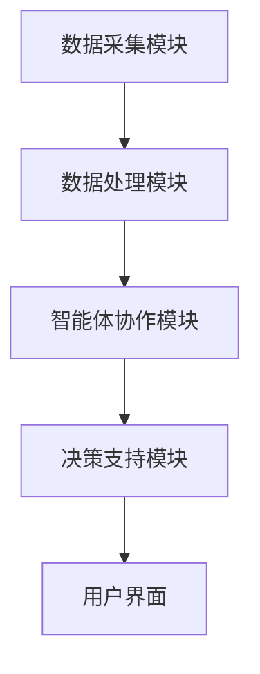
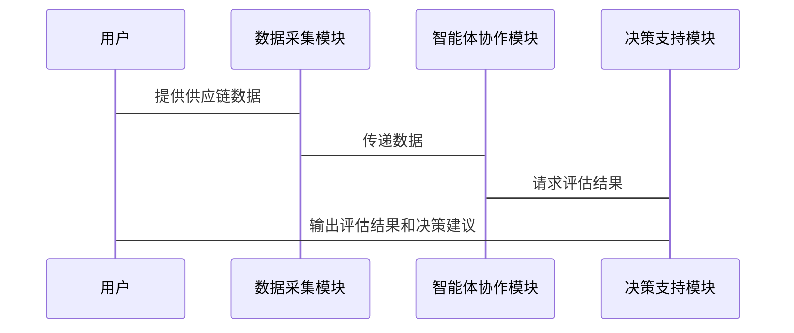

                 


# 《价值投资中的多智能体AI供应链韧性评估系统》

> 关键词：多智能体AI，供应链韧性，价值投资，系统架构，算法原理，项目实战

> 摘要：本文将详细探讨如何利用多智能体人工智能技术构建供应链韧性评估系统，为价值投资者提供决策支持。文章从问题背景出发，分析多智能体AI的核心原理，详细阐述算法实现与系统架构设计，结合实际案例展示系统实现过程，并总结经验与展望未来发展方向。

---

# 第1章: 问题背景与价值投资概述

## 1.1 供应链韧性评估的背景与意义
### 1.1.1 供应链韧性评估的核心概念
供应链韧性是指供应链在面对外部冲击时的适应性和恢复能力。现代供应链面临的不确定性（如自然灾害、疫情、地缘政治冲突等）使得供应链韧性评估成为企业风险管理的重要组成部分。

### 1.1.2 供应链韧性在价值投资中的重要性
价值投资者关注企业的长期稳健发展，而供应链韧性是企业抗风险能力的重要体现。通过评估供应链韧性，投资者可以更准确地判断企业的长期价值。

### 1.1.3 传统供应链评估的局限性
传统供应链评估方法通常基于静态数据和单点分析，难以捕捉动态变化和多因素交互影响。例如，传统方法难以实时评估供应商的协同能力和应对突发事件的能力。

## 1.2 多智能体AI在供应链管理中的应用
### 1.2.1 多智能体AI的基本概念
多智能体AI是指由多个具有自主决策能力的智能体组成的系统，这些智能体能够通过协作完成复杂任务。与传统AI不同，多智能体AI强调智能体之间的交互与协作。

### 1.2.2 多智能体AI在供应链管理中的优势
- **分布式决策**：每个智能体可以独立决策，减少中心化决策的延迟。
- **协同优化**：通过智能体之间的协作，实现全局优化。
- **动态适应**：智能体能够实时感知环境变化并调整策略。

### 1.2.3 价值投资与供应链韧性的结合
通过多智能体AI实时监控和评估供应链的各个节点，投资者可以更全面地评估企业的抗风险能力，从而做出更明智的投资决策。

## 1.3 本章小结
本章介绍了供应链韧性评估的背景与意义，并重点探讨了多智能体AI在供应链管理中的应用及其优势。

---

# 第2章: 多智能体AI与供应链韧性评估的核心概念

## 2.1 多智能体AI的核心原理
### 2.1.1 多智能体系统的定义与特点
- **定义**：由多个智能体组成的系统，每个智能体都有自己的目标和决策机制。
- **特点**：
  - 分布式计算
  - 协作性
  - 动态性

### 2.1.2 多智能体AI在供应链中的角色
- **供应商智能体**：负责原材料采购和供应。
- **制造商智能体**：负责生产计划和调度。
- **物流智能体**：负责货物运输和仓储管理。
- **零售商智能体**：负责市场需求预测和订单处理。

### 2.1.3 多智能体AI与传统AI的区别
| 特性                | 多智能体AI                  | 传统AI                     |
|---------------------|-----------------------------|----------------------------|
| 决策主体            | 多个智能体协作              | 单个中心化决策             |
| 适应性              | 强调动态协作与适应          | 较难实时调整               |
| 应用场景            | 适合复杂分布式系统         | 适合单一任务或简单场景     |

## 2.2 供应链韧性评估的指标与模型
### 2.2.1 供应链韧性评估的主要指标
- **供应弹性**：供应链在需求波动下的适应能力。
- **恢复时间**：供应链在遭受破坏后恢复至正常水平所需的时间。
- **冗余性**：供应链中备用资源的充足程度。
- **透明度**：供应链各环节信息的可视化程度。

### 2.2.2 基于多智能体的供应链韧性模型
- **模型结构**：由多个智能体组成的分布式模型，每个智能体负责供应链的一个环节。
- **模型特点**：实时性、动态性、协作性。

### 2.2.3 供应链韧性评估的数学模型
$$
R = \sum_{i=1}^{n} w_i \cdot S_i
$$
其中，$R$ 表示供应链韧性，$w_i$ 表示第 $i$ 个指标的权重，$S_i$ 表示第 $i$ 个指标的评分。

## 2.3 多智能体AI与供应链韧性评估的结合
### 2.3.1 多智能体AI在供应链韧性评估中的作用
- **实时监控**：智能体实时感知供应链各环节的状态。
- **协同优化**：智能体协作优化供应链的整体韧性。
- **风险预测**：通过历史数据和实时数据，预测潜在风险。

### 2.3.2 供应链韧性评估的系统架构
- **数据采集层**：从供应链各环节采集数据。
- **智能体协作层**：多个智能体协作完成评估任务。
- **决策层**：基于评估结果提供决策支持。

## 2.4 本章小结
本章详细阐述了多智能体AI的核心原理，并探讨了其在供应链韧性评估中的应用。

---

# 第3章: 多智能体AI供应链韧性评估系统的算法原理

## 3.1 多智能体协作算法
### 3.1.1 多智能体协作的基本原理
- **分布式计算**：每个智能体独立计算，然后通过通信模块共享信息。
- **协同优化**：通过智能体之间的协作，实现全局优化。

### 3.1.2 基于强化学习的多智能体协作
- **强化学习机制**：智能体通过与环境的交互获得奖励，从而优化决策策略。
- **策略更新**：智能体根据奖励调整策略参数。

### 3.1.3 多智能体协作算法的实现步骤
1. 初始化智能体参数。
2. 智能体与环境交互，获取状态和奖励。
3. 根据奖励更新策略参数。
4. 重复步骤2和3，直到达到收敛条件。

## 3.2 供应链韧性评估的数学模型
### 3.2.1 供应链韧性评估的指标权重分配
$$
w_i = \frac{1}{\sum_{j=1}^{n} |c_{ij}|}
$$
其中，$c_{ij}$ 表示第 $i$ 个指标对第 $j$ 个智能体的影响程度。

### 3.2.2 基于多智能体的供应链韧性模型
$$
R = \sum_{i=1}^{n} w_i \cdot S_i
$$
其中，$S_i$ 表示第 $i$ 个指标的评分，$w_i$ 表示第 $i$ 个指标的权重。

### 3.2.3 算法实现的代码示例
```python
import numpy as np
from collections import defaultdict

class MultiAgent:
    def __init__(self, num_agents):
        self.num_agents = num_agents
        self.agents = [Agent(i) for i in range(num_agents)]
    
    def step(self, state):
        actions = []
        for agent in self.agents:
            action = agent.act(state)
            actions.append(action)
        return actions

class Agent:
    def __init__(self, id):
        self.id = id
        self.model = self.build_model()
    
    def build_model(self):
        # 构建强化学习模型
        pass
    
    def act(self, state):
        # 根据状态输出动作
        pass

# 示例用法
if __name__ == "__main__":
    agents = MultiAgent(5)
    state = np.random.randn(10)
    actions = agents.step(state)
    print(actions)
```

## 3.3 算法实现与优化
### 3.3.1 算法实现的步骤与流程
- 初始化智能体参数。
- 智能体与环境交互，获取状态和奖励。
- 根据奖励更新策略参数。

### 3.3.2 多智能体AI的优化策略
- **分布式计算**：利用分布式计算框架（如Spark、Dask）优化计算效率。
- **并行学习**：通过并行计算加速学习过程。

## 3.4 本章小结
本章详细阐述了多智能体协作算法的原理，并提供了具体的实现代码和优化策略。

---

# 第4章: 系统分析与架构设计

## 4.1 问题场景与需求分析
### 4.1.1 供应链韧性评估的场景描述
- **场景1**：供应商因疫情停工，影响整个供应链的稳定性。
- **场景2**：市场需求突然增加，供应链需要快速调整生产计划。

### 4.1.2 价值投资中的需求分析
- **需求1**：实时监控供应链各环节的状态。
- **需求2**：评估供应链的抗风险能力。
- **需求3**：提供决策支持。

## 4.2 系统功能设计
### 4.2.1 系统功能模块划分
- **数据采集模块**：采集供应链各环节的数据。
- **智能体协作模块**：多个智能体协作完成供应链韧性评估。
- **决策支持模块**：基于评估结果提供决策支持。

### 4.2.2 多智能体协作模块设计
- **通信机制**：智能体之间通过消息队列（如Kafka）进行通信。
- **协作规则**：定义智能体之间的协作规则和优先级。

### 4.2.3 供应链韧性评估模块设计
- **评估指标**：基于多智能体协作结果，计算供应链韧性评分。
- **风险预警**：当供应链韧性低于阈值时，触发预警机制。

## 4.3 系统架构设计
### 4.3.1 系统架构图


### 4.3.2 系统接口设计
- **输入接口**：接收供应链各环节的数据。
- **输出接口**：输出供应链韧性评估结果和决策建议。

### 4.3.3 系统交互序列图


## 4.4 本章小结
本章从问题场景出发，详细设计了系统的功能模块和架构，并通过图示展示了系统的交互流程。

---

# 第5章: 项目实战与实现

## 5.1 环境安装与配置
### 5.1.1 安装Python与依赖库
```bash
pip install numpy matplotlib pandas
```

### 5.1.2 安装多智能体协作框架
```bash
pip install ray
```

## 5.2 系统核心实现
### 5.2.1 数据采集模块实现
```python
import pandas as pd

def collect_data():
    # 从数据库或API获取数据
    data = pd.read_csv('supply_chain_data.csv')
    return data
```

### 5.2.2 多智能体协作模块实现
```python
import ray

@ray.remote
def agent_actor(id):
    pass

def main():
    agents = [agent_actor.remote(i) for i in range(5)]
    # 启动智能体
    ray.run(main)

if __name__ == "__main__":
    main()
```

### 5.2.3 供应链韧性评估模块实现
```python
def evaluate_risk(data):
    # 计算供应链韧性评分
    return sum(data['score']) / len(data)
```

## 5.3 代码应用与解读
### 5.3.1 数据采集模块解读
- **功能**：从CSV文件中读取供应链数据。
- **实现**：使用Pandas库读取数据。

### 5.3.2 多智能体协作模块解读
- **功能**：启动多个智能体实例，通过Ray框架实现分布式计算。
- **实现**：定义远程函数，启动多个智能体实例。

### 5.3.3 供应链韧性评估模块解读
- **功能**：根据数据计算供应链韧性评分。
- **实现**：通过简单的平均值计算评分。

## 5.4 实际案例分析
### 5.4.1 案例背景
假设某制造企业需要评估其供应链的抗风险能力。

### 5.4.2 数据采集与处理
```python
data = collect_data()
print(data.head())
```

### 5.4.3 评估结果与分析
```python
risk_score = evaluate_risk(data)
print(f"供应链韧性评分为：{risk_score}")
```

## 5.5 本章小结
本章通过实际案例展示了系统的实现过程，并提供了具体的代码实现和解读。

---

# 第6章: 总结与展望

## 6.1 系统总结
### 6.1.1 系统的优势
- **实时性**：能够实时监控和评估供应链状态。
- **动态性**：能够根据环境变化快速调整策略。
- **协作性**：通过多智能体协作实现全局优化。

### 6.1.2 系统的不足
- **计算成本**：多智能体协作需要较高的计算资源。
- **模型复杂性**：模型的复杂性可能影响实时性。

## 6.2 未来展望
### 6.2.1 技术优化方向
- **优化算法**：进一步优化多智能体协作算法，降低计算成本。
- **提升模型精度**：引入更先进的机器学习模型，提高评估精度。

### 6.2.2 应用场景拓展
- **行业扩展**：将系统应用于更多行业，如金融、能源等。
- **智能化升级**：进一步智能化供应链管理，实现自适应优化。

## 6.3 本章小结
本章总结了系统的优缺点，并展望了未来的技术优化方向和应用场景。

---

# 参考文献
（此处列出相关参考文献）

---

# 致谢
感谢读者的耐心阅读，感谢同行专家的宝贵意见。

