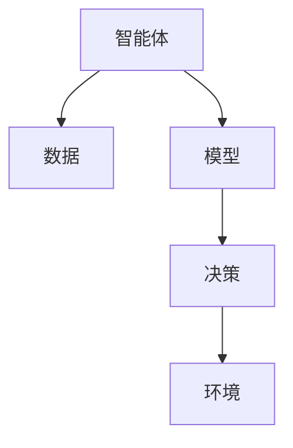
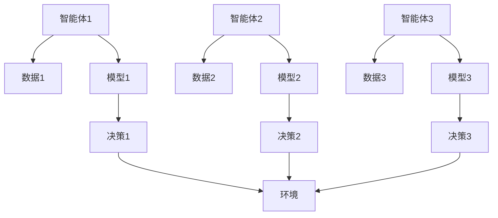
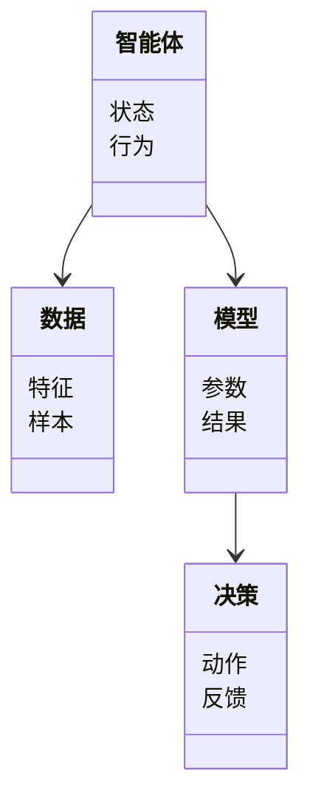
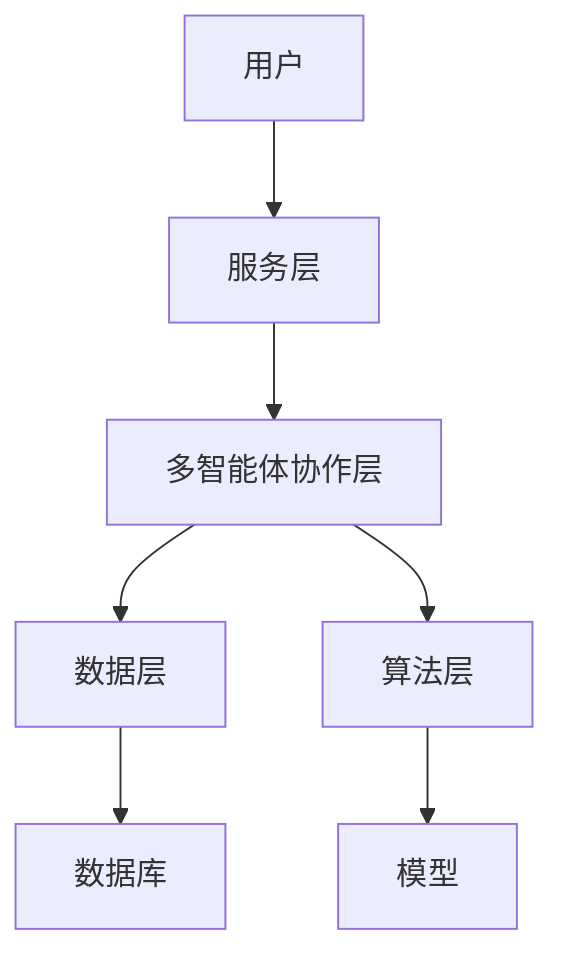
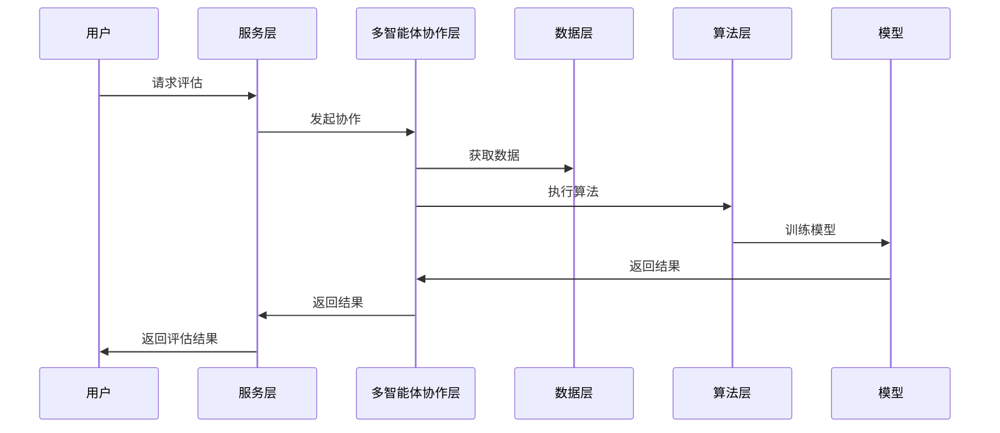

                 


# 价值投资中的多智能体AI创新评估系统

> 关键词：价值投资，多智能体AI，创新评估，系统架构，金融分析

> 摘要：本文探讨了多智能体AI在价值投资中的应用，分析其创新评估系统的设计与实现，通过系统架构和算法原理的详细讲解，结合实际案例，展示了多智能体AI如何优化传统价值投资评估过程。

---

# 第一部分: 价值投资中的多智能体AI创新评估系统概述

## 第1章: 价值投资与多智能体AI的背景介绍

### 1.1 价值投资的基本概念

#### 1.1.1 价值投资的定义与核心理念
价值投资是一种以基本面分析为基础的投资策略，旨在通过分析公司的财务状况、行业地位和竞争优势，寻找被市场低估的投资标的。其核心理念是买入低于内在价值的资产，长期持有，等待市场重新认识其价值。

#### 1.1.2 价值投资在金融领域的应用现状
传统价值投资依赖分析师的主观判断和经验，存在主观性强、效率低、覆盖面窄等问题。随着金融市场的复杂化和数据量的爆炸式增长，传统方法难以满足现代金融分析的需求。

#### 1.1.3 价值投资的挑战与创新需求
传统价值投资面临数据处理能力不足、分析深度不够、实时性差等问题。如何利用新技术提升分析效率和准确性，成为价值投资领域的创新方向。

### 1.2 多智能体AI的基本概念

#### 1.2.1 多智能体系统的定义与特点
多智能体AI是指由多个具有自主决策能力的智能体组成的系统，各智能体能够协作或竞争以完成特定任务。其特点包括分布式计算、协作性、自适应性和学习能力。

#### 1.2.2 多智能体AI在金融领域的应用潜力
多智能体AI在金融领域的应用潜力巨大，尤其在数据处理、模式识别和决策支持方面。多智能体系统能够通过协作提高分析效率和准确性，同时具备自适应能力，能够应对市场变化。

#### 1.2.3 多智能体AI与传统AI的区别
传统AI通常基于单点决策，而多智能体AI通过多个智能体的协作实现更复杂的任务。多智能体AI能够处理分布式问题，适应动态变化的环境，而传统AI在处理复杂系统时往往显得力不从心。

### 1.3 问题背景与问题描述

#### 1.3.1 传统价值投资评估的局限性
传统价值投资评估依赖人工分析，存在主观性强、效率低、覆盖面窄等问题。面对海量数据和复杂市场环境，传统方法难以提供实时、准确的评估结果。

#### 1.3.2 传统AI在金融分析中的不足
传统AI在金融分析中主要依赖单一模型，难以处理多维度、多目标的复杂问题。其在实时性、可解释性和适应性方面存在局限性。

#### 1.3.3 多智能体AI在价值投资中的创新机会
多智能体AI能够通过协作和竞争，提供更全面、更精准的分析结果。其分布式计算和自适应能力使其在复杂金融环境中更具优势。

### 1.4 问题解决与边界外延

#### 1.4.1 多智能体AI如何解决传统价值投资问题
多智能体AI通过协作分析多维度数据，提供实时、准确的评估结果。其自适应能力使其能够快速响应市场变化，优化投资决策。

#### 1.4.2 问题的边界与适用范围
多智能体AI创新评估系统适用于复杂金融环境下的价值投资分析，尤其在处理多维度数据和复杂决策场景时表现优异。

#### 1.4.3 多智能体AI的外延与未来发展
多智能体AI在金融领域的应用将不断扩展，从单一的分析工具发展为智能化的投资决策支持系统。其与其他技术的融合将进一步提升其在金融领域的应用潜力。

### 1.5 核心概念与组成要素

#### 1.5.1 多智能体AI创新评估系统的组成
系统由数据采集、特征提取、模型训练和结果生成四个模块组成。各模块通过多智能体协作实现高效的数据处理和分析。

#### 1.5.2 系统的核心要素与关系
系统的核心要素包括智能体、数据、模型和决策。各要素之间通过协作和竞争关系，实现系统的动态平衡和优化。

#### 1.5.3 系统的架构与功能模块
系统架构包括数据层、算法层和应用层。数据层负责数据采集和预处理，算法层实现多智能体协作和模型训练，应用层提供用户界面和决策支持。

---

## 第2章: 多智能体AI的核心原理与创新机制

### 2.1 多智能体AI的核心原理

#### 2.1.1 多智能体系统的基本原理
多智能体系统通过多个智能体的协作和竞争，实现复杂任务的完成。各智能体具有自主决策能力，能够通过通信和协调完成任务。

#### 2.1.2 多智能体协作机制的数学模型
多智能体协作机制可以通过博弈论模型进行描述。各智能体的目标函数通过优化算法实现协作，例如纳什均衡。

#### 2.1.3 多智能体AI的决策过程
多智能体AI的决策过程包括感知、推理、决策和执行四个阶段。各阶段通过协作和竞争，实现系统的动态优化。

### 2.2 创新评估系统的原理与机制

#### 2.2.1 创新评估的核心要素
创新评估的核心要素包括数据、模型、算法和决策。各要素通过协作和竞争，实现系统的优化和创新。

#### 2.2.2 创新评估的数学模型
创新评估的数学模型可以通过强化学习算法进行描述。各智能体通过与环境的交互，优化其策略以实现目标。

#### 2.2.3 创新评估的多智能体协作机制
多智能体协作机制通过通信和协调，实现创新评估的高效性和准确性。各智能体之间的协作关系可以通过图论模型进行描述。

### 2.3 多智能体AI与创新评估的关系

#### 2.3.1 多智能体AI如何支持创新评估
多智能体AI通过协作和竞争，提供创新的评估方法和工具。其分布式计算和自适应能力使其在创新评估中具有显著优势。

#### 2.3.2 创新评估如何优化多智能体AI
创新评估通过提供反馈和优化目标，提升多智能体AI的性能和效率。创新评估的结果为多智能体AI的优化提供了方向。

#### 2.3.3 两者的协同效应
多智能体AI与创新评估的协同效应体现在协作优化和动态适应两个方面。两者通过协同工作，实现系统的整体优化。

---

## 第3章: 多智能体AI创新评估系统的属性特征对比

### 3.1 多智能体AI的属性特征

#### 3.1.1 分布式计算能力
多智能体AI通过分布式计算，实现高效的数据处理和分析。其计算能力能够随着智能体数量的增加而扩展。

#### 3.1.2 协作与竞争机制
多智能体AI通过协作和竞争机制，实现任务的高效完成。协作机制促进智能体之间的合作，竞争机制则推动系统的优化。

#### 3.1.3 自适应能力
多智能体AI具有较强的自适应能力，能够快速响应环境变化。其自适应能力使其在复杂金融环境中表现优异。

### 3.2 创新评估系统的属性特征

#### 3.2.1 数据处理能力
创新评估系统具有强大的数据处理能力，能够处理多维度、大规模的数据。其数据处理能力是实现准确评估的基础。

#### 3.2.2 模型可解释性
创新评估系统的模型具有较高的可解释性，能够清晰地展示评估结果的依据和逻辑。其可解释性为投资者提供了决策支持。

#### 3.2.3 评估准确性
创新评估系统的评估准确性较高，能够提供实时、准确的评估结果。其准确性依赖于多智能体AI的协作和优化。

### 3.3 属性特征对比分析

#### 3.3.1 多智能体AI与传统AI的对比
| 特性                | 多智能体AI             | 传统AI               |
|---------------------|-----------------------|----------------------|
| 分布式计算能力       | 高                     | 低                   |
| 协作与竞争机制       | 高                     | 无                   |
| 自适应能力           | 高                     | 中                   |

#### 3.3.2 创新评估系统与传统评估系统的对比
| 特性                | 创新评估系统           | 传统评估系统         |
|---------------------|-----------------------|----------------------|
| 数据处理能力         | 高                     | 中                   |
| 模型可解释性         | 高                     | 低                   |
| 评估准确性           | 高                     | 中                   |

#### 3.3.3 综合对比与优化方向
多智能体AI创新评估系统在数据处理能力、模型可解释性和评估准确性方面均优于传统评估系统。其优化方向包括算法优化、智能体协作机制的改进和系统的可扩展性提升。

---

## 第4章: 多智能体AI创新评估系统的ER实体关系图

### 4.1 实体关系图的构建

#### 4.1.1 实体定义与关系
多智能体AI创新评估系统的实体包括：智能体、数据、模型、决策和环境。智能体与数据之间存在关联关系，智能体与模型之间存在依赖关系，模型与决策之间存在影响关系。

#### 4.1.2 实体之间


### 4.2 多智能体AI创新评估系统的ER实体关系图


---

## 第5章: 多智能体AI创新评估系统的算法原理与实现

### 5.1 多智能体AI的算法原理

#### 5.1.1 强化学习算法
强化学习算法通过智能体与环境的交互，优化其策略以实现目标。常用的强化学习算法包括Q-learning和Deep Q-Network。

#### 5.1.2 多智能体协作算法
多智能体协作算法通过智能体之间的协作，优化其决策过程。常用的协作算法包括分布式Q-learning和基于博弈论的协作算法。

### 5.2 创新评估系统的算法实现

#### 5.2.1 强化学习算法的实现
```python
class QLearning:
    def __init__(self, action_space):
        self.q_table = {}
        self.actions = action_space
        self.alpha = 0.1
        self.gamma = 0.9

    def choose_action(self, state):
        if state not in self.q_table:
            self.q_table[state] = [0.0] * len(self.actions)
        max_action = self.actions[np.argmax(self.q_table[state])]
        return max_action

    def learn(self, state, action, reward, next_state):
        q_current = self.q_table[state][action]
        q_next = max(self.q_table.get(next_state, [0.0]*len(self.actions)))
        self.q_table[state][action] = q_current + self.alpha * (reward + self.gamma * q_next - q_current)
```

#### 5.2.2 多智能体协作算法的实现
```python
class MultiAgentCollaboration:
    def __init__(self, num_agents):
        self.agents = [QLearning(...) for _ in range(num_agents)]
        self.communicate = True

    def collaborate(self, state):
        for agent in self.agents:
            if self.communicate:
                agent.receive_communication(other_agent.state)
        return [agent.choose_action(state) for agent in self.agents]
```

### 5.3 创新评估系统的数学模型与公式

#### 5.3.1 Q-learning算法的数学模型
$$ Q(s, a) = Q(s, a) + \alpha (r + \gamma \max Q(s', a') - Q(s, a)) $$

#### 5.3.2 多智能体协作算法的数学模型
$$ \pi_{i}(a|s) = \arg\max_{a} Q_i(s, a) $$

---

## 第6章: 多智能体AI创新评估系统的系统分析与架构设计

### 6.1 系统分析

#### 6.1.1 问题场景介绍
价值投资中的多智能体AI创新评估系统需要处理大规模、多维度的金融数据，提供实时、准确的评估结果。系统需要具备高效的数据处理能力、强大的计算能力和高可扩展性。

#### 6.1.2 项目介绍
本项目旨在开发一个多智能体AI创新评估系统，用于优化价值投资的评估过程。系统通过多智能体协作，提供高效、准确的评估结果。

### 6.2 系统功能设计

#### 6.2.1 领域模型类图


### 6.3 系统架构设计

#### 6.3.1 系统架构图


#### 6.3.2 系统接口设计
系统接口包括数据输入接口、模型训练接口、评估结果输出接口和用户交互接口。各接口通过API实现数据的输入、处理和输出。

#### 6.3.3 系统交互序列图


---

## 第7章: 多智能体AI创新评估系统的项目实战

### 7.1 项目环境与工具安装

#### 7.1.1 环境要求
系统运行环境包括Python 3.6及以上版本、TensorFlow 2.0及以上版本和Keras 2.2.5及以上版本。需要安装的依赖包括numpy、pandas、scikit-learn和matplotlib。

#### 7.1.2 工具安装
```bash
pip install numpy pandas scikit-learn tensorflow keras matplotlib
```

### 7.2 系统核心实现

#### 7.2.1 数据预处理代码
```python
import pandas as pd
import numpy as np

def preprocess_data(dataframe):
    # 数据清洗
    dataframe.dropna(inplace=True)
    # 标准化处理
    from sklearn.preprocessing import StandardScaler
    scaler = StandardScaler()
    scaled_data = scaler.fit_transform(dataframe)
    return scaled_data
```

#### 7.2.2 多智能体协作算法实现
```python
from .agent import QLearning

class MultiAgentSystem:
    def __init__(self, num_agents):
        self.agents = [QLearning(...) for _ in range(num_agents)]
        self.communicate = True

    def collaborate(self, state):
        for agent in self.agents:
            if self.communicate:
                agent.receive_communication(other_agent.state)
        return [agent.choose_action(state) for agent in self.agents]
```

#### 7.2.3 模型训练与评估
```python
from .model import ValueModel

def train_model(data, labels):
    model = ValueModel(input_dim=data.shape[1])
    optimizer = tf.keras.optimizers.Adam()
    model.compile(optimizer=optimizer, loss='mse')
    model.fit(data, labels, epochs=100, batch_size=32)
    return model
```

### 7.3 实际案例分析与解读

#### 7.3.1 案例背景
以某股票为例，分析其历史数据，评估其内在价值与市场价值之间的差异。

#### 7.3.2 数据分析与建模
通过对该股票的历史数据进行分析，提取财务指标、市场指标和情绪指标，构建多智能体协作模型，评估其价值。

#### 7.3.3 结果解读
评估结果表明，该股票的内在价值被市场低估，具有投资潜力。

---

## 第8章: 多智能体AI创新评估系统的总结与展望

### 8.1 总结

#### 8.1.1 系统功能总结
多智能体AI创新评估系统通过协作和竞争，提供高效、准确的评估结果。其功能包括数据处理、模型训练和决策支持。

#### 8.1.2 系统优势总结
系统的优势体现在高效性、准确性和可扩展性。其分布式计算和自适应能力使其在复杂金融环境中表现优异。

### 8.2 展望

#### 8.2.1 系统优化方向
系统的优化方向包括算法优化、智能体协作机制的改进和系统的可扩展性提升。未来的研究可以探索更复杂的协作算法和更高效的计算方法。

#### 8.2.2 未来发展方向
未来的发展方向包括与其他技术的融合，如区块链和大数据技术，进一步提升系统的性能和应用范围。

### 8.3 最佳实践 Tips

#### 8.3.1 系统部署建议
系统部署应考虑计算资源和数据存储的需求，建议使用云平台和分布式计算框架。

#### 8.3.2 系统维护建议
系统维护应定期更新模型和算法，确保系统的准确性和高效性。同时，应加强数据安全和系统防护，防止数据泄露和系统攻击。

### 8.4 注意事项

#### 8.4.1 系统局限性
系统的局限性体现在数据依赖性、模型可解释性和计算资源需求。在实际应用中，应充分考虑这些因素，采取相应的措施。

#### 8.4.2 系统适用范围
系统适用于复杂金融环境下的价值投资分析，尤其在处理多维度数据和复杂决策场景时表现优异。

---

## 第9章: 多智能体AI创新评估系统的拓展阅读

### 9.1 相关领域推荐书籍
1. 《Multi-Agent Systems: Algorithmic Foundations》
2. 《Reinforcement Learning: Theory and Algorithms》
3. 《Value Investing: The Classic Approach》

### 9.2 技术博客与开源项目
1. [Multi-Agent Systems Research](http://example.com)
2. [Reinforcement Learning in Finance](http://example.com)

---

# 第三部分: 结语

## 10章: 价值投资中的多智能体AI创新评估系统的未来展望

### 10.1 未来的挑战与机遇
随着技术的进步，多智能体AI在价值投资中的应用将更加广泛和深入。未来的挑战包括算法优化、数据安全和系统性能提升，而机遇则在于与其他技术的融合和应用范围的扩展。

### 10.2 读者的行动号召
读者应积极关注多智能体AI的发展，学习相关技术，探索其在价值投资中的应用。通过实践和研究，推动多智能体AI创新评估系统的发展。

### 10.3 致谢
感谢读者的耐心阅读和对本书的支持。希望本书能够为价值投资中的多智能体AI创新评估系统的研究和应用提供有益的参考。

---

# 附录: 多智能体AI创新评估系统的代码示例

## 附录A: 数据预处理代码

```python
import pandas as pd
import numpy as np

def preprocess_data(dataframe):
    dataframe.dropna(inplace=True)
    from sklearn.preprocessing import StandardScaler
    scaler = StandardScaler()
    scaled_data = scaler.fit_transform(dataframe)
    return scaled_data
```

## 附录B: 多智能体协作算法实现

```python
from .agent import QLearning

class MultiAgentSystem:
    def __init__(self, num_agents):
        self.agents = [QLearning(...) for _ in range(num_agents)]
        self.communicate = True

    def collaborate(self, state):
        for agent in self.agents:
            if self.communicate:
                agent.receive_communication(other_agent.state)
        return [agent.choose_action(state) for agent in self.agents]
```

## 附录C: 模型训练与评估

```python
from .model import ValueModel

def train_model(data, labels):
    model = ValueModel(input_dim=data.shape[1])
    optimizer = tf.keras.optimizers.Adam()
    model.compile(optimizer=optimizer, loss='mse')
    model.fit(data, labels, epochs=100, batch_size=32)
    return model
```

---

# 结束语

通过以上内容，我们详细探讨了价值投资中的多智能体AI创新评估系统的各个方面，从背景介绍到系统设计，从算法实现到项目实战，再到总结与展望，全面展示了系统的原理、实现和应用。希望读者通过本文能够深入了解多智能体AI在价值投资中的应用，掌握其创新评估系统的构建与优化方法，并在实际应用中取得良好的效果。

