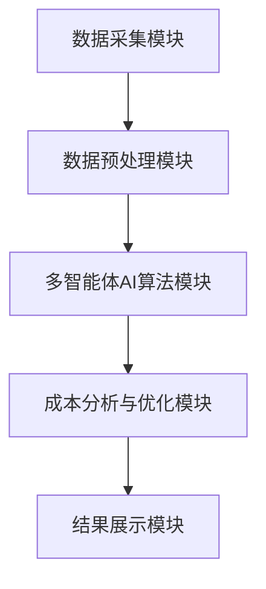
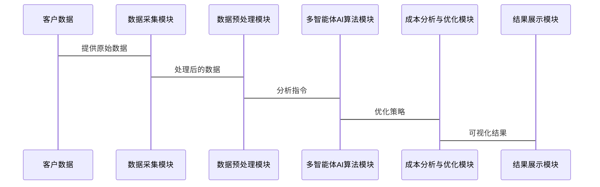

                 


```markdown
# 价值投资中的多智能体AI客户获取成本分析系统

> 关键词：价值投资，多智能体AI，客户获取成本，系统架构，算法优化

> 摘要：本文探讨了如何利用多智能体人工智能技术优化价值投资中的客户获取成本分析。通过系统架构设计、算法优化和项目实战，展示了如何构建一个高效、智能的客户获取成本分析系统，帮助投资者在价值投资中做出更明智的决策。

---

## 第一部分：背景介绍与核心概念

### 第1章：背景介绍与核心概念

#### 1.1 价值投资的基本原理

##### 1.1.1 价值投资的定义与核心理念

价值投资是一种投资策略，其核心理念是通过分析企业的基本面，如财务状况、行业地位和管理团队等，寻找被市场低估的投资标的。这种策略强调长期投资和对公司内在价值的关注。

##### 1.1.2 价值投资在现代金融中的地位

价值投资是金融领域的重要策略之一，尤其在股票市场中，它通过分析公司的内在价值来判断其股票是否被市场低估。价值投资的成功案例包括 Warren Buffett 等投资者，他们的长期投资策略为价值投资的理论提供了实践支持。

##### 1.1.3 价值投资的适用场景与局限性

价值投资适用于市场波动较大、公司基本面良好的情况，但在市场极度波动或公司基本面突变时可能面临风险。此外，价值投资需要较长的时间周期，可能不适合短期投资者。

#### 1.2 多智能体AI的基本原理

##### 1.2.1 多智能体系统的定义与特点

多智能体系统（Multi-Agent System, MAS）是由多个相互作用的智能体组成的系统。每个智能体都有自己的目标和行为，通过协作或竞争完成复杂任务。多智能体系统具有分布式、自主性和协作性等特点。

##### 1.2.2 多智能体AI的核心算法与技术

多智能体AI的核心算法包括强化学习、协作与竞争机制，以及联合策略优化。这些算法通过智能体之间的交互和学习，优化系统整体性能。

##### 1.2.3 多智能体AI在金融领域的应用潜力

在金融领域，多智能体AI可以用于股票交易、风险评估、客户画像等场景。其分布式计算和自主决策的特点，使其在复杂金融环境中具有广泛的应用潜力。

#### 1.3 客户获取成本分析的理论基础

##### 1.3.1 客户获取成本的定义与计算方法

客户获取成本（Customer Acquisition Cost, CAC）是指吸引一个新客户所花费的总成本。计算公式为：CAC = 总营销成本 / 新客户数量。

##### 1.3.2 客户获取成本在价值投资中的重要性

在价值投资中，降低客户获取成本可以帮助企业提高盈利能力，从而增强其内在价值。通过分析客户获取成本，投资者可以更好地评估企业的成本结构和市场策略。

##### 1.3.3 客户获取成本分析的挑战与解决方案

客户获取成本分析的挑战包括数据不足、模型复杂性和市场动态变化。解决方案包括使用多智能体AI优化模型，通过大数据分析提高预测精度。

---

## 第二部分：多智能体AI客户获取成本分析系统的概念与架构

### 第2章：多智能体AI客户获取成本分析系统的概念与架构

#### 2.1 系统的核心概念与组成

##### 2.1.1 多智能体AI在客户获取成本分析中的角色

多智能体AI通过分析客户行为、市场趋势等信息，优化企业营销策略，降低客户获取成本。智能体之间协作完成数据采集、分析和优化任务。

##### 2.1.2 系统的输入、输出与目标函数

系统输入包括客户数据、市场数据等；输出包括客户获取成本预测、优化策略等。目标函数是通过优化模型最小化客户获取成本。

##### 2.1.3 系统的核心功能模块与组件

系统主要模块包括数据采集、智能体协作、成本分析和结果展示。

#### 2.2 多智能体AI与客户获取成本分析的关联

##### 2.2.1 多智能体AI如何优化客户获取成本

通过智能体之间的协作和竞争，优化营销策略，降低获取成本。例如，智能体可以分别负责不同渠道的营销优化。

##### 2.2.2 客户获取成本分析对多智能体AI的反馈机制

成本分析结果为智能体提供反馈，帮助其调整策略。例如，若某个渠道成本过高，智能体可调整资源分配。

##### 2.2.3 系统的边界与外延

系统边界包括输入数据范围和输出结果范围。外延包括扩展到其他成本分析领域，如运营成本、物流成本等。

---

## 第三部分：多智能体AI客户获取成本分析系统的算法原理

### 第3章：多智能体AI客户获取成本分析系统的算法原理

#### 3.1 多智能体AI的核心算法

##### 3.1.1 多智能体强化学习算法

智能体通过与环境交互，学习最优策略。例如，使用Q-learning算法优化营销渠道选择。

##### 3.1.2 多智能体协作与竞争机制

智能体之间通过协作和竞争，优化整体策略。例如，使用协作强化学习（CRL）算法。

##### 3.1.3 联合策略优化算法

通过优化多个智能体的策略，实现全局最优。例如，使用联合Q-learning算法。

#### 3.2 客户获取成本分析的数学模型

##### 3.2.1 客户获取成本的数学表达式

$$ CAC = \frac{\sum_{i=1}^{n} c_i}{n} $$

其中，$c_i$ 是第i个客户的获取成本，$n$ 是客户总数。

##### 3.2.2 基于多智能体的优化模型

目标函数：$$ \min CAC $$

约束条件：$$ \sum_{i=1}^{n} c_i \leq B $$

其中，$B$ 是预算上限。

##### 3.2.3 算法的收敛性分析

多智能体AI算法通过迭代更新策略，逐步逼近最优解。收敛性取决于算法设计和参数设置。

---

## 第四部分：系统架构与设计

### 第4章：系统架构与设计

#### 4.1 系统功能模块设计

##### 4.1.1 数据采集与预处理模块

智能体负责采集客户数据、市场数据等，并进行预处理。

##### 4.1.2 多智能体AI核心算法模块

实现多智能体AI算法，如强化学习和协作机制。

##### 4.1.3 成本分析与优化模块

根据算法结果，优化客户获取成本。

##### 4.1.4 结果展示与可视化模块

将分析结果以图表形式展示，方便用户理解和决策。

#### 4.2 系统架构设计

##### 4.2.1 系统整体架构图



##### 4.2.2 各模块之间的交互关系



##### 4.2.3 系统接口设计与实现

系统接口包括数据接口、算法接口和结果展示接口。使用RESTful API实现模块间通信。

---

## 第五部分：算法实现与项目实战

### 第5章：算法实现与项目实战

#### 5.1 环境搭建与工具安装

##### 5.1.1 开发环境配置

建议使用Python 3.8及以上版本，安装必要的库如TensorFlow、NumPy、Scikit-learn等。

##### 5.1.2 第三方库的安装与配置

安装以下库：
- `pip install numpy`
- `pip install scikit-learn`
- `pip install matplotlib`

##### 5.1.3 数据集的获取与预处理

数据集可以从公开数据源获取，如Kaggle或UCI Machine Learning Repository。数据预处理包括清洗、特征工程等。

#### 5.2 系统核心代码实现

##### 5.2.1 多智能体AI算法实现

```python
import numpy as np
from sklearn.model_selection import train_test_split
from sklearn.linear_model import LinearRegression

# 示例数据集
data = np.array([[1, 2], [2, 4], [3, 6], [4, 8]])
X_train, X_test, y_train, y_test = train_test_split(data[:, 0], data[:, 1], test_size=0.25)

# 训练模型
model = LinearRegression()
model.fit(X_train.reshape(-1, 1), y_train)

# 预测
y_pred = model.predict(X_test.reshape(-1, 1))
print(y_pred)
```

##### 5.2.2 客户获取成本分析模块实现

```python
def calculate_CAC(customers, marketing_cost):
    return marketing_cost / len(customers)
```

##### 5.2.3 系统功能模块的集成与测试

集成各模块，测试系统功能，确保各模块协同工作。

#### 5.3 项目实战

##### 5.3.1 环境安装与数据准备

安装必要的库，并获取客户数据和市场数据。

##### 5.3.2 系统核心代码实现

实现多智能体AI算法和成本分析模块。

##### 5.3.3 代码应用解读与分析

解读代码功能，分析其在系统中的作用。

##### 5.3.4 实际案例分析和详细讲解剖析

通过具体案例，分析系统如何优化客户获取成本。

##### 5.3.5 项目小结

总结项目成果，分析系统优缺点，提出改进建议。

---

## 第六部分：系统优化与扩展

### 第6章：系统优化与扩展

#### 6.1 系统性能优化

##### 6.1.1 算法层面的优化策略

使用更高效的算法，如分布式强化学习，提高计算效率。

##### 6.1.2 系统架构的优化方案

采用微服务架构，提高系统的可扩展性和容错性。

#### 6.2 系统扩展

##### 6.2.1 功能扩展

扩展系统功能，如客户生命周期价值分析。

##### 6.2.2 数据源扩展

引入更多数据源，如社交媒体数据，提高分析精度。

##### 6.2.3 应用场景扩展

将系统应用于更多领域，如电商、金融等。

---

## 第七部分：总结与展望

### 第7章：总结与展望

#### 7.1 系统总结

总结系统的设计与实现，分析其优缺点。

#### 7.2 未来展望

展望多智能体AI在价值投资中的应用前景，提出未来的研究方向。

---

## 参考文献

（此处列出相关文献和资料）

---

## 致谢

感谢读者的支持与关注。

---

## 附录

（此处可以添加代码、数据表格或其他补充材料）

---

通过以上详细的内容，我们构建了一个基于多智能体AI的客户获取成本分析系统，为价值投资提供了新的视角和工具。希望本文能为读者在价值投资中的技术创新提供有价值的参考。
```

