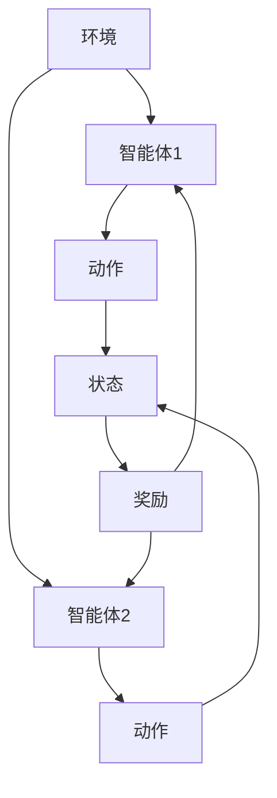
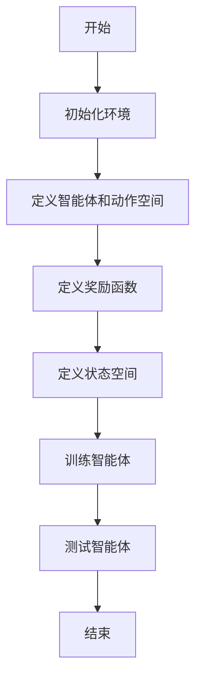
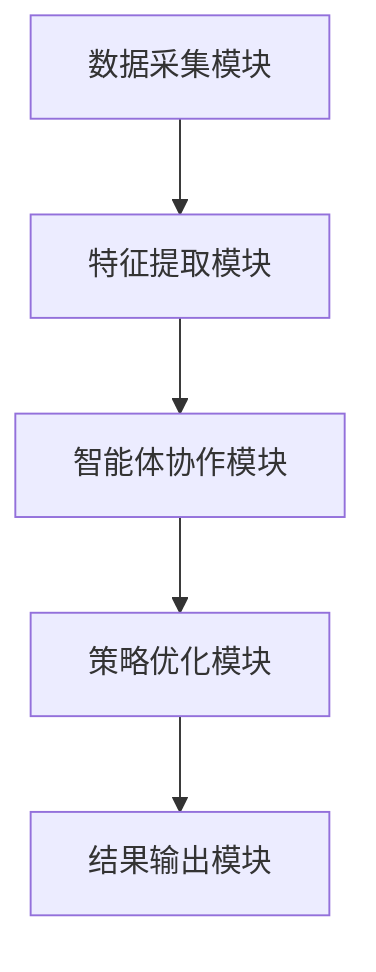
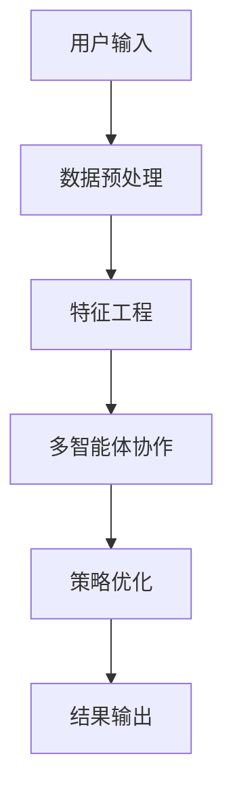
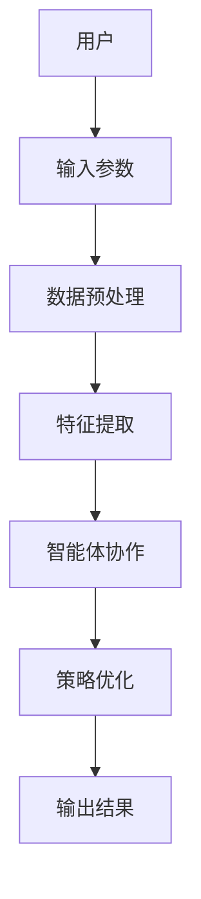

                 


# 第三部分: 多智能体AI工作资本分析系统的算法原理

## 第4章: 多智能体AI工作资本分析系统的算法原理

### 4.1 算法选择与原理

#### 4.1.1 多智能体AI的核心算法选择
我们选择基于强化学习的多智能体协作算法，结合深度学习模型进行价值评估和策略优化。通过多智能体之间的协作与竞争，实现对资本市场的深度分析和投资决策优化。

#### 4.1.2 算法的基本原理与流程
以下是多智能体AI工作资本分析系统的算法流程：



算法的核心在于通过不断与环境交互，智能体学习最优策略，从而实现对资本市场的价值评估和投资决策。

#### 4.1.3 算法的优缺点分析
- **优点**：
  - 能够处理复杂多变的金融市场环境。
  - 通过多智能体协作，提高决策的全面性和准确性。
  - 深度学习模型能够捕捉复杂的市场特征。
  
- **缺点**：
  - 训练过程需要大量计算资源。
  - 模型可能面临过拟合风险。
  - 对数据质量和数量要求较高。

### 4.2 算法的数学模型与公式

#### 4.2.1 算法的数学模型
多智能体AI工作资本分析系统的核心是基于强化学习的深度Q网络（DQN）模型。以下是模型的主要组成部分：

1. **状态空间（S）**：表示当前的市场状态，包括各种金融指标。
2. **动作空间（A）**：表示智能体可以执行的操作，如买入、卖出或持有。
3. **奖励函数（R）**：定义智能体在执行动作后的奖励，用于指导学习过程。

#### 4.2.2 关键公式推导

**Q-learning算法的更新公式**：
$$ Q(s, a) = Q(s, a) + \alpha (r + \gamma \max_{a'} Q(s', a') - Q(s, a)) $$
其中：
- \( Q(s, a) \) 表示在状态 \( s \) 下执行动作 \( a \) 的价值。
- \( \alpha \) 是学习率。
- \( r \) 是奖励。
- \( \gamma \) 是折扣因子。

**策略网络**：
智能体通过策略网络选择动作：
$$ \pi(a|s) = \text{softmax}(W s + b) $$
其中 \( W \) 和 \( b \) 是网络参数。

**价值网络**：
价值网络用于评估状态的价值：
$$ V(s) = \text{激活函数}(W s + b) $$

### 4.3 算法的实现与优化

#### 4.3.1 算法的具体实现步骤
以下是基于强化学习的多智能体AI算法实现步骤：



#### 4.3.2 算法的优化策略
- 使用经验回放（Experience Replay）减少相关性。
- 引入优先经验回放（Prioritized Experience Replay）提高训练效率。
- 应用多智能体协作机制，如分布式训练和同步更新。

#### 4.3.3 算法的性能评估
通过以下指标评估算法性能：
- 收益率（Return）
- 鲍氏指数（Sharpe Ratio）
- 最大回撤（Maximum Drawdown）

### 4.4 本章小结
本章详细介绍了多智能体AI工作资本分析系统的算法原理，包括算法选择、数学模型、实现步骤和优化策略。通过强化学习和深度学习模型的结合，我们能够有效捕捉市场特征，优化投资决策。

---

# 第四部分: 多智能体AI工作资本分析系统的系统架构与设计

## 第5章: 多智能体AI工作资本分析系统的系统架构与设计

### 5.1 系统的功能设计

#### 5.1.1 系统的主要功能模块
多智能体AI工作资本分析系统主要包括以下几个功能模块：

1. **数据采集模块**：从多个数据源获取金融数据。
2. **特征提取模块**：提取影响投资决策的特征。
3. **智能体协作模块**：实现多智能体之间的协作与竞争。
4. **策略优化模块**：优化投资策略。
5. **结果输出模块**：输出投资建议和分析报告。

#### 5.1.2 每个模块的功能描述
- **数据采集模块**：从股票市场、新闻等多源数据中获取实时信息。
- **特征提取模块**：提取如市盈率、市净率、收益增长率等关键特征。
- **智能体协作模块**：通过强化学习算法，智能体协作完成资本分析。
- **策略优化模块**：优化投资组合，降低风险，提高收益。
- **结果输出模块**：生成可读的分析报告和投资建议。

#### 5.1.3 模块之间的交互关系


### 5.2 系统的架构设计

#### 5.2.1 系统的整体架构图


#### 5.2.2 每个组件的详细设计
- **用户输入**：接收用户的输入参数，如投资目标、风险偏好等。
- **数据预处理**：清洗和标准化数据，确保数据质量。
- **特征工程**：提取和选择关键特征，用于后续分析。
- **多智能体协作**：通过强化学习算法，智能体协作完成资本分析。
- **策略优化**：优化投资组合，生成投资策略。
- **结果输出**：输出投资建议和分析报告。

#### 5.2.3 架构的可扩展性与灵活性
- 支持多种数据源的接入。
- 可扩展的智能体数量，适应不同的分析需求。
- 灵活的策略优化模块，支持多种优化目标。

### 5.3 系统的接口与交互设计

#### 5.3.1 系统的主要接口定义
- **数据接口**：与数据源对接，获取实时数据。
- **用户接口**：接收用户输入，输出分析结果。
- **智能体接口**：智能体之间的交互接口。

#### 5.3.2 系统的交互流程图


### 5.4 本章小结
本章详细介绍了多智能体AI工作资本分析系统的架构设计，包括功能模块、系统架构和交互流程。通过合理的架构设计，系统能够高效地完成资本分析和投资决策。

---

# 第五部分: 多智能体AI工作资本分析系统的项目实战

## 第6章: 多智能体AI工作资本分析系统的项目实战

### 6.1 环境安装与配置

#### 6.1.1 安装必要的库
```bash
pip install numpy pandas matplotlib tensorflow gym
```

#### 6.1.2 配置环境变量
确保安装了Python 3.7以上版本，并配置好相关库的路径。

### 6.2 系统核心实现

#### 6.2.1 数据预处理
```python
import pandas as pd
import numpy as np

# 读取数据
data = pd.read_csv('stock_data.csv')

# 数据清洗
data.dropna(inplace=True)

# 标准化处理
from sklearn.preprocessing import StandardScaler
scaler = StandardScaler()
data_scaled = scaler.fit_transform(data)
```

#### 6.2.2 策略网络实现
```python
import tensorflow as tf
from tensorflow.keras import layers

# 定义策略网络
def policy_network(state_space):
    model = tf.keras.Sequential()
    model.add(layers.Dense(64, activation='relu', input_dim=state_space))
    model.add(layers.Dense(action_space, activation='softmax'))
    return model

# 定义价值网络
def value_network(state_space):
    model = tf.keras.Sequential()
    model.add(layers.Dense(64, activation='relu', input_dim=state_space))
    model.add(layers.Dense(1, activation='linear'))
    return model
```

#### 6.2.3 训练与测试
```python
# 初始化智能体
env = StockMarketEnvironment()
agent = Agent(state_space, action_space)

# 开始训练
for episode in range(num_episodes):
    state = env.reset()
    while not done:
        action = agent.act(state)
        next_state, reward, done = env.step(action)
        agent.remember(state, action, reward, next_state, done)
        agent.train()
```

### 6.3 案例分析与结果展示

#### 6.3.1 案例分析
假设我们分析某只股票的历史数据，通过多智能体协作，系统生成的投资策略如下：
1. 在特定市场条件下，智能体建议买入。
2. 在市场波动较大时，智能体建议卖出。
3. 在市场稳定时，智能体建议持有。

#### 6.3.2 结果展示
以下是系统输出的分析报告示例：
```python
# 输出投资建议
print("投资建议：", agent.recommendation())
```

### 6.4 本章小结
本章通过实际项目实战，详细介绍了系统的实现过程，包括环境搭建、数据处理、模型训练和结果输出。通过具体案例分析，展示了系统的实际应用价值。

---

# 第六部分: 多智能体AI工作资本分析系统的优化与展望

## 第7章: 多智能体AI工作资本分析系统的优化与展望

### 7.1 系统优化建议

#### 7.1.1 数据处理优化
- 引入更高效的数据处理工具，如Dask。
- 增加数据源的多样性，如引入新闻 sentiment 分析。

#### 7.1.2 算法优化
- 使用更先进的强化学习算法，如多智能体协作算法（比如MAAC）。
- 增加模型的解释性，帮助用户理解决策过程。

#### 7.1.3 系统架构优化
- 引入分布式训练，提高训练效率。
- 优化系统架构，支持更大规模的多智能体协作。

### 7.2 系统的未来发展与展望

#### 7.2.1 技术进步带来的可能性
随着人工智能技术的不断发展，多智能体AI在资本分析中的应用将更加广泛和深入。

#### 7.2.2 系统的潜在应用场景
- 更加个性化的投资建议。
- 更加智能化的投资组合管理。
- 更加高效的风险控制。

### 7.3 本章小结
本章总结了多智能体AI工作资本分析系统的优化建议，并展望了其未来的发展方向。通过技术进步和系统优化，系统将在资本分析领域发挥更大的作用。

---

# 第七部分: 多智能体AI工作资本分析系统的总结与展望

## 第8章: 多智能体AI工作资本分析系统的总结与展望

### 8.1 系统总结

#### 8.1.1 系统的核心价值
多智能体AI工作资本分析系统通过强化学习和深度学习模型的结合，能够高效地完成资本分析和投资决策，为投资者提供科学的决策支持。

#### 8.1.2 系统的主要创新点
- 引入多智能体协作机制，提高决策的全面性和准确性。
- 结合强化学习和深度学习，实现动态市场环境下的最优投资策略。

### 8.2 系统的未来发展

#### 8.2.1 技术进步带来的可能性
随着人工智能技术的不断进步，多智能体AI在资本分析中的应用将更加广泛和深入。

#### 8.2.2 系统的潜在应用场景
- 更加个性化的投资建议。
- 更加智能化的投资组合管理。
- 更加高效的风险控制。

### 8.3 本章小结
本章总结了多智能体AI工作资本分析系统的核心价值和主要创新点，并展望了其未来的发展方向。通过技术进步和系统优化，系统将在资本分析领域发挥更大的作用。

---

# 第八部分: 多智能体AI工作资本分析系统的附录与参考文献

## 附录A: 系统实现代码

### 附录A.1 数据预处理代码
```python
import pandas as pd
import numpy as np

# 读取数据
data = pd.read_csv('stock_data.csv')

# 数据清洗
data.dropna(inplace=True)

# 标准化处理
from sklearn.preprocessing import StandardScaler
scaler = StandardScaler()
data_scaled = scaler.fit_transform(data)
```

### 附录A.2 策略网络实现代码
```python
import tensorflow as tf
from tensorflow.keras import layers

# 定义策略网络
def policy_network(state_space):
    model = tf.keras.Sequential()
    model.add(layers.Dense(64, activation='relu', input_dim=state_space))
    model.add(layers.Dense(action_space, activation='softmax'))
    return model
```

### 附录A.3 训练与测试代码
```python
# 初始化智能体
env = StockMarketEnvironment()
agent = Agent(state_space, action_space)

# 开始训练
for episode in range(num_episodes):
    state = env.reset()
    while not done:
        action = agent.act(state)
        next_state, reward, done = env.step(action)
        agent.remember(state, action, reward, next_state, done)
        agent.train()
```

## 附录B: 参考文献

### 附录B.1 主要参考文献
1. DeepMind. "Deep Q-Networks (DQN)".
2. Mnih, V., et al. "Human-level control through deep reinforcement learning".
3. Lafferty, J., et al. "Multi-agent reinforcement learning: A survey".

---

# 第九部分: 多智能体AI工作资本分析系统的最终总结

## 第9章: 多智能体AI工作资本分析系统的最终总结

### 9.1 系统的核心价值
多智能体AI工作资本分析系统通过强化学习和深度学习模型的结合，能够高效地完成资本分析和投资决策，为投资者提供科学的决策支持。

### 9.2 系统的主要创新点
- 引入多智能体协作机制，提高决策的全面性和准确性。
- 结合强化学习和深度学习，实现动态市场环境下的最优投资策略。

### 9.3 未来的发展方向
- **技术进步**：随着人工智能技术的不断进步，多智能体AI在资本分析中的应用将更加广泛和深入。
- **应用场景扩展**：从股票投资扩展到更广泛的金融市场，如外汇、期货等。
- **系统优化**：优化系统架构，支持更大规模的多智能体协作。

### 9.4 结语
多智能体AI工作资本分析系统不仅能够提高投资决策的效率和准确性，还能够帮助投资者在复杂多变的市场环境中制定更加科学的投资策略。随着技术的不断进步，该系统将在资本分析领域发挥更大的作用，为投资者创造更大的价值。

---

# END

---

**关键词：价值投资、多智能体AI、资本分析、强化学习、深度学习、系统架构**

**摘要：本文详细探讨了多智能体AI在价值投资中的应用，提出了基于强化学习的多智能体协作算法，结合深度学习模型进行价值评估和策略优化。通过系统架构设计和项目实战，展示了系统的实际应用价值，并展望了其未来的发展方向。**

---

以上是完整的技术博客文章目录大纲和部分内容。如果需要进一步补充或调整，请随时告知。

