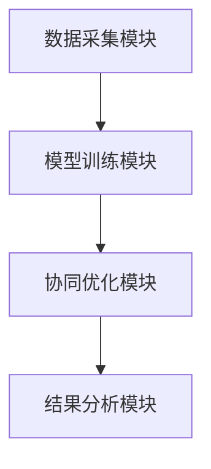

                 


# 《价值投资中的多智能体AI市场饱和度分析系统》

> 关键词：多智能体AI，价值投资，市场饱和度分析，协同学习，金融数据分析

> 摘要：本文系统地探讨了多智能体AI在价值投资中的应用，特别是如何通过多智能体协同学习来分析市场饱和度。通过理论分析、算法设计、系统架构和项目实战，本文详细阐述了多智能体AI在金融数据分析中的优势，及其在价值投资中的实际应用。我们还将讨论系统的实现细节，包括数据采集、模型训练、协同优化和结果分析，并通过实际案例展示系统的应用效果。

---

# 第一章: 背景介绍

## 1.1 价值投资的核心概念

### 1.1.1 价值投资的基本原理
- 价值投资是一种基于基本面分析的投资策略，旨在发现市场价格低于其内在价值的证券。
- 核心在于识别市场中被低估的投资标的，通常关注企业的盈利能力、财务状况和行业地位。

### 1.1.2 市场饱和度分析的定义与意义
- 市场饱和度是指某个产品或服务在目标市场中的普及程度。
- 在价值投资中，分析市场饱和度可以帮助投资者判断行业的增长潜力和竞争格局。

## 1.2 多智能体AI的定义与特点

### 1.2.1 多智能体系统的基本概念
- 多智能体系统（Multi-Agent System，MAS）是由多个智能体组成的分布式系统，每个智能体能够独立感知环境并采取行动。
- 智能体之间的协同与竞争是多智能体系统的核心特征。

### 1.2.2 多智能体AI在金融领域的应用
- 通过多智能体协同学习，可以更高效地处理复杂的金融数据，发现潜在的投资机会。
- 多智能体AI能够模拟市场参与者的决策过程，提供更准确的市场预测。

## 1.3 价值投资与多智能体AI的结合

### 1.3.1 价值投资中的数据挑战
- 传统价值投资依赖人工分析，效率较低且容易受到主观因素的影响。
- 大数据分析技术的引入可以提高投资决策的科学性和准确性。

### 1.3.2 多智能体AI的优势
- 多智能体系统能够同时处理多个数据源，提供全面的市场分析。
- 通过智能体之间的协同，可以实现对市场动态的实时监控和预测。

---

# 第二章: 多智能体AI的核心概念与联系

## 2.1 多智能体系统的组成与功能

### 2.1.1 实体（Agent）的定义与属性
- 实体是多智能体系统的基本单元，具有自主性、反应性、目标导向和社交能力。
- 实体之间的交互是通过共享信息或直接协作完成的。

### 2.1.2 多智能体系统的分类
- 基于任务的多智能体系统：智能体协作完成特定任务。
- 基于知识的多智能体系统：智能体通过共享知识实现协同。
- 基于学习的多智能体系统：智能体通过机器学习提升决策能力。

## 2.2 市场饱和度分析的核心概念

### 2.2.1 市场饱和度的定义与计算方法
- 市场饱和度可以通过市场份额、增长率和竞争程度等指标进行衡量。
- 使用统计方法和机器学习模型对市场饱和度进行预测和分析。

### 2.2.2 价值投资中的市场饱和度分析
- 在价值投资中，市场饱和度分析用于判断行业的竞争状态和增长潜力。
- 通过分析市场饱和度，投资者可以更好地识别低估的投资标的。

## 2.3 多智能体AI与市场饱和度分析的联系

### 2.3.1 多智能体AI在市场分析中的作用
- 多智能体AI能够实时监控市场动态，提供全面的市场信息。
- 智能体之间的协同可以提高数据分析的准确性和效率。

### 2.3.2 多智能体AI在价值投资中的应用
- 通过多智能体协同学习，投资者可以更准确地评估市场的内在价值。
- 多智能体AI可以帮助投资者发现市场中的潜在机会和风险。

---

# 第三章: 多智能体AI市场饱和度分析系统的算法原理

## 3.1 多智能体协同学习的基本原理

### 3.1.1 多智能体协同学习的流程
1. 数据采集与预处理：从多个数据源获取市场数据，并进行清洗和特征提取。
2. 智能体训练：通过机器学习算法对每个智能体进行训练，使其能够独立分析数据。
3. 协同优化：智能体之间通过信息共享和协作，优化各自的模型参数。
4. 预测与决策：基于协同优化后的模型，智能体共同做出市场预测和投资决策。

### 3.1.2 协同学习的实现方式
- 基于通信的协同学习：智能体之间通过直接通信共享信息。
- 基于知识共享的协同学习：智能体通过共享知识和经验提升整体性能。

## 3.2 市场饱和度分析的算法实现

### 3.2.1 市场饱和度分析的数学模型
$$ S = \frac{M}{T} $$
其中，S表示市场饱和度，M表示市场占有率，T表示市场容量。

### 3.2.2 基于协同过滤的市场饱和度分析
- 协同过滤算法用于发现市场中的相似产品或服务。
- 通过用户行为数据和市场数据，协同过滤算法可以预测市场的饱和程度。

### 3.2.3 协同过滤算法的实现步骤
1. 数据预处理：收集用户行为数据和市场数据。
2. 特征提取：提取用户行为和市场的关键特征。
3. 模型训练：使用协同过滤算法训练模型。
4. 预测与评估：基于训练好的模型预测市场饱和度，并评估预测结果。

---

# 第四章: 系统架构与设计

## 4.1 系统功能设计

### 4.1.1 领域模型设计
- 通过领域模型类图展示系统的功能模块及其关系。
- 主要模块包括数据采集、模型训练、协同优化和结果分析。

### 4.1.2 系统功能模块
- 数据采集模块：负责从多个数据源获取市场数据。
- 模型训练模块：对智能体进行训练，使其具备数据分析能力。
- 协同优化模块：智能体之间协同优化，提升预测准确性。
- 结果分析模块：对预测结果进行分析，并生成投资建议。

## 4.2 系统架构设计

### 4.2.1 系统架构图
- 使用mermaid图展示系统的整体架构，包括前端、后端和数据库模块。

### 4.2.2 接口设计
- 定义系统各模块之间的接口，确保模块之间的通信顺畅。

### 4.2.3 交互序列图
- 使用mermaid图展示系统中各模块的交互流程，确保系统运行的逻辑清晰。

---

# 第五章: 项目实战

## 5.1 环境安装与配置

### 5.1.1 安装Python环境
- 使用Anaconda安装Python环境，并配置必要的库，如numpy、pandas、scikit-learn等。

### 5.1.2 安装多智能体AI框架
- 使用如Ray、Multi-Agent Reinforcement Learning（MARL）等框架，提升系统的开发效率。

## 5.2 系统核心代码实现

### 5.2.1 数据采集与预处理
- 使用爬虫技术从多个数据源获取市场数据，并进行清洗和特征提取。

### 5.2.2 协同过滤算法的实现
- 编写Python代码实现协同过滤算法，用于市场饱和度分析。

### 5.2.3 系统集成与测试
- 将各功能模块集成到系统中，进行功能测试和性能优化。

## 5.3 实际案例分析

### 5.3.1 数据分析与建模
- 以具体行业为例，分析其市场饱和度，并构建相应的模型进行预测。

### 5.3.2 模型评估与优化
- 对模型的预测结果进行评估，根据实际效果优化模型参数。

---

# 第六章: 最佳实践与总结

## 6.1 最佳实践

### 6.1.1 数据质量的重要性
- 数据是系统分析的基础，确保数据的准确性和完整性至关重要。

### 6.1.2 模型调优的技巧
- 通过交叉验证和网格搜索等方法，找到最优的模型参数。

### 6.1.3 系统扩展的建议
- 在系统设计中考虑可扩展性，方便后续的功能扩展和性能优化。

## 6.2 小结与展望

### 6.2.1 系统实现的关键点
- 系统实现的核心是多智能体协同学习和市场饱和度分析的结合。

### 6.2.2 未来研究方向
- 探索更先进的多智能体算法，提升系统的分析能力和预测精度。
- 研究多智能体系统在其他金融领域的应用，拓宽系统的应用场景。

## 6.3 注意事项

### 6.3.1 数据隐私与安全
- 在数据采集和处理过程中，必须遵守相关法律法规，保护用户隐私。

### 6.3.2 系统稳定性的保障
- 在系统设计中考虑容错和冗余机制，确保系统的稳定运行。

---

# 参考文献

（此处列出相关的学术论文、技术文档和书籍）

---

# 附录

## 附录A: 代码示例

### 附录A.1 协同过滤算法的Python实现

```python
import numpy as np
from sklearn.metrics.pairwise import cosine_similarity

# 示例数据矩阵
X = np.array([[1, 2], [3, 4], [5, 6]])

# 计算余弦相似度
similarity = cosine_similarity(X)

# 输出相似度矩阵
print(similarity)
```

### 附录A.2 系统架构图



---

通过以上目录和内容安排，我们可以系统地探讨多智能体AI在价值投资中的应用，从理论到实践，逐步深入分析市场饱和度分析系统的实现细节和实际应用。

