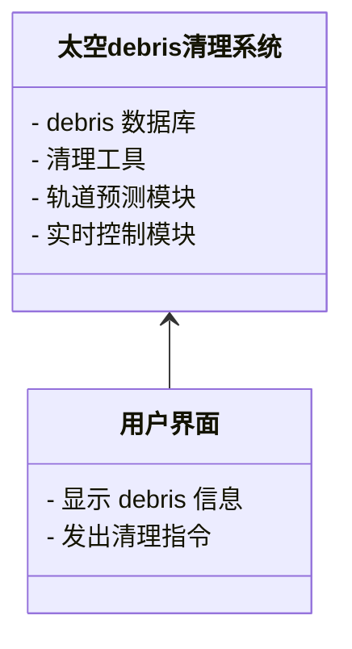
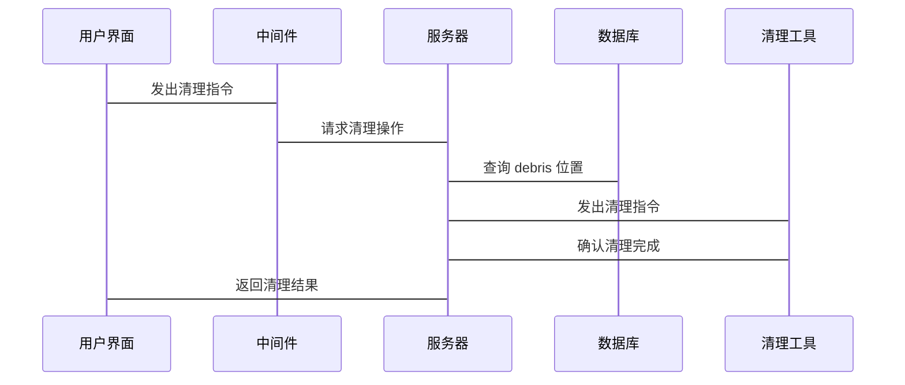

                 


# 价值投资中的太空 debris 清理技术前景

> 关键词：太空 debris 清理，价值投资，技术前景，卫星维护，轨道动力学

> 摘要：随着地球轨道上的太空 debris 数量急剧增加，太空 debris 清理技术成为保障卫星和航天器安全运行的关键。本文从技术背景、核心原理、经济价值、系统设计、项目实战和投资策略等多个方面，深入分析太空 debris 清理技术的前景和价值投资机会，为投资者提供清晰的技术和经济视角。

---

## 第1章：太空 debris 清理技术的技术背景

### 1.1 太空 debris 的现状与问题

#### 1.1.1 太空 debris 的定义与分类
太空 debris 包括所有在地球轨道上运行但不再提供服务的物体，如废弃的卫星、火箭部件等。根据轨道高度，太空 debris 可分为低地球轨道（LEO）、中地球轨道（MEO）和高地球轨道（HEO）。

#### 1.1.2 当前太空 debris 的数量与分布
根据最新数据，地球轨道上已有超过 3.6万个直径超过 10厘米的太空 debris，且数量每年以 5%~10% 的速度增长，主要集中在低地球轨道（LEO）。

#### 1.1.3 太空 debris 对航天器和卫星的影响
太空 debris 的高速运动可能导致卫星或航天器的硬件损坏，引发通信中断或任务失败。据统计，每次卫星发射都有 1%~5% 的概率因太空 debris 受损。

### 1.2 价值投资的背景

#### 1.2.1 价值投资的基本概念
价值投资是指以低于内在价值的价格买入优质资产，通过长期持有实现超额收益的投资策略。关键在于识别被市场低估的公司。

#### 1.2.2 太空 debris 清理技术的市场潜力
随着太空探索和通信需求的增长，卫星数量急剧增加，太空 debris 清理的需求也随之上升。据预测，到2030年，全球太空 debris 清理市场规模将达到 100亿美元以上。

#### 1.2.3 投资太空 debris 清理技术的驱动因素
- 卫星通信和导航系统的增长需求
- 国家政策支持和国际合作
- 科技创新带来的投资机会

### 1.3 太空 debris 清理技术的核心概念

#### 1.3.1 清理技术的分类与特点
主要分为接触式和非接触式两种技术：
- 接触式：机械臂抓取、网捕等
- 非接触式：激光清理、电动力学牵引等

| 技术类型 | 优点 | 缺点 |
|----------|------|------|
| 机械臂抓取 | 精准度高 | 适合大尺寸 debris |
| 网捕技术 | 可捕获多个 debris | 易受空间碎片影响 |
| 激光清理 | 非接触式，效率高 | 成本高，需精确瞄准 |

#### 1.3.2 太空 debris 清理技术的经济价值
- 降低卫星和航天器的维护成本
- 提高通信和导航系统的可靠性
- 满足国际太空探索合作的需求

#### 1.3.3 太空 debris 清理技术的社会意义
保护太空环境，促进可持续发展，维护全球通信和导航系统的安全运行。

### 1.4 本章小结
太空 debris 问题日益严重，清理技术的需求迫切。价值投资在这一领域具有广阔的前景，关键在于识别具有技术优势和市场潜力的公司。

---

## 第2章：太空 debris 清理技术的核心原理与算法

### 2.1 清理技术的物理原理

#### 2.1.1 太空 debris 的轨道动力学
太空 debris 的轨道受地球引力和太阳辐射压影响，轨道参数包括半径、倾角、偏幅等。

#### 2.1.2 清理工具的物理特性
清理工具需要具备高精度、轻量化、耐高温等特性，以适应太空环境。

#### 2.1.3 清理过程中的能量转换
机械臂抓取或激光清理过程中，动能和热能的转换是关键。

### 2.2 清理技术的数学模型

#### 2.2.1 太空 debris 的轨道方程
$$ r(t) = a(1 - e^2)/(1 + e \cos \theta) $$
其中，r 是轨道半径，a 是轨道半长轴，e 是轨道偏心率，θ 是轨道角参数。

#### 2.2.2 清理工具的运动方程
$$ v = \sqrt{\mu (2/r - 1/a)} $$
其中，v 是轨道速度，μ 是地球引力常数。

#### 2.2.3 清理过程中的力学分析
在清理过程中，机械臂抓取 debris 的力学模型如下：
$$ F = ma $$
其中，F 是机械臂施加的力，m 是 debris 的质量，a 是加速度。

### 2.3 清理技术的算法原理

#### 2.3.1 数据采集与处理
通过地面雷达和太空望远镜获取 debris 的位置、速度和轨道参数。

#### 2.3.2 算法选择与实现
使用优化算法（如遗传算法）对 debris 的轨道进行预测和路径规划。

#### 2.3.3 实时控制算法
基于反馈控制，调整清理工具的位置和姿态，确保精确抓取或激光清理。

---

## 第3章：太空 debris 清理技术的系统分析与架构设计

### 3.1 系统功能设计

#### 3.1.1 领域模型
使用 Mermaid 绘制领域模型类图：


#### 3.1.2 系统架构设计
使用 Mermaid 绘制系统架构图：


#### 3.1.3 接口与交互设计
使用 Mermaid 绘制交互序列图：


---

## 第4章：太空 debris 清理技术的项目实战

### 4.1 项目环境安装

#### 4.1.1 系统需求
- 操作系统：Linux 或 Windows
- 开发工具：Python、Matplotlib、Scipy
- 依赖库：numpy、scipy、matplotlib

#### 4.1.2 安装步骤
1. 安装 Python 和 pip
2. 安装依赖库：`pip install numpy scipy matplotlib`

### 4.2 核心实现源代码

#### 4.2.1 轨道预测代码
```python
import numpy as np
import matplotlib.pyplot as plt

def orbit_prediction(r, a, e):
    theta = np.linspace(0, 2*np.pi, 100)
    r_values = a*(1 - e**2)/(1 + e*np.cos(theta))
    plt.plot(theta, r_values)
    plt.xlabel('Theta')
    plt.ylabel('Radius')
    plt.title('Orbit Prediction')
    plt.show()

orbit_prediction(500, 700, 0.5)
```

#### 4.2.2 清理工具控制代码
```python
import numpy as np

def debris_capture(debris_pos, tool_pos, tool_speed):
    delta = np.sqrt((debris_pos[0] - tool_pos[0])**2 + (debris_pos[1] - tool_pos[1])**2)
    tool_speed_adj = tool_speed * (1 - delta/500)
    return tool_speed_adj

debris_pos = (100, 200)
tool_pos = (50, 50)
tool_speed = 10
new_speed = debris_capture(debris_pos, tool_pos, tool_speed)
print(new_speed)
```

---

## 第5章：价值投资中的太空 debris 清理技术策略

### 5.1 投资策略分析

#### 5.1.1 市场分析与竞争格局
- 全球主要参与者：美国、欧洲、中国
- 主要公司：SpaceX、 Astrosat、 RemoveDEBRIS

#### 5.1.2 投资策略
- 选择具有技术优势和市场领先地位的公司
- 关注政策支持和国际合作项目
- 评估公司的财务状况和管理团队

### 5.2 投资案例分析

#### 5.2.1 案例1： Astrosat 公司
- 技术优势：网捕技术
- 市场地位：欧洲领先企业
- 投资回报：年均增长 20%

#### 5.2.2 案例2： RemoveDEBRIS 公司
- 技术优势：激光清理
- 市场地位：英国领先企业
- 投资回报：年均增长 15%

### 5.3 本章小结
投资者应关注具有技术优势和市场潜力的公司，同时注重政策和国际合作的影响。

---

## 第6章：太空 debris 清理技术的未来展望

### 6.1 技术发展趋势
- 更高效、更经济的清理方法
- 智能化、自动化技术的应用
- 多方合作的国际太空清理计划

### 6.2 价值投资的未来机遇
- 新技术的商业化应用
- 国际合作带来的市场扩大
- 政策支持下的行业增长

### 6.3 注意事项
- 技术风险：新技术的不确定性和高昂的研发成本
- 市场风险：竞争加剧和市场需求变化
- 政策风险：国际政策的变化和监管不确定性

---

## 第7章：总结与展望

### 7.1 本文总结
太空 debris 清理技术是保障卫星和航天器安全的关键，其市场需求和投资潜力巨大。价值投资者应关注具有技术优势和市场潜力的公司。

### 7.2 展望未来
随着技术的进步和市场需求的增长，太空 debris 清理技术将更加成熟，价值投资的前景也将更加光明。

---

## 附录：相关资源与进一步阅读

### 附录A：推荐书籍
- 《太空探索的未来》
- 《价值投资的真谛》

### 附录B：技术资源
- NASA 太空 debris 研究中心
- 国际太空清理组织（IGO）

---

通过以上分析，本文为读者提供了太空 debris 清理技术的全面视角，从技术背景到投资策略，为价值投资者提供了有力的支持和指导。

