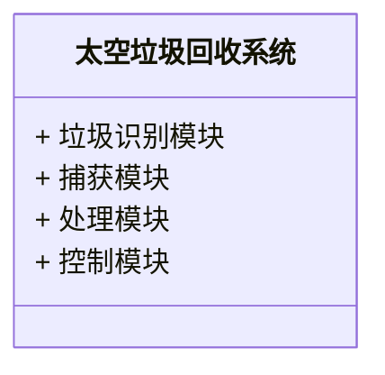

                 


# 价值投资中的太空垃圾回收技术发展前景

> **关键词**：价值投资、太空垃圾回收、技术前景、投资模型、经济价值

> **摘要**：  
太空垃圾回收技术是解决当前航天活动中日益严重的太空垃圾问题的关键技术。本文从价值投资的角度，分析太空垃圾回收技术的经济价值、技术可行性以及投资潜力。通过详细的技术分析、数学建模和系统设计，探讨如何将太空垃圾回收技术转化为投资机会，并评估其长期投资价值。

---

# 第一部分：太空垃圾回收技术的背景与挑战

## 第1章：太空垃圾问题的现状

### 1.1 太空垃圾的定义与分类

太空垃圾是指在地球轨道上运行的不再具有功能的航天器、卫星、火箭部件以及其他碎片。根据轨道高度，太空垃圾可以分为低地球轨道（LEO）、中地球轨道（MEO）和高地球轨道（GEO）垃圾。此外，太空垃圾还包括废弃的卫星、火箭整流罩和航天器部件等。

### 1.2 当前太空垃圾的数量与分布

根据最新统计，地球轨道上的太空垃圾数量已超过3.6万个，其中直径超过10厘米的碎片约有2.7万个，直径在1厘米以上的碎片数量超过1亿个。低地球轨道（LEO）是太空垃圾最密集的区域，尤其是距离地球表面200-2000公里的轨道。

### 1.3 太空垃圾对航天活动的影响

太空垃圾对当前的航天活动构成严重威胁，主要表现为：
- **物理威胁**：高速运动的太空垃圾可能对在轨卫星、航天器造成严重损害，导致设备损坏或任务失败。
- **运行成本增加**：为了规避太空垃圾的风险，航天器需要频繁调整轨道，增加了燃料消耗和运行成本。
- **潜在灾难**：太空垃圾可能对国际空间站或其他重要航天器构成威胁，导致重大事故。

---

## 第2章：价值投资的基本原理

### 2.1 价值投资的定义

价值投资是一种投资策略，强调通过深入分析企业的基本面，寻找市场价格低于其内在价值的投资机会。价值投资者认为市场存在非理性，可以通过长期持有优质资产获得超额收益。

### 2.2 价值投资的核心理念

价值投资的核心理念包括：
1. **安全边际**：买入价格低于内在价值，以降低投资风险。
2. **长期视角**：关注企业的长期盈利能力，而非短期市场波动。
3. **基本面分析**：通过财务报表、行业地位、管理团队等因素评估企业的内在价值。

### 2.3 价值投资与太空垃圾回收技术的结合

太空垃圾回收技术具有较高的技术门槛和市场潜力，但同时也面临较高的技术和市场风险。通过价值投资的视角，可以从企业的技术可行性、市场需求和财务状况等多个维度，评估太空垃圾回收技术的投资价值。

---

# 第二部分：太空垃圾回收技术的核心概念与联系

## 第3章：太空垃圾回收技术的核心原理

### 3.1 太空垃圾回收的主要技术手段

1. **机械抓取技术**：利用机械臂或其他抓取工具捕获太空垃圾。
2. **激光清理技术**：使用地面或空间站上的激光器照射太空垃圾，使其脱离轨道并坠入大气层烧毁。
3. **电动力拖拽技术**：通过电场或磁场作用于太空垃圾，改变其轨道，使其脱离地球轨道。

### 3.2 太空垃圾回收技术的难点与挑战

1. **技术难度**：太空垃圾的高速运动和微小尺寸使得捕获和回收技术极具挑战性。
2. **成本问题**：太空垃圾回收技术的研发和实施成本较高，且目前尚未形成稳定的商业模式。
3. **政策与法规**：太空垃圾回收涉及国际法和多国利益，政策协调难度较大。

---

## 第4章：价值投资视角下的技术评估框架

### 4.1 技术可行性评估

1. **技术成熟度**：评估太空垃圾回收技术的现有技术水平及其在实际应用中的可行性。
2. **技术壁垒**：分析企业的技术专利、研发能力和技术团队的专业性。

### 4.2 市场需求分析

1. **市场规模**：估算太空垃圾回收服务的潜在市场规模。
2. **客户需求**：分析卫星运营商、政府机构等潜在客户的回收需求。

### 4.3 财务可行性分析

1. **成本结构**：评估太空垃圾回收技术的研发成本、设备成本和运营成本。
2. **收入来源**：分析可能的收入来源，如卫星运营商付费、政府补贴等。

---

# 第三部分：太空垃圾回收技术的算法原理与数学模型

## 第5章：太空垃圾回收技术的算法原理

### 5.1 垃圾识别算法

1. **基于图像识别的垃圾识别**：利用深度学习算法，通过遥感图像识别太空垃圾的位置和形状。
2. **基于雷达的垃圾识别**：通过雷达信号分析太空垃圾的形状和位置。

### 5.2 垃圾捕获算法

1. **机械抓取算法**：优化机械臂的运动轨迹，确保准确捕获目标垃圾。
2. **激光清理算法**：计算激光器的最佳照射角度和时间，确保高效清除垃圾。

---

## 第6章：价值投资中的数学模型

### 6.1 投资收益计算公式

$$ \text{投资收益} = \text{总收入} - \text{总成本} $$

其中：
- **总收入**：来自太空垃圾回收服务的收入。
- **总成本**：包括研发成本、设备成本和运营成本。

### 6.2抽样案例分析

假设某公司计划投资于一家太空垃圾回收技术公司，其财务数据如下：
- **预计总收入**：1000万美元/年
- **预计总成本**：600万美元/年
- **净收益**：400万美元/年

投资收益计算：
$$ \text{投资收益} = 1000\, \text{万} - 600\, \text{万} = 400\, \text{万} $$

---

# 第四部分：太空垃圾回收技术的系统分析与架构设计

## 第7章：系统功能设计

### 7.1 领域模型



### 7.2 系统架构设计


---

## 第8章：项目实战

### 8.1 项目介绍

以某太空垃圾回收公司为例，分析其技术可行性、市场需求和财务状况。

### 8.2 核心实现

```python
def calculate_investment_value(revenue, cost):
    return revenue - cost

revenue = 1000  # 单位：万美元
cost = 600      # 单位：万美元
investment_value = calculate_investment_value(revenue, cost)
print(f"投资价值为：{investment_value}万美元")
```

---

## 第9章：最佳实践

### 9.1 小结

太空垃圾回收技术具有较高的投资价值，但也面临技术和市场风险。投资者应从技术可行性、市场需求和财务状况等多个维度进行综合评估。

### 9.2 注意事项

- **技术风险**：关注技术的成熟度和企业的研发能力。
- **政策风险**：关注相关政策和法规的变化。
- **市场风险**：分析市场需求的可持续性和客户接受度。

### 9.3 拓展阅读

- 推荐阅读《价值投资入门》和《太空技术与商业》等书籍。

---

通过以上分析，我们可以得出结论：太空垃圾回收技术具有较大的市场潜力和投资价值，但需要投资者具备较高的技术分析能力和风险承受能力。

