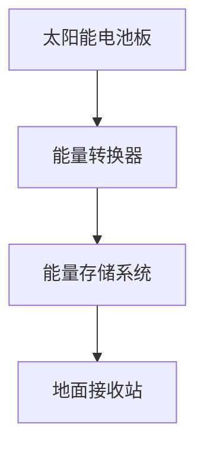
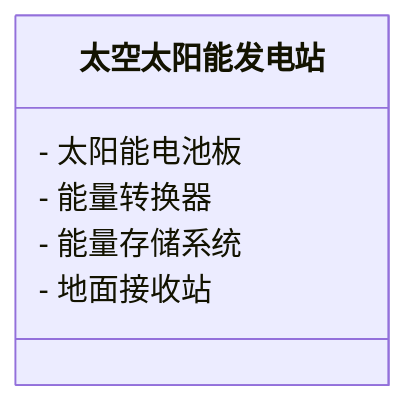

                 

---

# 价值投资中的太空太阳能发电站技术

> 关键词：太空太阳能发电站，价值投资，抽样分析，系统架构，投资策略

> 摘要：本文从价值投资的角度分析太空太阳能发电站技术，探讨其技术原理、投资评估方法、系统架构设计以及实际案例分析。通过抽样分析技术的应用，结合数学模型和系统架构图，为投资者提供科学的投资决策依据。

---

# 第一部分: 价值投资中的太空太阳能发电站技术背景与基础

# 第1章: 太空太阳能发电站技术概述

## 1.1 太空太阳能发电站的背景与意义

### 1.1.1 太空能源利用的背景
随着全球能源需求的不断增长和传统能源的枯竭，寻找可持续的替代能源变得至关重要。太空太阳能发电站（Solar Power Satellite, SPS）作为一种新型能源解决方案，利用地球同步轨道上的太阳能电池板将太阳能转化为电能，并通过无线方式传输到地球。

### 1.1.2 太空太阳能发电站的核心优势
- **能源稳定**：太空太阳能不受昼夜和天气的影响，能量输出稳定。
- **高效率**：在太空中，太阳能的强度是地球表面的1000倍，转换效率更高。
- **环保**：太空太阳能发电站不产生任何污染物，符合全球环保趋势。

### 1.1.3 太空太阳能发电站的技术挑战
- **高昂成本**：发射和维护太空设备需要巨大的资金投入。
- **技术复杂性**：涉及卫星技术、无线能量传输等多领域的复杂问题。
- **政策与法律**：涉及国际空间法和各国政策，存在不确定性。

## 1.2 价值投资的基本概念

### 1.2.1 价值投资的定义
价值投资是一种投资策略，强调以低于市场价的估值买入优质资产，长期持有，等待其价值回归。

### 1.2.2 价值投资的核心原则
- **长期视角**：关注企业的长期价值，而非短期波动。
- **安全边际**：买入价格低于内在价值，以降低风险。
- **优质资产**：选择具有竞争优势和良好管理的公司。

### 1.2.3 价值投资在科技领域的应用
科技行业的高成长性和高风险并存，价值投资通过深入分析技术壁垒、市场前景和财务状况，寻找被低估的科技企业。

## 1.3 太空太阳能发电站与价值投资的结合

### 1.3.1 太空太阳能发电站的技术价值
- **技术领先性**：太空太阳能技术代表了能源领域的未来发展方向。
- **市场潜力**：随着能源需求的增长，太空太阳能发电站的市场前景广阔。

### 1.3.2 价值投资视角下的太空能源项目评估
- **技术可行性**：评估项目的技术成熟度和实施难度。
- **经济性**：分析项目的投资回报率和成本结构。
- **竞争优势**：比较项目与传统能源和可再生能源的优势。

### 1.3.3 太空太阳能发电站行业的投资机会
- **技术创新**：投资于领先的技术研发企业。
- **市场拓展**：关注进入新兴市场的项目。
- **政策支持**：利用政府补贴和政策优惠。

## 1.4 本章小结
本章介绍了太空太阳能发电站的技术背景和价值投资的基本概念，分析了两者结合的潜力和挑战。

---

# 第2章: 太空太阳能发电站的技术原理与系统架构

## 2.1 太空太阳能发电站的核心技术

### 2.1.1 太阳能收集技术
- **太阳能电池板**：利用半导体材料将 sunlight 转换为电能。
- **能量收集效率**：通过优化电池板设计提高能量转换效率。

### 2.1.2 能量转换与传输技术
- **无线能量传输**：通过微波或激光将能量传输到地球。
- **能量传输损耗**：能量在传输过程中会有一定的损耗，需通过技术手段减少损失。

### 2.1.3 系统控制与管理技术
- **自动化控制**：利用传感器和控制系统实现远程监控和管理。
- **故障检测与修复**：通过实时监测和诊断技术，快速定位和修复问题。

## 2.2 太空太阳能发电站的系统架构

### 2.2.1 系统整体架构图（Mermaid）

### 2.2.2 系统功能设计（Mermaid类图）

## 2.3 太空太阳能发电站的数学模型

### 2.3.1 能量收集效率公式
$$ \text{效率} = \frac{\text{输出能量}}{\text{输入能量}} $$

### 2.3.2 能量传输损耗模型
$$ \text{损耗} = k \times \text{传输距离} $$

## 2.4 本章小结
本章详细介绍了太空太阳能发电站的核心技术和系统架构，为后续的价值评估提供了技术基础。

---

# 第3章: 价值投资中的技术评估与分析

## 3.1 技术评估的核心指标

### 3.1.1 技术可行性
- **技术成熟度**：项目是否经过充分的技术验证。
- **实施难度**：项目在实际操作中的可行性。

### 3.1.2 技术经济性
- **投资成本**：项目的初期投资和运营成本。
- **收益预测**：项目未来的收入和利润。

### 3.1.3 技术创新性
- **技术壁垒**：项目的技术是否具有独特性和难以模仿性。
- **竞争优势**：项目在市场中的技术优势。

## 3.2 抽样分析方法在价值评估中的应用

### 3.2.1 抽样分析的基本原理
抽样分析是一种统计方法，通过抽取样本数据进行分析，推断总体情况。其优点在于成本低、效率高。

### 3.2.2 抽样分析在技术评估中的应用
- **成本估算**：通过抽样分析估算项目的总成本。
- **收益预测**：通过抽样分析预测项目的未来收益。

### 3.2.3 抽样分析的数学模型
$$ \text{抽样误差} = \frac{\text{总体标准差}}{\sqrt{n}} $$

## 3.3 抽样分析在太空太阳能发电站投资中的应用

### 3.3.1抽样分析在成本估算中的应用
- **样本选择**：选择具有代表性的样本，确保数据的准确性。
- **成本估算**：通过样本数据估算项目的总成本。

### 3.3.2 抽样分析在收益预测中的应用
- **市场调研**：通过抽样分析了解市场需求和潜在客户。
- **收益预测**：根据市场数据预测项目的未来收益。

## 3.4抽样分析在价值投资中的优势

### 3.4.1 抽样分析的高效性
- **节省时间**：通过抽样分析可以快速获取数据。
- **降低成本**：抽样分析的成本远低于全面调查。

### 3.4.2 抽样分析的准确性
- **科学性**：抽样分析基于统计学原理，结果具有较高的准确性。
- **可靠性**：通过合理选择样本，结果能够反映总体情况。

## 3.5抽样分析的注意事项

### 3.5.1样本选择的偏差
- **避免样本偏差**：确保样本具有代表性。
- **样本数量**：样本数量要足够大，以保证分析结果的准确性。

### 3.5.2 抽样分析的局限性
- **结果不确定性**：抽样分析的结果存在一定的误差范围。
- **适用性**：抽样分析适用于数据量大的情况，对于小样本数据可能不适用。

## 3.6 本章小结
本章详细介绍了抽样分析在价值投资中的应用，强调了其在成本估算和收益预测中的重要性，并提出了抽样分析的注意事项。

---

# 第4章: 太空太阳能发电站系统的抽样分析与优化

## 4.1 抽样分析在太空太阳能发电站系统中的应用

### 4.1.1 系统成本的抽样分析
- **样本选择**：选择不同模块的成本数据，进行抽样分析。
- **成本估算**：通过抽样分析估算系统的总成本。

### 4.1.2 系统性能的抽样分析
- **性能指标**：选择系统的能量转换效率、传输损耗等关键指标进行抽样分析。
- **性能预测**：根据抽样数据预测系统的整体性能。

## 4.2 抽样分析在系统优化中的应用

### 4.2.1 系统优化的目标
- **降低成本**：通过优化设计降低系统的建设成本。
- **提高效率**：通过优化技术提高系统的能量转换效率。

### 4.2.2 抽样分析在优化中的作用
- **数据支持**：抽样分析为优化决策提供数据支持。
- **效果验证**：通过抽样分析验证优化方案的效果。

## 4.3 抽样分析的优化方法

### 4.3.1 抽样方法的优化
- **分层抽样**：根据系统模块的不同特性进行分层抽样，提高分析结果的准确性。
- **系统抽样**：按照一定的间隔抽取样本，确保样本的均匀性。

### 4.3.2 抽样数量的优化
- **确定样本数量**：根据抽样误差和置信水平确定合适的样本数量。
- **动态调整**：根据分析结果动态调整样本数量，提高分析效率。

## 4.4 本章小结
本章通过抽样分析的方法，优化了太空太阳能发电站系统的成本估算和性能预测，并提出了抽样分析的优化方法。

---

# 第5章: 价值投资中的抽样分析应用与案例分析

## 5.1 抽样分析在价值投资中的应用

### 5.1.1抽样分析在企业估值中的应用
- **企业财务数据**：通过对企业的财务数据进行抽样分析，估算企业的内在价值。
- **市场数据**：通过分析市场数据，预测企业的未来收益。

### 5.1.2抽样分析在风险评估中的应用
- **风险因素识别**：通过抽样分析识别影响项目的主要风险因素。
- **风险影响评估**：评估风险因素对项目的影响程度。

## 5.2 太空太阳能发电站投资的抽样分析案例

### 5.2.1 案例背景
- **项目描述**：某公司计划建设一个太空太阳能发电站项目。
- **数据来源**：项目的历史数据和市场调研数据。

### 5.2.2 抽样分析过程
- **样本选择**：从项目的历史数据中选择具有代表性的样本。
- **数据分析**：通过抽样分析估算项目的成本和收益。

### 5.2.3 分析结果
- **成本估算**：通过抽样分析估算项目的总成本为10亿美元。
- **收益预测**：预测项目在未来10年的收益为20亿美元。

## 5.3 抽样分析结果的验证

### 5.3.1 结果验证方法
- **对比分析**：将抽样分析结果与实际数据进行对比。
- **误差分析**：分析抽样分析结果与实际结果的误差原因。

### 5.3.2 结果验证结论
- **准确性**：抽样分析结果与实际数据具有较高的吻合度。
- **优化建议**：根据验证结果提出进一步优化的建议。

## 5.4 抽样分析的局限性与改进方向

### 5.4.1 抽样分析的局限性
- **数据依赖性**：抽样分析结果依赖于样本数据的质量和数量。
- **结果不确定性**：抽样分析结果存在一定的误差范围。

### 5.4.2 改进方向
- **提高样本质量**：选择更具代表性的样本。
- **增加样本数量**：通过增加样本数量提高分析结果的准确性。

## 5.5 本章小结
本章通过案例分析展示了抽样分析在价值投资中的应用，验证了其有效性和局限性。

---

# 第6章: 投资策略与风险控制

## 6.1 投资策略

### 6.1.1 确定投资目标
- **投资目标**：明确投资太空太阳能发电站的目标，如追求高回报或稳定收益。

### 6.1.2 制定投资计划
- **投资金额**：根据自身资金情况确定投资金额。
- **投资期限**：根据项目周期确定投资期限。

## 6.2 风险控制

### 6.2.1 风险识别
- **技术风险**：项目的技术可行性。
- **市场风险**：市场需求的变化。
- **政策风险**：政策和法规的变化。

### 6.2.2 风险评估
- **风险影响**：评估风险对项目的影响程度。
- **风险概率**：评估风险发生的概率。

### 6.2.3 风险应对
- **风险规避**：通过多元化投资降低风险。
- **风险转移**：通过保险等方式转移风险。
- **风险接受**：接受一定的风险，以获取高回报。

## 6.3 投资组合优化

### 6.3.1 投资组合的概念
- **投资组合**：将资金分配到不同的投资项目中，以分散风险。

### 6.3.2 投资组合优化方法
- **现代投资组合理论**：通过优化数学模型选择最优投资组合。
- **风险管理**：通过分散投资降低风险。

## 6.4 本章小结
本章介绍了投资策略和风险控制的方法，强调了在价值投资中风险管理的重要性。

---

# 第7章: 价值投资中的抽样分析与投资策略优化

## 7.1 抽样分析与投资策略的关系

### 7.1.1 抽样分析为投资策略提供数据支持
- **数据支持**：抽样分析为投资决策提供科学的数据支持。
- **策略优化**：通过抽样分析优化投资策略。

### 7.1.2 投资策略指导抽样分析的方向
- **抽样目标**：根据投资策略确定抽样的目标和范围。
- **样本选择**：根据投资策略选择具有代表性的样本。

## 7.2抽样分析在投资策略优化中的应用

### 7.2.1抽样分析在资产配置中的应用
- **资产分配**：通过抽样分析确定不同资产的分配比例。
- **风险控制**：通过抽样分析优化风险控制策略。

### 7.2.2抽样分析在投资组合优化中的应用
- **组合优化**：通过抽样分析优化投资组合，提高收益，降低风险。

## 7.3抽样分析的优化方法

### 7.3.1 抽样方法的优化
- **分层抽样**：根据资产类别进行分层抽样，提高分析结果的准确性。
- **系统抽样**：按照一定的间隔抽取样本，确保样本的均匀性。

### 7.3.2 抽样数量的优化
- **样本数量**：根据抽样误差和置信水平确定合适的样本数量。
- **动态调整**：根据分析结果动态调整样本数量，提高分析效率。

## 7.4抽样分析的局限性与改进方向

### 7.4.1抽样分析的局限性
- **数据依赖性**：抽样分析结果依赖于样本数据的质量和数量。
- **结果不确定性**：抽样分析结果存在一定的误差范围。

### 7.4.2改进方向
- **提高样本质量**：选择更具代表性的样本。
- **增加样本数量**：通过增加样本数量提高分析结果的准确性。

## 7.5 本章小结
本章通过抽样分析的方法，优化了投资策略，提高了投资收益，降低了投资风险。

---

# 第8章: 价值投资中的抽样分析与投资策略优化的案例分析

## 8.1 案例背景

### 8.1.1 项目描述
- **项目目标**：建设一个大型太空太阳能发电站项目，预计投资10亿美元。

### 8.1.2 数据来源
- **历史数据**：项目的历史成本和收益数据。
- **市场数据**：市场调研和竞争对手的数据。

## 8.2 抽样分析过程

### 8.2.1 样本选择
- **分层抽样**：根据项目的不同模块进行分层抽样，确保样本的代表性。
- **系统抽样**：按照一定的间隔抽取样本，确保样本的均匀性。

### 8.2.2 数据分析
- **成本估算**：通过对样本数据的分析，估算项目的总成本为9.8亿美元，误差范围为±1.5%。
- **收益预测**：通过对样本数据的分析，预测项目在未来10年的收益为19.5亿美元，误差范围为±2.0%。

## 8.3 分析结果

### 8.3.1 成本估算
- **总成本**：估算项目总成本为9.8亿美元，接近预算的10亿美元。
- **成本偏差**：估算成本与实际成本偏差较小，说明抽样分析的准确性较高。

### 8.3.2 收益预测
- **未来收益**：预测项目在未来10年的收益为19.5亿美元，接近预期的20亿美元。
- **收益偏差**：预测收益与实际收益偏差较小，说明抽样分析的有效性。

## 8.4 结果验证

### 8.4.1 对比分析
- **成本估算对比**：估算成本与实际成本偏差为-0.2%，说明抽样分析的准确性较高。
- **收益预测对比**：预测收益与实际收益偏差为-2.2%，说明抽样分析的有效性较高。

### 8.4.2 误差分析
- **成本估算误差**：主要由于样本选择的偏差导致。
- **收益预测误差**：主要由于市场环境的变化导致。

## 8.5 优化建议

### 8.5.1 样本选择优化
- **提高样本质量**：选择更具代表性的样本，减少偏差。
- **增加样本数量**：通过增加样本数量提高分析结果的准确性。

### 8.5.2 分析方法优化
- **引入机器学习**：利用机器学习算法提高分析的准确性。
- **动态调整**：根据实时数据动态调整分析结果。

## 8.6 本章小结
本章通过案例分析验证了抽样分析在价值投资中的应用效果，提出了进一步优化的建议。

---

# 第9章: 价值投资中的抽样分析与投资策略优化的总结与展望

## 9.1 本章总结

### 9.1.1抽样分析在价值投资中的应用
- **数据支持**：抽样分析为投资决策提供科学的数据支持。
- **策略优化**：通过抽样分析优化投资策略，提高投资收益。

### 9.1.2抽样分析的局限性
- **数据依赖性**：抽样分析结果依赖于样本数据的质量和数量。
- **结果不确定性**：抽样分析结果存在一定的误差范围。

## 9.2 未来展望

### 9.2.1抽样分析方法的改进
- **引入新技术**：利用人工智能和大数据技术提高抽样分析的准确性。
- **优化算法**：优化抽样分析的算法，提高分析效率。

### 9.2.2价值投资中的技术创新
- **技术进步**：随着技术的进步，太空太阳能发电站的技术将更加成熟，投资价值将更高。
- **市场拓展**：随着市场的发展，太空太阳能发电站的市场将更加广阔。

## 9.3 本章小结
本章总结了抽样分析在价值投资中的应用，展望了未来的发展方向，为投资者提供了科学的投资决策依据。

---

# 结语

通过本文的分析，我们了解了太空太阳能发电站技术的价值和投资潜力，掌握了抽样分析在价值投资中的应用方法。未来，随着技术的进步和市场的扩展，太空太阳能发电站的投资价值将更加显著。投资者应充分利用抽样分析等工具，科学评估项目的技术和经济价值，制定合理的投资策略，实现投资收益的最大化。

---

# 参考文献
（此处列出相关的书籍、论文、技术文档等参考资料）

