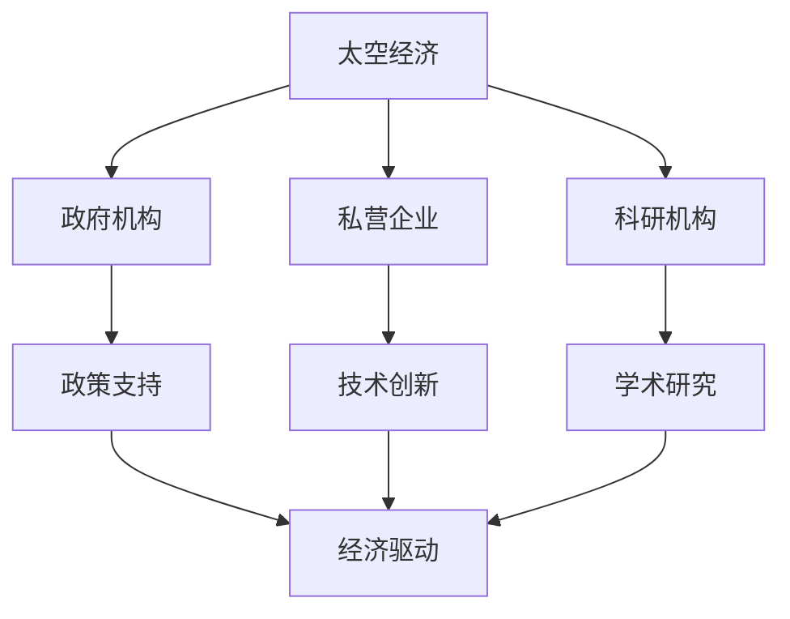

                 


```markdown
# 价值投资中的太空经济前景分析

---

## 关键词：价值投资、太空经济、投资分析、商业航天、深空探索

---

## 摘要：  
随着科技的进步和商业航天的崛起，太空经济正成为一个充满潜力的投资领域。本文从价值投资的角度，分析太空经济的核心概念、产业链结构、投资机会与风险，并通过数学模型和案例研究，探讨如何在太空经济中实现价值投资的长期收益。

---

## 第一部分：太空经济与价值投资的背景介绍

### 第1章：太空经济的定义与现状

#### 1.1 太空经济的核心概念  
- **太空经济的定义**：太空经济是指围绕太空资源开发、利用和商业化所形成的经济体系，涵盖卫星通信、深空探索、太空资源开发等领域。  
- **太空经济的范围**：包括卫星制造、发射服务、数据应用、太空站建设等。  
- **驱动因素**：技术进步、政策支持、市场需求。  

#### 1.2 价值投资的基本概念  
- **价值投资的定义**：价值投资是一种投资策略，旨在通过识别市场低估的资产，长期持有以实现超额收益。  
- **价值投资的核心要素**：基本面分析、安全边际、长期视角。  

#### 1.3 太空经济的现状与发展趋势  
- **当前主要领域**：卫星互联网、深空探索、太空资源开发。  
- **主要参与者**：政府机构（NASA、ESA等）、私营企业（SpaceX、Blue Origin）、科研机构。  
- **未来趋势**：商业化加速、技术突破、市场规模扩大。

---

### 第2章：太空经济的核心概念与联系

#### 2.1 太空经济的核心概念原理  
- **太空资源的定义与特征**：包括卫星轨道资源、月球/ asteroid资源等，具有稀缺性和高价值。  
- **太空技术的创新与应用**：如 reusable rockets、AI在航天中的应用。  
- **太空经济的商业模式**：硬件销售、服务订阅、数据变现。  

#### 2.2 核心概念属性特征对比表  
| **属性** | **太空经济** | **传统经济** |  
|----------|---------------|--------------|  
| 投资门槛 | 高            | 中            |  
| 技术依赖 | 高            | 中            |  
| 市场潜力 | 巨大           | 大            |  

#### 2.3 ER实体关系图（Mermaid流程图）  


---

### 第3章：太空经济中的价值投资分析

#### 3.1 太空经济中的投资机会  
- **卫星技术与通信**：卫星互联网（如Starlink）的投资潜力。  
- **深空探索与资源开发**：月球采矿、 asteroid资源开发。  
- **太空站与商业航天**：SpaceX等企业的商业航天服务。  

#### 3.2 价值投资的理论与方法  
- **价值投资的基本原理**：寻找市场低估的企业，关注企业基本面。  
- **太空经济中的应用**：评估企业技术优势、市场需求、财务状况。  
- **核心指标分析**：市盈率（P/E）、市净率（P/B）、自由现金流（FCF）。  

#### 3.3 太空经济中的投资风险  
- **技术风险**：技术失败或被替代的风险。  
- **政策风险**：政府政策变化影响市场。  
- **市场风险**：市场波动和竞争加剧的风险。  

---

### 第4章：太空经济的产业链分析

#### 4.1 太空产业链的构成  
- **上游：技术与设备研发**：包括火箭发动机、卫星制造技术。  
- **中游：卫星制造与发射**：卫星设计、生产、发射服务。  
- **下游：数据应用与服务**：卫星数据的收集与应用。  

#### 4.2 产业链中的投资机会  
- **上游企业的投资价值**：技术领先的企业具备长期竞争优势。  
- **中游企业的市场潜力**：发射服务的需求增长。  
- **下游企业的应用前景**：数据应用的多样化发展。  

#### 4.3 产业链中的价值投资策略  
- **整体分析**：关注产业链的协同效应。  
- **投资重点**：上游技术创新、中游市场扩张、下游数据应用。  
- **风险分散**：通过多元化投资降低风险。  

---

## 第五章：数学模型与算法原理

### 5.1 数学模型：太空经济投资价值评估  
- **模型公式**：  
  $$ \text{投资价值} = \frac{\text{未来现金流}}{\text{贴现率}} $$  
- **应用案例**：以SpaceX为例，分析其未来现金流和贴现率，计算其投资价值。  

### 5.2 算法原理：价值投资筛选算法  
- **算法步骤**：  
  1. 筛选低估值企业（P/E < 市场平均值）。  
  2. 分析企业基本面（ROE、负债率）。  
  3. 评估市场潜力。  

---

## 第六章：系统架构设计

### 6.1 系统功能设计（领域模型Mermaid类图）  


---

## 第七章：项目实战与案例分析

### 7.1 项目实战：SpaceX投资分析  
- **环境安装**：分析SpaceX的市场环境、政策环境。  
- **核心实现**：评估SpaceX的财务状况、技术优势。  
- **代码应用**：使用Python计算SpaceX的市盈率、市净率。  

### 7.2 案例分析：Blue Origin的商业模式  
- **案例介绍**：Blue Origin的太空旅游业务。  
- **数据分析**：市场需求、竞争分析、财务表现。  

---

## 第八章：结论与建议

### 8.1 总结  
- 太空经济是一个高潜力但高风险的领域，价值投资需要长期视角和深入分析。  

### 8.2 建议  
- 投资者应关注技术领先、市场需求大的企业。  
- 注意政策变化和技术风险，合理分散投资。  

### 8.3 未来研究方向  
- 深空探索的商业化模式。  
- 太空资源开发的法律与伦理问题。  

---

## 参考文献  
1. 国家航天局官网：https://www.nasa.gov  
2. SpaceX投资者报告：https://www.spacex.com  
3. 《价值投资实战策略》  
4. 《太空经济：机遇与挑战》

---

## 附录  
- 附录A：数学模型详细推导  
- 附录B：系统架构设计代码示例  
- 附录C：案例分析数据表格
```

