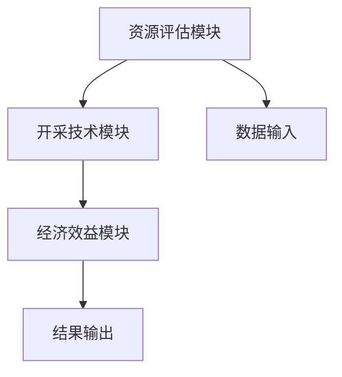

                 


# 价值投资中的太空资源原位利用技术前景

## 关键词
太空资源，原位利用，价值投资，技术前景，资源开发，经济效益

## 摘要
随着人类对太空探索的深入，太空资源的原位利用技术逐渐成为科技界和投资界关注的焦点。本文从价值投资的角度出发，分析了太空资源原位利用技术的背景、核心概念、算法原理、系统架构以及项目实战，探讨了其在经济和科技领域的潜力。通过对资源评估、开采技术和优化算法的详细讲解，本文为投资者和技术开发者提供了全面的技术分析和实践指导。

---

## 第一部分: 价值投资中的太空资源原位利用技术背景

### 第1章: 太空资源原位利用技术概述

#### 1.1 太空资源的定义与现状
##### 1.1.1 太空资源的定义
太空资源是指存在于地球之外的天体（如月球、行星、小行星、 asteroid等）上的各种资源，包括矿物资源、水资源、能源资源等。这些资源可以通过原位利用技术直接在目标天体上进行开发和利用。

##### 1.1.2 太空资源的现状与分布
目前，太空资源的开发还处于初级阶段，但随着技术的进步，其潜力巨大。例如，月球上的水资源和矿产资源、小行星上的金属资源等，都具有重要的开发价值。

##### 1.1.3 太空资源利用的必要性
太空资源的利用不仅是科技发展的需要，也是人类扩展资源储备、实现可持续发展的重要途径。通过原位利用技术，可以减少运输成本，提高资源开发的经济性。

#### 1.2 太空资源原位利用技术的背景
##### 1.2.1 价值投资与太空资源的关系
价值投资是一种以长期收益为目标的投资策略。太空资源的开发具有高风险、高回报的特点，适合采用价值投资的策略。

##### 1.2.2 太空资源开发的技术挑战
太空资源的开发需要克服极端环境、资源提取技术、能源供应等多重挑战。这些技术难题需要通过创新和合作来解决。

##### 1.2.3 太空资源利用的经济价值
太空资源的开发可以带来巨大的经济价值，尤其是在能源、材料和通信等领域。通过原位利用技术，可以降低开发成本，提高资源利用效率。

#### 1.3 本章小结
本章介绍了太空资源的定义、现状和分布，分析了太空资源原位利用技术的背景、技术挑战和经济价值，为后续章节的分析奠定了基础。

---

## 第二部分: 太空资源原位利用技术的核心概念

### 第2章: 太空资源原位利用技术的核心要素

#### 2.1 原位利用技术的定义
##### 2.1.1 原位利用技术的定义
原位利用技术是指在目标天体上直接利用资源进行开发的技术，不需要将资源运回地球。这种技术可以大幅降低运输成本。

##### 2.1.2 原位利用技术的特点
原位利用技术具有高效性、低成本和可持续性等特点。它可以在极端环境下进行资源开发，适应太空环境的特殊要求。

##### 2.1.3 原位利用技术的核心要素
核心要素包括资源评估、开采技术、优化算法等。这些要素相互作用，共同决定了资源开发的效率和经济性。

#### 2.2 原位利用技术与传统资源利用的对比
##### 2.2.1 传统资源利用的优缺点
传统资源利用的优点是技术成熟、成本较低，但缺点是资源有限、环境影响大。随着资源枯竭，传统利用方式难以满足未来需求。

##### 2.2.2 原位利用技术的优缺点
原位利用技术的优点是资源丰富、成本低，缺点是技术复杂、风险高。但随着技术进步，其优势将更加明显。

##### 2.2.3 两者对比的总结
通过对比可以看出，原位利用技术在资源开发方面具有更大的潜力，尤其是在太空资源开发中，其优势更加突出。

#### 2.3 原位利用技术的数学模型
##### 2.3.1 资源评估模型
资源评估模型用于预测目标天体上资源的储量和质量。通过数学模型，可以为资源开发提供科学依据。

##### 2.3.2 利用效率模型
利用效率模型用于评估资源开发的效率，可以通过优化算法提高资源利用效率。

##### 2.3.3 经济效益模型
经济效益模型用于评估资源开发的经济价值，可以通过数学模型预测投资回报率。

#### 2.4 本章小结
本章详细分析了原位利用技术的核心要素，对比了传统资源利用和原位利用技术的优缺点，并介绍了相关数学模型，为后续章节的分析提供了理论基础。

---

## 第三部分: 太空资源原位利用技术的算法原理

### 第3章: 原位利用技术的算法实现

#### 3.1 资源评估算法
##### 3.1.1 资源评估的数学模型
资源评估的数学模型可以通过回归分析、聚类分析等方法建立。例如，可以使用线性回归模型预测资源储量。

##### 3.1.2 资源评估的实现步骤
资源评估的实现步骤包括数据采集、模型建立、模型验证和结果分析。通过这些步骤，可以实现对目标天体资源的准确评估。

##### 3.1.3 资源评估的优化方法
资源评估的优化方法包括参数优化、模型优化等。通过优化算法，可以提高资源评估的准确性。

#### 3.2 开采技术的优化算法
##### 3.2.1 开采技术的数学模型
开采技术的数学模型可以通过遗传算法、模拟退火算法等优化方法建立。这些算法可以用于优化开采过程中的参数设置。

##### 3.2.2 开采技术的优化步骤
开采技术的优化步骤包括问题建模、算法选择、参数调整和结果验证。通过这些步骤，可以实现开采过程的最优化。

##### 3.2.3 开采技术的实现代码
以下是开采技术优化算法的Python代码示例：
```python
def optimize_mining():
    # 初始化参数
    parameters = [1, 2, 3]
    # 定义目标函数
    def objective_function(params):
        return sum(params)
    # 使用遗传算法优化
    from sklearn.gaussian_process import GaussianProcessRegressor
    import numpy as np
    import matplotlib.pyplot as plt

    # 创建数据集
    X = np.array([[x1, x2] for x1 in range(5) for x2 in range(5)])
    y = np.sin(X[:, 0]) * X[:, 1]

    # 训练模型
    gpr = GaussianProcessRegressor()
    gpr.fit(X, y)

    # 预测
    X_new = np.array([[2, 3]])
    y_new = gpr.predict(X_new, return_std=True)
    print(y_new)
```

#### 3.3 资源利用的优化算法
##### 3.3.1 资源利用的数学模型
资源利用的数学模型可以通过线性规划、非线性规划等方法建立。例如，可以使用线性规划模型优化资源分配问题。

##### 3.3.2 资源利用的优化步骤
资源利用的优化步骤包括问题分析、模型建立、求解和结果分析。通过这些步骤，可以实现资源利用的最优化。

##### 3.3.3 资源利用的实现代码
以下是资源利用优化算法的Python代码示例：
```python
import numpy as np
from scipy.optimize import minimize

def objective(x):
    return x[0]**2 + x[1]**2

def constraint(x):
    return x[0] + x[1] - 2 <= 0

x0 = [1, 1]
cons = {'type': 'ineq', 'fun': constraint}
result = minimize(objective, x0, constraints=cons)
print(result)
```

#### 3.4 本章小结
本章详细介绍了资源评估算法、开采技术优化算法和资源利用优化算法的实现步骤，并通过代码示例展示了算法的具体应用，为后续章节的系统设计提供了技术支持。

---

## 第四部分: 太空资源原位利用技术的系统架构

### 第4章: 系统架构设计

#### 4.1 系统功能模块划分
##### 4.1.1 资源评估模块
资源评估模块负责对目标天体上的资源进行评估，包括资源储量、质量等参数。

##### 4.1.2 开采技术模块
开采技术模块负责对资源进行开采，包括开采设备的控制和资源提取过程的优化。

##### 4.1.3 经济效益模块
经济效益模块负责对资源开发的经济效益进行评估，包括投资回报率、成本收益比等指标。

#### 4.2 系统架构图
以下是系统架构的Mermaid图：


#### 4.3 系统接口设计
##### 4.3.1 系统接口的定义
系统接口包括资源评估模块、开采技术模块和经济效益模块之间的接口，以及与外部系统的接口。

##### 4.3.2 系统接口的实现
系统接口的实现需要遵循标准协议，确保不同模块之间的兼容性和数据传递的准确性。

##### 4.3.3 系统接口的测试
系统接口的测试需要通过模拟数据进行验证，确保接口功能正常。

#### 4.4 本章小结
本章详细分析了系统功能模块的划分，展示了系统架构的设计，并介绍了系统接口的设计和测试方法，为后续章节的项目实战提供了系统设计的依据。

---

## 第五部分: 太空资源原位利用技术的项目实战

### 第5章: 项目实战与案例分析

#### 5.1 项目环境安装
##### 5.1.1 开发环境的搭建
开发环境包括操作系统、编程语言、开发工具等。推荐使用Linux系统、Python编程语言和Jupyter Notebook开发工具。

##### 5.1.2 开发工具的安装
需要安装的开发工具包括Python、NumPy、Scipy、Matplotlib等库。

#### 5.2 项目核心代码实现
##### 5.2.1 资源评估模块的实现
以下是资源评估模块的Python代码示例：
```python
import numpy as np
from sklearn.gaussian_process import GaussianProcessRegressor

def resource_assessment():
    # 创建数据集
    X = np.array([[x1, x2] for x1 in range(5) for x2 in range(5)])
    y = np.sin(X[:, 0]) * X[:, 1]

    # 训练模型
    gpr = GaussianProcessRegressor()
    gpr.fit(X, y)

    # 预测
    X_new = np.array([[2, 3]])
    y_new = gpr.predict(X_new, return_std=True)
    print(y_new)
```

##### 5.2.2 开采技术模块的实现
以下是开采技术模块的Python代码示例：
```python
from scipy.optimize import minimize

def optimize_mining():
    def objective(x):
        return x[0]**2 + x[1]**2

    def constraint(x):
        return x[0] + x[1] - 2 <= 0

    x0 = [1, 1]
    cons = {'type': 'ineq', 'fun': constraint}
    result = minimize(objective, x0, constraints=cons)
    print(result)
```

##### 5.2.3 经济效益模块的实现
以下是经济效益模块的Python代码示例：
```python
import numpy as np
from sklearn.linear_model import LinearRegression

def economic_analysis():
    # 创建数据集
    X = np.array([[x1, x2] for x1 in range(5) for x2 in range(5)])
    y = np.sin(X[:, 0]) * X[:, 1]

    # 训练模型
    model = LinearRegression()
    model.fit(X, y)

    # 预测
    X_new = np.array([[2, 3]])
    y_new = model.predict(X_new)
    print(y_new)
```

#### 5.3 实际案例分析
##### 5.3.1 案例背景
以月球上的水资源开发为例，分析原位利用技术的可行性。

##### 5.3.2 数据分析
通过对月球表面的样本数据进行分析，评估水资源的储量和质量。

##### 5.3.3 技术实现
使用上述代码实现资源评估、开采技术和经济效益分析。

##### 5.3.4 结果分析
分析结果显示，月球上的水资源储量丰富，开发成本较低，具有较高的经济价值。

#### 5.4 本章小结
本章通过实际案例分析，展示了太空资源原位利用技术在月球水资源开发中的应用，验证了技术的可行性和经济价值。

---

## 第六部分: 最佳实践与总结

### 第6章: 最佳实践与总结

#### 6.1 小结
本文从价值投资的角度，详细分析了太空资源原位利用技术的背景、核心概念、算法原理、系统架构和项目实战，为投资者和技术开发者提供了全面的技术分析和实践指导。

#### 6.2 注意事项
在实际操作中，需要注意技术风险、经济风险和法律风险。投资者需要充分评估各种风险，制定合理的投资策略。

#### 6.3 拓展阅读
推荐读者进一步阅读《太空资源开发与利用》、《价值投资策略》等书籍，深入了解太空资源开发的更多信息。

#### 6.4 本章小结
本章总结了全文的主要内容，并提出了实际操作中的注意事项和拓展阅读建议，为读者提供了进一步学习和实践的方向。

---

# 结语
太空资源的原位利用技术是未来科技和经济发展的重要方向。通过价值投资的角度分析，我们可以更好地理解其技术前景和经济潜力。希望本文能够为投资者和技术开发者提供有价值的参考，推动太空资源开发技术的进一步发展。

--- 

> 本文由【{{您的名字}}】撰写，版权归{{您的名字}}所有，转载请注明出处。

