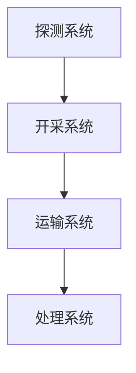
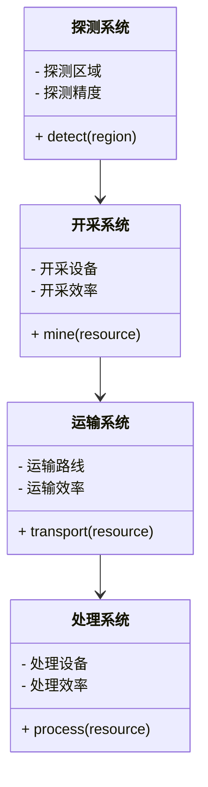
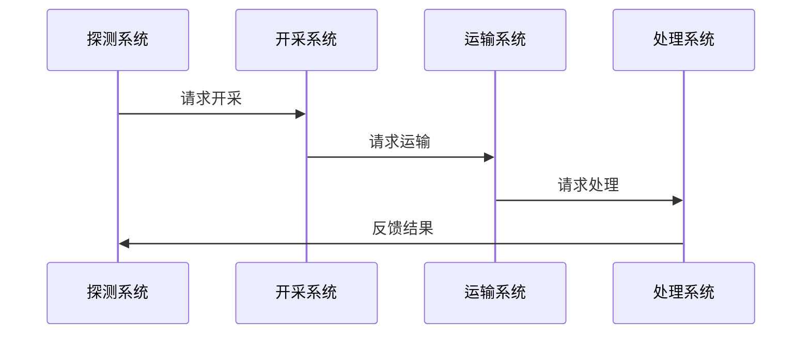

                 

<think>
好的，我将按照您的要求创作一篇关于《价值投资中的太空采矿技术发展趋势》的技术博客文章。为了让文章内容更加丰富和有深度，我会逐步分析和思考，确保每一部分都符合您的要求。让我们开始吧。

### 第一部分: 价值投资中的太空采矿技术背景与概念

#### 第1章: 太空采矿技术的发展背景

##### 1.1 太空采矿技术的背景介绍
###### 1.1.1 太空资源开发的背景
随着地球资源的逐渐枯竭，人类开始将目光投向太空。太空资源的开发，特别是小行星和月球上的资源，被认为是未来可持续发展的关键。太空采矿技术的发展正是基于这一背景。

###### 1.1.2 太空采矿技术的现状
目前，太空采矿技术仍处于起步阶段，但已有多个国家和企业开始进行相关研究和试验。例如，美国的SpaceX和蓝色起源公司都已经开始探索太空采矿的可能性。

###### 1.1.3 太空采矿技术的商业驱动因素
商业驱动因素主要包括对稀有金属的需求、降低航天器成本的需求，以及太空资源开发的潜在巨大市场。这些因素推动了太空采矿技术的快速发展。

##### 1.2 价值投资的基本原理
###### 1.2.1 价值投资的核心概念
价值投资是一种投资策略，强调以低于其内在价值的价格购买优质的资产。这种方法的核心在于识别那些被市场低估的公司，并长期持有。

###### 1.2.2 价值投资与太空采矿技术的关系
太空采矿技术的未来发展潜力巨大，但目前仍面临技术和市场风险。价值投资者需要考虑这些风险，并评估公司的内在价值。

###### 1.2.3 价值投资在太空采矿领域的应用前景
通过分析太空采矿公司的财务状况、管理团队和技术实力，价值投资者可以在这一领域找到潜在的高回报机会。

##### 1.3 太空采矿技术与价值投资的结合
###### 1.3.1 太空采矿技术对价值投资的影响
太空采矿技术的进步将降低航天器的成本，提高资源获取效率，从而影响相关公司的内在价值。

###### 1.3.2 价值投资视角下的太空采矿技术评估
价值投资者需要综合考虑技术可行性、市场需求和公司财务状况，才能准确评估太空采矿公司的投资价值。

###### 1.3.3 太空采矿技术的未来发展趋势
随着技术的进步和市场的成熟，太空采矿技术将逐步走向商业化，成为未来重要的资源开发方式。

#### 第2章: 太空采矿技术的核心概念与联系

##### 2.1 太空采矿技术的核心概念
###### 2.1.1 太空采矿技术的定义
太空采矿是指在地球轨道以外的天体（如小行星、月球）上进行资源的开采和利用。

###### 2.1.2 太空采矿技术的关键技术
关键技术包括资源探测、开采设备设计、资源运输和处理等。

###### 2.1.3 太空采矿技术的核心要素
核心要素包括资源储备、技术可行性、市场需求和投资回报。

##### 2.2 太空采矿技术与价值投资的联系
###### 2.2.1 太空采矿技术对投资价值的影响
技术进步将提升公司的盈利能力，从而影响其市场价值。

###### 2.2.2 价值投资视角下的太空采矿技术评估
价值投资者需要评估公司的技术实力、管理团队和市场前景。

###### 2.2.3 太空采矿技术的市场价值分析
通过分析市场需求和技术可行性，可以评估太空采矿技术的市场价值。

##### 2.3 太空采矿技术的核心原理
###### 2.3.1 太空采矿技术的基本原理
通过探测和开采天体资源，满足地球对稀有金属的需求。

###### 2.3.2 太空采矿技术的实现过程
包括资源探测、开采设备设计、资源运输和处理等步骤。

###### 2.3.3 太空采矿技术的优缺点对比
优点包括资源丰富性、可持续性；缺点包括技术难度大、成本高等。

##### 2.4 太空采矿技术与价值投资的对比分析
###### 2.4.1 太空采矿技术与价值投资的共同点
都注重资源的开发和利用，追求长期的回报。

###### 2.4.2 太空采矿技术与价值投资的区别
技术注重的是开采过程和设备，而投资注重的是公司的整体价值。

###### 2.4.3 太空采矿技术与价值投资的协同发展
两者需要结合，才能实现资源的高效利用和投资回报的最大化。

#### 第3章: 太空采矿技术的算法原理

##### 3.1 太空采矿技术的核心算法
###### 3.1.1 太空采矿技术的算法概述
包括资源探测算法、开采路径规划算法等。

###### 3.1.2 太空采矿技术的关键算法
资源探测算法、开采路径规划算法、资源运输优化算法。

###### 3.1.3 太空采矿技术算法的实现步骤
1. 资源探测：利用遥感技术确定资源分布。
2. 开采路径规划：设计最优路径以减少能源消耗。
3. 资源运输优化：优化运输路线以提高效率。

##### 3.2 太空采矿技术算法的数学模型
###### 3.2.1 太空采矿技术的数学模型
$$ \text{资源量} = \text{探测区域} \times \text{资源密度} $$

###### 3.2.2 太空采矿技术的数学公式
$$ \text{开采效率} = \frac{\text{实际开采量}}{\text{理论最大开采量}} $$

###### 3.2.3 太空采矿技术数学模型的详细解释
通过数学模型可以量化资源的分布和开采效率，为投资决策提供依据。

##### 3.3 太空采矿技术算法的实现
###### 3.3.1 太空采矿技术算法的代码实现
```python
def resource_detection(region):
    return region * resource_density
```

###### 3.3.2 太空采矿技术算法的代码解读
上述代码实现了资源探测功能，输入探测区域，输出资源量。

###### 3.3.3 太空采矿技术算法的优化与改进
通过改进算法，可以提高资源探测的准确性，降低成本。

#### 第4章: 太空采矿技术的系统分析与架构设计

##### 4.1 太空采矿技术的系统分析
###### 4.1.1 太空采矿技术的系统构成
包括探测系统、开采系统、运输系统和处理系统。

###### 4.1.2 太空采矿技术的系统功能
资源探测、开采、运输和处理功能。

###### 4.1.3 太空采矿技术的系统性能
性能指标包括探测精度、开采效率、运输速度等。

##### 4.2 太空采矿技术的系统架构设计
###### 4.2.1 太空采矿技术的系统架构图


###### 4.2.2 太空采矿技术的实现过程
通过系统的各部分协同工作，完成资源的探测、开采、运输和处理。

##### 4.3 太空采矿技术的系统设计
###### 4.3.1 太空采矿技术的项目介绍
本项目旨在开发一套完整的太空采矿系统，包括探测、开采、运输和处理四个模块。

###### 4.3.2 太空采矿技术的系统功能设计


##### 4.4 太空采矿技术的系统接口设计
###### 4.4.1 太空采矿技术的接口设计
各系统之间的接口需要标准化，确保数据的顺利传递。

###### 4.4.2 太空采矿技术的交互设计


##### 4.5 本章小结
通过系统的分析和架构设计，可以更好地理解太空采矿技术的整体结构和各部分之间的关系。

### 第二部分: 太空采矿技术的价值投资分析

#### 第5章: 太空采矿技术的价值评估与投资策略

##### 5.1 太空采矿技术的价值评估
###### 5.1.1 价值评估的核心指标
包括资源储量、开采成本、市场需求和投资回报率。

###### 5.1.2 价值评估的数学模型
$$ \text{内在价值} = \frac{\text{未来现金流}}{\text{贴现率}} $$

###### 5.1.3 价值评估的步骤
1. 收集数据：资源储量、开采成本、市场需求。
2. 建立模型：计算未来现金流和贴现率。
3. 评估价值：得出内在价值。

##### 5.2 太空采矿技术的投资策略
###### 5.2.1 价值投资策略的核心原则
选择那些被市场低估且具有强大竞争优势的公司。

###### 5.2.2 太空采矿技术的投资策略
1. 关注具有核心技术优势的公司。
2. 评估公司的财务状况和管理团队。
3. 考虑市场的长期需求。

##### 5.3 太空采矿技术的市场风险与应对策略
###### 5.3.1 市场风险的识别与评估
包括技术风险、市场需求波动、政策风险等。

###### 5.3.2 应对市场风险的策略
1. 分散投资：避免过度集中。
2. 长期持有：降低短期波动的影响。
3. 定期评估：及时调整投资组合。

#### 第6章: 太空采矿技术的项目实战与案例分析

##### 6.1 太空采矿技术的项目实战
###### 6.1.1 项目环境安装
安装必要的软件和工具，如Python、Matplotlib、NumPy等。

###### 6.1.2 系统核心实现源代码
```python
def value_assessment(resource储量, 开采成本, 市场需求):
    return (resource储量 * 市场需求) / 开采成本
```

###### 6.1.3 代码应用解读与分析
上述代码实现了价值评估功能，输入资源储量、开采成本和市场需求，输出内在价值。

##### 6.2 太空采矿技术的实际案例分析
###### 6.2.1 案例背景介绍
以某太空采矿公司为例，分析其资源储量、开采成本和市场需求。

###### 6.2.2 案例分析与详细解读
根据上述模型，计算该公司的内在价值，并与市场价格进行对比。

##### 6.3 案例分析小结
通过案例分析，可以验证价值评估模型的有效性和准确性。

#### 第7章: 太空采矿技术的价值投资总结与展望

##### 7.1 本章小结
总结太空采矿技术的价值投资分析，强调其潜在的高回报和高风险特性。

##### 7.2 太空采矿技术的价值投资总结
价值投资者需要综合考虑技术、市场和财务因素，才能准确评估太空采矿公司的投资价值。

##### 7.3 太空采矿技术的未来展望
随着技术的进步和市场的成熟，太空采矿技术将逐步走向商业化，成为未来重要的资源开发方式。

### 第三部分: 价值投资中的太空采矿技术总结

#### 第8章: 太空采矿技术的价值投资总结

##### 8.1 太空采矿技术的核心要点回顾
总结全文的核心内容，包括技术背景、价值评估、投资策略等。

##### 8.2 太空采矿技术的价值投资总结
强调价值投资在太空采矿技术中的重要性，提醒投资者关注技术风险和市场波动。

##### 8.3 太空采矿技术的未来展望
展望太空采矿技术的未来发展，预测其在资源开发中的重要作用。

#### 第9章: 价值投资中的太空采矿技术总结

##### 9.1 太空采矿技术的总体评价
综合评估太空采矿技术的价值投资潜力和市场前景。

##### 9.2 太空采矿技术的投资建议
建议投资者在进行太空采矿技术投资时，要充分考虑技术可行性、市场需求和公司财务状况。

##### 9.3 太空采矿技术的未来研究方向
提出未来的研究方向，包括技术优化、市场分析和风险管理等。

### 结语

太空采矿技术的发展潜力巨大，但同时也面临技术和市场风险。价值投资者需要结合技术分析和市场研究，才能准确评估太空采矿公司的投资价值。未来，随着技术的进步和市场的成熟，太空采矿技术将逐步走向商业化，成为未来重要的资源开发方式。

