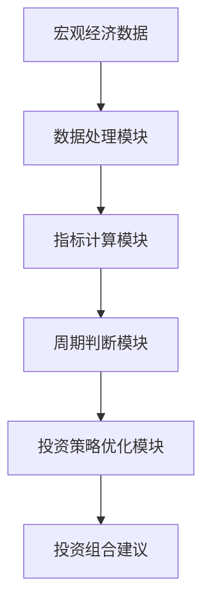

                 


# 价值投资中的宏观经济周期判断

---

## 关键词：价值投资、宏观经济周期、经济指标、投资策略、周期分析

---

## 摘要：

本文旨在探讨价值投资与宏观经济周期之间的关系，分析如何通过宏观经济周期的判断优化投资决策。文章从宏观经济周期的基本概念出发，详细阐述了经济增长、利率、通货膨胀等关键因素对经济周期的影响，并结合价值投资的核心原理，提出了在不同经济周期阶段的投资策略。通过系统架构设计和实战案例分析，展示了如何利用宏观经济指标构建投资模型，实现长期稳定的收益。

---

## 第一部分：宏观经济周期的基本概念

### 第1章：经济周期的定义与特征

#### 1.1 经济周期的定义

经济周期是指经济活动在长时间内呈现出的波动性增长和收缩的模式。通常包括复苏、繁荣、衰退和萧条四个阶段。

$$
\text{经济周期阶段} = \{\text{复苏, 繁荣, 衰退, 萧条}\}
$$

#### 1.2 经济周期的主要特征

- **波动性**：经济指标如GDP、就业率等呈现周期性波动。
- **非线性**：周期的长度和强度因环境因素而异。
- **相关性**：不同经济指标之间存在相关性，例如利率与投资活动。

#### 1.3 价值投资的基本原理

价值投资强调购买价格低于内在价值的资产，核心在于寻找市场低估的机会。宏观经济周期判断帮助投资者识别这些低估资产的出现周期。

---

## 第二部分：宏观经济周期的分析框架

### 第2章：经济增长与周期波动

#### 2.1 经济增长的定义与衡量指标

经济增长是宏观经济学的核心概念，常用GDP增长率衡量。经济增长率的波动反映了经济周期的变化。

$$
\text{GDP增长率} = \frac{\text{当前GDP} - \text{前期GDP}}{\text{前期GDP}} \times 100\%
$$

#### 2.2 经济增长对投资的影响

经济增长强劲时，企业盈利上升，股票价值增加；反之，经济衰退时，企业盈利下降，股票价值降低。

### 第3章：通货膨胀与货币政策

#### 3.1 通货膨胀的定义与影响

通货膨胀是指物价水平持续上涨，影响购买力和投资决策。通胀率通常用CPI（消费者物价指数）衡量。

$$
\text{通胀率} = \frac{\text{当前CPI} - \text{前期CPI}}{\text{前期CPI}} \times 100\%
$$

#### 3.2 货币政策对经济周期的影响

中央银行通过调整利率和货币供应量影响经济周期。例如，降息可以刺激投资和消费，推动经济复苏。

---

## 第三部分：价值投资策略与宏观经济周期结合

### 第4章：经济周期对投资策略的影响

#### 4.1 经济繁荣阶段的投资策略

在经济繁荣阶段，企业盈利高，股票估值上升，适合积极投资。

#### 4.2 经济衰退阶段的投资策略

在经济衰退阶段，市场低估，适合寻找被低估的资产进行长期投资。

### 第5章：宏观经济指标的量化分析

#### 5.1 宏观经济指标的选择

常用的宏观经济指标包括GDP增长率、失业率、通胀率等。这些指标帮助投资者判断经济周期阶段。

#### 5.2 基于宏观经济指标的投资模型

通过量化分析宏观经济指标，构建投资组合优化模型，选择在特定周期阶段表现最佳的资产。

---

## 第四部分：系统架构与实战案例

### 第6章：宏观经济分析系统的构建

#### 6.1 系统功能设计

- 数据采集模块：收集宏观经济指标数据。
- 指标分析模块：计算指标并判断经济周期阶段。
- 投资决策模块：基于周期判断优化投资策略。

#### 6.2 系统架构设计



### 第7章：Python代码实现

#### 7.1 环境安装

安装必要的Python库，如pandas、numpy、matplotlib。

#### 7.2 核心代码实现

```python
import pandas as pd
import numpy as np
import matplotlib.pyplot as plt

# 示例数据：GDP增长率
gdp_growth = pd.Series([2.5, 3.2, 1.8, 2.9, 0.5], index=['2020', '2021', '2022', '2023', '2024'])

# 计算经济周期阶段
def determine_cycle_stage(gdp_growth):
    stages = []
    for i in range(len(gdp_growth)):
        if gdp_growth.iloc[i] > 3:
            stages.append('繁荣')
        elif gdp_growth.iloc[i] > 1:
            stages.append('复苏')
        elif gdp_growth.iloc[i] < 0:
            stages.append('萧条')
        else:
            stages.append('衰退')
    return stages

cycle_stage = determine_cycle_stage(gdp_growth)
print(cycle_stage)
```

---

## 第五部分：总结与展望

### 第8章：总结

通过宏观经济周期的判断，投资者可以更好地把握市场趋势，优化投资策略。本文结合理论分析和系统设计，展示了如何在不同经济周期阶段进行价值投资。

### 第9章：展望

未来研究可以进一步探讨更多宏观经济指标的组合应用，以及如何利用大数据和人工智能技术提升周期判断的准确性。

---

## 附录

### 附录A：术语表

- GDP：国内生产总值
- CPI：消费者物价指数
- 萧条：经济极度收缩的阶段

### 附录B：工具推荐

- Python：数据分析与可视化
- Pandas：数据处理库
- Matplotlib：绘图库

### 附录C：参考文献

- 投资学经典教材
- 宏观经济学权威著作

---

通过以上结构，本文系统地探讨了价值投资中的宏观经济周期判断，为投资者提供了理论支持和实践指导。

