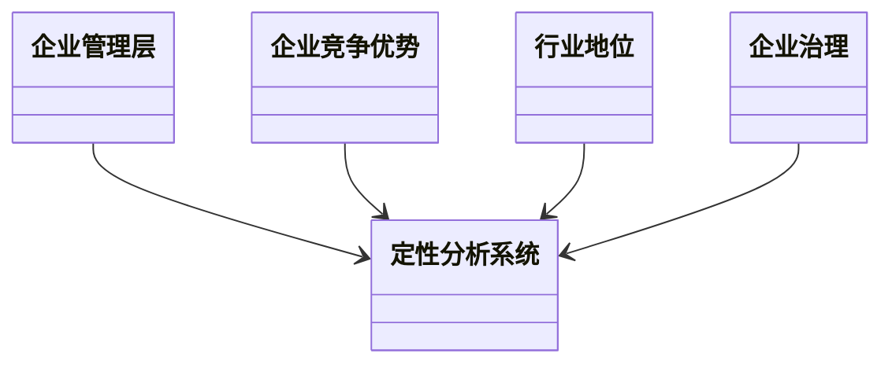

                 


# 价值投资中的定性分析：超越数字的洞察

> 关键词：价值投资、定性分析、投资决策、竞争优势、管理层能力、企业治理

> 摘要：在价值投资中，数字和财务指标只是冰山一角。定性分析是理解企业内在价值的关键。本文通过系统化的分析框架、算法原理、数学模型和实际案例，深入探讨定性分析的核心要素和应用方法，揭示超越数字的深刻洞察。

---

# 第一部分: 定性分析的背景与重要性

## # 第1章: 定性分析的背景与重要性

### ## 1.1 价值投资的核心要素

#### ### 1.1.1 传统定量分析的局限性
传统价值投资过度依赖财务指标（如市盈率、ROE）进行评估，但这些指标无法反映企业的核心竞争力、管理层能力和行业地位等关键因素。例如，一家企业可能拥有漂亮的财务数据，但如果管理层决策失误，企业可能迅速陷入困境。

#### ### 1.1.2 定性分析的定义与作用
定性分析是通过对企业战略、管理层质量、竞争优势和行业环境等非财务因素的深入研究，评估企业长期价值的方法。它弥补了定量分析的不足，帮助投资者更全面地理解企业的内在价值。

#### ### 1.1.3 定性分析在价值投资中的地位
定性分析是价值投资的“灵魂”，它帮助投资者识别那些具有可持续竞争优势和优秀管理层的企业。例如，巴菲特的投资决策中，很大程度依赖对企业管理层的信任和对企业竞争优势的判断。

### ## 1.2 定性分析的核心要素

#### ### 1.2.1 管理层质量
管理层是企业发展的关键。一个优秀的管理层能够制定正确的战略、优化资源配置，并带领企业应对挑战。例如，某公司的管理层在过去五年中成功推出多个爆款产品，显示出卓越的战略眼光和执行力。

#### ### 1.2.2 企业竞争优势
竞争优势是企业长期盈利的基石。包括成本优势、技术壁垒、品牌影响力等因素。例如，苹果的生态系统和品牌忠诚度是其竞争优势的核心。

#### ### 1.2.3 行业地位与前景
行业环境直接影响企业的未来发展。投资者需要评估行业是否具有增长潜力，企业是否处于有利的竞争位置。例如，电动汽车行业的快速发展为特斯拉提供了巨大的增长空间。

#### ### 1.2.4 企业治理结构
良好的治理结构能够确保管理层的利益与股东的利益保持一致，减少代理成本。例如，谷歌母公司 Alphabet 的双层股权结构确保了创始人对公司的控制权，同时为股东创造了长期价值。

### ## 1.3 定性分析与定量分析的对比

#### ### 1.3.1 分析方法对比
| 分析方法 | 定性分析 | 定量分析 |
|----------|----------|----------|
| 数据来源 | 文本、访谈、行业报告 | 财务报表、市场数据 |
| 分析目标 | 理解企业内在价值 | 评估企业财务状况 |
| 结果形式 | 主观评分、定性描述 | 客观指标、数值结果 |

#### ### 1.3.2 数据来源对比
| 数据来源 | 定性分析 | 定量分析 |
|----------|----------|----------|
| 文本分析 | √        |          |
| 访谈记录 | √        |          |
| 财务报表 |          | √        |
| 市场数据 |          | √        |

#### ### 1.3.3 应用场景对比
| 应用场景       | 定性分析 | 定量分析 |
|----------------|----------|----------|
| 评估管理层能力 | √        |          |
| 分析行业趋势   | √        |          |
| 计算市盈率     |          | √        |
| 评估企业风险   | √        |          |

---

## # 第2章: 定性分析的核心概念与联系

### ## 2.1 核心概念原理

#### ### 2.1.1 管理层质量的评估维度
管理层质量可以从以下几个方面进行评估：
1. **战略眼光**：管理层是否能够识别市场机会并制定正确的战略。
2. **执行能力**：管理层是否能够有效执行战略。
3. **道德与诚信**：管理层是否诚信，是否以股东利益为重。

#### ### 2.1.2 企业竞争优势的来源
竞争优势是企业在市场上胜过竞争对手的关键因素，主要包括：
1. **成本优势**：企业生产成本低于竞争对手。
2. **技术壁垒**：企业拥有独特的技术或专利。
3. **品牌影响力**：强大的品牌可以帮助企业获取更多的市场份额。

#### ### 2.1.3 行业地位的影响因素
行业地位受到以下因素的影响：
1. **行业集中度**：行业的集中度越高，头部企业的竞争优势越明显。
2. **行业周期**：行业所处的周期（如衰退期、成长期）会影响企业的表现。
3. **政策环境**：政策的支持或限制会影响行业的整体发展。

### ## 2.2 定性分析与定量分析的联系

#### ### 2.2.1 数据与非数据的结合
定性分析提供非财务数据的洞察，而定量分析提供财务数据的支持。例如，可以通过定性分析识别具有竞争优势的企业，再通过定量分析验证其财务健康状况。

#### ### 2.2.2 分析方法的互补性
定性分析帮助投资者理解企业的内在价值，而定量分析则提供具体的估值依据。例如，可以通过定性分析确定企业的竞争优势，再通过定量分析计算其合理估值。

#### ### 2.2.3 投资决策的综合考量
在实际投资决策中，定性分析和定量分析需要结合起来使用。例如，在选择投资标的时，既要考虑企业的财务状况（定量分析），也要考虑其管理层能力和竞争优势（定性分析）。

---

## # 第3章: 定性分析的算法原理

### ## 3.1 定性分析框架

#### ### 3.1.1 SWOT分析法
SWOT分析法是一种常用的企业分析工具，可以帮助投资者全面评估企业的优势、劣势、机会和威胁。

**步骤：**
1. **识别优势（Strengths）**：企业的内部优势，如技术壁垒、品牌影响力等。
2. **识别劣势（Weaknesses）**：企业的内部劣势，如成本过高、管理不善等。
3. **识别机会（Opportunities）**：外部机会，如市场需求增长、政策支持等。
4. **识别威胁（Threats）**：外部威胁，如行业竞争加剧、政策变化等。

#### ### 3.1.2 波特五力模型
波特五力模型是一种用于分析行业竞争环境的工具，由迈克尔·波特提出。

**步骤：**
1. **评估行业内现有竞争者**：行业内的竞争程度。
2. **评估潜在进入者的威胁**：新进入者的难度。
3. **评估替代品的威胁**：替代品对行业的影响。
4. **评估供应商的议价能力**：供应商的集中度和议价能力。
5. **评估买家的议价能力**：买家的集中度和议价能力。

---

## # 第4章: 定性分析的数学模型与公式

### ## 4.1 竞争优势指数模型

**公式：**
$$
\text{竞争优势指数} = \frac{\text{企业竞争优势得分}}{\text{行业平均竞争优势得分}} \times 100
$$

**解读：**
- 企业竞争优势得分：通过定性分析得出的企业竞争优势得分（例如，满分100分）。
- 行业平均竞争优势得分：行业内企业的平均竞争优势得分。

**示例：**
如果某企业的竞争优势得分为85，行业平均得分为70，则：
$$
\text{竞争优势指数} = \frac{85}{70} \times 100 = 121.43
$$

---

## # 第5章: 定性分析的系统架构与实现

### ## 5.1 系统功能设计

#### ### 5.1.1 领域模型（Mermaid 类图）


#### ### 5.1.2 系统架构设计（Mermaid 架构图）
```mermaid
docker
    定性分析系统
    ├── 管理层分析模块
    │   └── 管理层质量评估
    ├── 竞争优势分析模块
    │   └── 竞争优势评分
    ├── 行业分析模块
    │   └── 行业地位评估
    └── 综合分析模块
        └── 综合评分与报告生成
```

---

## # 第6章: 项目实战与案例分析

### ## 6.1 环境配置

#### ### 6.1.1 安装必要的库
```bash
pip install numpy pandas matplotlib
```

### ## 6.2 核心代码实现

#### ### 6.2.1 竞争优势评分
```python
def calculate_competitive_edge优势优势优势优势优势优势优势优势优势优势优势优势优势优势
    # 示例：计算竞争优势指数
    industry_avg = 70
    company_score = 85
    competitive_index = (company_score / industry_avg) * 100
    return competitive_index

competitive_index = calculate_competitive_edge优势优势优势优势优势优势优势优势优势优势优势优势优势
print(f"竞争优势指数为：{competitive_index}%")
```

---

## # 第7章: 最佳实践与小结

### ## 7.1 最佳实践

#### ### 7.1.1 综合考虑定性与定量因素
在实际投资中，定性分析和定量分析需要结合起来使用。例如，可以通过定性分析识别具有竞争优势的企业，再通过定量分析验证其估值是否合理。

#### ### 7.1.2 持续学习与更新
行业环境和企业管理层的决策会不断变化，投资者需要持续关注企业的最新动态，及时更新自己的分析。

### ## 7.2 注意事项

#### ### 7.2.1 定性分析的主观性
定性分析的结果具有较强的主观性，不同投资者可能得出不同的结论。因此，投资者需要结合自己的研究和判断，避免盲目跟从。

#### ### 7.2.2 数据来源的可靠性
定性分析依赖于高质量的数据和信息，投资者需要确保数据来源的可靠性和准确性。

### ## 7.3 拓展阅读

#### ### 7.3.1 推荐书籍
- 《巴菲特的选股智慧》
- 《彼得·林奇的投资哲学》

#### ### 7.3.2 推荐博客
- [价值投资的奥秘](https://example.com)
- [定性分析的实践](https://example.com)

---

## # 第8章: 总结与展望

### ## 8.1 总结

定性分析是价值投资中不可或缺的一部分。通过深入分析企业的管理层质量、竞争优势、行业地位和治理结构，投资者可以更全面地评估企业的内在价值，做出更明智的投资决策。

### ## 8.2 展望

随着人工智能和大数据技术的发展，定性分析的方法和工具将更加丰富和高效。未来，投资者可以通过更先进的技术手段，进一步提升定性分析的准确性和效率。

---

通过以上目录结构，我们可以系统地探讨定性分析的核心要素、算法原理和实际应用，帮助投资者更好地理解并运用定性分析的方法，做出更明智的投资决策。

