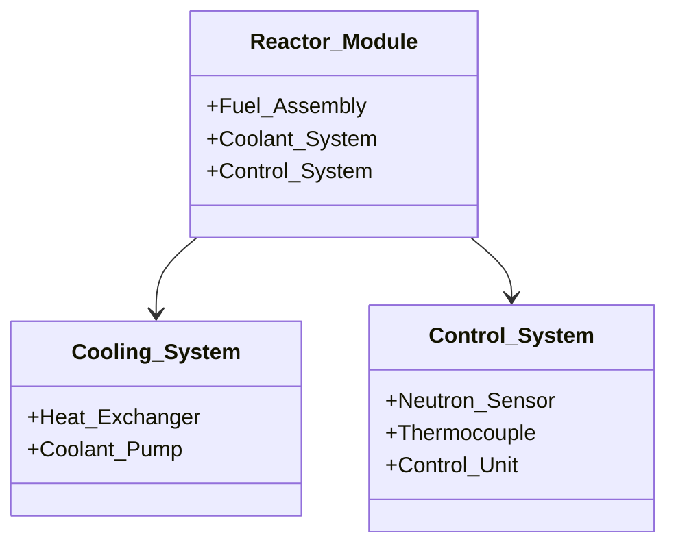
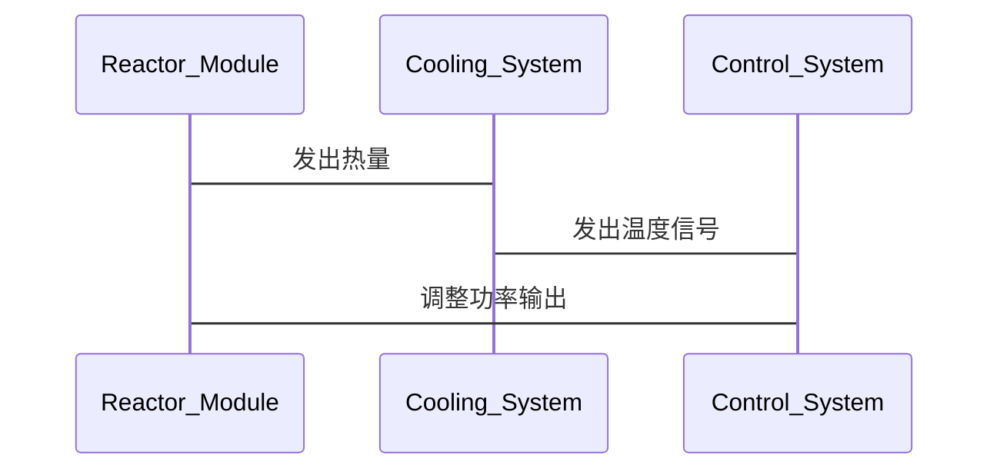

                 


# 价值投资中的小型模块化核反应堆技术前景

> 关键词：小型模块化核反应堆，价值投资，能源技术，投资前景，模块化设计

> 摘要：本文探讨了小型模块化核反应堆技术在能源市场中的潜力及其对价值投资的影响。通过分析技术原理、市场前景、投资策略等方面，本文为投资者提供了基于技术分析的决策参考。

---

## 第1章 小型模块化核反应堆技术概述

### 1.1 小型模块化核反应堆的定义与特点

#### 1.1.1 小型模块化核反应堆的定义
小型模块化核反应堆（Small Modular Reactors, SMR）是指功率输出在300 MW以下，采用模块化设计的核反应堆。与传统大型核反应堆相比，SMR具有体积小、成本低、部署灵活的特点。

#### 1.1.2 小型模块化核反应堆的核心技术特点
- **模块化设计**：SMR可以在工厂预制，现场组装，缩短建设周期。
- **安全性高**：采用非能动安全系统，提高运行安全性。
- **灵活性强**：适用于不同的能源需求场景，如偏远地区或工业区。

#### 1.1.3 小型模块化核反应堆与传统核反应堆的对比

| 对比维度       | 小型模块化核反应堆（SMR）                     | 传统大型核反应堆（LWR）                     |
|----------------|--------------------------------------------|--------------------------------------------|
| 输出功率       | 300 MW及以下                               | 1000 MW及以上                              |
| 建设周期       | 2-3年                                       | 5-10年                                      |
| 成本           | 较低                                       | 较高                                       |
| 部署场景       | 工业园区、偏远地区等                         | 大型电网                                    |

### 1.2 小型模块化核反应堆的技术优势

#### 1.2.1 技术可行性分析
SMR采用成熟的技术路线，基于现有的核反应堆设计，进一步优化模块化结构。

#### 1.2.2 成本优势
模块化生产降低了制造成本，同时缩短了建设周期，降低了资金的时间成本。

#### 1.2.3 安全性与灵活性
SMR采用非能动安全系统，降低了核事故的风险。同时，模块化设计使其能够灵活部署在不同的能源需求场景。

### 1.3 小型模块化核反应堆的市场前景

#### 1.3.1 全球能源需求分析
随着全球能源需求的增长，对高效、清洁的能源技术需求日益迫切。SMR作为一种清洁能源技术，具有广阔的市场前景。

#### 1.3.2 小型模块化核反应堆的潜在市场应用
- **偏远地区供电**：SMR可以为缺乏电网覆盖的地区提供稳定的电力。
- **工业园区供能**：SMR可以为工业园区提供热电联供，提高能源利用效率。
- **应急电源**：SMR可以在灾害发生时作为应急电源，保障关键设施的运行。

#### 1.3.3 技术商业化面临的挑战
- **政策支持不足**：需要政府在政策、资金等方面给予支持。
- **技术成熟度**：SMR技术尚未完全成熟，需要进一步研发和验证。
- **市场竞争**：与传统能源技术相比，SMR的成本和技术优势需要进一步体现。

### 1.4 小型模块化核反应堆与价值投资的关系

#### 1.4.1 价值投资的核心概念
价值投资是指以低于内在价值的价格买入优质资产，长期持有的投资策略。关键在于识别具有长期增长潜力的优质资产。

#### 1.4.2 小型模块化核反应堆的技术前景对投资的影响
SMR技术具有广阔的市场前景和较高的技术壁垒，符合价值投资的长期增长逻辑。

#### 1.4.3 投资者如何评估小型模块化核反应堆的潜力
- **技术成熟度**：评估SMR技术的商业化进程和技术创新能力。
- **市场需求**：分析全球能源需求和政策支持情况。
- **竞争格局**：研究行业内主要企业的竞争地位和市场布局。

### 1.5 本章小结
本章介绍了小型模块化核反应堆的技术特点、市场前景以及与价值投资的关系。SMR作为一项具有革命性潜力的技术，值得投资者关注。

---

## 第2章 小型模块化核反应堆技术的核心原理

### 2.1 核反应堆的基本原理

#### 2.1.1 核裂变反应的基本过程
核裂变是指重核吸收一个中子后分裂成两个较轻的核，同时释放出更多的中子和能量。这一过程可以链式反应，产生大量能量。

#### 2.1.2 核反应堆的组成部分
- **燃料组件**：通常使用低 enriched uranium（LEU）作为燃料。
- **慢化剂**：用于减速快中子，提高反应堆的效率。
- **冷却剂**：用于带走反应堆产生的热量，通常是水或气体。
- **防护系统**：用于防止放射性物质泄漏和保护反应堆免受外部威胁。

#### 2.1.3 核反应堆的安全性与控制
核反应堆的安全性主要依赖于多重防护措施和控制系统的可靠性。非能动安全系统可以在没有外部干预的情况下维持反应堆的安全运行。

### 2.2 小型模块化核反应堆的技术创新

#### 2.2.1 模块化设计的优势
模块化设计使得SMR可以在工厂预制，现场组装，缩短了建设周期，降低了成本。

#### 2.2.2 小型化技术的实现
SMR通过优化设计，降低了反应堆的体积和成本，同时保持了较高的能效。

#### 2.2.3 智能化与数字化技术的应用
SMR采用智能化和数字化技术，提高了运行效率和安全性。例如，使用人工智能技术进行实时监控和预测维护。

### 2.3 小型模块化核反应堆的能效分析

#### 2.3.1 能效计算的基本公式
能效（Energy Efficiency）可以表示为输出的能量与输入的能量之比：

$$ \text{能效} = \frac{\text{输出能量}}{\text{输入能量}} $$

#### 2.3.2 模块化设计对能效的影响
模块化设计通过优化能量传递路径，提高了能效。例如，SMR的设计可以减少热量损失，提高能源利用效率。

#### 2.3.3 技术创新对能效的提升
技术创新，如改进燃料组件和优化反应堆设计，进一步提高了SMR的能效。

### 2.4 本章小结
本章详细介绍了核反应堆的基本原理和SMR的技术创新，强调了模块化设计和技术创新对能效的提升。

---

## 第3章 小型模块化核反应堆的技术与市场对比分析

### 3.1 技术对比分析

#### 3.1.1 小型模块化核反应堆与传统核电站的技术对比
| 技术特点       | 小型模块化核反应堆（SMR）                     | 传统核电站（LWR）                     |
|----------------|--------------------------------------------|--------------------------------------------|
| 输出功率       | 300 MW及以下                               | 1000 MW及以上                              |
| 建设周期       | 2-3年                                       | 5-10年                                      |
| 成本           | 较低                                       | 较高                                       |
| 部署场景       | 工业园区、偏远地区等                         | 大型电网                                    |

#### 3.1.2 不同类型小型模块化核反应堆的技术优劣
- **水冷式SMR**：技术成熟，成本较低，但对水资源依赖较大。
- **气冷式SMR**：抗高温能力强，适合沙漠等缺水地区，但技术难度较高。

#### 3.1.3 技术创新对市场竞争力的影响
技术创新可以降低SMR的成本，提高其市场竞争力。例如，采用模块化设计可以缩短建设周期，降低投资成本。

### 3.2 市场对比分析

#### 3.2.1 全球能源市场的现状与趋势
全球能源需求持续增长，对清洁能源技术的需求日益迫切。SMR作为一种高效、清洁的能源技术，具有广阔的市场前景。

#### 3.2.2 小型模块化核反应堆的市场定位
SMR主要面向工业园区、偏远地区和应急电源市场，与传统核电站形成互补。

#### 3.2.3 不同地区市场对小型模块化核反应堆的需求差异
- **发达国家**：能源需求稳定，对SMR的需求主要集中在工业园区和应急电源。
- **发展中国家**：能源需求快速增长，SMR可以作为一种快速部署的能源解决方案。

### 3.3 投资价值分析

#### 3.3.1 技术成熟度对投资价值的影响
技术成熟度越高，投资风险越小，投资价值越大。目前，SMR技术尚处于商业化初期，需要进一步验证。

#### 3.3.2 市场需求对投资价值的影响
市场需求越大，投资价值越高。随着全球能源需求的增长，SMR的市场需求将逐步增加。

#### 3.3.3 技术与市场的匹配程度
技术与市场匹配程度高，投资价值大。SMR技术适用于工业园区和偏远地区，符合全球能源需求多样化的趋势。

### 3.4 本章小结
本章通过技术与市场的对比分析，强调了SMR的市场定位和投资价值。

---

## 第4章 小型模块化核反应堆的系统架构与设计

### 4.1 系统架构设计

#### 4.1.1 模块化设计
SMR采用模块化设计，包括反应堆模块、冷却系统模块和控制模块。模块化设计使得SMR可以在工厂预制，现场组装，缩短了建设周期。

#### 4.1.2 分布式部署
SMR可以分布在不同的地点，灵活部署，满足不同能源需求场景。

### 4.2 系统功能设计

#### 4.2.1 领域模型类图


#### 4.2.2 系统架构图


### 4.3 系统交互设计

#### 4.3.1 序列图


### 4.4 本章小结
本章详细介绍了SMR的系统架构与设计，强调了模块化设计和分布式部署的优势。

---

## 第5章 项目实战：小型模块化核反应堆的投资分析

### 5.1 环境安装

#### 5.1.1 技术环境
- 操作系统：Linux
- 开发工具：Python、Matplotlib、NumPy

#### 5.1.2 数据来源
- 全球能源需求数据：国际能源署（IEA）
- 核电市场数据：世界核能协会（WNA）

### 5.2 核心实现源代码

#### 5.2.1 能源需求预测模型
```python
import numpy as np
import matplotlib.pyplot as plt

# 数据准备
years = np.array([2020, 2021, 2022, 2023, 2024])
energy_demand = np.array([500, 550, 600, 650, 700])

# 线性回归模型
def linear_regression(x, y):
    slope = np.sum((x - x.mean()) * (y - y.mean())) / np.sum((x - x.mean())**2)
    intercept = y.mean() - slope * x.mean()
    return slope, intercept

slope, intercept = linear_regression(years, energy_demand)
energy_prediction = slope * years + intercept

# 可视化
plt.plot(years, energy_demand, 'o', label='实际数据')
plt.plot(years, energy_prediction, '-', label='预测数据')
plt.xlabel('年份')
plt.ylabel('能源需求')
plt.legend()
plt.show()
```

#### 5.2.2 投资回报率计算
```python
def calculate_roe(investment, revenue, years):
    roe = (revenue - investment) / investment * 100
    return f"投资回报率：{roe}%，投资回收期：{years}年"
```

### 5.3 实际案例分析

#### 5.3.1 案例背景
某国家计划在工业园区建设一座小型模块化核反应堆，预计总投资为5000万美元，预计运营寿命为30年，年均收入为2000万美元。

#### 5.3.2 投资回报分析
- **投资回报率（ROI）**：
  $$ ROI = \frac{\text{年均收入} - \text{年均成本}}{\text{年均成本}} \times 100\% $$
- **投资回收期**：预计5年。

### 5.4 本章小结
本章通过实际案例分析，展示了SMR的投资回报率和回收期，强调了SMR的市场潜力。

---

## 第6章 总结与最佳实践

### 6.1 总结
小型模块化核反应堆技术具有广阔的技术前景和市场潜力。随着技术的成熟和市场的推广，SMR将在能源领域发挥越来越重要的作用。

### 6.2 最佳实践 tips
- **技术评估**：关注SMR的技术成熟度和创新能力。
- **市场需求**：分析全球能源需求和政策支持情况。
- **投资策略**：选择具有技术优势和市场竞争力的SMR项目。

### 6.3 注意事项
- **政策风险**：关注政策变化对SMR技术的影响。
- **技术风险**：SMR技术尚未完全成熟，存在一定的技术风险。
- **市场竞争**：关注行业内竞争格局的变化。

### 6.4 拓展阅读
- **《小型模块化核反应堆的技术与市场》**
- **《价值投资与能源技术》**

### 6.5 本章小结
总结SMR的技术前景和投资价值，为投资者提供参考。

---

通过以上内容，我们详细探讨了小型模块化核反应堆技术的前景及其对价值投资的影响。SMR技术具有广阔的技术前景和市场潜力，值得投资者关注。

