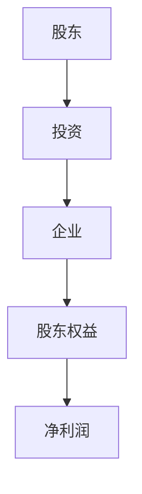

                 

# 价值投资中的成长型企业估值

---

## 关键词：
- 价值投资
- 成长型企业
- 估值方法
- DCF模型
- 财务分析

---

## 摘要：
本文将深入探讨价值投资中的成长型企业估值方法，分析其核心概念、数学模型及实际应用。从DCF模型到财务报表分析，从行业趋势到竞争优势，系统地解析如何准确评估成长型企业的内在价值。通过实际案例和最佳实践，为投资者提供实用的估值框架和策略建议。

---

## 第一部分: 价值投资中的成长型企业估值基础

## 第1章: 价值投资与成长型企业概述

### 1.1 价值投资的基本概念

#### 1.1.1 价值投资的定义
价值投资是一种以低于其内在价值的价格买入优质股票的投资策略。其核心在于识别市场低估的公司，并长期持有以获取超额收益。

#### 1.1.2 成长型企业的定义
成长型企业是指那些在较长时期内能够维持较高销售额和利润增长率的企业。这类企业通常处于快速发展的行业，具有强大的竞争优势和创新能力。

#### 1.1.3 价值投资与成长型企业的关系
价值投资与成长型企业密切相关，因为成长型企业通常具备较高的内在价值增长潜力。投资者通过识别具有持续成长能力的公司，可以在长期获得超额回报。

### 1.2 价值投资的核心理念

#### 1.2.1 股票的内在价值
股票的内在价值是基于公司未来现金流的现值。计算内在价值可以帮助投资者判断股票是否被市场低估或高估。

#### 1.2.2 市场价值与内在价值的差异
市场价值是股票在市场上的交易价格，可能高于或低于其内在价值。价值投资者关注的是内在价值与市场价值之间的差异，以寻找投资机会。

#### 1.2.3 长期投资与短期投资的区别
长期投资注重企业的基本面和长期增长潜力，而短期投资关注市场波动和短期价格变化。价值投资强调长期投资，以时间复利效应最大化收益。

### 1.3 成长型企业估值的重要性

#### 1.3.1 估值在投资决策中的作用
准确的估值是投资决策的基础。通过估值，投资者可以判断企业是否具备投资价值，并制定合理的买入和卖出策略。

#### 1.3.2 成长型企业估值的挑战
成长型企业通常具有较高的增长率和不确定性，这使得其估值更具挑战性。投资者需要综合考虑企业的财务状况、行业地位和未来前景。

#### 1.3.3 成长型企业估值的长期回报潜力
成长型企业由于其持续的增长能力，通常能够为投资者带来较高的长期回报。准确的估值是实现这一潜力的关键。

### 1.4 本章小结
本章介绍了价值投资的基本概念、核心理念以及成长型企业估值的重要性。通过理解这些内容，投资者可以为后续的估值分析打下坚实基础。

---

## 第2章: 成长型企业估值的核心概念与联系

### 2.1 核心概念原理

#### 2.1.1 股东权益的计算公式
股东权益是公司净资产的价值，计算公式为：
$$ \text{股东权益} = \text{资产} - \text{负债} $$

#### 2.1.2 股东权益增长率的计算公式
股东权益增长率反映了公司资产的扩张速度，计算公式为：
$$ \text{股东权益增长率} = \frac{\text{本年股东权益} - \text{上年股东权益}}{\text{上年股东权益}} \times 100\% $$

### 2.2 核心概念对比表格

| 概念 | 定义 | 关键指标 | 计算公式 |
|------|------|----------|----------|
| 内在价值 | 股票的真正价值 | 股东权益、现金流、增长率 | $$ \text{内在价值} = \frac{\text{现金流}}{\text{折现率}} $$ |
| 可持续增长率 | 公司在不依赖外部融资情况下的增长率 | ROE、留存收益比率 | $$ \text{可持续增长率} = \frac{\text{ROE} \times \text{留存收益比率}}{1 - \text{ROE} \times \text{留存收益比率}} $$ |

### 2.3 ER实体关系图

### 2.4 本章小结
本章通过核心概念的对比和关系图，展示了成长型企业估值的主要指标和计算方法。这些工具为后续的估值分析提供了基础。

---

## 第3章: 现金流折现模型（DCF模型）原理与应用

### 3.1 DCF模型的基本原理

#### 3.1.1 自由现金流的定义
自由现金流是企业在偿还债务和再投资必要的资本之后剩余的现金流，用于回报股东。

#### 3.1.2 折现率的计算方法
折现率通常使用加权平均资本成本（WACC）计算，公式为：
$$ \text{WACC} = \left( \frac{D}{D+E} \right) \times W \times (1 - T) + \left( \frac{E}{D+E} \right) \times R_e $$

#### 3.1.3 终值的计算公式
终值是企业未来现金流的现值，公式为：
$$ \text{TV} = \frac{\text{FCFF} \times (1 + g)}{\text{WACC}} $$

### 3.2 DCF模型的步骤

#### 3.2.1 确定企业的自由现金流
自由现金流（FCFF）计算公式为：
$$ \text{FCFF} = \text{净利润} + \text{折旧} - \text{资本支出} $$

#### 3.2.2 确定适当的折现率
使用WACC作为折现率，计算公式如上。

#### 3.2.3 计算终值
使用终值公式计算企业未来现金流的现值。

#### 3.2.4 计算总价值
总价值是企业股权的公允价值，公式为：
$$ \text{股权价值} = \text{终值} - \text{债务价值} $$

### 3.3 DCF模型的优缺点

#### 3.3.1 优点
- 能够量化企业的内在价值
- 考虑了时间价值和风险因素
- 适用于成长型企业估值

#### 3.3.2 缺点
- 依赖于假设的准确性
- 计算复杂，需要大量数据
- 市场环境变化可能影响模型的有效性

### 3.4 DCF模型的数学公式

#### 3.4.1 自由现金流公式
$$ \text{FCFF} = \text{净利润} + \text{折旧} - \text{资本支出} $$

#### 3.4.2 终值公式
$$ \text{TV} = \frac{\text{FCFF} \times (1 + g)}{\text{WACC}} $$

#### 3.4.3 股权价值公式
$$ \text{股权价值} = \text{TV} - \text{债务价值} $$

### 3.5 DCF模型的实际应用

#### 3.5.1 案例分析
假设某成长型企业未来5年的自由现金流分别为100、120、140、160、180万元，折现率为8%。计算其终值和股权价值。

#### 3.5.2 计算步骤
1. 计算终值：
   $$ \text{TV} = \frac{180 \times (1 + g)}{0.08} $$
   假设增长率g为5%，则：
   $$ \text{TV} = \frac{180 \times 1.05}{0.08} = 2362.5 \text{万元} $$

2. 计算股权价值：
   $$ \text{股权价值} = 2362.5 - \text{债务价值} $$

### 3.6 本章小结
本章详细介绍了DCF模型的原理和应用，通过案例分析展示了如何使用该模型进行企业估值。DCF模型是价值投资者的重要工具，但需要结合实际情况进行调整。

---

## 第4章: 财务报表分析与成长型企业估值

### 4.1 财务报表分析的基本方法

#### 4.1.1 利润表分析
利润表反映了企业的收入和利润情况，关注点包括营业收入、净利润和利润率。

#### 4.1.2 资产负债表分析
资产负债表反映了企业的资产、负债和股东权益，关注点包括资产结构、负债水平和股东权益增长。

#### 4.1.3 现金流量表分析
现金流量表反映了企业的现金流入和流出情况，关注点包括经营活动现金流和投资活动现金流。

### 4.2 成长型企业财务指标分析

#### 4.2.1 营收增长率
营收增长率是衡量企业销售增长的重要指标，计算公式为：
$$ \text{营收增长率} = \frac{\text{本年营收} - \text{上年营收}}{\text{上年营收}} \times 100\% $$

#### 4.2.2 净利润增长率
净利润增长率反映了企业盈利能力的增长情况，计算公式为：
$$ \text{净利润增长率} = \frac{\text{本年净利润} - \text{上年净利润}}{\text{上年净利润}} \times 100\% $$

#### 4.2.3 现金流健康度
现金流健康度反映了企业的财务健康状况，重点关注经营活动现金流净额。

### 4.3 财务报表分析的实际应用

#### 4.3.1 案例分析
以某成长型企业为例，分析其利润表、资产负债表和现金流量表的关键指标。

#### 4.3.2 关键指标对比
将企业的财务指标与行业平均水平进行对比，判断其竞争力和成长潜力。

### 4.4 本章小结
本章通过财务报表分析，展示了如何从企业财务数据中提取估值所需的关键信息。财务报表分析是成长型企业估值的重要基础。

---

## 第5章: 成长型企业估值的行业与宏观因素

### 5.1 行业趋势分析

#### 5.1.1 行业生命周期
行业生命周期包括导入期、成长期、成熟期和衰退期，不同阶段的企业估值方法和预期回报不同。

#### 5.1.2 行业竞争结构
行业竞争结构影响企业的利润率和成长空间，通常使用五力模型进行分析。

### 5.2 宏观经济因素

#### 5.2.1 经济周期
经济周期波动会影响企业的业绩和估值，成长型企业通常在经济复苏和扩张期表现较好。

#### 5.2.2 利率环境
利率环境影响折现率，进而影响企业的估值。低利率环境通常会推高企业的内在价值。

### 5.3 政策与监管环境

#### 5.3.1 行业政策
行业政策的变化可能影响企业的经营环境和成长空间，投资者需要关注相关政策的变化。

#### 5.3.2 税收政策
税收政策影响企业的净利润和现金流，进而影响估值。

### 5.4 本章小结
本章分析了行业趋势和宏观经济因素对成长型企业估值的影响。投资者需要综合考虑这些因素，以准确评估企业的内在价值。

---

## 第6章: 成长型企业估值的风险管理与投资策略

### 6.1 风险管理

#### 6.1.1 估值风险
估值风险是由于模型假设和数据误差导致的估值偏差，投资者需要通过敏感性分析和压力测试来评估和管理这种风险。

#### 6.1.2 市场风险
市场风险是由于市场波动导致的股价波动，投资者需要通过分散投资和长期持有来降低市场风险。

### 6.2 投资策略

#### 6.2.1 价值投资策略
价值投资策略强调以低于内在价值的价格买入优质股票，并长期持有。

#### 6.2.2 成长型投资策略
成长型投资策略注重投资于具有高成长潜力的企业，强调企业的未来增长能力。

### 6.3 本章小结
本章讨论了成长型企业估值中的风险管理与投资策略。投资者需要结合估值结果和市场环境，制定合理的投资策略。

---

## 第7章: 实际案例分析与最佳实践

### 7.1 案例分析

#### 7.1.1 案例背景
选择一家具有代表性的成长型企业，分析其财务数据和市场表现。

#### 7.1.2 估值过程
使用DCF模型和财务报表分析方法，计算企业的内在价值。

#### 7.1.3 投资决策
基于估值结果，制定买入、持有或卖出的投资策略。

### 7.2 最佳实践

#### 7.2.1 数据收集与验证
投资者需要收集可靠的数据，并对数据进行验证和交叉检查。

#### 7.2.2 模型调整与优化
根据实际情况调整模型参数，优化估值结果。

#### 7.2.3 定期复盘与评估
定期复盘投资组合的表现，评估估值模型的有效性，并进行必要的调整。

### 7.3 本章小结
本章通过实际案例分析，展示了如何将理论应用于实际投资决策。最佳实践提供了实用的估值工具和方法。

---

## 第8章: 总结与展望

### 8.1 总结
本文系统地介绍了价值投资中的成长型企业估值方法，分析了核心概念、数学模型和实际应用。通过案例分析和最佳实践，为投资者提供了实用的估值框架和策略建议。

### 8.2 展望
未来，随着市场环境的变化和技术的进步，成长型企业估值方法将不断创新和优化。投资者需要持续学习和提升，以应对新的挑战和机遇。

### 8.3 本章小结
本章总结了全文的主要内容，并展望了未来的研究方向和发展趋势。

---

## 参考文献
（此处列出相关的书籍、论文和其他参考资料）

---

## 致谢
感谢读者的关注和支持，感谢所有在写作过程中给予帮助和支持的人。

--- 

（本文版权归作者所有，未经授权不得转载）

