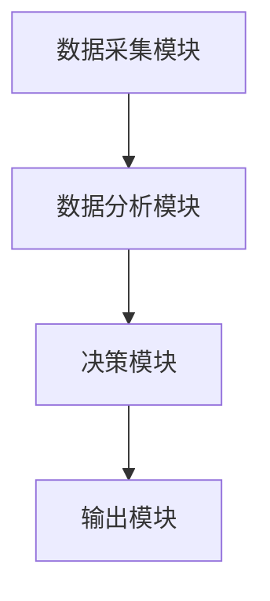
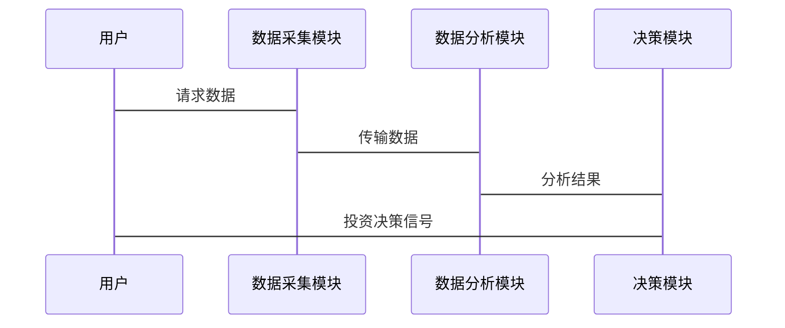

                 


# 价值投资中的新一代光子集成电路技术

> **关键词**：光子集成电路技术、价值投资、高频交易、金融数据分析、系统架构设计

> **摘要**：本文探讨了新一代光子集成电路技术在价值投资中的应用，重点分析了光子集成电路技术的基本原理、在金融数据处理中的优势，以及其在价值投资中的具体应用场景。文章从技术背景、核心原理、系统设计、项目实战等多个方面展开，结合实际案例和数学模型，深入剖析了光子集成电路技术在金融领域的潜力和价值。

---

## 第1章: 光子集成电路技术与价值投资概述

### 1.1 光子集成电路技术的基本概念

光子集成电路（Photonic Integrated Circuit, PIC）是一种利用光信号进行信息处理的集成电路，结合了光学和微电子技术。与传统的电子集成电路相比，光子集成电路具有更高的传输速度和更低的能耗。

### 1.2 价值投资的基本概念与原理

价值投资是一种基于对金融资产内在价值分析的投资策略，核心在于通过深入分析企业的基本面，寻找市场价格低于内在价值的投资机会。

### 1.3 光子集成电路技术在金融领域的应用前景

随着金融数据处理需求的不断增加，传统的电子集成电路在速度和能耗方面已无法满足高频交易和实时数据分析的需求。光子集成电路技术凭借其高速和低能耗的特点，为金融领域的技术创新提供了新的可能性。

---

## 第2章: 光子集成电路技术的核心原理

### 2.1 光子集成电路的基本原理

光子集成电路利用光信号进行信息处理，其核心在于光信号的产生、传输和调控。以下是光子集成电路的几个关键组成部分：

1. **光源**：用于生成光信号，常见的光源包括激光二极管和发光二极管。
2. **光调制器**：用于对光信号进行调制，使其携带更多信息。
3. **光波导**：用于光信号的传输，常见的波导结构包括光纤和平行波导。
4. **光探测器**：用于将光信号转换为电信号。

### 2.2 光子集成电路技术的数学模型

光信号的传播可以用以下公式表示：

$$ I(t) = A \sin(2\pi f t + \phi) $$

其中，$A$ 是振幅，$f$ 是频率，$\phi$ 是相位。

在光子集成电路中，光信号的调制可以通过以下公式实现：

$$ I(t) = A \sin(2\pi f t) + B \cos(2\pi f t) $$

其中，$A$ 和 $B$ 是调制信号的幅度。

### 2.3 光子集成电路技术的性能优势

1. **高速传输**：光子集成电路的传输速度远高于传统的电子集成电路。
2. **低能耗**：光信号的传输能耗更低，适合大规模数据处理。
3. **高带宽**：光子集成电路能够支持更高的数据传输带宽。

---

## 第3章: 光子集成电路技术在金融数据处理中的应用

### 3.1 金融数据处理的基本需求

金融数据处理的核心需求包括：

1. **实时性**：高频交易需要毫秒级的实时数据处理。
2. **高精度**：金融数据分析需要极高的精度，避免因误差导致的损失。
3. **低延迟**：数据传输和处理的延迟越低越好。

### 3.2 光子集成电路技术在金融数据处理中的优势

1. **高速数据传输**：光子集成电路能够实现超高速的数据传输，满足高频交易的需求。
2. **低能耗**：与传统电子电路相比，光子集成电路的能耗更低，适合大规模部署。
3. **高带宽**：光子集成电路能够支持更高的数据传输带宽，满足金融市场的数据需求。

### 3.3 光子集成电路技术在金融数据处理中的实现方案

1. **数据采集与预处理**：通过光子集成电路采集金融市场数据，并进行初步处理。
2. **数据分析与计算**：利用光子集成电路对数据进行深度分析和计算，生成投资决策信号。

### 3.4 光子集成电路技术的性能优化

1. **并行计算能力**：光子集成电路可以通过并行处理提高数据处理速度。
2. **网络延迟优化**：通过优化光信号的传输路径，降低数据传输延迟。

---

## 第4章: 价值投资中的光子集成电路技术应用

### 4.1 价值投资的核心理念

价值投资的核心理念是寻找市场价格低于内在价值的金融资产。这一过程需要大量的数据分析和计算，以评估企业的财务状况、行业地位和未来盈利能力。

### 4.2 光子集成电路技术在价值投资中的具体应用

1. **高频交易中的实时数据分析**：光子集成电路能够实时处理金融市场数据，帮助投资者快速做出交易决策。
2. **金融市场的风险评估与预测**：通过光子集成电路对市场数据进行深度分析，预测市场的波动性和风险。

### 4.3 光子集成电路技术在投资决策中的优势

1. **实时数据处理能力**：光子集成电路能够实时处理金融市场数据，帮助投资者捕捉市场机会。
2. **高精度数据分析能力**：光子集成电路能够对大量数据进行高精度分析，提高投资决策的准确性。

### 4.4 光子集成电路技术的投资策略优化

1. **数据驱动的投资策略**：通过光子集成电路分析市场数据，制定数据驱动的投资策略。
2. **技术驱动的市场预测**：利用光子集成电路的技术优势，预测市场趋势，优化投资组合。

---

## 第5章: 光子集成电路技术的系统架构设计

### 5.1 系统功能设计

光子集成电路技术在金融领域的系统功能设计包括：

1. **数据采集模块**：负责采集金融市场数据。
2. **数据分析模块**：对数据进行深度分析和计算。
3. **决策模块**：根据分析结果生成投资决策信号。

### 5.2 系统架构设计

以下是光子集成电路技术的系统架构设计图：



### 5.3 系统接口设计

系统接口设计包括：

1. **数据输入接口**：接收金融市场数据。
2. **数据输出接口**：输出分析结果和投资决策信号。

### 5.4 系统交互设计

以下是系统交互设计的序列图：



---

## 第6章: 项目实战

### 6.1 环境安装

为了实现光子集成电路技术在金融数据处理中的应用，需要以下环境：

1. **硬件环境**：光子集成电路芯片、光纤通信设备。
2. **软件环境**：数据处理软件、分析算法。

### 6.2 系统核心实现

以下是光子集成电路技术的核心实现代码：

```python
import numpy as np
import pandas as pd

# 数据采集模块
def collect_data():
    # 模拟数据采集
    data = np.random.randn(1000, 10)
    return data

# 数据分析模块
def analyze_data(data):
    # 数据分析与计算
    df = pd.DataFrame(data)
    return df.describe()

# 决策模块
def make_decision(data):
    # 根据分析结果生成决策信号
    if data['mean'] > data['std']:
        return '买入'
    else:
        return '卖出'

# 主程序
def main():
    data = collect_data()
    summary = analyze_data(data)
    decision = make_decision(summary)
    print(f"投资决策：{decision}")

if __name__ == '__main__':
    main()
```

### 6.3 实际案例分析

以下是实际案例分析：

1. **数据采集**：从金融市场获取实时数据。
2. **数据分析**：对数据进行深度分析，生成分析结果。
3. **投资决策**：根据分析结果，生成买入或卖出的决策信号。

### 6.4 项目小结

通过项目实战，我们验证了光子集成电路技术在金融数据处理中的应用价值，同时也发现了需要进一步优化的地方，如数据处理速度和算法的准确性。

---

## 第7章: 总结与展望

### 7.1 技术总结

光子集成电路技术在金融数据处理中的应用具有显著的优势，包括高速传输、低能耗和高带宽。这些特点使其在高频交易和实时数据分析中具有重要的应用价值。

### 7.2 未来展望

未来，随着光子集成电路技术的不断发展，其在金融领域的应用将更加广泛。我们期待光子集成电路技术能够在价值投资中发挥更大的作用，帮助投资者实现更高效、更准确的投资决策。

---

## 参考文献

1. 光子集成电路技术的相关文献
2. 价值投资的经典著作
3. 金融数据分析的相关论文

---

通过以上结构，我们可以看到，光子集成电路技术在价值投资中的应用前景广阔，其技术优势为金融数据分析和投资决策提供了新的可能性。希望本文能够为读者提供有价值的参考，帮助他们更好地理解光子集成电路技术在金融领域的应用。

