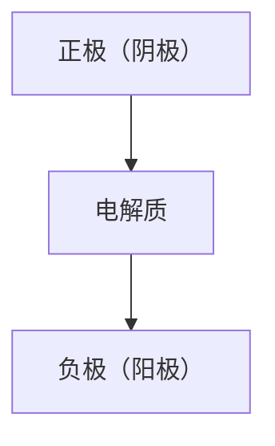

                 

# 价值投资中的新一代固态电池技术前景

> 关键词：固态电池、价值投资、技术分析、市场分析、投资策略、电动汽车、储能技术

> 摘要：  
固态电池作为下一代电池技术的代表，以其高能量密度、卓越的安全性和长循环寿命，正在重塑电动汽车和储能领域的格局。本文从技术原理、市场需求、竞争格局、投资策略等多维度，深入分析固态电池的前景，并为投资者提供基于技术评估的价值投资策略。通过系统的技术分析和市场洞察，本文旨在帮助投资者识别高潜力的技术和企业，把握固态电池技术带来的投资机会。

---

# 第一部分: 价值投资中的固态电池技术背景

# 第1章: 固态电池技术概述

## 1.1 固态电池的基本概念

### 1.1.1 传统电池与固态电池的定义对比

- **传统电池**：如锂离子电池，通常使用液态电解质。  
- **固态电池**：使用固体电解质替代传统液态电解质，具有更高的能量密度和安全性。

### 1.1.2 固态电池的核心技术优势

- **能量密度**：固态电池的能量密度显著高于传统锂离子电池，可提升电动汽车的续航里程。  
- **安全性**：固体电解质降低了电池起火和爆炸的风险。  
- **循环寿命**：固态电池的循环寿命更长，适合储能和电动汽车领域。

### 1.1.3 固态电池的市场定位与应用场景

- **应用场景**：广泛应用于电动汽车、储能系统、消费电子等领域。  
- **市场定位**：作为下一代电池技术，固态电池正在逐步取代传统锂离子电池。

---

## 1.2 固态电池技术的发展历程

### 1.2.1 电池技术的历史演变

- **19世纪**：铅酸电池的发明。  
- **20世纪**：镍镉电池和锂离子电池的快速发展。  
- **21世纪**：固态电池技术逐渐成熟，成为研究热点。

### 1.2.2 固态电池技术的突破与创新

- **技术突破**：固体电解质的开发和优化。  
- **创新应用**：新型阴极材料和阳极材料的应用。

### 1.2.3 固态电池技术的未来发展趋势

- **技术路线**：向更高能量密度和更低成本方向发展。  
- **商业化进程**：逐步从实验室走向量产。

---

## 1.3 价值投资的基本原理

### 1.3.1 价值投资的定义与核心理念

- **价值投资**：以低于内在价值的价格买入优质资产，长期持有的投资策略。  
- **核心理念**：注重企业的基本面，寻找被市场低估的投资机会。

### 1.3.2 价值投资与技术创新的关系

- **技术创新对企业价值的影响**：技术创新可以显著提升企业的竞争力和盈利能力。  
- **价值投资者如何评估技术创新的价值**：通过分析技术的市场前景和企业的技术储备来判断其投资价值。

### 1.3.3 技术创新对企业价值的影响

- **技术壁垒**：高技术壁垒可以保护企业的市场份额和盈利能力。  
- **技术商业化能力**：企业能否将技术创新转化为实际收益是关键。

---

## 1.4 固态电池技术与价值投资的结合

### 1.4.1 技术创新对企业价值的提升作用

- **技术创新如何提升企业竞争力**：固态电池技术可以显著提高电池性能，降低生产成本。  
- **技术领先企业的竞争优势**：技术领先的企业可以在市场上获得更高的利润率和更大的市场份额。

### 1.4.2 固态电池技术对行业格局的影响

- **行业格局的变化**：固态电池技术的普及可能改变现有的电池供应链和市场竞争格局。  
- **新进入者的挑战**：技术领先的企业的竞争优势可能面临挑战。

### 1.4.3 价值投资者如何识别技术领先企业

- **技术储备**：企业是否有足够的技术储备和研发能力。  
- **商业化能力**：企业能否将技术创新转化为实际的商业化产品。  
- **财务表现**：企业的财务状况和盈利能力是否能够支持技术创新的投入。

---

## 1.5 本章小结

本章从固态电池的基本概念、发展历程和技术优势出发，分析了固态电池技术对行业格局的影响，并探讨了技术领先企业在价值投资中的重要性。接下来，我们将深入分析固态电池的技术原理和核心材料，为后续的价值评估打下基础。

---

# 第二部分: 固态电池技术的核心分析

# 第2章: 固态电池技术的核心原理

## 2.1 固态电池的工作原理

### 2.1.1 电池的基本工作原理

电池通过化学能转化为电能，主要由阴极（正极）、阳极（负极）和电解质组成。

### 2.1.2 固态电池的电化学反应机制

- **放电过程**：阳极（负极）的锂离子通过电解质迁移到阴极（正极），与电子流方向相反。  
- **充电过程**：锂离子从阴极迁移到阳极，储存能量。

### 2.1.3 固态电解质的作用与特性

- **固体电解质**：具有良好的离子导电性和电子绝缘性。  
- **优点**：安全性高，化学稳定性好，耐高温。

### 2.1.4 固态电池与传统电池的对比

| 特性          | 固态电池          | 传统锂离子电池     |
|---------------|-------------------|--------------------|
| 电解质        | 固态             | 液态               |
| 安全性        | 高               | 较低               |
| 能量密度      | 高               | 中等               |
| 循环寿命      | 长               | 较短               |

---

### 2.1.5 固态电池的结构设计

#### 2.1.5.1 电池结构

#### 2.1.5.2 材料选择

- **正极材料**：如LiFePO4或NMC（镍锰钴氧化物）。  
- **负极材料**：如锂金属或石墨。  
- **电解质**：如氧化锂陶瓷或聚合物固体电解质。

---

## 2.2 固态电池的关键材料分析

### 2.2.1 阴极材料的选择与优化

- **选择标准**：高容量、高稳定性和良好的循环性能。  
- **优化方向**：提高材料的导电性和稳定性。

### 2.2.2 阳极材料的创新与应用

- **锂金属阳极**：具有高比容量，但存在树枝状锂生长的问题。  
- **解决方案**：通过改变化学成分和结构设计，降低锂枝晶的风险。

### 2.2.3 固态电解质材料的技术难点

- **材料选择**：寻找具有高离子导电性和化学稳定性的固体电解质材料。  
- **制备工艺**：实现均匀、致密的电解质膜。

---

### 2.2.4 材料成本与性能的权衡

| 材料类型       | 优点                | 缺点                |
|----------------|---------------------|--------------------|
| 聚合物电解质     | 成本低、加工容易      | 离子导电性较低      |
| 氧化物电解质     | 离子导电性高          | 成本高、加工难度大    |

---

## 2.3 固态电池的制备工艺

### 2.3.1 传统电池制备工艺的对比

- **传统工艺**：液态电解质，易于制备，成本较低。  
- **固态电池工艺**：固体电解质的制备需要更高的技术和设备投入。

### 2.3.2 固态电池制备工艺的独特性

- **材料制备**：需要高温烧结或特殊加工技术。  
- **组装工艺**：需要确保固体电解质与电极材料的紧密接触。

### 2.3.3 制备工艺对电池性能的影响

- **工艺优化**：制备工艺的优化可以显著提高电池的能量密度和循环寿命。

---

## 2.4 固态电池的技术优势与局限性

### 2.4.1 技术优势

- **安全性**：固态电解质降低了电池起火和爆炸的风险。  
- **能量密度**：固态电池的能量密度显著高于传统锂离子电池。  
- **循环寿命**：固态电池的循环寿命更长，适合储能和电动汽车领域。

### 2.4.2 技术局限性

- **成本**：固态电池的制备成本较高，尚未实现大规模量产。  
- **技术成熟度**：固态电池技术尚未完全成熟，仍需进一步研发和优化。  
- **量产能力**：目前固态电池的量产能力有限，制约了其大规模应用。

---

## 2.5 本章小结

本章详细介绍了固态电池的工作原理、关键材料和制备工艺，分析了其技术优势与局限性。固态电池的技术创新为其在电动汽车和储能领域的广泛应用奠定了基础，但其商业化仍面临诸多挑战。接下来，我们将从市场和投资的角度，分析固态电池技术的市场前景和投资策略。

---

# 第三部分: 固态电池技术的市场与投资分析

# 第3章: 固态电池技术的市场需求与竞争格局

## 3.1 全球固态电池市场的现状分析

### 3.1.1 市场规模

- **2023年市场规模**：约50亿美元。  
- **未来增长预测**：预计到2030年，市场规模将超过200亿美元。

### 3.1.2 市场驱动因素

- **电动汽车需求增长**：全球电动汽车市场快速发展，推动固态电池需求。  
- **政策支持**：各国政府出台政策支持新能源技术发展。  
- **技术进步**：固态电池技术的不断突破推动市场需求增长。

---

## 3.2 固态电池技术的竞争格局

### 3.2.1 主要竞争企业

| 企业       | 主要技术方向       | 市场地位       |
|------------|--------------------|----------------|
| 特斯拉     | 固态电池研发       | 市场领先       |
| 宁德时代   | 固态电池研发       | 市场领先       |
| 松下       | 固态电池研发       | 技术领先       |
|三星SDI     | 固态电池研发       | 技术领先       |

### 3.2.2 技术路线竞争

- **氧化物电解质路线**：以松下为代表，技术成熟，但成本较高。  
- **聚合物电解质路线**：以特斯拉为代表，成本较低，但离子导电性较差。  
- **锂离子固体电解质路线**：以宁德时代为代表，兼顾成本和性能。

### 3.2.3 市场进入壁垒

- **技术壁垒**：固态电池技术的研发和量产需要较高的技术和资金投入。  
- **专利壁垒**：主要企业通过专利布局形成技术壁垒，限制新进入者。

---

## 3.3 固态电池技术的市场机会与风险

### 3.3.1 技术领先企业的市场机会

- **技术创新带来的市场机会**：技术领先企业可以通过技术创新降低成本，提升产品性能。  
- **市场扩展带来的增长机会**：随着固态电池技术的普及，市场需求将快速增长。

### 3.3.2 投资风险

- **技术风险**：固态电池技术尚未完全成熟，存在技术失败的风险。  
- **市场竞争风险**：市场竞争加剧可能导致企业利润下降。  
- **经济周期风险**：全球经济波动可能影响市场需求。

---

## 3.4 本章小结

本章分析了固态电池技术的市场需求和竞争格局，指出了技术领先企业的市场机会和投资风险。投资者需要结合技术、市场和财务等多个维度，综合评估投资价值。

---

# 第四部分: 投资策略与实战分析

# 第4章: 价值投资策略

## 4.1 固态电池技术的价值评估

### 4.1.1 企业技术评估

- **技术储备**：企业是否有足够的技术储备和研发能力。  
- **技术商业化能力**：企业能否将技术创新转化为实际的商业化产品。

### 4.1.2 企业财务表现

- **盈利能力**：企业的盈利能力和财务状况是否能够支持技术创新的投入。  
- **成本控制能力**：企业是否能够有效控制生产成本，提升产品竞争力。

---

## 4.2 投资策略制定

### 4.2.1 技术领先企业投资策略

- **选择技术领先企业**：投资技术领先的企业，分享技术创新带来的收益。  
- **关注企业的商业化能力**：企业能否将技术创新转化为实际的商业化产品。  
- **分散投资风险**：通过分散投资降低单一投资的风险。

### 4.2.2 投资组合管理

- **投资组合的构建**：根据企业的技术实力、市场地位和财务状况，构建多元化投资组合。  
- **动态调整**：根据市场变化和技术发展，动态调整投资组合。

---

## 4.3 风险管理

### 4.3.1 技术风险

- **技术失败风险**：技术创新失败可能导致企业价值下降。  
- **技术替代风险**：新技术的出现可能导致现有技术快速淘汰。

### 4.3.2 市场风险

- **市场竞争风险**：市场竞争加剧可能导致企业利润下降。  
- **市场需求风险**：市场需求变化可能导致企业价值波动。

### 4.3.3 经济周期风险

- **经济波动风险**：全球经济波动可能影响企业的经营环境和市场需求。

---

## 4.4 本章小结

本章提出了基于固态电池技术的价值投资策略，强调了技术领先企业和商业化能力的重要性，并提出了风险管理的具体措施。接下来，我们将通过实际案例分析，进一步验证投资策略的有效性。

---

# 第五部分: 项目实战分析

# 第5章: 项目实战分析

## 5.1 案例分析：某固态电池企业

### 5.1.1 企业背景

- **企业名称**：XYZ固态电池公司。  
- **主要业务**：专注于固态电池技术研发和生产。  
- **技术优势**：采用聚合物电解质技术，成本低，能量密度高。

### 5.1.2 财务分析

- **收入与利润**：公司近年来收入快速增长，但尚未实现盈利。  
- **研发投入**：公司研发投入占比较高，显示出对技术创新的重视。

### 5.1.3 市场表现

- **市场份额**：公司目前市场份额较低，但增长潜力大。  
- **竞争对手分析**：主要竞争对手包括特斯拉、宁德时代等。

---

## 5.2 投资机会与风险评估

### 5.2.1 投资机会

- **技术创新带来的市场机会**：公司聚合物电解质技术具有成本优势，未来市场需求增长潜力大。  
- **行业发展趋势**：固态电池技术逐渐成熟，市场需求将快速增长。

### 5.2.2 投资风险

- **技术风险**：聚合物电解质技术可能存在离子导电性不足的问题，影响电池性能。  
- **市场竞争风险**：公司面临来自特斯拉、宁德时代等强大竞争对手的压力。

---

## 5.3 投资决策建议

### 5.3.1 投资建议

- **长期投资**：基于公司技术创新和市场需求增长的潜力，建议投资者长期持有。  
- **风险控制**：通过分散投资和动态调整投资组合，降低单一投资风险。

### 5.3.2 投资退出策略

- **上市公司的退出策略**：通过二级市场减持或出售，实现投资收益。  
- **非上市公司退出策略**：通过股权转让或企业并购退出。

---

## 5.4 本章小结

本章通过实际案例分析，验证了投资策略的有效性，并提出了具体的投资建议和风险控制措施。投资者需要结合企业的技术、市场和财务等多个维度，综合评估投资价值。

---

# 第六部分: 最佳实践与小结

# 第6章: 最佳实践与投资小结

## 6.1 最佳实践

### 6.1.1 技术评估

- **关注技术创新**：技术创新是企业核心竞争力，投资者需要关注企业的技术储备和商业化能力。  
- **关注技术路线**：不同技术路线有不同的优缺点，投资者需要结合市场需求和技术发展选择合适的技术路线。

### 6.1.2 市场分析

- **关注市场需求**：市场需求是企业发展的基础，投资者需要关注行业发展趋势和市场需求变化。  
- **关注竞争对手**：竞争对手的技术和市场动态是企业竞争的重要因素。

### 6.1.3 财务分析

- **关注企业财务状况**：企业的财务状况是投资决策的重要依据，投资者需要关注企业的盈利能力、成本控制能力和财务健康状况。

---

## 6.2 投资小结

### 6.2.1 投资总结

- **技术创新是关键**：固态电池技术的创新是企业核心竞争力，投资者需要关注企业的技术创新能力。  
- **商业化能力是重点**：企业的商业化能力是技术创新能否转化为实际收益的关键，投资者需要关注企业的商业化能力。

### 6.2.2 投资注意事项

- **技术风险**：技术创新失败可能导致企业价值下降，投资者需要关注技术风险。  
- **市场竞争风险**：市场竞争加剧可能导致企业利润下降，投资者需要关注市场竞争风险。  
- **经济周期风险**：全球经济波动可能影响企业的经营环境和市场需求，投资者需要关注经济周期风险。

---

## 6.3 未来展望

### 6.3.1 固态电池技术的未来发展趋势

- **技术路线多样化**：不同技术路线将继续竞争，推动技术进步。  
- **成本下降**：随着技术进步和规模化生产，固态电池的成本将逐步下降。  
- **市场扩展**：随着市场需求增长，固态电池技术的应用领域将逐步扩大。

### 6.3.2 投资者的机会与挑战

- **机会**：技术创新和市场需求增长带来的投资机会。  
- **挑战**：技术风险、市场竞争风险和经济周期风险等。

---

## 6.4 本章小结

本章总结了固态电池技术的投资经验和教训，提出了未来投资的注意事项和展望。投资者需要结合技术、市场和财务等多个维度，综合评估投资价值，并关注技术、市场和经济环境的变化，及时调整投资策略。

---

# 结语

固态电池技术作为下一代电池技术的代表，正在逐步改变电动汽车和储能领域的格局。通过技术创新和市场分析，投资者可以识别高潜力的技术和企业，把握固态电池技术带来的投资机会。然而，投资者也需要关注技术风险、市场竞争风险和经济周期风险，制定合理的投资策略，实现长期稳定的收益。

--- 

# END

