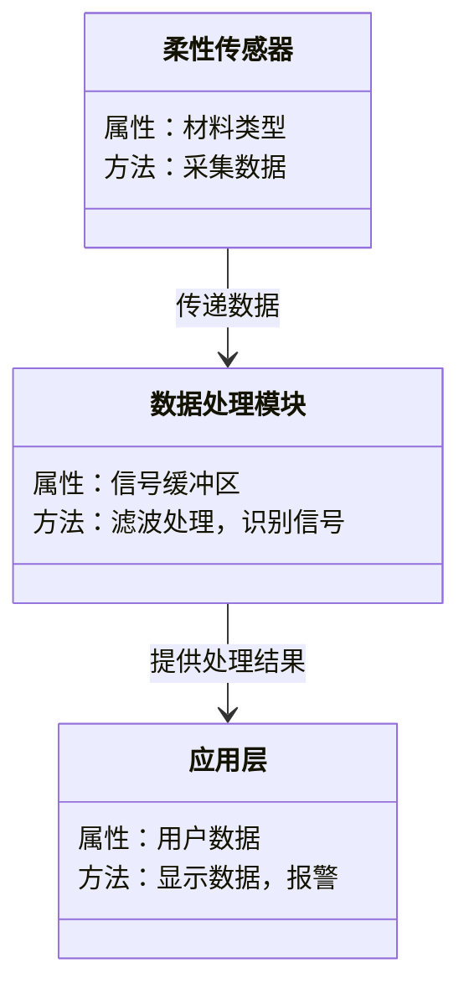

                 


# 价值投资中的新一代柔性传感器技术前景

> 关键词：柔性传感器，价值投资，技术前景，传感器技术，投资分析

> 摘要：本文从技术角度深入分析柔性传感器的核心原理、市场价值及在智能硬件、医疗健康、智能家居等领域的应用前景，结合价值投资的理念，探讨其市场潜力和投资机会。

---

## 第1章: 柔性传感器技术概述

### 1.1 柔性传感器的基本概念

#### 1.1.1 传感器的基本定义
传感器是一种能够检测特定物理量（如温度、湿度、压力、光线等）并将其转换为可测量信号的装置。它是现代信息技术和物联网（IoT）系统的核心组成部分。

#### 1.1.2 柔性传感器的定义与特点
柔性传感器是一种具有柔性和可变形特性的传感器，能够在复杂环境中适应不同的形状和表面。其特点包括：
- 高灵敏度
- 轻薄灵活
- 耐用性强
- 适应性强

#### 1.1.3 柔性传感器的应用领域
柔性传感器广泛应用于多个领域，包括医疗健康、智能家居、可穿戴设备、环境监测等。

### 1.2 柔性传感器的工作原理

#### 1.2.1 传感器的基本工作原理
传感器通过感知外界物理量的变化，将其转化为电信号。常用的工作原理包括电阻变化、电容变化、热电效应等。

#### 1.2.2 柔性传感器的材料与结构
柔性传感器的核心材料包括导电高分子、纳米材料、弹性体等。其结构设计决定了其灵敏度和响应速度。

#### 1.2.3 柔性传感器的制造工艺
柔性传感器的制造工艺包括材料涂布、 patterning、封装等步骤，确保其柔性和耐用性。

### 1.3 柔性传感器的分类与对比

#### 1.3.1 按材料分类
- 金属材料传感器
- 导电高分子传感器
- 纳米材料传感器

#### 1.3.2 按结构分类
- 平面结构传感器
- 三维结构传感器
- 弯曲结构传感器

#### 1.3.3 按应用场景分类
- 健康监测传感器
- 环境监测传感器
- 智能家居传感器

### 1.4 柔性传感器的技术优势与挑战

#### 1.4.1 技术优势
- 轻薄灵活，适合复杂环境
- 高灵敏度，精确检测
- 适应性强，可应用于多种场景

#### 1.4.2 技术挑战
- 制造成本较高
- 稳定性不足
- 标准化问题

#### 1.4.3 未来发展方向
- 提高灵敏度和稳定性
- 降低成本，实现规模化生产
- 推动标准化建设

---

## 第2章: 价值投资中的柔性传感器技术应用前景

### 2.1 价值投资的基本概念

#### 2.1.1 价值投资的定义
价值投资是一种投资策略，通过分析公司的基本面（如财务状况、行业地位、盈利能力等）来寻找被市场低估的投资机会。

#### 2.1.2 价值投资的核心理念
- 购买优质资产，长期持有
- 瞬间决策，长期持股
- 避免短期波动，关注长期价值

#### 2.1.3 价值投资的适用领域
价值投资适用于多个领域，包括科技、医疗、消费等，尤其在技术创新和市场潜力较大的领域中更具优势。

### 2.2 柔性传感器技术在价值投资中的应用

#### 2.2.1 柔性传感器在智能硬件中的应用
- 智能手表、可穿戴设备中的健康监测
- 智能家居中的环境监测
- 智能汽车中的安全监测

#### 2.2.2 柔性传感器在医疗健康中的应用
- 病人监测：心率、体温、血压等
- 康复医疗：运动监测和反馈
- 精准医疗：个性化医疗监测

#### 2.2.3 柔性传感器在智能家居中的应用
- 家庭环境监测：温湿度、空气质量
- 家庭安全：入侵检测
- 智能家电控制：远程监控

### 2.3 柔性传感器技术的市场价值分析

#### 2.3.1 市场需求分析
- 全球传感器市场规模持续增长
- 柔性传感器需求逐步增加
- 物联网和可穿戴设备推动市场增长

#### 2.3.2 技术壁垒分析
- 制造工艺复杂
- 材料研发难度高
- 标准化问题尚未完全解决

#### 2.3.3 未来市场前景预测
- 预计柔性传感器市场将快速增长
- 应用场景将更加多样化
- 技术创新将推动市场扩展

---

## 第3章: 柔性传感器技术的核心概念与联系

### 3.1 柔性传感器技术的核心原理

#### 3.1.1 柔性传感器的材料选择
- 导电高分子材料：如聚丙烯酸酯
- 纳米材料：如石墨烯、碳纳米管
- 弹性体材料：如硅胶

#### 3.1.2 柔性传感器的结构设计
- 单层结构：简单灵敏
- 多层结构：高灵敏度
- 三维结构：复杂环境适应性强

#### 3.1.3 柔性传感器的信号处理
- 模数转换：将模拟信号转换为数字信号
- 数据分析：通过算法处理数据
- 信号反馈：实时反馈监测结果

### 3.2 柔性传感器技术的属性特征对比

#### 3.2.1 刚性传感器与柔性传感器的对比
| 特性       | 刚性传感器 | 柔性传感器 |
|------------|------------|------------|
| 结构       | 刚性       | 柔性       |
| 重量       | 较重       | 较轻       |
| 灵敏度     | 较低       | 较高       |
| 适应性     | 一般       | 优异       |

#### 3.2.2 不同类型柔性传感器的性能对比
| 类型         | 灵敏度 | 响应时间 | 耐用性 |
|--------------|--------|----------|--------|
| 压力传感器   | 高     | 快       | 良     |
| 温度传感器   | 中     | 中       | 良     |
| 光电传感器   | 中     | 快       | 优     |

#### 3.2.3 柔性传感器的灵敏度与稳定性分析
灵敏度是指传感器对输入信号的响应程度，稳定性是指传感器在长期使用中的性能保持能力。高灵敏度和高稳定性是柔性传感器的重要特征。

### 3.3 柔性传感器技术的ER实体关系图

```mermaid
erDiagram
    actor 投资者 {
        <属性>
        -抽选目标
        -投资金额
        -预期收益
    }
    class 柔性传感器技术 {
        <属性>
        -材料类型
        -传感器类型
        -应用场景
    }
    class 价值投资分析 {
        <属性>
        -市场潜力
        -技术壁垒
        -投资回报率
    }
    投资者 --> 柔性传感器技术 : 选择投资
    柔性传感器技术 --> 价值投资分析 : 分析技术价值
```

---

## 第4章: 柔性传感器技术的算法原理讲解

### 4.1 柔性传感器数据采集算法

#### 4.1.1 数据采集的基本原理
柔性传感器通过感知物理量的变化，将其转换为电信号。常用的数据采集算法包括模数转换（ADC）和数字信号处理（DSP）。

#### 4.1.2 数据采集的算法实现
以下是数据采集的Python实现示例：

```python
import numpy as np
import matplotlib.pyplot as plt

# 模拟柔性传感器数据
def generate_sensor_data(sampling_rate=1000, duration=1):
    t = np.linspace(0, duration, sampling_rate)
    # 模拟压力信号
    signal = np.sin(2 * np.pi * 5 * t) + np.random.normal(0, 0.1, len(t))
    return t, signal

t, signal = generate_sensor_data()
plt.plot(t, signal)
plt.title('Flexible Sensor Data')
plt.xlabel('Time (s)')
plt.ylabel('Amplitude')
plt.show()
```

#### 4.1.3 数据采集的数学模型
信号处理的数学模型如下：
$$ y(t) = A \sin(2\pi f t + \phi) + \eta $$
其中：
- \( A \) 是信号幅度
- \( f \) 是频率
- \( \phi \) 是相位
- \( \eta \) 是噪声

### 4.2 柔性传感器信号处理算法

#### 4.2.1 信号滤波算法
低通滤波器用于去除高频噪声：
$$ H(f) = \frac{1}{1 + (f/f_c)^2} $$
其中 \( f_c \) 是截止频率。

#### 4.2.2 信号识别算法
基于阈值的识别算法：
$$ \text{如果 } y(t) > T \text{，则识别为有效信号} $$

---

## 第5章: 柔性传感器技术的系统分析与架构设计

### 5.1 问题场景介绍
在医疗健康领域，柔性传感器可以用于实时监测患者的生理指标，如心率、体温、血压等。

### 5.2 系统功能设计

#### 5.2.1 领域模型（Mermaid 类图）


### 5.3 系统架构设计

#### 5.3.1 系统架构图（Mermaid 架构图）


### 5.4 系统接口设计
- 感器接口：SPI、I2C、UART
- 数据处理接口：RESTful API
- 用户界面接口：图形化界面

### 5.5 系统交互设计（Mermaid 序列图）

```mermaid
sequenceDiagram
    用户 -> 感器：发送读取命令
    感器 -> 数据处理模块：传递数据
    数据处理模块 -> 应用层：处理数据
    应用层 -> 用户：显示结果
```

---

## 第6章: 柔性传感器技术的项目实战

### 6.1 环境安装
- 硬件环境：PC、柔性传感器模块、数据采集卡
- 软件环境：Python 3.8+, numpy, matplotlib

### 6.2 系统核心实现源代码

```python
import numpy as np
import matplotlib.pyplot as plt
import serial

# 串口配置
ser = serial.Serial('COM3', 9600)

# 采集数据
data = []
while len(data) < 1000:
    if ser.in_waiting > 0:
        raw_data = ser.readline().decode().strip()
        try:
            value = float(raw_data)
            data.append(value)
        except:
            pass

# 绘制图形
plt.figure(figsize=(10, 6))
plt.plot(data, label='Sensor Data')
plt.xlabel('Time')
plt.ylabel('Amplitude')
plt.legend()
plt.show()
```

### 6.3 代码应用解读与分析
上述代码实现了从柔性传感器采集数据，并通过Python进行处理和可视化。通过调整采样率和波特率，可以优化数据采集的实时性和准确性。

### 6.4 实际案例分析
以医疗健康领域为例，柔性传感器可以实时监测患者的生理指标，帮助医生进行精准诊断。

### 6.5 项目小结
通过实际项目，我们可以看到柔性传感器技术在医疗健康领域的巨大潜力，同时也能发现现有技术的不足之处。

---

## 第7章: 总结与展望

### 7.1 总结
本文从技术角度深入分析了柔性传感器的核心原理、市场价值及在智能硬件、医疗健康、智能家居等领域的应用前景。结合价值投资的理念，探讨了其市场潜力和投资机会。

### 7.2 未来展望
柔性传感器技术未来将朝着高灵敏度、高稳定性、低成本的方向发展。随着技术的进步，其应用领域将更加广泛，市场潜力也将进一步释放。

---

## 第8章: 最佳实践与投资建议

### 8.1 投资策略
- 关注技术创新型企业
- 选择具有竞争优势的项目
- 长期持有优质资产

### 8.2 风险管理
- 分散投资风险
- 定期评估投资组合
- 关注行业动态

### 8.3 拓展阅读
推荐阅读《传感器技术与物联网应用》、《价值投资实战指南》等书籍，以深入了解相关领域的知识。

---

以上是《价值投资中的新一代柔性传感器技术前景》的完整目录大纲和文章内容。希望这篇技术博客能够为读者提供有价值的信息和启发。

