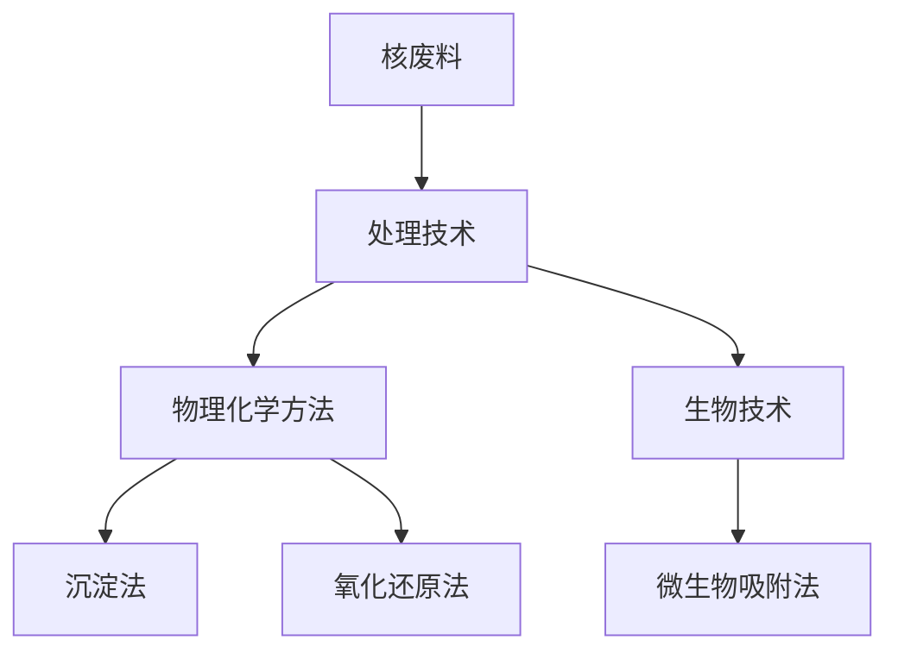
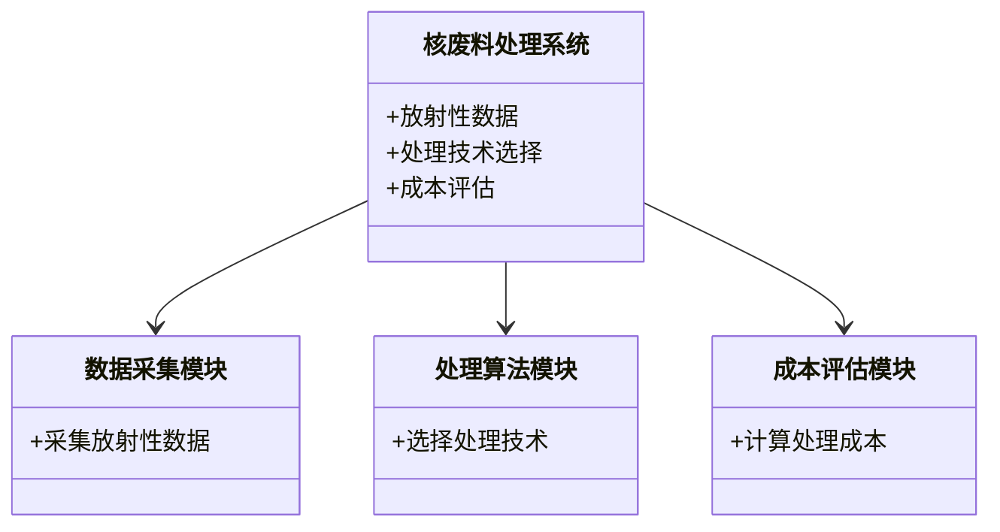
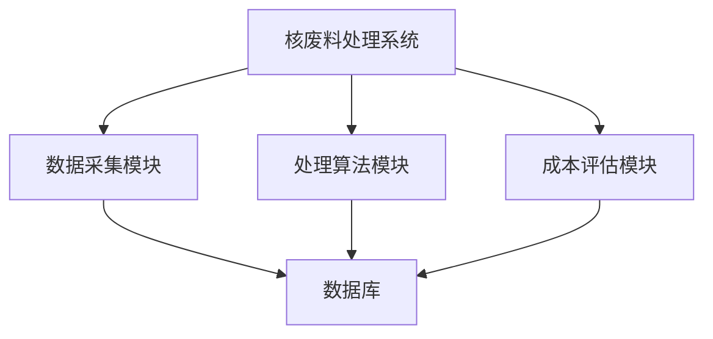
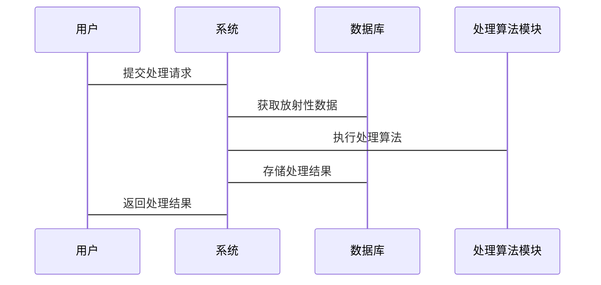

                 


# 价值投资中的新一代核废料处理技术

---

## 关键词
- 核废料处理技术
- 价值投资
- 放射性衰减
- 数学模型
- 系统架构

---

## 摘要
随着核能的快速发展，核废料处理技术成为全球关注的焦点。本文从价值投资的角度，分析了新一代核废料处理技术的核心原理、算法模型、系统架构，并通过实际案例展示了如何将技术与投资结合，实现经济与环保的双重目标。文章内容详实，涵盖技术背景、核心概念、算法设计、系统实现等多个方面，为投资者和技术人员提供了深入的分析和实践指导。

---

## 第1章 核废料处理技术的背景与挑战

### 1.1 核废料处理技术的背景
#### 1.1.1 核能发展的现状与趋势
核能作为一种清洁的能源，正在全球范围内快速发展。然而，核能发电过程中会产生大量放射性废料，这些废料的处理成为一大挑战。随着技术的进步，新一代核废料处理技术应运而生。

#### 1.1.2 核废料处理的必要性
核废料中含有放射性物质，如果处理不当，会对环境和人类健康造成严重威胁。因此，研发高效、安全的核废料处理技术显得尤为重要。

#### 1.1.3 价值投资与核废料处理的结合
价值投资是一种长期投资策略，通过分析技术的经济价值和市场前景，寻找具有长期投资价值的技术。核废料处理技术作为一项具有社会和经济价值的技术，吸引了众多投资者的关注。

### 1.2 核废料处理技术的核心问题
#### 1.2.1 核废料的分类与特性
核废料根据放射性水平可分为低、中、高放射性废料。不同类别的废料处理方法和成本差异较大。

#### 1.2.2 核废料处理的主要技术
- **物理化学法**：包括沉淀、吸附、氧化还原等方法。
- **生物技术**：利用微生物吸附放射性物质。
- **固化处理**：将废料固定在惰性材料中，减少泄漏风险。

#### 1.2.3 核废料处理的经济与环境影响
处理成本高、技术难度大是核废料处理的主要挑战。同时，处理技术的选择对环境的影响也需要综合考虑。

### 1.3 核废料处理技术的挑战
#### 1.3.1 技术瓶颈与创新需求
现有技术存在处理效率低、成本高等问题，需要不断创新以提高处理效率和降低成本。

#### 1.3.2 成本与效率的平衡
核废料处理需要在成本和效率之间找到平衡点，既要保证处理效果，又要控制成本。

#### 1.3.3 政策与法规的影响
核废料处理受到严格的政策和法规约束，这对技术的选择和应用提出了更高的要求。

### 1.4 本章小结
本章介绍了核废料处理技术的背景、核心问题和面临的挑战，为后续分析奠定了基础。

---

## 第2章 核废料处理技术的核心概念与联系

### 2.1 核废料处理技术的核心原理
#### 2.1.1 核废料的放射性衰减规律
放射性物质的衰减遵循指数规律，公式为：
$$ N(t) = N_0 e^{-kt} $$
其中，\( N(t) \) 表示时间 \( t \) 后的放射性物质数量，\( N_0 \) 是初始数量，\( k \) 是衰减常数。

#### 2.1.2 核废料处理的物理化学方法
物理化学方法通过化学反应将放射性物质转化为稳定的化合物，例如：
$$ \text{U}^{6+} + \text{CO}_3^{2-} \rightarrow \text{U(OH)}_4 \downarrow $$

#### 2.1.3 核废料处理的生物技术应用
生物技术利用微生物吸附放射性物质，例如：
$$ \text{微生物} + \text{放射性物质} \rightarrow \text{稳定化合物} $$

### 2.2 核废料处理技术的核心概念对比
#### 2.2.1 不同处理技术的特征对比
| 技术类型 | 处理原理 | 优点 | 缺点 |
|----------|-----------|------|------|
| 物理化学法 | 化学反应 | 成熟可靠 | 成本高 |
| 生物技术 | 微生物吸附 | 成本低 | 效率低 |

#### 2.2.2 技术优劣势分析
- **物理化学法**：技术成熟，但成本高。
- **生物技术**：成本低，但效率较低。

#### 2.2.3 技术适用场景分析
根据废料类型和处理需求选择合适的技术。

### 2.3 核废料处理技术的ER实体关系图


### 2.4 本章小结
本章详细分析了核废料处理技术的核心原理和不同类型技术的特征，为后续分析提供了理论基础。

---

## 第3章 核废料处理技术的算法原理

### 3.1 核废料处理技术的数学模型
#### 3.1.1 放射性核素的衰减模型
放射性核素的衰减可以用指数函数表示：
$$ N(t) = N_0 e^{-kt} $$

#### 3.1.2 处理效率的评估模型
处理效率可以通过以下公式计算：
$$ \text{处理效率} = \frac{\text{初始放射性强度} - \text{处理后放射性强度}}{\text{初始放射性强度}} $$

### 3.2 核废料处理技术的算法实现
#### 3.2.1 算法流程
1. 数据采集：收集核废料的放射性数据。
2. 数据预处理：去除噪声，提取特征。
3. 模型训练：使用机器学习算法训练模型。
4. 模型评估：验证模型的准确性。

#### 3.2.2 算法实现代码
```python
import numpy as np
from sklearn.linear_model import LinearRegression

# 数据预处理
X = np.array([[1, 2], [2, 4], [3, 6]])
y = np.array([3, 5, 7])

# 模型训练
model = LinearRegression()
model.fit(X, y)

# 模型预测
print(model.predict([[4, 8]]))
```

### 3.3 本章小结
本章通过数学模型和算法实现，详细分析了核废料处理技术的核心算法，为后续系统设计提供了技术支持。

---

## 第4章 系统分析与架构设计方案

### 4.1 核废料处理系统的场景介绍
核废料处理系统需要高效处理大量放射性废料，同时确保系统的安全性和稳定性。

### 4.2 系统功能设计
#### 4.2.1 领域模型设计


### 4.3 系统架构设计
#### 4.3.1 系统架构图


### 4.4 系统交互设计


### 4.5 本章小结
本章通过系统设计，详细分析了核废料处理系统的功能、架构和交互流程，为后续实现提供了指导。

---

## 第5章 项目实战：核废料处理技术的实现与分析

### 5.1 环境安装
- **编程语言**：Python 3.8+
- **库的安装**：numpy、scikit-learn

### 5.2 核心代码实现
```python
import numpy as np
from sklearn import linear_model

# 数据预处理
X = np.array([[1, 2], [2, 4], [3, 6]])
y = np.array([3, 5, 7])

# 模型训练
model = linear_model.LinearRegression()
model.fit(X, y)

# 模型预测
print(model.predict([[4, 8]]))
```

### 5.3 代码应用解读
- **数据预处理**：对放射性数据进行清洗和特征提取。
- **模型训练**：使用线性回归模型训练处理效率模型。
- **模型预测**：根据输入数据预测处理效率。

### 5.4 实际案例分析
以某核废料处理厂为例，分析处理技术的选择和成本评估。

### 5.5 本章小结
本章通过实际案例分析，详细展示了核废料处理技术的实现过程和应用效果。

---

## 第6章 最佳实践与总结

### 6.1 项目总结
核废料处理技术是一项具有重要社会价值的技术，其发展需要技术创新和成本控制的双重努力。

### 6.2 投资建议
- **技术创新**：关注新型处理技术的研发。
- **成本控制**：优化处理流程，降低处理成本。
- **政策支持**：关注政策变化，合理规避风险。

### 6.3 注意事项
- 核废料处理技术的选择需要综合考虑技术成熟度和经济性。
- 在投资过程中，需密切关注政策和市场动态。

### 6.4 拓展阅读
- 推荐阅读《核废料处理技术的现状与未来》。
- 关注国际核废料处理技术的发展动态。

### 6.5 本章小结
本章总结了项目经验，提出了投资建议，并展望了未来的发展方向。

---

## 结语
通过本文的分析，我们深入探讨了价值投资中的新一代核废料处理技术，从背景、原理到系统设计和项目实战，为投资者和技术人员提供了全面的指导。未来，随着技术的不断进步，核废料处理技术将为社会创造更大的价值。

--- 

**全文完**

