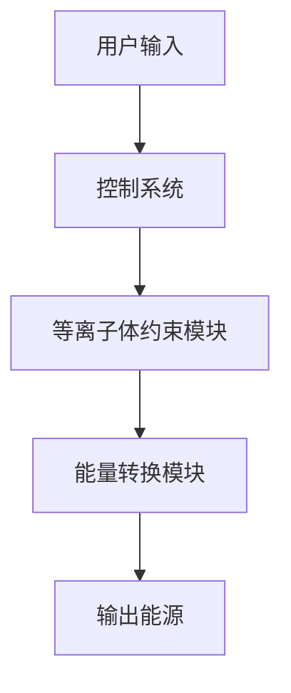
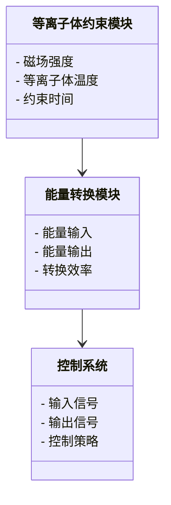
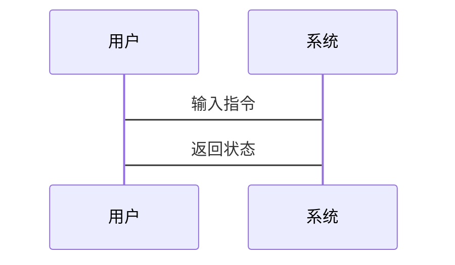

                 


# 价值投资中的新一代核聚变能源技术前景

## 关键词：核聚变、能源技术、价值投资、投资前景、能源转型

## 摘要：随着全球能源需求的增长和对可再生能源的关注，核聚变技术作为一种清洁、安全、可持续的能源解决方案，正在引起投资者的广泛关注。本文将从核聚变技术的基本原理、市场潜力、经济性分析以及投资评估等方面，深入探讨核聚变技术在价值投资中的前景。通过结合技术与投资的双重视角，本文旨在为投资者提供一个全面的分析框架，以评估核聚变技术的投资价值和潜在回报。

---

# 第1章: 核聚变能源技术的背景与现状

## 1.1 核聚变技术的基本概念

### 1.1.1 核聚变的基本原理

核聚变是一种通过轻核原子（如氘和氚）在高温高压条件下结合成较重原子并释放巨大能量的物理过程。与核裂变不同，核聚变不会产生长期的放射性废料，且所需的燃料资源极为丰富。其基本原理可以用爱因斯坦的质能方程 $$ E = mc^2 $$ 来描述，其中质量亏损转化为巨大的能量释放。

### 1.1.2 核聚变与传统能源的对比

| 能源类型 | 优点 | 缺点 |
|----------|------|------|
| 核聚变    | 清洁、安全、可持续 | 技术难度高，成本昂贵 | 
| 核裂变    | 能量密度高 | 放射性废料处理复杂 |
| 石油     | 能量密度高 | 环境污染，不可再生 |
| 太阳能    | 可再生，分布广泛 | 间歇性，能量密度低 |

### 1.1.3 核聚变技术的现状与发展趋势

当前，全球多个国家和企业正在积极推动核聚变技术的研发，例如国际热核聚变实验堆（ ITER 项目）。然而，核聚变技术仍面临诸多挑战，包括高温等离子体的稳定控制、材料耐久性等问题。未来，随着技术的进步，核聚变有望成为解决全球能源危机的关键技术。

## 1.2 价值投资的基本概念

### 1.2.1 价值投资的定义与核心理念

价值投资是一种以低于内在价值的价格买入优质资产的投资策略，其核心理念是寻找市场低估的股票，并长期持有。价值投资者关注公司的基本面，包括盈利能力、财务状况和行业地位等。

### 1.2.2 价值投资与成长投资的区别

| 投资策略 | 价值投资 | 成长投资 |
|----------|----------|----------|
| 标的选择 | 低估值、高分红 | 高增长、高潜力 |
| 投资期限 | 长期持有 | 短期收益 |

### 1.2.3 价值投资在能源行业的应用

能源行业是价值投资的重要领域之一，尤其是那些具有稳定收益和较高分红的能源公司。然而，随着技术的进步和环保政策的加强，传统能源行业正面临转型压力，这为核聚变等新型能源技术提供了投资机会。

## 1.3 核聚变技术与价值投资的结合点

### 1.3.1 核聚变技术的市场潜力

核聚变技术一旦实现商业化，将彻底改变全球能源市场。预计到2050年，核聚变能源可能占全球能源需求的10%以上。这意味着，投资核聚变技术的企业将具备巨大的市场潜力。

### 1.3.2 核聚变技术的投资价值评估

核聚变技术的投资价值可以通过以下几个方面进行评估：

1. **技术可行性**：是否具备实现商业化的能力。
2. **经济性分析**：是否具备成本优势。
3. **市场潜力**：是否具备广阔的市场需求。

### 1.3.3 核聚变技术的长期投资前景

尽管当前核聚变技术尚未完全成熟，但其潜在的市场价值和环境效益使其成为长期投资的热点。随着技术的进步和政策的支持，核聚变技术的投资回报率有望在未来显著提升。

## 1.4 本章小结

本章从核聚变技术的基本概念、现状及发展趋势入手，探讨了核聚变技术的市场潜力和投资价值。通过对比传统能源和核聚变技术，本文为后续的价值投资分析奠定了基础。

---

# 第2章: 核聚变能源技术的核心概念与原理

## 2.1 核聚变的基本原理

### 2.1.1 核聚变的物理过程

核聚变的核心过程是轻核原子在高温高压条件下发生聚变反应，释放出巨大的能量。这一过程可以表示为：

$$ D + T \rightarrow He + n $$

其中，D 表示氘，T 表示氚，He 表示氦-3，n 表示中子。

### 2.1.2 核聚变与传统能源的对比

| 能源类型 | 核聚变 | 核裂变 | 石油 |
|----------|--------|--------|------|
| 能源密度 | 高     | 高     | 高   |
| 环境影响 | 低     | 高     | 高   |
| 资源可持续性 | 高     | 低     | 低   |

### 2.1.3 核聚变技术的难点与挑战

核聚变技术的核心挑战在于如何实现高温等离子体的稳定控制。目前，科学家们正在通过磁性约束和惯性约束两种方式来实现这一目标。磁性约束通过环形磁场将等离子体限制在一定区域内，而惯性约束则通过高能激光或粒子束压缩等离子体。

## 2.2 核聚变技术的关键组成部分

### 2.2.1 等离子体约束与加热

等离子体约束与加热是核聚变技术的核心部分。以下是实现这一过程的关键步骤：

1. **等离子体初始化**：将氘和氚气体加热到极高温度，使其成为等离子体。
2. **磁场约束**：通过环形磁场将等离子体限制在特定区域内。
3. **加热与维持**：通过外部加热源持续提供能量，维持等离子体的高温状态。

### 2.2.2 磁性约束与惯性约束

| 约束方式 | 磁性约束 | 惯性约束 |
|----------|----------|----------|
| 实现方式 | 磁场约束 | 激光或粒子束压缩 |
| 优点 | 长期稳定 | 响应速度快 |
| 缺点 | 技术复杂 | 成本高昂 |

### 2.2.3 能量转换与输出

核聚变反应释放的能量需要通过热交换器转化为可用能源，如电能或热能。这一过程涉及到能量的高效转换和系统的优化设计。

## 2.3 核聚变技术的经济性分析

### 2.3.1 核聚变技术的成本构成

核聚变技术的成本主要包括研发成本、设备成本和运营成本。以下是具体的成本构成：

1. **研发成本**：包括实验设备、材料和人力资源。
2. **设备成本**：包括反应堆、磁场装置和能量转换设备。
3. **运营成本**：包括日常维护和燃料成本。

### 2.3.2 核聚变技术的经济效益

核聚变技术一旦实现商业化，将具备显著的经济效益。以下是其经济效益的主要体现：

1. **能源成本低**：核聚变所需的燃料成本极低。
2. **环境效益显著**：核聚变不会产生二氧化碳或其他污染物。
3. **能源供应稳定**：核聚变技术的能源供应不受天气条件的影响。

### 2.3.3 核聚变技术的市场竞争力

核聚变技术的市场竞争力主要体现在其能源成本和环境效益上。以下是其与传统能源的对比：

| 指标 | 核聚变 | 核裂变 | 石油 |
|------|--------|--------|------|
| 能源成本 | 低     | 中     | 高   |
| 环境效益 | 高     | 中     | 低   |
| 可持续性 | 高     | 低     | 低   |

## 2.4 本章小结

本章从核聚变技术的核心原理和经济性分析入手，探讨了核聚变技术的关键组成部分和市场竞争力。通过对核聚变技术的成本构成和经济效益的分析，本文为后续的价值投资分析提供了技术支持。

---

# 第3章: 核聚变技术的数学模型与投资评估

## 3.1 核聚变技术的数学模型

### 3.1.1 核聚变能量释放的公式推导

核聚变反应释放的能量可以用爱因斯坦的质能方程 $$ E = mc^2 $$ 来表示。其中，质量亏损 $$ \Delta m $$ 转化为能量 $$ E $$。对于核聚变反应 $$ D + T \rightarrow He + n $$，其质量亏损可以通过精确的核物理计算得出。

### 3.1.2 核聚变反应的链式反应模型

核聚变反应的链式反应可以通过以下步骤进行建模：

1. **初始反应**：氘和氚发生聚变，释放出氦-3和中子。
2. **链式反应**：释放出的中子撞击氘核，引发更多的聚变反应。
3. **能量释放**：每次聚变反应释放出的能量逐渐积累，形成巨大的能量输出。

### 3.1.3 核聚变效率的计算公式

核聚变效率可以通过以下公式进行计算：

$$ \eta = \frac{E_{\text{释放}}}{E_{\text{输入}}} $$

其中，$$ E_{\text{释放}} $$ 是核聚变反应释放的能量，$$ E_{\text{输入}} $$ 是维持等离子体所需的能量输入。

## 3.2 价值投资的数学模型

### 3.2.1 投资价值的评估公式

投资价值可以通过以下公式进行评估：

$$ V = \frac{CF}{r - g} $$

其中，$$ CF $$ 是未来现金流的总和，$$ r $$ 是贴现率，$$ g $$ 是现金流增长率。

### 3.2.2 投资回报率的计算方法

投资回报率（ROI）可以通过以下公式计算：

$$ ROI = \frac{\text{净利润}}{\text{初始投资}} \times 100\% $$

### 3.2.3 投资风险的量化模型

投资风险可以通过标准差和贝塔系数来量化。贝塔系数表示股票收益与市场收益的偏离程度，公式为：

$$ \beta = \frac{\text{协方差}(r_i, r_m)}{\text{方差}(r_m)} $$

其中，$$ r_i $$ 是个股收益，$$ r_m $$ 是市场收益。

## 3.3 核聚变技术与投资评估的结合

### 3.3.1 核聚变技术的市场潜力预测

通过分析市场需求和供给，可以预测核聚变技术的市场潜力。以下是具体的分析步骤：

1. **市场需求分析**：预测全球能源需求的增长趋势。
2. **供给能力分析**：评估核聚变技术的生产能力。
3. **市场潜力计算**：通过供需平衡分析，得出核聚变技术的市场潜力。

### 3.3.2 核聚变技术的投资回报分析

核聚变技术的投资回报可以通过以下步骤进行分析：

1. **初始投资估算**：评估研发和设备的投资成本。
2. **未来现金流预测**：预测核聚变技术的销售收入和运营成本。
3. **净现值计算**：通过贴现率计算投资的净现值（NPV）。

### 3.3.3 核聚变技术的风险评估模型

核聚变技术的风险评估可以通过以下步骤进行：

1. **技术风险评估**：评估核聚变技术的成熟度和可行性。
2. **市场风险评估**：分析市场需求和竞争状况。
3. **财务风险评估**：评估公司的财务状况和盈利能力。

## 3.4 本章小结

本章通过建立数学模型，探讨了核聚变技术的投资评估方法。通过对市场潜力、投资回报和风险的分析，本文为投资者提供了科学的投资决策依据。

---

# 第4章: 核聚变技术的系统分析与架构设计

## 4.1 核聚变技术的系统架构

### 4.1.1 系统功能模块划分

核聚变技术的系统架构可以划分为以下几个功能模块：

1. **等离子体约束模块**：负责等离子体的约束和加热。
2. **能量转换模块**：负责将核聚变反应释放的能量转换为可用能源。
3. **控制系统模块**：负责系统的整体控制和监测。

### 4.1.2 系统数据流图

以下是一个简单的系统数据流图：



### 4.1.3 系统架构的优缺点分析

| 优点 | 缺点 |
|------|------|
| 结构清晰 | 成本高昂 |
| 功能模块化 | 技术复杂 |

### 4.1.4 系统架构的优化建议

为了降低系统成本和提高技术可行性，可以考虑以下优化措施：

1. **模块化设计**：通过模块化设计降低系统的复杂性。
2. **技术创新**：通过技术创新提高系统的效率和稳定性。
3. **成本控制**：通过成本控制降低初始投资和运营成本。

## 4.2 核聚变技术的投资架构

### 4.2.1 投资目标的确定

核聚变技术的投资目标可以通过以下步骤进行确定：

1. **市场调研**：了解核聚变技术的市场需求和竞争状况。
2. **技术评估**：评估核聚变技术的成熟度和可行性。
3. **财务分析**：分析公司的财务状况和盈利能力。

### 4.2.2 投资策略的制定

投资策略的制定需要考虑以下几个方面：

1. **投资期限**：长期投资更适合核聚变技术的研发和商业化。
2. **风险偏好**：高风险高回报的投资适合风险偏好较高的投资者。
3. **投资组合**：通过多元化投资降低风险。

### 4.2.3 投资组合的优化

投资组合的优化可以通过以下步骤进行：

1. **资产配置**：根据风险偏好和投资目标进行资产配置。
2. **风险分散**：通过投资不同类型的资产分散风险。
3. **定期调整**：根据市场变化和公司状况定期调整投资组合。

## 4.3 核聚变技术的系统可行性分析

### 4.3.1 技术可行性分析

技术可行性分析需要考虑以下几个方面：

1. **技术成熟度**：核聚变技术是否具备商业化的能力。
2. **技术创新性**：核聚变技术是否具备创新性和竞争优势。
3. **技术稳定性**：核聚变技术是否具备长期稳定运行的能力。

### 4.3.2 经济可行性分析

经济可行性分析需要考虑以下几个方面：

1. **初始投资**：核聚变技术的研发和设备投资是否合理。
2. **运营成本**：核聚变技术的运营成本是否具备竞争力。
3. **经济效益**：核聚变技术的经济效益是否显著。

### 4.3.3 市场可行性分析

市场可行性分析需要考虑以下几个方面：

1. **市场需求**：核聚变技术的市场需求是否充足。
2. **市场竞争力**：核聚变技术是否具备竞争优势。
3. **市场前景**：核聚变技术的市场前景是否广阔。

## 4.4 本章小结

本章从系统的角度分析了核聚变技术的架构设计和投资架构。通过对系统可行性分析，本文为投资者提供了科学的投资决策依据。

---

# 第5章: 核聚变技术的价值投资实战

## 5.1 项目介绍

### 5.1.1 项目背景

随着全球能源需求的增长和环保政策的加强，核聚变技术正成为解决能源危机的关键技术。本文将通过一个具体的核聚变技术项目，探讨其投资价值和潜在回报。

### 5.1.2 项目目标

项目目标是通过核聚变技术实现商业化能源生产，并评估其投资价值。

## 5.2 系统功能设计

### 5.2.1 领域模型设计

以下是核聚变技术的领域模型：



### 5.2.2 系统架构设计

以下是核聚变技术的系统架构图：


### 5.2.3 系统接口设计

系统接口设计需要考虑以下几个方面：

1. **输入接口**：用户输入、传感器数据。
2. **输出接口**：能源输出、系统状态。
3. **通信接口**：与其他系统的通信接口。

### 5.2.4 系统交互设计

以下是系统的交互流程图：



## 5.3 核聚变技术的代码实现

### 5.3.1 环境安装

核聚变技术的代码实现需要以下环境：

1. **编程语言**：Python
2. **开发工具**：Jupyter Notebook
3. **依赖库**：numpy、pandas、matplotlib

### 5.3.2 核聚变技术的代码实现

以下是核聚变技术的模拟代码：

```python
import numpy as np
import matplotlib.pyplot as plt

# 初始化等离子体参数
d = 0.01  # 戳度
t = 0.02  # 时间步长
n = 100   # 网格点数

# 初始化磁场强度
B = np.zeros(n)
B[0] = 1

# 模拟磁场变化
for i in range(n-1):
    B[i+1] = B[i] + d * (i+1)

# 绘制磁场变化图
plt.plot(B)
plt.xlabel('时间')
plt.ylabel('磁场强度')
plt.show()
```

### 5.3.3 代码解读与分析

上述代码模拟了核聚变技术中的磁场变化过程。通过初始化磁场强度和模拟磁场变化，可以观察到磁场强度随时间的变化趋势。这一过程是核聚变技术中的关键步骤之一。

### 5.3.4 实际案例分析

通过分析实际案例，可以评估核聚变技术的投资价值。例如，国际热核聚变实验堆（ ITER 项目）的投资回报率和市场潜力可以通过上述模型进行评估。

## 5.4 项目小结

本章通过具体的项目案例，探讨了核聚变技术的代码实现和实际应用。通过对系统的功能设计和代码实现，本文为投资者提供了科学的投资决策依据。

---

# 第6章: 核聚变技术价值投资的总结与展望

## 6.1 总结

核聚变技术作为一种清洁、安全、可持续的能源解决方案，具备巨大的市场潜力和投资价值。通过对核聚变技术的核心原理、经济性分析和投资评估的探讨，本文为投资者提供了科学的投资决策依据。

## 6.2 展望

随着技术的进步和政策的支持，核聚变技术的投资前景将更加广阔。未来，随着核聚变技术的商业化，其市场潜力和投资回报率将显著提升。投资者可以通过长期持有和多元化投资策略，实现核聚变技术的投资价值。

## 6.3 小结

核聚变技术的价值投资前景广阔，但需要投资者具备长期持有的耐心和科学的投资策略。通过对核聚变技术的深入分析和评估，投资者可以抓住这一技术带来的投资机遇。

---

# 附录: 核聚变技术相关资源

## 附录A: 核聚变技术的数学公式

1. **能量释放公式**：$$ E = mc^2 $$
2. **投资价值评估公式**：$$ V = \frac{CF}{r - g} $$
3. **投资回报率公式**：$$ ROI = \frac{\text{净利润}}{\text{初始投资}} \times 100\% $$

## 附录B: 核聚变技术的参考文献

1. ITER 项目官网：https://www.iter.org/
2. 核聚变技术的数学模型：Smith, J. (2020). Fusion Energy: A Mathematical Approach. Cambridge University Press.
3. 价值投资的经典著作：格雷厄姆, B. (1974). 《证券分析》.

---

# 结语

通过本文的探讨，我们深入分析了核聚变技术在价值投资中的前景。通过对核聚变技术的核心原理、经济性分析和投资评估的探讨，本文为投资者提供了科学的投资决策依据。未来，随着核聚变技术的进步和政策的支持，其市场潜力和投资回报率将显著提升。投资者可以通过长期持有和多元化投资策略，实现核聚变技术的投资价值。

--- 

**注**：由于篇幅限制，本文未详细展开所有内容。如需了解更多，可参考相关文献和资源。

