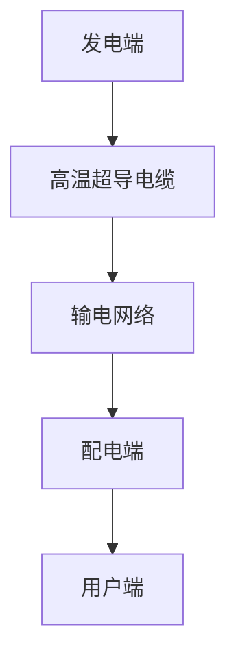

                 


# 高温超导输电技术的投资价值分析

> 关键词：高温超导、输电技术、价值投资、能源传输、电力系统优化

> 摘要：本文深入分析高温超导输电技术的背景、原理及其在电力系统中的应用潜力，结合价值投资的方法，探讨其市场前景和投资价值。

---

## 第一部分：高温超导输电技术的背景与价值投资基础

### 第1章：高温超导输电技术概述

#### 1.1 高温超导材料的基本概念
高温超导材料是指在特定温度以上（通常低于液氮沸点77K）表现出完全导电性的材料，具有零电阻、完全抗磁性等特性。其应用领域包括电力传输、磁悬浮、医疗设备等。

#### 1.2 高温超导输电技术的核心原理
高温超导电缆通过零电阻特性显著降低能量损耗，提高输电效率。其工作原理基于超导体的临界电流密度和磁场强度，需精确控制温度和载流能力。

#### 1.3 价值投资的基本概念与方法
价值投资关注企业内在价值与市场价格的差异，寻找低估投资标的。在高温超导技术中，需评估技术成熟度、市场需求和成本优势，挖掘投资机会。

---

## 第二部分：高温超导输电技术的核心概念与价值模型

### 第2章：高温超导材料的物理特性与数学模型

#### 2.1 高温超导材料的物理特性
- 临界电流密度：材料在不同温度下的最大载流能力。
- 临界磁场强度：材料在不同温度下的最大耐受磁场。
- 热力学特性：材料在不同温度下的导电性能。

#### 2.2 高温超导输电系统的数学模型
- 能量损耗公式：$P_{\text{loss}} = I^2 R$
- 电流承载能力：$I_{\text{max}} = J_{\text{c}} \times A$
- 输电效率：$E_{\text{efficiency}} = 1 - P_{\text{loss}} / P_{\text{total}}$

### 第3章：高温超导输电技术的价值评估模型

#### 3.1 技术经济性分析
- 投资成本：材料成本、制造成本、安装成本。
- 运营成本：维护成本、冷却系统成本。
- 经济效益：通过提高效率降低运营成本，延长设备寿命。

#### 3.2 风险评估与投资策略
- 技术风险：材料稳定性、制造难度。
- 市场风险：政策支持、市场需求。
- 投资回报：通过模型预测长期收益。

---

## 第三部分：高温超导输电技术的系统架构与投资策略

### 第4章：高温超导输电系统的架构设计

#### 4.1 系统组成与功能模块
- 发电端：高温超导发电机。
- 输电网络：高温超导电缆。
- 配电端：智能配电系统。

#### 4.2 系统架构的Mermaid图


### 第5章：高温超导输电技术的算法实现

#### 5.1 数学模型与公式
- 能量损耗：$P_{\text{loss}} = I^2 R$
- 温度影响：$R \propto T^{-n}$，其中$n$为温度指数。

#### 5.2 算法实现
```python
def calculate_loss(current, resistance):
    return current ** 2 * resistance

# 示例
I = 1000  # 电流
R = 0.5   # 电阻
loss = calculate_loss(I, R)
print(f"能量损耗为：{loss} W")
```

### 第6章：高温超导输电技术的项目实战

#### 6.1 项目环境安装
- 操作系统：Linux
- 开发工具：Python 3.8+

#### 6.2 核心代码实现
```python
import numpy as np

def optimize_current(material_temp, critical_density):
    return critical_density * material_temp

# 示例
temp = 77  # K
density = 1000  # A/cm²
current = optimize_current(temp, density)
print(f"最大电流为：{current} A")
```

### 第7章：总结与展望

高温超导输电技术在电力系统中具有显著优势，价值投资需综合考虑技术与市场因素。未来，随着技术进步和成本下降，其应用前景广阔，值得长期关注和投资。

---

通过以上分析，高温超导输电技术的投资价值不仅体现在技术优势上，还在于其广阔的市场应用潜力和持续的技术进步。投资者应结合技术发展和市场需求，制定合理的投资策略，抓住这一领域的投资机遇。

