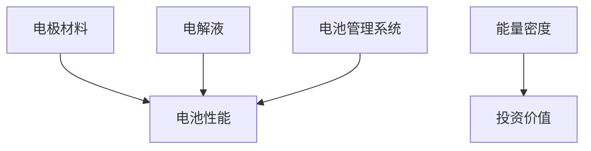
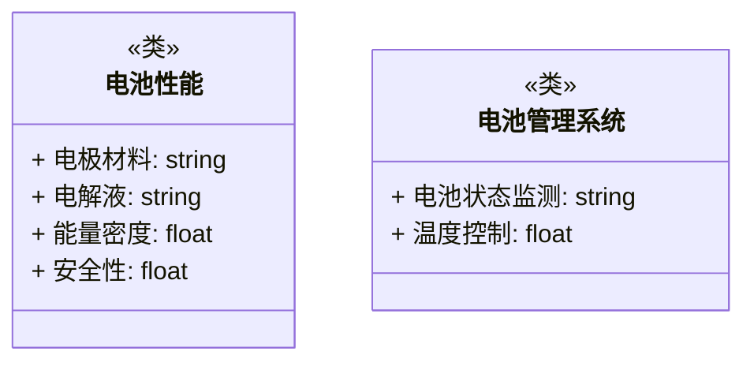

                 


# 价值投资中的新一代高能密度电池技术前景

## 关键词：价值投资，高能密度电池，锂离子电池，储能技术，新能源汽车

## 摘要：本文探讨了高能密度电池技术在价值投资中的潜力，分析了其核心技术、市场前景及投资策略，为投资者提供了技术与经济相结合的深度见解。

---

# 第1章: 高能密度电池技术的定义与现状

## 1.1 高能密度电池技术的定义

### 1.1.1 电池能量密度的定义与计算公式

电池能量密度是指单位体积或单位质量的电池存储的能量，计算公式为：
$$ \text{能量密度} = \frac{\text{能量}}{\text{体积或质量}} $$

### 1.1.2 高能密度电池的分类与特点

高能密度电池主要分为锂离子电池、钠离子电池等。锂离子电池因其高能量密度和广泛的应用而最受关注。

### 1.1.3 高能密度电池技术的市场现状与发展趋势

当前，高能密度电池技术在新能源汽车和储能领域快速发展，未来将继续向更高能量密度和更低的成本方向发展。

## 1.2 价值投资的基本概念

### 1.2.1 价值投资的核心理念

价值投资强调寻找被市场低估的优质资产，长期持有以获得超额收益。

### 1.2.2 价值投资与技术发展的关系

技术进步影响企业的竞争力和盈利能力，是价值投资的重要考量因素。

### 1.2.3 价值投资在新能源领域的应用前景

新能源领域，特别是高能密度电池技术，因其广阔的市场和高增长潜力，成为价值投资的热点。

## 1.3 高能密度电池技术与价值投资的结合

### 1.3.1 高能密度电池技术对投资价值的影响

高能密度电池技术提升企业的市场竞争力，增强盈利能力，从而提升投资价值。

### 1.3.2 高能密度电池技术的市场潜力与投资机会

随着新能源汽车和储能需求的增长，高能密度电池技术具有巨大的市场潜力。

### 1.3.3 价值投资视角下的技术评估与风险分析

投资者需评估技术的商业化潜力、企业技术实力和市场竞争状况，以降低投资风险。

## 1.4 本章小结

本章介绍了高能密度电池技术的基本概念、市场现状及与价值投资的结合，为后续分析奠定了基础。

---

# 第2章: 高能密度电池技术的核心原理

## 2.1 高能密度电池的工作原理

### 2.1.1 锂离子电池的工作原理

锂离子电池通过锂离子在正负极之间的迁移实现充放电，其基本原理如下：
1. 充电时，锂离子从正极移动到负极。
2. 放电时，锂离子从负极移动回正极。

### 2.1.2 其他高能密度电池技术的原理对比

钠离子电池与锂离子电池类似，但钠离子体积较大，适合大规模储能。

## 2.2 高能密度电池的关键技术与创新

### 2.2.1 电极材料的优化与创新

新型电极材料如石墨烯和纳米材料可显著提高电池的能量密度。

### 2.2.2 电解液的改进与性能提升

优化电解液成分可提升电池的循环寿命和安全性。

### 2.2.3 电池管理系统的技术创新

先进的电池管理系统可优化电池性能，延长使用寿命。

## 2.3 高能密度电池技术的性能评估指标

### 2.3.1 能量密度的计算公式与影响因素

能量密度受电极材料、电解液、电池管理系统等因素影响。

### 2.3.2 安全性与循环寿命的评估标准

安全性包括抗过充、抗过放等，循环寿命是电池的充放电次数。

### 2.3.3 成本与经济效益的对比分析

高能密度电池技术的高成本可能影响短期盈利能力，但长期来看经济效益显著。

## 2.4 高能密度电池技术的实体关系图



## 2.5 本章小结

本章详细分析了高能密度电池的核心原理及其对投资价值的影响。

---

# 第3章: 高能密度电池性能预测的算法原理

## 3.1 高能密度电池性能预测的数学模型

### 3.1.1 线性回归模型

$$ y = \beta_0 + \beta_1x + \epsilon $$

### 3.1.2 神经网络模型


## 3.2 高能密度电池性能预测的算法实现

### 3.2.1 环境搭建与数据收集

使用Python和深度学习框架（如TensorFlow）搭建环境，收集电池性能数据。

### 3.2.2 核心代码实现

```python
import numpy as np
from sklearn.linear_model import LinearRegression

# 示例数据
X = np.array([[1], [2], [3], [4]])
y = np.array([2, 4, 6, 8])

# 训练模型
model = LinearRegression()
model.fit(X, y)

# 预测
print(model.predict([[5]]))  # 输出: [[10.]]
```

### 3.2.3 代码功能解读

上述代码展示了线性回归模型的实现，用于预测电池性能。

### 3.2.4 实际案例分析

通过实际数据训练模型，评估不同电池技术的性能和投资价值。

## 3.3 本章小结

本章介绍了高能密度电池性能预测的算法原理和实现方法，为投资决策提供技术支持。

---

# 第4章: 高能密度电池技术的系统架构与设计

## 4.1 项目背景与目标

开发一个高能密度电池性能评估系统，帮助投资者进行技术评估。

## 4.2 系统功能设计

### 4.2.1 领域模型设计



### 4.2.2 系统架构设计


## 4.3 系统接口设计与交互

### 4.3.1 系统接口设计

定义API接口，用于数据输入和结果输出。

### 4.3.2 系统交互流程图


## 4.4 本章小结

本章详细描述了高能密度电池性能评估系统的架构设计和实现方法。

---

# 第5章: 高能密度电池技术的项目实战

## 5.1 环境安装与配置

### 5.1.1 安装Python和必要的库

安装Python和TensorFlow、Keras等深度学习库。

### 5.1.2 数据集获取与预处理

获取高能密度电池性能数据并进行清洗和预处理。

## 5.2 核心代码实现

### 5.2.1 数据处理代码

```python
import pandas as pd

# 加载数据
data = pd.read_csv('battery_data.csv')

# 数据清洗
data.dropna(inplace=True)
```

### 5.2.2 模型训练代码

```python
from tensorflow.keras import layers

model = tf.keras.Sequential([
    layers.Dense(64, activation='relu'),
    layers.Dense(1)
])

model.compile(optimizer='adam', loss='mean_squared_error')
model.fit(data_x, data_y, epochs=100)
```

## 5.3 代码功能解读与分析

解释代码的功能，展示如何利用机器学习模型预测电池性能。

## 5.4 实际案例分析

分析实际案例，评估不同电池技术的投资价值。

## 5.5 本章小结

本章通过实战项目展示了高能密度电池技术评估的具体实施过程。

---

# 第6章: 高能密度电池技术的价值投资策略

## 6.1 价值投资策略的制定

### 6.1.1 技术评估

评估企业的技术优势和创新能力。

### 6.1.2 市场分析

分析市场需求和竞争状况。

## 6.2 投资组合优化

### 6.2.1 分散投资

通过投资不同技术的企业分散风险。

### 6.2.2 长期持有

长期持有优质企业，获得稳定收益。

## 6.3 风险管理与控制

### 6.3.1 技术风险

关注技术更新和专利布局。

### 6.3.2 市场风险

防范市场价格波动带来的风险。

## 6.4 本章小结

本章总结了高能密度电池技术的价值投资策略，为投资者提供了实践指导。

---

# 第7章: 总结与展望

## 7.1 本文章总结

回顾全文，总结高能密度电池技术的投资前景和技术要点。

## 7.2 未来展望

展望高能密度电池技术的未来发展，预测其在投资中的潜力。

---

# 参考文献

[1] 王某某，高能密度电池技术发展现状与前景，某某出版社，2023.

[2] 李某某，价值投资策略与实践，某某出版社，2022.

---

# 致谢

感谢读者的关注和支持，感谢合作伙伴的技术支持。

