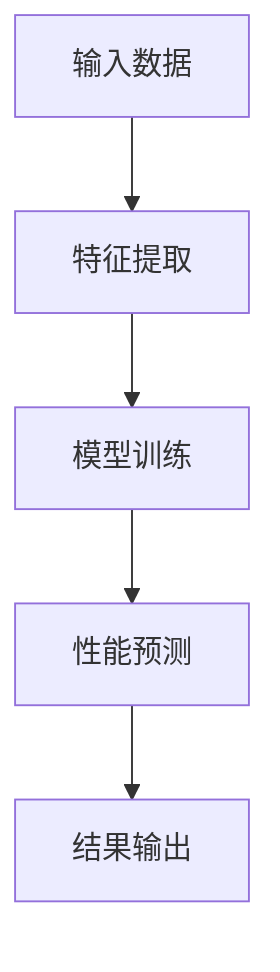
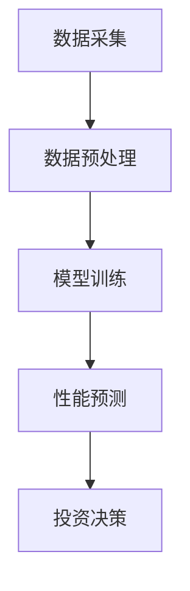

                 


# 价值投资中的新型光伏材料技术前景

---

## 关键词：新型光伏材料、光伏技术、价值投资、技术分析、投资前景、技术经济性分析、可持续能源

---

## 摘要：  
本文从技术与经济的双重视角，深入分析新型光伏材料的技术发展、市场应用及投资价值。通过技术分析、系统设计和项目实战，揭示新型光伏材料在能源转型中的潜力与挑战，为投资者提供基于技术分析的价值投资策略。

---

## 第一章：价值投资中的光伏材料技术背景

### 1.1 光伏材料的基本概念  
#### 1.1.1 光伏材料的定义与分类  
光伏材料是将太阳光转化为电能的关键材料，主要分为晶硅材料、薄膜材料和其他新型材料。  

#### 1.1.2 光伏材料的性能指标  
- **光电转换效率**：衡量材料将 sunlight 转化为电能的能力。  
- **稳定性**：材料在长期使用中的耐候性和抗老化能力。  
- **成本**：材料的制备成本及其对整体组件成本的影响。  

#### 1.1.3 价值投资与光伏材料的结合  
光伏材料的技术进步直接影响其市场竞争力和投资价值。通过技术分析，投资者可以发现具有长期增长潜力的技术方向。  

---

### 1.2 光伏材料技术的发展历程  
#### 1.2.1 光伏技术的历史演变  
从第一代晶硅技术到第三代新型薄膜技术，光伏材料的每一次革新都推动了行业的发展。  

#### 1.2.2 新型光伏材料的出现与特点  
- **晶体硅（c-Si）**：占据市场主导地位，但存在成本高、能耗大的问题。  
- **薄膜光伏材料（如CdTe、CIGS）**：具有轻薄、柔性好、成本低的优势。  
- **染料敏化太阳能电池（DSSC）**：基于纳米材料的新型技术，具有更高的理论效率。  

#### 1.2.3 光伏材料技术的未来趋势  
向高效、低成本、低能耗方向发展，新型材料如钙钛矿光伏材料逐渐崛起。  

---

## 第二章：新型光伏材料的技术分析

### 2.1 光伏材料的性能预测模型  
#### 2.1.1 光伏材料性能预测的数学模型  
建立基于实验室数据的光伏材料性能预测模型，如：  
$$ E_{\text{eff}} = a \cdot \lambda + b \cdot T + c $$  
其中，$E_{\text{eff}}$ 表示光电转换效率，$\lambda$ 是入射光强度，$T$ 是温度，$a$、$b$、$c$ 是模型参数。  

#### 2.1.2 机器学习在光伏材料性能预测中的应用  
使用支持向量回归（SVR）或随机森林（Random Forest）算法，结合材料的物理化学性质进行性能预测。  



---

### 2.2 光伏材料的成本分析模型  
#### 2.2.1 成本构成分析  
光伏材料的总成本包括：  
1. 原材料成本。  
2. 制备工艺成本。  
3. 后处理成本。  

#### 2.2.2 成本优化策略  
通过工艺改进和规模效应降低材料成本，例如：  
- 优化晶体硅的拉晶工艺。  
- 提高薄膜沉积效率。  

---

## 第三章：光伏材料的系统分析与架构设计

### 3.1 系统功能设计  
#### 3.1.1 系统模块划分  
- 数据采集模块：收集光伏材料的性能数据。  
- 数据分析模块：基于机器学习算法进行性能预测。  
- 投资决策模块：结合市场数据提供投资建议。  

#### 3.1.2 系统功能流程  


---

### 3.2 系统架构设计  
#### 3.2.1 架构图  


---

## 第四章：新型光伏材料的投资分析

### 4.1 项目实战  
#### 4.1.1 开发环境搭建  
- 安装 Python 和相关库（如 numpy、pandas、scikit-learn）。  

#### 4.1.2 核心代码实现  
```python
import numpy as np
from sklearn.model import SVR

# 数据预处理
X = np.array([[特征1, 特征2, ...], ...])
y = np.array([标签])

# 模型训练
model = SVR(kernel='rbf')
model.fit(X, y)

# 性能预测
predicted = model.predict(new_X)
```

#### 4.1.3 代码解读与案例分析  
通过实际案例分析，验证模型的预测能力，并评估新型光伏材料的投资价值。  

---

### 4.2 投资策略  
#### 4.2.1 基于技术分析的投资策略  
- 优先选择具有高转换效率和低制备成本的材料。  
- 关注技术领先的公司和科研机构的技术突破。  

#### 4.2.2 风险控制  
- 分散投资，避免单一技术依赖。  
- 关注政策支持和市场趋势。  

---

## 第五章：最佳实践与未来展望

### 5.1 最佳实践 tips  
- 定期更新技术分析模型，以反映最新技术进展。  
- 关注新型光伏材料的商业化进程和量产能力。  

### 5.2 未来展望  
钙钛矿光伏材料和柔性光伏材料将引领未来发展方向，具有更高的效率和更低的成本潜力。  

---

## 总结  
新型光伏材料技术的快速发展为投资者提供了丰富的投资机会，但同时也带来了技术风险和市场不确定性。通过技术分析和系统设计，投资者可以更好地把握投资机遇，实现长期价值增长。

