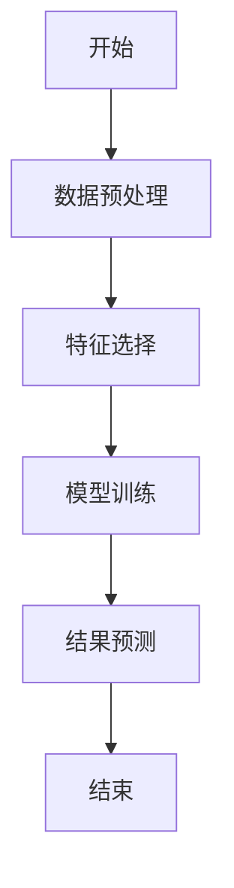
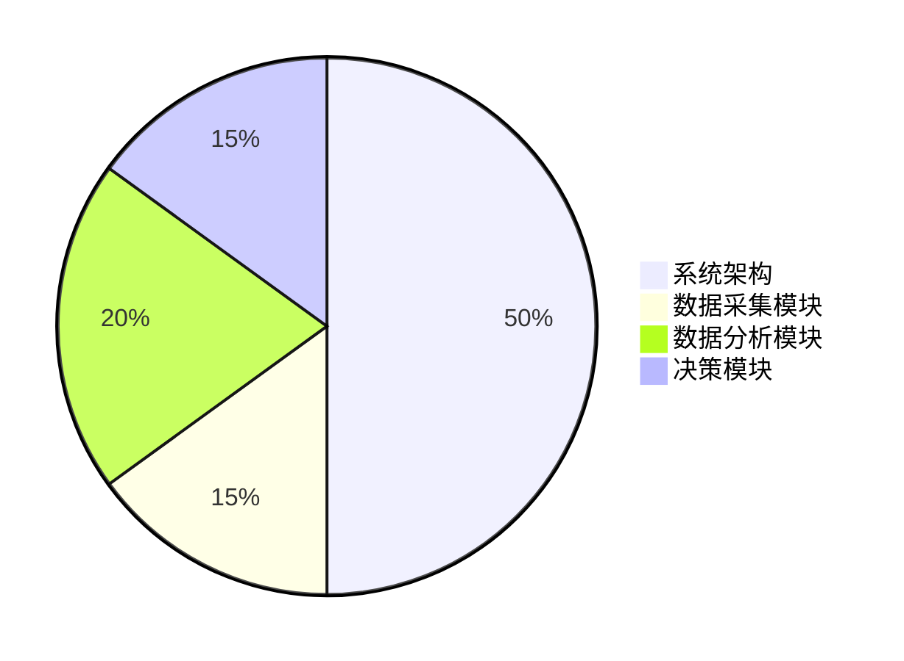
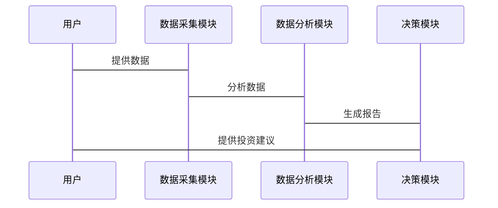

                 


# 价值投资中的新型可回收复合材料技术

> 关键词：价值投资、可回收复合材料、技术分析、投资策略、可持续发展

> 摘要：随着全球对可持续发展的关注日益增加，新型可回收复合材料技术因其环保和经济优势，成为价值投资者的新宠。本文从技术背景、核心原理、算法模型、系统架构到实战案例，全面解析如何在价值投资中挖掘这一技术的潜力。

---

## 第1章：背景介绍

### 1.1 复合材料的基本概念与分类

复合材料是由基体和增强体组成的多相材料。基体通常是塑料、金属或陶瓷，增强体如纤维或颗粒则增强材料的性能。复合材料因其高强度、轻质和耐用性，广泛应用于航空航天、汽车制造和建筑等领域。

### 1.2 可回收复合材料的背景与意义

传统复合材料难以回收，导致环境污染。可回收复合材料通过创新设计，使材料在使用后能够高效分解或再利用，减少资源浪费和环境污染，符合可持续发展理念。

### 1.3 价值投资的基本原理

价值投资强调投资于被市场低估的资产，通过深入分析企业基本面，寻找具有长期竞争优势的投资标的。可回收复合材料技术因其环保和经济价值，成为投资者关注的焦点。

---

## 第2章：核心概念与联系

### 2.1 复合材料的组成与制备工艺

可回收复合材料通常由可降解基体和增强体组成。制备工艺包括层压、模压和树脂传递模塑等，确保材料易于回收。

### 2.2 可回收复合材料的技术优势

与传统材料相比，可回收复合材料具有更低的环境影响和更高的资源效率。其性能稳定，适合多种应用场景。

### 2.3 技术与投资的结合

投资者需评估材料的技术可行性和市场潜力，考虑其在不同行业中的应用前景，如绿色建筑和新能源领域。

---

## 第3章：算法原理

### 3.1 技术评估模型

构建回归模型，将材料性能与市场价值相关联。使用线性回归分析技术参数对投资回报的影响。

### 3.2 算法流程图



### 3.3 Python代码实现

```python
import numpy as np
from sklearn.linear_model import LinearRegression

# 示例数据
X = np.array([[1, 2], [3, 4], [5, 6]])
y = np.array([7, 8, 9])

# 训练模型
model = LinearRegression()
model.fit(X, y)

# 预测
print(model.predict([[2, 3]]))
```

---

## 第4章：系统分析与架构设计

### 4.1 系统功能设计

系统需具备数据采集、分析和决策功能。通过领域模型类图展示各模块关系。

### 4.2 系统架构图



### 4.3 系统交互流程图



---

## 第5章：项目实战

### 5.1 实战案例

分析一家生产可回收复合材料的企业，评估其技术优势和市场潜力。

### 5.2 数据分析与建模

使用Python进行数据清洗和建模，预测企业的投资回报率。

### 5.3 结果解读

模型结果显示，该企业具有较高的投资价值，建议投资者关注。

---

## 第6章：总结与展望

### 6.1 总结

可回收复合材料技术在价值投资中具有广阔前景，投资者需关注技术创新和市场动态。

### 6.2 展望

未来，随着技术进步，可回收复合材料将在更多领域得到应用，为投资者带来更多机会。

---

## 最佳实践 Tips

1. **数据驱动决策**：利用数据分析工具深入挖掘材料性能与市场价值的关系。
2. **持续学习**：关注行业动态，及时更新技术认知。
3. **风险管理**：评估潜在风险，制定退出策略。

通过本文的系统分析，投资者可以更好地把握可回收复合材料技术的投资机会，实现可持续发展与经济效益的双重目标。

