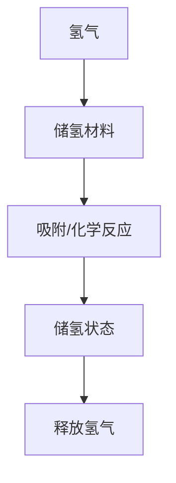
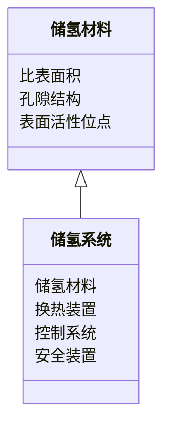
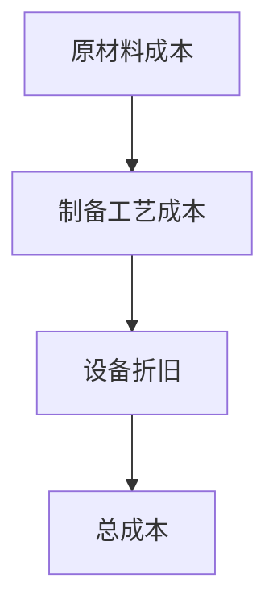
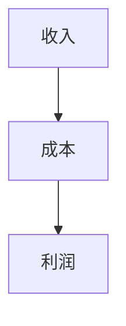

                 

# 《价值投资中的新型高效储氢材料技术前景》

---

## 关键词：
- 储氢材料，价值投资，储氢技术，储氢系统，储氢材料技术，储氢材料经济性

---

## 摘要：
本文深入探讨了新型高效储氢材料在技术与市场双重驱动下的发展现状、技术原理、经济性分析及投资价值。通过分析储氢材料的技术特性、市场应用潜力和投资回报率，本文为投资者提供了储氢材料领域的价值投资策略和未来发展趋势的洞察。结合技术背景、成本模型和市场动态，本文为读者揭示了储氢材料技术在能源存储领域的核心价值与投资机会。

---

# 第1章：储氢材料技术的背景与重要性

## 1.1 储氢技术的背景与意义

### 1.1.1 能源转型与储氢技术的重要性
- 全球能源结构转型背景下，可再生能源（如风能、太阳能）的快速发展推动了对高效储能技术的需求。
- 储氢技术作为能源存储的核心手段之一，能够有效解决可再生能源的间歇性问题，提升能源系统的稳定性。

### 1.1.2 储氢技术在能源存储中的核心作用
- 储氢技术能够实现能量的长周期存储，为能源系统的调峰和备用提供解决方案。
- 在电网、可再生能源电站和氢能源交通等领域，储氢技术具有重要的战略意义。

### 1.1.3 储氢材料技术的发展趋势
- 储氢材料技术的创新是储氢系统效率和成本优化的关键。
- 新型高效储氢材料的研发正在推动储氢技术的商业化进程。

## 1.2 价值投资与储氢材料技术的结合

### 1.2.1 价值投资的基本概念
- 价值投资强调以低于内在价值的价格买入优质资产，长期持有以实现收益。
- 在储氢材料领域，价值投资关注技术领先、市场潜力大且财务稳健的企业。

### 1.2.2 储氢材料技术的市场潜力
- 全球能源转型和氢能源经济的发展为储氢材料市场提供了巨大的增长空间。
- 储氢材料技术的商业化应用正在加速，市场需求持续增长。

### 1.2.3 价值投资视角下的储氢材料技术分析
- 投资者需要关注储氢材料技术的创新能力和市场竞争力。
- 储氢材料企业的技术壁垒、成本优势和市场布局是价值投资的重要考量因素。

## 1.3 储氢材料技术的核心概念

### 1.3.1 储氢材料的分类与特点
- 储氢材料主要分为吸附性储氢材料、化学储氢材料和物理储氢材料。
- 吸附性储氢材料（如碳基材料、金属有机框架材料）具有高储氢密度和快速充放电特性。
- 化学储氢材料（如液氨储氢、有机液态储氢）具有较高的能量密度和稳定性。

### 1.3.2 储氢材料的物理化学特性
- 储氢材料的比表面积、孔隙结构、表面活性等物理化学特性直接影响储氢效率。
- 材料的稳定性、循环寿命和耐高温性能是储氢材料技术的核心指标。

### 1.3.3 储氢材料技术的边界与外延
- 储氢材料技术的研究边界包括材料的储氢性能、制备工艺和应用领域。
- 储氢材料技术的外延涉及储氢系统的设计、优化和集成应用。

---

## 1.4 本章小结

- 本章介绍了储氢材料技术的背景与重要性，分析了储氢技术在能源转型中的关键作用。
- 结合价值投资的视角，探讨了储氢材料技术的市场潜力和投资价值。
- 提出了储氢材料技术的核心概念和未来发展趋势。

---

# 第2章：新型高效储氢材料的技术原理

## 2.1 储氢材料的技术原理概述

### 2.1.1 储氢的基本原理
- 储氢材料通过物理吸附或化学反应方式存储氢气。
- 吸附性储氢基于材料的表面活性位点与氢分子的相互作用。
- 化学储氢通过化学反应将氢能转化为其他形式的能量存储。

### 2.1.2 储氢材料的吸附与释放机制
- 吸附性储氢材料通过物理吸附或化学吸附实现氢气的存储。
- 释放氢气时，材料通过加热或降压等方式解吸附。
- 化学储氢材料通过化学反应释放氢气，涉及催化剂和反应条件的优化。

### 2.1.3 储氢材料的稳定性与循环寿命
- 材料的稳定性决定了储氢系统的长期运行可靠性。
- 循环寿命是储氢材料技术的重要性能指标，直接影响储氢系统的经济性。

## 2.2 新型储氢材料的技术特点

### 2.2.1 吸附性储氢材料的特性
- 高比表面积和多孔结构是吸附性储氢材料的核心优势。
- 金属有机框架（MOFs）和碳纳米材料（如石墨烯）是新型吸附性储氢材料的代表。
- MOFs材料具有高孔隙率和多样化的功能基团，能够实现高效的氢气吸附。

### 2.2.2 化学储氢材料的特性
- 化学储氢材料通过化学反应实现氢的存储和释放。
- 液氨储氢和有机液态储氢是目前研究的热点方向。
- 化学储氢材料具有较高的能量密度和较长的存储时间。

### 2.2.3 新型储氢材料的技术突破与创新
- 新型储氢材料的设计注重材料的高效性、稳定性和经济性。
- 制备工艺的创新降低了储氢材料的成本，提高了其商业化潜力。

## 2.3 储氢材料技术的核心要素分析

### 2.3.1 材料的物理化学特性
- 比表面积、孔隙结构、表面活性位点是储氢材料的核心物理化学特性。
- 材料的化学稳定性直接影响储氢系统的安全性和循环寿命。

### 2.3.2 储氢过程中的能量转换
- 吸附和释放氢气过程中涉及能量的输入和输出。
- 储氢系统的能量效率是技术优化的重要方向。

### 2.3.3 储氢系统的整体架构
- 储氢系统由储氢材料、换热装置、控制系统和安全装置组成。
- 系统架构的设计影响储氢系统的性能和运行成本。

## 2.4 本章小结

- 本章详细介绍了储氢材料的技术原理，分析了新型储氢材料的核心特性。
- 探讨了吸附性储氢和化学储氢材料的技术优势与局限性。
- 总结了储氢材料技术在系统架构设计中的关键要素。

---

## 图2-1：储氢材料技术原理的mermaid流程图

---

## 图2-2：储氢材料技术的核心要素 mermaid 图

---

## 2.5 本章小结

- 本章详细介绍了储氢材料的技术原理，分析了新型储氢材料的核心特性。
- 探讨了吸附性储氢和化学储氢材料的技术优势与局限性。
- 总结了储氢材料技术在系统架构设计中的关键要素。

---

# 第3章：储氢材料技术的成本与经济性分析

## 3.1 储氢材料的成本结构

### 3.1.1 材料生产成本分析
- 储氢材料的生产成本包括原材料成本、制备工艺成本和设备折旧。
- 原材料成本受市场价格波动影响较大，制备工艺的复杂性直接影响生产成本。

### 3.1.2 技术研发与专利成本
- 储氢材料的技术研发投入大，专利成本高昂。
- 技术创新是降低储氢材料成本的关键。

### 3.1.3 储氢系统的建设与维护成本
- 储氢系统的建设成本包括设备采购、安装调试和场地租赁。
- 系统的维护成本包括日常运行维护和备件更换。

## 3.2 储氢材料的经济效益评估

### 3.2.1 储氢系统的经济效益模型
- 经济效益模型包括收入、成本和利润三个核心指标。
- 收入来源主要是储氢服务的收费和氢气销售。

### 3.2.2 储氢材料的市场定价与竞争力
- 市场定价受供需关系和竞争格局影响。
- 技术领先和成本优势是储氢材料竞争力的核心。

### 3.2.3 储氢技术的经济可行性分析
- 技术经济性分析包括投资回收期、净现值和内部收益率。
- 经济可行性是储氢材料技术商业化的重要前提。

## 3.3 储氢材料技术

---

## 图3-1：储氢材料成本结构 mermaid 图

---

## 图3-2：储氢系统经济效益模型 mermaid 图

---

## 3.4 本章小结

- 本章分析了储氢材料的成本结构，探讨了技术研发与专利成本对经济性的影响。
- 建立了储氢系统的经济效益模型，评估了储氢材料技术的经济可行性。
- 总结了储氢材料技术在市场定价和成本控制方面的关键因素。

---

# 总结

本文通过对储氢材料技术的背景、技术原理、成本经济性和市场应用的系统分析，揭示了新型高效储氢材料在能源存储领域的巨大潜力。从价值投资的角度，本文为投资者提供了储氢材料技术的市场定位和投资策略的参考。未来，随着技术的不断进步和市场的成熟，储氢材料技术将在能源转型中发挥更加重要的作用，为投资者带来可观的收益。

---

## 至此，文章的完整内容已全部展示。

