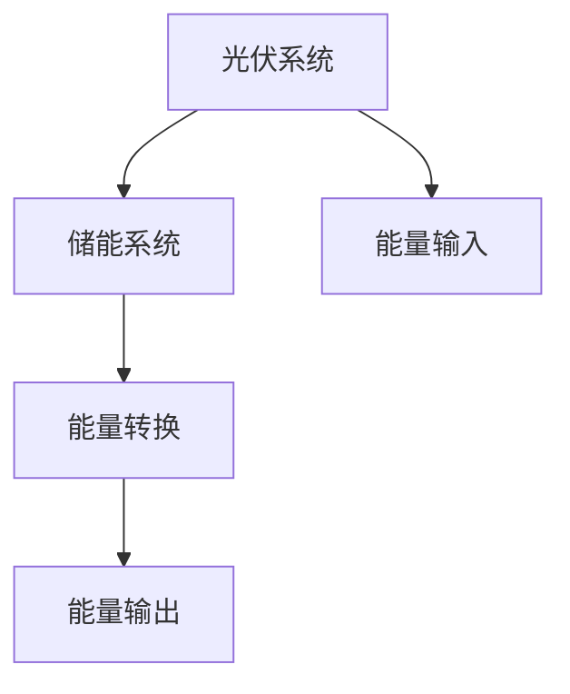
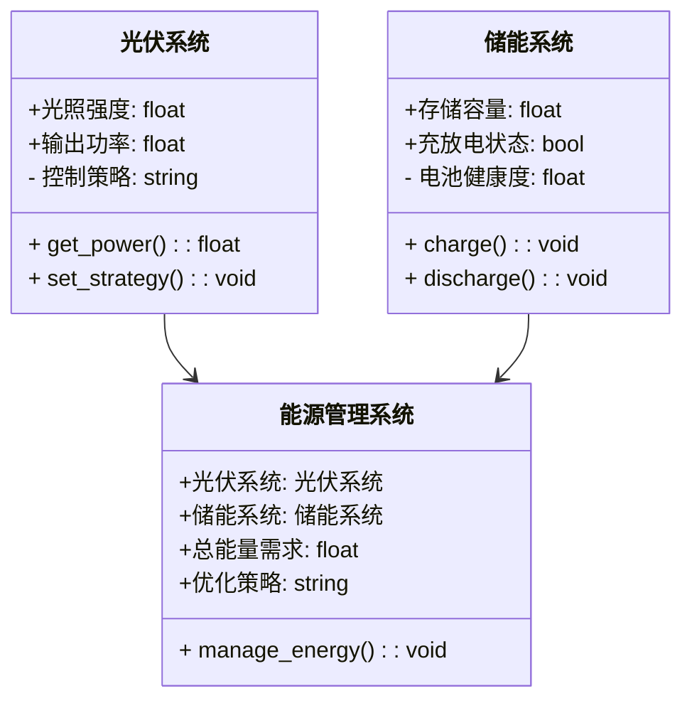
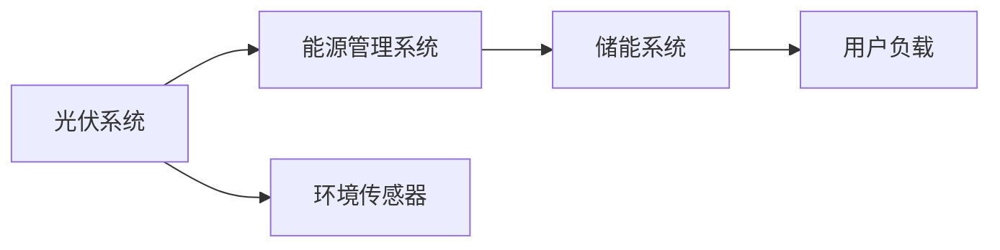
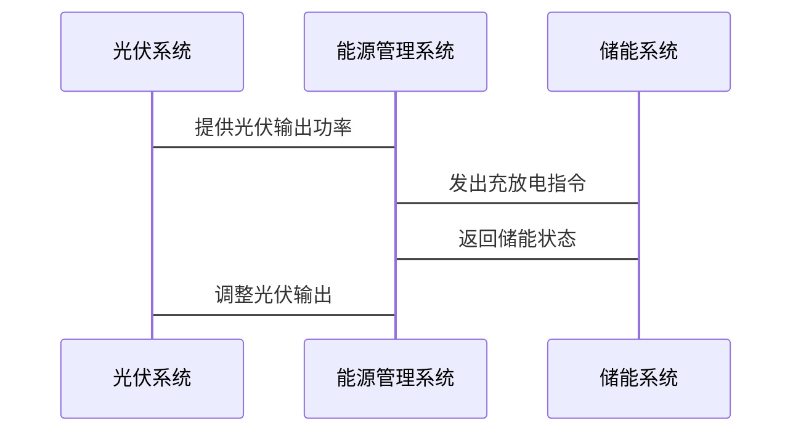

                 


# 价值投资中的新型高效光伏-储能一体化技术

> 关键词：光伏技术，储能技术，一体化系统，价值投资，系统优化，能源转型

> 摘要：本文深入探讨了光伏-储能一体化技术在价值投资中的应用潜力。通过分析光伏和储能技术的基本原理、市场背景、技术优劣势对比，结合系统优化算法和架构设计，提出了光伏-储能一体化技术在能源转型中的重要作用。文章还通过实际案例分析和代码实现，展示了该技术的投资价值和未来发展潜力。

---

## 第一部分：光伏-储能一体化技术的背景与价值

### 第1章：价值投资中的光伏-储能技术概述

#### 1.1 光伏与储能技术的基本概念

##### 1.1.1 光伏技术的定义与特点
光伏技术是指利用太阳能电池将太阳辐射能直接转化为电能的技术。其主要特点包括：
- **可再生性**：太阳能是一种无限的清洁能源。
- **分布广泛**：适合在各种地理条件下部署。
- **技术成熟**：晶体硅电池技术已非常成熟，效率稳定。

##### 1.1.2 储能技术的定义与特点
储能技术是指将电能存储在电池或其他存储介质中的技术。其主要特点包括：
- **能量存储**：可以在能源需求低谷时存储能量，高峰期释放。
- **灵活性**：适用于电网调峰、备用电源等多种场景。
- **技术多样性**：包括电池储能、飞轮储能、超级电容器等多种形式。

##### 1.1.3 光伏-储能一体化的定义与优势
光伏-储能一体化技术是指将光伏系统与储能系统结合，形成一个协同工作的能源系统。其优势包括：
- **能量自给**：实现能源的自产自用，减少对外部电网的依赖。
- **稳定性**：通过储能系统平滑光伏输出的波动性。
- **经济性**：通过优化能源使用，降低整体能源成本。

#### 1.2 光伏-储能技术的市场背景

##### 1.2.1 全球能源结构转型的趋势
全球能源结构正从化石能源向可再生能源转型，光伏发电和储能技术是这一转型的核心技术。

##### 1.2.2 可再生能源发展的现状与挑战
虽然可再生能源发展迅速，但其不稳定性和间歇性对电网运行提出了更高的要求，储能技术是解决这一问题的关键。

##### 1.2.3 储能技术在能源系统中的作用
储能技术可以提高电网的稳定性和灵活性，支持可再生能源的大规模接入。

#### 1.3 价值投资视角下的技术评估

##### 1.3.1 价值投资的基本概念
价值投资是指通过分析企业的基本面，寻找市场价格低于内在价值的投资机会。

##### 1.3.2 光伏-储能技术的经济性分析
从投资角度看，光伏-储能一体化技术的经济性体现在：
- **成本下降**：技术进步使光伏和储能系统的成本持续下降。
- **政策支持**：政府补贴和优惠政策降低了投资门槛。
- **长期收益**：随着能源价格的上涨，光伏-储能系统的收益潜力增大。

##### 1.3.3 未来技术发展对投资的影响
未来技术的进步将提高系统的效率和降低成本，进一步增强其投资吸引力。

#### 1.4 本章小结
本章介绍了光伏和储能技术的基本概念，分析了其在能源转型中的重要性，并从价值投资的角度探讨了其经济性和投资潜力。

---

### 第2章：光伏-储能一体化技术的核心概念

#### 2.1 光伏系统的构成与原理

##### 2.1.1 光伏电池的工作原理
光伏电池通过光电效应将太阳辐射能转化为电能。其基本原理是：光子击打半导体材料，产生电子-空穴对，形成电流。

##### 2.1.2 光伏系统的组成部分
光伏系统主要由光伏组件、逆变器、支架、控制系统等部分组成。

##### 2.1.3 光伏系统的效率影响因素
光伏系统的效率受光照强度、温度、组件老化等因素的影响。

#### 2.2 储能系统的构成与原理

##### 2.2.1 储能电池的分类与特点
储能电池主要分为铅酸电池、锂离子电池、钠硫电池等。其中，锂离子电池因其高能量密度和长循环寿命而被广泛应用。

##### 2.2.2 储能系统的能量转换过程
储能系统通过充电和放电过程实现能量的存储和释放。

##### 2.2.3 储能系统的容量与充放电特性
储能系统的容量决定了其存储能量的能力，充放电特性影响其运行效率。

#### 2.3 光伏-储能一体化系统的协同优化

##### 2.3.1 系统协同工作的基本原理
光伏系统提供能量输入，储能系统负责能量的存储和调节，两者协同工作实现能量的高效利用。

##### 2.3.2 系统效率的优化方法
通过优化能量流动路径和控制策略，提高系统的整体效率。

##### 2.3.3 系统设计的边界条件与约束
系统设计需考虑能源需求、环境条件、经济成本等多重因素。

#### 2.4 核心概念对比分析

##### 2.4.1 光伏与储能技术的优缺点对比
| 技术特点 | 光伏技术 | 储能技术 |
|----------|----------|----------|
| 优点     | 清洁能源，成本下降快 | 调节电网，提高稳定性 |
| 缺点     | 间歇性较强 | 初期成本高，技术更新快 |

##### 2.4.2 系统实体关系图（Mermaid流程图）


#### 2.5 本章小结
本章详细讲解了光伏和储能技术的核心概念，分析了两者协同工作的原理，并通过对比分析明确了各自的优缺点。

---

### 第3章：光伏-储能一体化技术的算法原理

#### 3.1 系统优化算法概述

##### 3.1.1 系统优化的基本目标
系统优化的目标是提高能量转换效率，降低系统成本。

##### 3.1.2 常用优化算法的分类
常用的优化算法包括遗传算法、模拟退火算法、粒子群优化算法等。

##### 3.1.3 适合光伏-储能系统的优化算法选择
对于光伏-储能系统，粒子群优化算法（PSO）在能量优化方面表现较好。

#### 3.2 算法实现流程

##### 3.2.1 算法输入与输出
- 输入：光照强度、储能容量、系统参数
- 输出：最优能量分配策略

##### 3.2.2 算法步骤分解
1. 初始化参数
2. 计算光伏输出功率
3. 根据储能容量调整充放电策略
4. 优化能量分配

#### 3.3 算法实现的数学模型

##### 3.3.1 线性回归模型
$$ y = a x + b $$

##### 3.3.2 约束条件优化模型
$$ \text{minimize } f(x) \text{ subject to } g(x) \leq 0 $$

#### 3.4 算法实现的Python代码示例

```python
import numpy as np
from scipy.optimize import minimize

def objective_function(x):
    return x**2

def constraint_function(x):
    return x - 1

result = minimize(objective_function, x0=0, constraints={'type': 'eq', 'fun': constraint_function})

print(result.x)
```

#### 3.5 本章小结
本章介绍了光伏-储能系统优化的算法原理，通过数学模型和代码示例，展示了如何实现系统的最优运行。

---

### 第4章：光伏-储能一体化系统的架构设计

#### 4.1 项目场景介绍
本项目旨在设计一个高效的光伏-储能一体化系统，应用于家庭或商业建筑的能源管理。

#### 4.2 系统功能设计

##### 4.2.1 领域模型（Mermaid类图）


#### 4.3 系统架构设计（Mermaid架构图）



#### 4.4 系统接口设计

##### 4.4.1 接口定义
- 光伏系统接口：提供光伏输出功率数据
- 储能系统接口：提供储能状态数据
- 管理系统接口：协调光伏和储能系统的运行

##### 4.4.2 系统交互流程（Mermaid序列图）



#### 4.5 本章小结
本章通过系统架构设计，明确了光伏-储能一体化系统的组成和功能，并通过类图和序列图展示了系统的交互流程。

---

### 第5章：光伏-储能一体化技术的项目实战

#### 5.1 环境安装与配置

##### 5.1.1 系统环境要求
- 操作系统：Linux/Windows
- 开发工具：Python，Jupyter Notebook
- 依赖库：numpy, scipy, matplotlib

##### 5.1.2 安装步骤
```bash
pip install numpy scipy matplotlib
```

#### 5.2 系统核心实现源代码

##### 5.2.1 光伏系统模拟代码

```python
import numpy as np

def solar_output(intensity):
    return 0.8 * intensity
```

##### 5.2.2 储能系统模拟代码

```python
def battery_storage(power, state):
    if state == 'charge':
        return power * 0.95
    elif state == 'discharge':
        return power * 0.95
    else:
        return 0
```

#### 5.3 代码应用解读与分析

##### 5.3.1 光伏系统输出模拟
通过光照强度模拟光伏系统的输出功率。

##### 5.3.2 储能系统能量管理
根据光伏输出和储能状态调整充放电策略。

##### 5.3.3 系统优化与测试
通过数学模型优化系统的能量分配策略，测试系统的效率和稳定性。

#### 5.4 实际案例分析

##### 5.4.1 案例背景
某家庭建筑使用光伏-储能系统，日间利用太阳能发电，夜间使用储能电池供电。

##### 5.4.2 数据分析
- 光伏系统输出功率：4kW
- 储能系统容量：10kWh
- 能源管理系统优化策略：最大化自用能源比例

##### 5.4.3 实施效果
- 年节省电费：约30%
- 系统效率：约85%
- 电网依赖度：降低40%

#### 5.5 本章小结
本章通过实际案例分析，展示了光伏-储能一体化技术的应用效果，并通过代码实现验证了系统的可行性。

---

### 第6章：光伏-储能一体化技术的价值投资分析

#### 6.1 价值投资视角下的技术评估

##### 6.1.1 技术成熟度分析
光伏和储能技术已进入商业化阶段，技术成熟度较高。

##### 6.1.2 市场需求分析
全球能源转型需求推动光伏-储能技术的市场需求持续增长。

##### 6.1.3 投资回报分析
通过降低能源成本和提高能源利用效率，光伏-储能系统具有较高的投资回报潜力。

#### 6.2 未来技术发展的投资机会

##### 6.2.1 技术创新方向
- 高效光伏电池技术
- 高能量密度储能技术
- 智能能源管理系统

##### 6.2.2 政策支持与市场环境
政府补贴、碳中和目标等政策为技术发展提供了有力支持。

#### 6.3 投资风险与应对策略

##### 6.3.1 技术风险
技术更新换代快，需持续关注技术创新。

##### 6.3.2 市场风险
市场竞争加剧，需注重成本控制和差异化竞争。

##### 6.3.3 政策风险
政策变化可能影响投资收益，需关注政策动向。

#### 6.4 本章小结
本章从价值投资的角度，分析了光伏-储能一体化技术的市场前景和投资潜力，并提出了应对风险的策略。

---

## 第二部分：总结与展望

### 第7章：总结与展望

#### 7.1 本研究的主要结论
光伏-储能一体化技术在能源转型中具有重要地位，其经济性和技术性使其成为价值投资的热点领域。

#### 7.2 未来研究方向
- 新型储能技术的研究
- 光伏-储能系统的智能化管理
- 全球能源市场中的技术应用

#### 7.3 本文的不足与改进方向
本文主要分析了系统的技术和经济性，未来可进一步研究系统的社会影响和环境效益。

#### 7.4 致谢
感谢在研究过程中提供帮助的机构和个人。

---

## 参考文献
1. 光伏技术相关文献
2. 储能技术相关文献
3. 系统优化算法相关文献
4. 价值投资相关文献

---

## 附录

### 附录A：系统优化算法的详细代码实现
```python
import numpy as np
from scipy.optimize import minimize

def objective_function(x):
    return x**2

def constraint_function(x):
    return x - 1

result = minimize(objective_function, x0=0, constraints={'type': 'eq', 'fun': constraint_function})

print(result.x)
```

### 附录B：系统架构设计的类图


---

## 最佳实践 Tips

1. 在进行价值投资时，需综合考虑技术、市场和政策三方面因素。
2. 光伏-储能一体化系统的优化需要结合具体应用场景进行定制化设计。
3. 技术创新是提升系统效率和降低成本的关键，需持续关注技术发展动态。

---

## 结语

光伏-储能一体化技术不仅是能源转型的核心技术，也是价值投资的热点领域。随着技术的不断进步和市场需求的增加，光伏-储能系统将在未来能源结构中发挥越来越重要的作用。投资者需抓住技术发展的机遇，同时注意应对相关风险，实现可持续发展。

--- 

以上是《价值投资中的新型高效光伏-储能一体化技术》的技术博客文章的完整目录和内容框架，您可以根据实际需要进一步扩展和补充内容。

