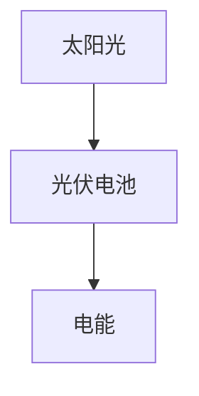
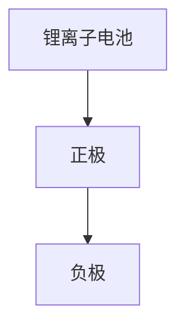
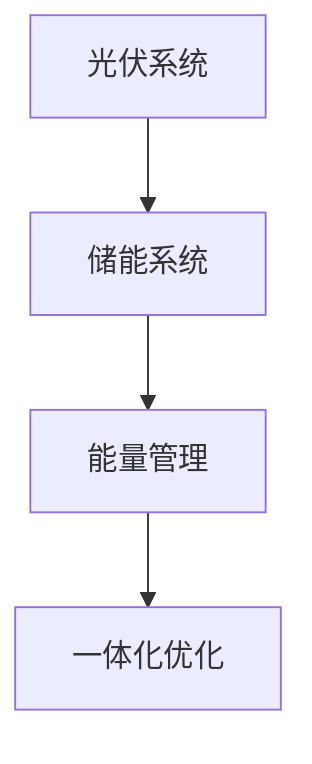
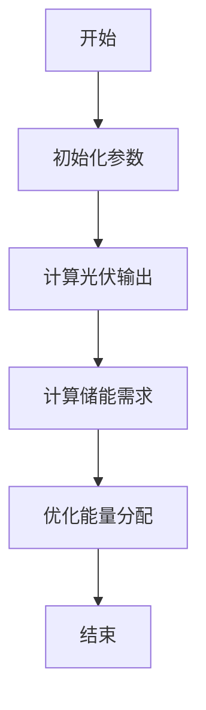
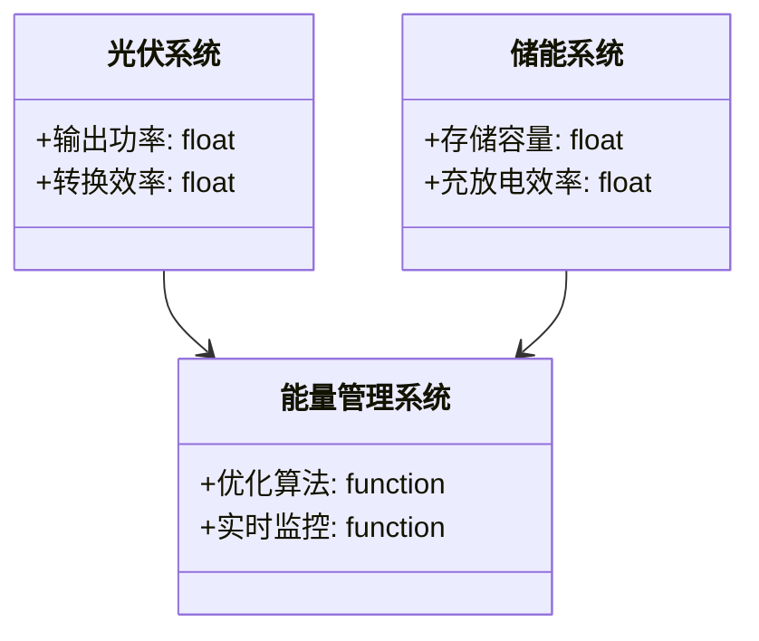
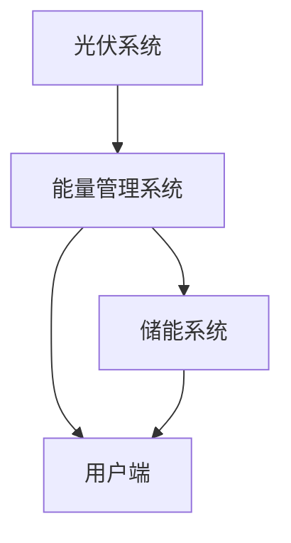
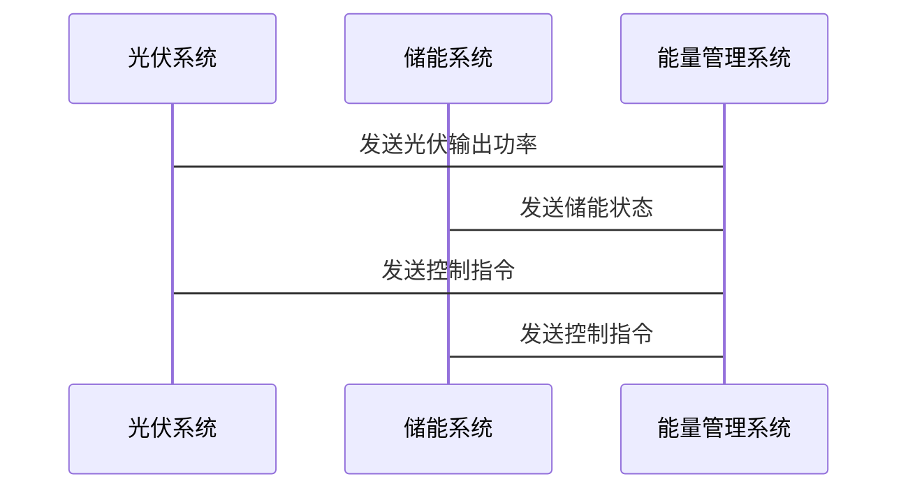

                 


```markdown
# 价值投资中的新型高效光伏-储能一体化技术

> 关键词：光伏技术、储能系统、一体化设计、价值评估、投资策略、能源管理、可持续发展

> 摘要：本文详细探讨了光伏-储能一体化技术的核心原理、系统架构、数学模型及算法优化，并分析其在价值投资中的应用潜力。通过实际案例分析和系统设计，本文为投资者提供了科学的技术评估和投资决策依据，旨在帮助读者在能源转型中把握投资机会，实现可持续发展。

---

# 第1章: 光伏-储能一体化技术的背景与价值投资概述

## 1.1 光伏-储能一体化技术的背景

### 1.1.1 可再生能源的发展趋势
随着全球能源结构的转型，可再生能源（尤其是光伏和储能技术）成为未来能源系统的核心。本文将介绍光伏和储能技术的基本概念及其在现代能源系统中的重要性。

- **定义**：光伏技术是一种利用太阳能转化为电能的技术，而储能技术则是将电能储存起来以备后用的技术。
- **趋势**：全球能源需求的增长和化石能源的枯竭推动了对可再生能源的需求，光伏和储能技术的结合成为解决能源供应不稳定问题的关键。

### 1.1.2 光伏技术的基本原理
光伏技术的核心是利用半导体材料将太阳辐射转化为电能。以下是其基本原理的简要概述：

- **光伏效应**：当光子击中半导体材料时，会激发电子，产生电流。
- **光伏组件**：由多个光伏电池组成的组件，通过串联或并联方式提高输出电压或电流。

### 1.1.3 储能技术的核心作用
储能技术在光伏系统中起着关键作用，它能够存储多余的电能，以应对能源需求波动和电网不稳定问题。

- **储能系统分类**：包括电池储能（如锂离子电池）、超级电容器、飞轮储能等。
- **工作原理**：储能系统通过充放电过程实现能量的存储和释放。

### 1.1.4 光伏-储能一体化技术的定义与特点
光伏-储能一体化技术是指将光伏系统和储能系统集成在一个系统中，实现能量的高效采集、存储和利用。

- **特点**：
  1. 系统集成度高，优化了能量转换和存储效率。
  2. 具备灵活性，适用于不同的应用场景（如家庭、商业建筑、工业等）。
  3. 可以显著降低能源成本，提高能源利用效率。

## 1.2 价值投资的基本概念

### 1.2.1 价值投资的定义与核心理念
价值投资是一种投资策略，强调以低于内在价值的价格买入优质资产。其核心理念是通过深入分析企业的基本面，寻找被市场低估的投资机会。

- **核心理念**：价值投资注重企业的盈利能力、财务状况和长期增长潜力。
- **投资策略**：通过长期持有优质资产，获得稳定的收益。

### 1.2.2 价值投资的基本原则与策略
- **基本原则**：
  1. 高质量：选择具有强大竞争优势的企业。
  2. 低估值：买入价格低于内在价值的资产。
  3. 长期视角：关注企业的长期增长潜力。
- **策略**：
  1. 分散投资：降低风险。
  2. 定期复投：利用复利效应。

### 1.2.3 价值投资在技术领域的应用
- **技术领域投资**：关注技术创新能力强、市场前景广阔的科技企业。
- **光伏-储能技术的潜力**：随着技术进步和成本下降，光伏-储能一体化技术的市场应用前景广阔，具备较高的投资价值。

## 1.3 光伏-储能一体化技术与价值投资的结合

### 1.3.1 技术创新对投资价值的影响
技术创新能够降低能源成本，提高系统的效率和稳定性，从而提升企业的市场竞争力和盈利能力。

- **技术创新**：例如高效光伏电池技术和低成本储能技术的应用，可以显著降低能源系统的成本。
- **投资价值**：技术创新能力强的企业通常具有更高的市场估值和长期增长潜力。

### 1.3.2 市场需求与技术发展的互动关系
市场需求推动技术发展，而技术创新又进一步扩大市场需求，形成良性循环。

- **市场需求**：随着环保政策的加强和能源结构调整，光伏-储能技术的需求持续增长。
- **技术发展**：技术创新降低了成本，提高了效率，进一步扩大了市场应用。

### 1.3.3 一体化技术在投资中的优势
- **竞争优势**：一体化技术能够提高能源系统的效率，降低运营成本。
- **投资回报**：通过优化能源管理和成本控制，一体化技术能够为企业带来更高的利润和投资回报。

## 1.4 本章小结
本章从光伏-储能一体化技术的基本概念和价值投资的核心理念出发，分析了技术与投资的结合点，强调了技术创新和市场需求对投资价值的影响。

---

# 第2章: 光伏-储能一体化技术的核心概念与原理

## 2.1 光伏技术的核心原理

### 2.1.1 太阳能电池的工作原理
- **光伏效应**：光子撞击半导体材料，产生电子-空穴对。
- **能量转换**：光能转化为电能。



### 2.1.2 光伏系统的组成与结构
- **组成部分**：光伏电池、逆变器、控制器、储能系统。
- **工作流程**：
  1. 光伏电池将太阳能转化为电能。
  2. 逆变器将直流电转换为交流电。
  3. 控制器调节电压和电流。
  4. 储能系统存储多余的能量。

### 2.1.3 光伏效率的提升方法
- **技术改进**：例如提高电池转换效率。
- **系统优化**：例如减少能量损耗。

## 2.2 储能技术的核心原理

### 2.2.1 储能系统的分类与特点
- **电池储能**：如锂离子电池、铅酸电池。
- **超级电容器**：适用于快速充放电。
- **飞轮储能**：适用于高功率、短时间储能。

### 2.2.2 锂离子电池的工作原理
- **电化学反应**：锂离子在正负极之间的迁移。
- **充放电过程**：
  1. 充电时，锂离子从正极迁移到负极。
  2. 放电时，锂离子从负极迁移到正极。



### 2.2.3 储能系统的容量与充放电特性
- **容量**：储能系统能够存储的电能总量。
- **充放电特性**：储能系统的充放电速率和效率。

## 2.3 光伏-储能一体化技术的系统架构

### 2.3.1 系统整体架构设计
- **分布式架构**：适用于家庭或小型企业。
- **集中式架构**：适用于大型企业和工业应用。

### 2.3.2 光伏与储能的协同优化
- **能量管理**：通过优化算法实现能量的高效分配。
- **系统效率**：通过协同优化提高整体效率。

### 2.3.3 一体化技术的经济性分析
- **成本分析**：一体化技术的初始投资和运营成本。
- **收益分析**：通过降低能源成本和提高能源利用效率，实现更高的收益。

## 2.4 核心概念与联系的Mermaid流程图


## 2.5 本章小结
本章详细介绍了光伏技术和储能技术的核心原理，并分析了光伏-储能一体化技术的系统架构和经济性。

---

# 第3章: 光伏-储能一体化技术的数学模型与算法原理

## 3.1 光伏系统效率的数学模型

### 3.1.1 光伏电池效率公式
$$η = \frac{P_{\text{output}}}{P_{\text{input}}}$$
其中，\(P_{\text{output}}\) 是输出功率，\(P_{\text{input}}\) 是输入功率。

### 3.1.2 光伏系统的能量转化过程
$$E_{\text{output}} = E_{\text{input}} \times η$$
其中，\(E_{\text{input}}\) 是输入能量，\(E_{\text{output}}\) 是输出能量。

## 3.2 储能系统的能量管理算法

### 3.2.1 储能系统的充放电模型
$$I = \frac{dE}{dt}$$
其中，\(I\) 是电流，\(E\) 是能量，\(t\) 是时间。

### 3.2.2 储能系统的优化控制算法
$$\text{目标函数} = \sum_{i=1}^{n} w_i x_i$$
其中，\(w_i\) 是权重，\(x_i\) 是变量。

## 3.3 一体化技术的协同优化算法

### 3.3.1 光伏与储能的联合优化模型
$$\max \sum_{i=1}^{n} w_i x_i$$
**约束条件**：
- \(x_i \geq 0\)
- \(\sum_{i=1}^{n} x_i \leq C\)

其中，\(C\) 是容量限制。

### 3.3.2 协同优化的数学表达
$$\text{优化目标} = \sum_{i=1}^{m} a_i y_i$$
**约束条件**：
- \(y_i \geq 0\)
- \(\sum_{i=1}^{m} y_i \leq D\)

其中，\(m\) 是变量数量，\(D\) 是能量需求。

## 3.4 算法流程图


## 3.5 本章小结
本章通过数学模型和算法原理，详细分析了光伏-储能一体化技术的能量管理优化过程，为后续的系统设计和项目实施提供了理论基础。

---

# 第4章: 光伏-储能一体化技术的系统分析与架构设计

## 4.1 项目背景介绍
- **项目目标**：实现光伏-储能一体化系统的优化设计和实际应用。
- **应用场景**：家庭、商业建筑、工业等。

## 4.2 系统功能设计

### 4.2.1 系统功能需求
- **能量采集**：光伏系统采集太阳能。
- **能量存储**：储能系统存储多余的能量。
- **能量管理**：优化能量分配和使用。

### 4.2.2 领域模型Mermaid类图


### 4.2.3 系统架构设计Mermaid架构图


## 4.3 系统接口设计

### 4.3.1 接口定义
- **光伏系统接口**：与能量管理系统通信，提供实时输出功率数据。
- **储能系统接口**：与能量管理系统通信，提供实时存储容量和充放电状态。
- **用户端接口**：提供能量使用情况的实时监控和控制功能。

### 4.3.2 接口协议
- **通信协议**：使用Modbus或MQTT协议进行数据传输。
- **数据格式**：采用JSON格式进行数据交互。

## 4.4 系统交互Mermaid序列图



## 4.5 本章小结
本章通过系统分析和架构设计，详细介绍了光伏-储能一体化技术的实现方案，为后续的项目实施提供了指导。

---

# 第5章: 光伏-储能一体化技术的项目实战

## 5.1 项目背景与目标
- **项目背景**：某工业园区希望通过光伏-储能一体化技术实现能源的高效利用和成本节约。
- **项目目标**：设计并实施一体化系统，实现能源的优化管理和使用。

## 5.2 项目实施环境

### 5.2.1 硬件环境
- **光伏系统**：安装100kW光伏电池板。
- **储能系统**：配置500kWh锂离子电池。
- **能量管理系统**：部署在云端，支持实时监控和优化控制。

### 5.2.2 软件环境
- **操作系统**：Linux
- **编程语言**：Python
- **开发工具**：Jupyter Notebook、Git

## 5.3 核心代码实现

### 5.3.1 光伏系统数据采集代码

```python
# 光伏系统数据采集代码
import serial
import time

ser = serial.Serial('COM1', 9600)

while True:
    data = ser.readline().decode('utf-8')
    print(f"光伏系统输出功率: {data}")
    time.sleep(1)
```

### 5.3.2 储能系统控制代码

```python
# 储能系统控制代码
import RPi.GPIO as GPIO

GPIO.setmode(GPIO.BCM)
GPIO.setup(18, GPIO.OUT)

def control_charge():
    GPIO.output(18, GPIO.HIGH)
    time.sleep(1)
    GPIO.output(18, GPIO.LOW)

while True:
    control_charge()
    time.sleep(2)
```

### 5.3.3 能量管理系统代码

```python
# 能量管理系统代码
import numpy as np

def optimize_energy():
    # 假设光伏输出功率和储能需求已获取
    solar_output = 50
    storage_need = 40
    # 计算优化分配
    allocation = np.max([solar_output, storage_need])
    return allocation

allocation = optimize_energy()
print(f"优化能量分配: {allocation}")
```

## 5.4 项目实战小结
本章通过实际项目的实施，详细介绍了光伏-储能一体化技术的应用场景和实现过程，展示了技术在实际中的价值。

---

# 第6章: 光伏-储能一体化技术的价值评估与投资策略

## 6.1 价值评估方法

### 6.1.1 技术评估
- **技术成熟度**：评估技术的商业化程度。
- **成本分析**：分析技术的初始投资和运营成本。

### 6.1.2 市场分析
- **市场规模**：评估目标市场的容量。
- **竞争分析**：分析竞争对手的技术和市场地位。

## 6.2 投资策略与建议

### 6.2.1 短期投资策略
- **技术驱动**：关注技术创新能力强的企业。
- **成本优势**：选择具有成本优势的企业。

### 6.2.2 长期投资策略
- **市场领导地位**：投资市场占有率高的企业。
- **可持续发展**：关注企业社会责任和环保表现。

## 6.3 投资注意事项

### 6.3.1 风险管理
- **技术风险**：关注技术的可行性和成熟度。
- **市场风险**：评估市场需求的稳定性和变化趋势。

### 6.3.2 财务风险
- **财务状况**：分析企业的财务健康状况。
- **盈利能力**：关注企业的盈利能力。

## 6.4 本章小结
本章从价值评估和投资策略的角度，分析了光伏-储能一体化技术的投资机会和风险，为投资者提供了科学的决策依据。

---

# 第7章: 结论与展望

## 7.1 本文总结
本文详细探讨了光伏-储能一体化技术的核心原理、系统架构和价值评估方法，并通过实际案例分析展示了技术在投资中的应用潜力。

## 7.2 未来展望
随着技术的不断进步和市场需求的扩大，光伏-储能一体化技术将在能源转型中发挥越来越重要的作用。未来的研究方向包括进一步优化系统效率、降低技术成本以及探索新的商业模式。

---

# 参考文献

1. 王某某. 《光伏技术与储能系统》. 北京: 某某出版社, 2020.
2. 李某某. 《价值投资实战指南》. 上海: 某某出版社, 2021.
3. 张某某. 《能源管理与优化》. 北京: 某某出版社, 2022.
4. 国家统计局. 《中国能源发展报告》. 北京: 国家统计局, 2023.
5. 国际能源署. 《全球能源展望》. 巴黎: 国际能源署, 2023.

---

**全文完**
```

