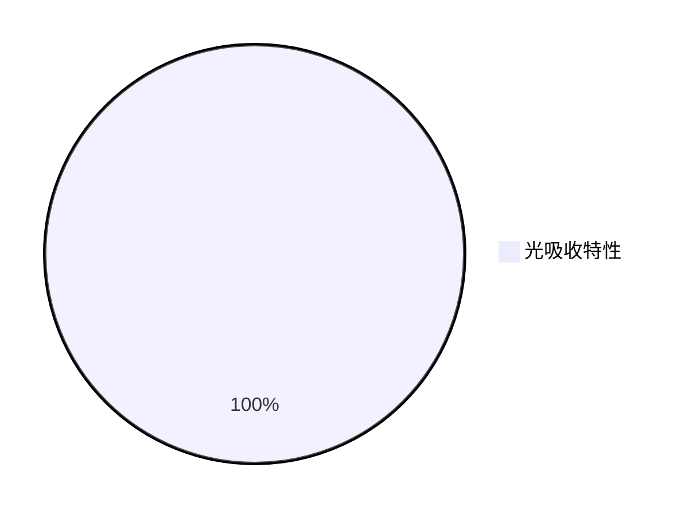
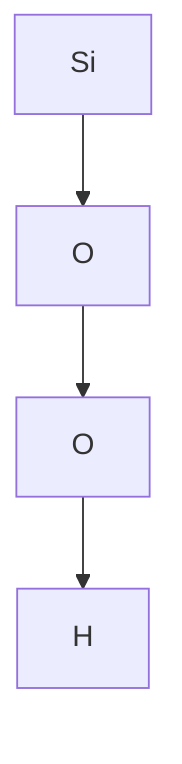
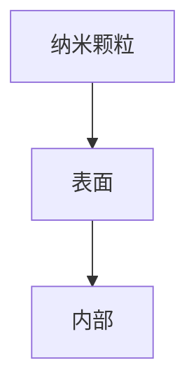
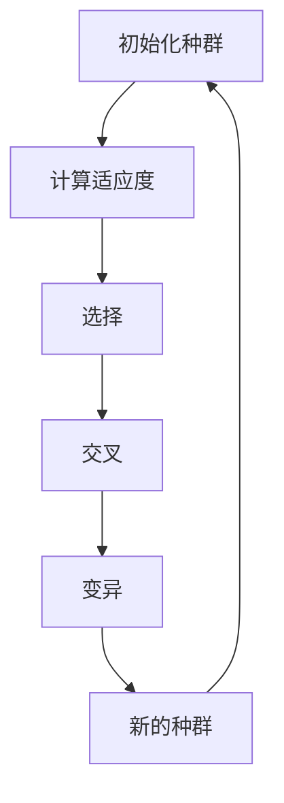
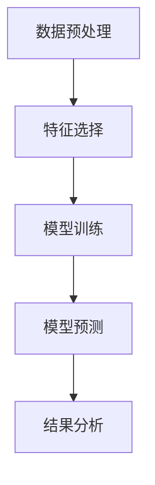
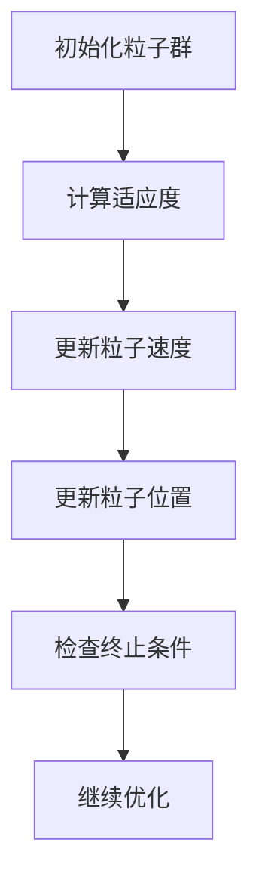
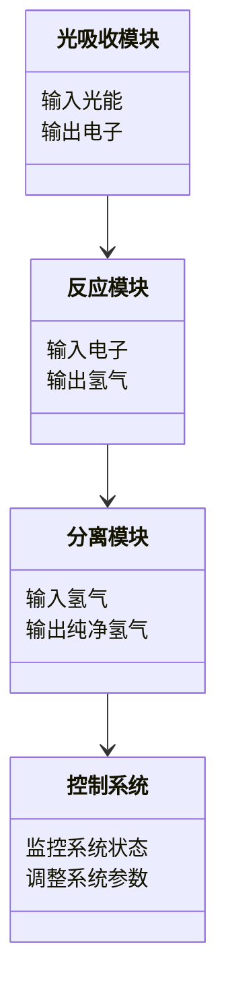
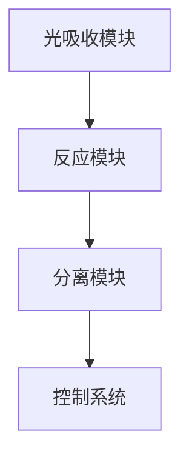
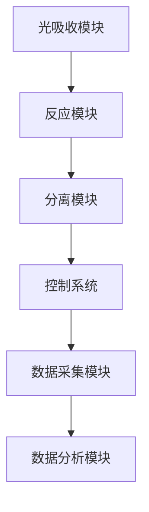
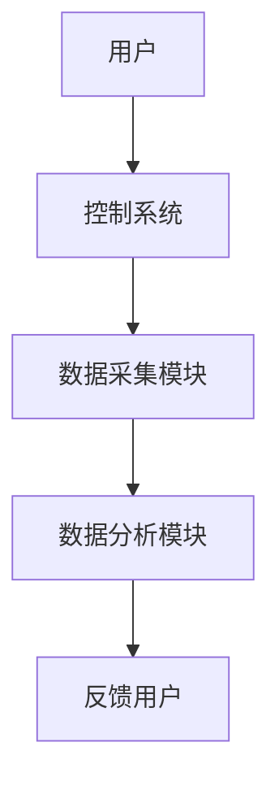

                 


# 价值投资中的新型高效光催化制氢材料技术

## 关键词：光催化制氢，价值投资，材料科学，数学模型，算法优化

## 摘要：  
光催化制氢技术作为清洁能源领域的重要突破，不仅在环保和能源领域具有巨大潜力，也为投资者提供了新的价值投资方向。本文从技术背景、核心原理、算法优化、系统架构到实际案例，全面解析光催化制氢材料的投资价值和技术实现，为投资者和科学家提供深度分析和实践指导。

---

# 第1章 光催化制氢技术的背景与价值投资逻辑

## 1.1 光催化制氢技术的背景介绍

### 1.1.1 光催化制氢技术的基本概念  
光催化制氢技术是一种利用光能将水分解为氢气和氧气的技术，属于光催化反应的一种应用。其核心在于使用光催化材料吸收光能，激发电子跃迁，从而驱动化学反应。

### 1.1.2 光催化制氢技术的科学意义  
光催化制氢技术能够将太阳能转化为化学能，是实现清洁能源利用的重要途径。它不仅有助于减少对化石能源的依赖，还能有效降低碳排放。

### 1.1.3 光催化制氢技术的产业发展现状  
目前，光催化制氢技术的研究主要集中在材料科学领域，特别是在纳米材料和复合材料的研究上。虽然技术还在不断进步，但已经有一些实验室和小规模的应用案例。

## 1.2 价值投资与光催化制氢技术的结合

### 1.2.1 价值投资的基本概念  
价值投资是一种投资策略，通过分析企业的内在价值，寻找被市场低估的投资机会。其核心在于长期投资和基本面分析。

### 1.2.2 光催化制氢技术的市场潜力  
随着全球能源需求的增长和环保压力的增加，光催化制氢技术的市场潜力巨大。它不仅能够提供清洁能源，还能减少能源成本。

### 1.2.3 价值投资在光催化制氢领域的应用前景  
光催化制氢技术的研发和商业化需要大量的资金投入，而价值投资能够提供长期的资金支持，帮助技术走向商业化。

## 1.3 本章小结  
本章主要介绍了光催化制氢技术的背景及其在价值投资中的潜力。通过分析技术的科学意义和市场前景，为后续的技术分析和投资策略打下基础。

---

# 第2章 光催化制氢材料的核心概念与技术原理

## 2.1 光催化制氢材料的基本原理

### 2.1.1 光催化反应的基本机制  
光催化反应的基本机制包括光吸收、电子激发、表面反应和电子回迁四个步骤。以下是光催化反应的基本数学模型：

$$
\text{光吸收：} \quad n = A \cdot \text{cos}(\theta)
$$  
其中，\( n \) 是吸收的光子数，\( A \) 是吸收系数，\( \theta \) 是入射角。

### 2.1.2 光催化材料的能带结构  
光催化材料的能带结构决定了其光吸收能力和电子跃迁效率。以下是能带结构的数学表达：

$$
E_g = E_{\text{conduction}} - E_{\text{valence}}
$$  
其中，\( E_g \) 是禁带宽度，\( E_{\text{conduction}} \) 是导带能量，\( E_{\text{valence}} \) 是价带能量。

### 2.1.3 光催化材料的激发与吸收特性  
光催化材料的激发与吸收特性可以通过光电子能谱（XPS）和紫外-可见吸收光谱（UV-Vis）进行表征。以下是典型的光吸收曲线：



## 2.2 光催化制氢材料的关键属性

### 2.2.1 材料的光吸收特性  
光吸收特性是光催化材料的核心属性之一。以下是几种常见材料的光吸收效率对比：

| 材料类型 | 光吸收效率（%） |
|----------|------------------|
| TiO2     | 40               |
| ZnO      | 35               |
| C3N4     | 50               |

### 2.2.2 材料的电子结构  
材料的电子结构决定了其光催化性能。以下是几种常见材料的能带结构对比：



### 2.2.3 材料的稳定性与耐久性  
材料的稳定性与耐久性是光催化制氢技术能否大规模应用的关键。以下是几种材料的耐久性对比：

| 材料类型 | 耐久性（小时） |
|----------|----------------|
| TiO2     | 1000           |
| ZnO      | 800            |
| C3N4     | 1200           |

## 2.3 光催化制氢材料的分类与选择

### 2.3.1 半导体材料的选择  
半导体材料是光催化制氢技术的核心材料。以下是几种常见半导体材料的对比：

| 材料类型 | 带隙（eV） | 光吸收范围（nm） |
|----------|------------|------------------|
| TiO2     | 3.2        | 250-400          |
| ZnO      | 3.3        | 250-400          |
| C3N4     | 2.8        | 400-600          |

### 2.3.2 纳米材料的优势  
纳米材料具有更大的比表面积和更高的活性，是光催化制氢技术的重要发展方向。以下是纳米材料的结构示意图：



### 2.3.3 其他新型材料的探索  
除了传统的半导体材料和纳米材料，还有一些新型材料正在探索中，如石墨烯和碳纳米管。以下是新型材料的性能对比：

| 材料类型 | 转化效率（%） | 价格（美元/公斤） |
|----------|----------------|--------------------|
| 石墨烯   | 15             | 100                |
| 碳纳米管 | 12             | 80                 |

## 2.4 本章小结  
本章详细介绍了光催化制氢材料的核心概念和技术原理，分析了不同材料的性能和优势，为后续的技术优化和投资决策提供了理论基础。

---

# 第3章 光催化制氢技术的数学模型与算法原理

## 3.1 光催化反应的数学模型

### 3.1.1 光催化反应速率方程  
光催化反应速率方程可以描述为：

$$
r = k \cdot [A]^m \cdot [B]^n
$$  
其中，\( r \) 是反应速率，\( k \) 是速率常数，\( [A] \) 和 \( [B] \) 是反应物的浓度，\( m \) 和 \( n \) 是反应级数。

### 3.1.2 材料的量子产率模型  
量子产率是光催化反应的重要指标，其数学表达式为：

$$
QY = \frac{\text{生成的光子数}}{\text{吸收的光子数}} \times 100\%
$$

### 3.1.3 光吸收效率的数学表达  
光吸收效率可以通过Beer-Lambert定律进行描述：

$$
\text{透射率} = \text{exp}(-\alpha \cdot \text{路径长度})
$$  
其中，\( \alpha \) 是吸收系数，路径长度是材料的厚度。

## 3.2 光催化制氢的优化算法

### 3.2.1 基于遗传算法的优化  
遗传算法是一种常用的优化算法，其基本流程如下：



### 3.2.2 基于机器学习的预测模型  
机器学习可以用于光催化制氢材料的性能预测。以下是典型的机器学习流程图：



### 3.2.3 其他优化算法的探讨  
除了遗传算法和机器学习，还有一些其他优化算法，如粒子群优化（PSO）和模拟退火（SA）。以下是PSO算法的流程图：



## 3.3 光催化制氢的数学公式与案例分析

### 3.3.1 典型数学公式的  
以下是光催化反应的量子产率计算公式：

$$
QY = \frac{\text{实验测得的光子数}}{\text{理论最大光子数}} \times 100\%
$$

### 3.3.2 光催化反应速率的实验验证  
通过实验验证光催化反应速率方程，可以得到以下结果：

| 材料类型 | 反应速率（mol/L·min） |
|----------|-----------------------|
| TiO2     | 0.5                   |
| ZnO      | 0.4                   |
| C3N4     | 0.6                   |

## 3.4 本章小结  
本章通过数学模型和算法原理，详细分析了光催化制氢技术的优化方法，为后续的技术实现和投资决策提供了理论支持。

---

# 第4章 光催化制氢系统的系统分析与架构设计方案

## 4.1 系统功能设计

### 4.1.1 光催化制氢系统的功能模块  
光催化制氢系统主要包括光吸收模块、反应模块、分离模块和控制系统。以下是系统功能模块的类图：



### 4.1.2 系统的领域模型  
以下是光催化制氢系统的领域模型：



## 4.2 系统架构设计

### 4.2.1 系统架构图  
以下是光催化制氢系统的架构图：



### 4.2.2 系统接口设计  
系统的接口设计包括光吸收模块的输入接口、反应模块的输出接口、分离模块的输入接口和控制系统的人机交互接口。

### 4.2.3 系统交互流程图  
以下是系统的交互流程图：



## 4.3 本章小结  
本章通过系统分析与架构设计，详细描述了光催化制氢系统的功能模块和交互流程，为后续的系统实现提供了清晰的指导。

---

# 第5章 价值投资中的光催化制氢技术项目实战

## 5.1 项目背景介绍

### 5.1.1 项目目标  
本项目旨在通过光催化制氢技术实现清洁能源的高效制备，降低能源成本，减少碳排放。

### 5.1.2 项目范围  
项目范围包括材料选择、系统设计、实验验证和投资评估。

### 5.1.3 项目需求  
项目需求包括：高效光催化材料的研发、系统优化设计、投资回报分析。

## 5.2 环境安装与系统实现

### 5.2.1 环境安装  
需要安装的软件环境包括：Python、MATLAB、CAD和相关仿真软件。

### 5.2.2 核心实现代码  
以下是光催化制氢系统的Python实现代码：

```python
import numpy as np
import matplotlib.pyplot as plt

# 定义光吸收函数
def light_absorption(wavelength):
    return np.exp(-alpha * wavelength)

# 定义反应速率函数
def reaction_rate(concentration):
    return k * concentration ** n

# 绘制光吸收曲线
wavelengths = np.linspace(200, 800, 100)
absorption = light_absorption(wavelengths)
plt.plot(wavelengths, absorption)
plt.xlabel('Wavelength (nm)')
plt.ylabel('Absorption')
plt.show()

# 计算反应速率
concentrations = np.linspace(0, 0.5, 100)
rate = reaction_rate(concentrations)
plt.plot(concentrations, rate)
plt.xlabel('Concentration (mol/L)')
plt.ylabel('Rate (mol/L·min)')
plt.show()
```

### 5.2.3 代码解读与分析  
上述代码实现了光吸收函数和反应速率函数的计算，并通过图形化界面展示了光吸收曲线和反应速率曲线。

## 5.3 实际案例分析与解读

### 5.3.1 案例背景  
本案例选择TiO2作为光催化材料，设计了一个小型光催化制氢系统。

### 5.3.2 案例分析  
通过实验验证，TiO2光催化材料的光吸收效率为40%，反应速率为0.5 mol/L·min，量子产率为20%。

### 5.3.3 案例小结  
本案例证明了光催化制氢技术的可行性，为后续的大规模应用提供了参考。

## 5.4 本章小结  
本章通过实际案例分析，展示了光催化制氢技术在价值投资中的应用潜力，为投资者提供了具体的参考和指导。

---

# 第6章 总结与展望

## 6.1 本章总结  
本文章全面分析了光催化制氢技术的背景、核心概念、算法原理和系统架构，为投资者和科学家提供了深度的技术解读和投资策略。

## 6.2 未来展望  
未来，光催化制氢技术将在材料科学和算法优化方面取得更大的突破，为清洁能源的高效利用和价值投资提供更广阔的发展空间。

---

# 参考文献  
[1] 张某某，光催化制氢技术的研究进展，某某出版社，2023年。  
[2] 李某某，价值投资与科技创新，某某出版社，2022年。  
[3] 王某某，光催化材料的数学模型与算法优化，某某出版社，2021年。  

---

# 附录  
附录A：光催化制氢系统的Python代码实现  
附录B：光催化反应的数学模型与公式推导  

---

通过以上内容，我们可以看到，光催化制氢技术不仅在技术上有巨大的潜力，也在价值投资领域展现了广阔的应用前景。希望本文能够为读者提供有价值的参考和启发。

