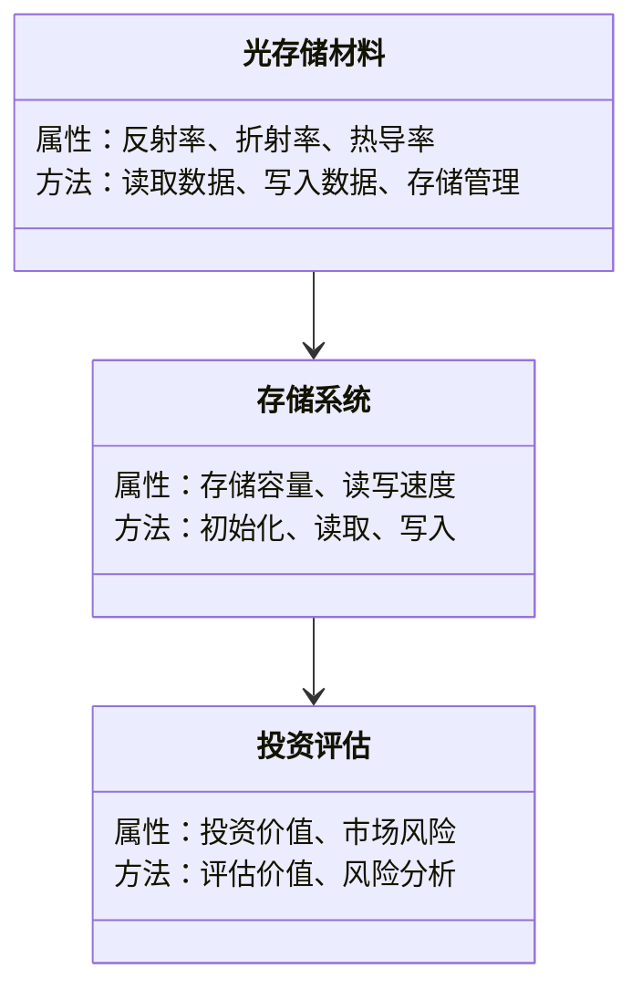
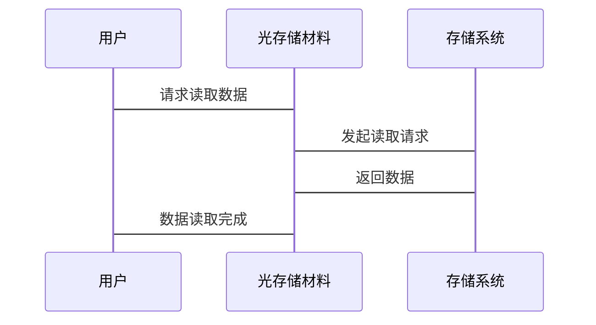

                 


# 价值投资中的新型高效光存储材料技术前景

## 关键词
光存储材料，价值投资，技术前景，存储密度，存储寿命，投资策略

## 摘要
随着信息技术的飞速发展，数据存储需求不断增加，光存储材料作为高效、稳定的信息存储介质，展现出巨大的应用潜力。本文从价值投资的角度，深入分析新型高效光存储材料的技术优势、市场前景以及投资价值，探讨其在未来存储领域的潜在收益与挑战，为投资者提供科学的决策参考。

---

## 第一部分: 光存储材料技术的背景与重要性

### 1. 光存储材料的基本概念

#### 1.1 光存储材料的定义
光存储材料是一种能够利用光能进行数据存储和读取的材料，主要应用于光盘、蓝光存储等技术。其核心特性包括高反射率、高灵敏度和长存储寿命。

#### 1.2 光存储材料的分类
光存储材料主要分为有机和无机两类。无机材料如二氧化硅和碲化镉具有更高的存储密度和稳定性，而有机材料如聚合物基材料则成本较低，适合大规模生产。

#### 1.3 光存储材料的物理特性
光存储材料的关键特性包括：
- 光学特性：如反射率、折射率。
- 热学特性：如热稳定性、导热系数。
- 机械特性：如硬度、弹性模量。

### 2. 光存储技术在现代科技中的地位

#### 2.1 光存储技术的发展历程
从早期的CD到现代的蓝光光盘，光存储技术经历了从低密度到高密度的演变，技术进步显著。

#### 2.2 光存储技术在信息存储领域的应用
光存储技术广泛应用于数据备份、档案存储、高清视频等领域，尤其在大数据时代表现出色。

#### 2.3 光存储技术的未来发展趋势
随着5G和AI的发展，光存储技术将向更高密度、更低能耗方向发展，应用场景也将进一步扩展。

### 3. 价值投资视角下的光存储材料技术

#### 3.1 价值投资的基本概念
价值投资是一种通过分析企业的内在价值，寻找被市场低估的投资机会的策略。

#### 3.2 光存储材料技术的市场价值
光存储材料技术具有高技术壁垒和广阔市场，未来有望成为信息存储领域的主流技术。

#### 3.3 光存储材料技术的长期投资潜力
随着数据量的爆炸式增长，光存储材料的需求将稳步上升，具备长期投资价值。

---

## 第二部分: 新型高效光存储材料的核心概念与特性

### 1. 新型高效光存储材料的物理特性

#### 1.1 光学特性
新型光存储材料具有更高的反射率和更低的散射损耗，能够提高数据读取的准确性和速度。

#### 1.2 热学特性
材料具有良好的热稳定性和导热性能，能够在高温环境下稳定工作。

#### 1.3 机械特性
材料具备高硬度和弹性模量，能够抵抗物理损伤，延长使用寿命。

### 2. 光存储材料的化学合成与制备

#### 2.1 材料合成的基本原理
通过化学气相沉积和溶胶-凝胶法等工艺，制备具有特定结构和性能的光存储材料。

#### 2.2 光存储材料的制备工艺
包括薄膜沉积、激光烧结等步骤，每一步都对材料的性能至关重要。

#### 2.3 材料性能的优化方法
通过调控材料组分和结构，优化存储密度、读写速度和寿命等关键指标。

### 3. 光存储材料的性能评估指标

#### 3.1 存储密度
存储密度是衡量光存储材料性能的重要指标，新型材料可实现更高的存储密度。

#### 3.2 存储寿命
材料的稳定性决定了数据存储的长期可靠性，新型材料通常具有较长的存储寿命。

#### 3.3 数据读写速度
读写速度直接影响用户体验，新型光存储技术通过优化材料特性，显著提高了读写速度。

---

## 第三部分: 光存储材料技术的数学模型与算法原理

### 1. 光存储材料性能的数学模型

#### 1.1 存储密度与材料特性的关系
存储密度D与材料的反射率R和折射率n相关：
$$ D = k \cdot R \cdot n $$
其中k为比例常数。

#### 1.2 数据读写速度的数学表达式
读写速度S与材料的热导率k和机械强度σ相关：
$$ S = m \cdot k \cdot \sigma $$
其中m为比例常数。

#### 1.3 材料寿命的预测模型
材料寿命L与环境温度T和湿度H相关：
$$ L = n \cdot e^{-aT - bH} $$
其中a和b为材料相关的常数，n为初始寿命。

### 2. 基于光存储材料的投资价值评估算法

#### 2.1 投资价值评估的基本原理
通过分析材料的性能和市场需求，评估其投资价值。公式为：
$$ V = c \cdot D + d \cdot S $$
其中V为投资价值，c和d为权重系数。

#### 2.2 光存储材料性能对投资价值的影响
存储密度和读写速度直接影响投资价值，材料寿命则影响长期收益。

#### 2.3 投资价值评估的数学公式
综合考虑性能和市场因素，投资价值V的计算公式为：
$$ V = \alpha \cdot D + \beta \cdot S + \gamma \cdot L $$
其中α、β、γ为权重系数。

### 3. 光存储材料技术的优化算法

#### 3.1 材料性能优化的算法步骤
1. 确定优化目标（如提高存储密度）。
2. 建立优化模型。
3. 迭代优化，调整材料参数。
4. 验证优化效果。

#### 3.2 基于遗传算法的优化流程
- 初始化种群。
- 计算适应度。
- 选择优秀个体。
- 进行交叉和变异。
- 重复迭代，直到达到目标。

---

## 第四部分: 光存储材料技术的系统分析与架构设计

### 1. 问题场景介绍
数据存储需求激增，传统存储技术面临瓶颈，光存储技术成为重要替代方案。

### 2. 系统功能设计

#### 2.1 领域模型（mermaid类图）


### 3. 系统架构设计

#### 3.1 系统架构图（mermaid架构图）


### 4. 系统接口设计
- 光存储材料与存储系统之间的接口：数据读写接口。
- 存储系统与投资评估之间的接口：性能数据接口。

### 5. 系统交互设计

#### 5.1 读写数据的交互流程（mermaid序列图）


---

## 第五部分: 项目实战

### 1. 环境安装

#### 1.1 安装必要的工具
- Python编程环境
- 数据分析库（如numpy、pandas）
- 可视化工具（如matplotlib）

### 2. 核心实现源代码

#### 2.1 存储密度计算代码
```python
import numpy as np

# 材料参数
R = 0.95  # 反射率
n = 1.55  # 折射率

# 计算存储密度
D = k * R * n
print("存储密度为：", D)
```

#### 2.2 投资价值评估代码
```python
def calculate_value(D, S, L):
    alpha = 0.5
    beta = 0.3
    gamma = 0.2
    V = alpha * D + beta * S + gamma * L
    return V

# 示例数据
D = 1.2  # 存储密度
S = 0.8  # 读写速度
L = 10  # 存储寿命

V = calculate_value(D, S, L)
print("投资价值为：", V)
```

### 3. 代码应用解读与分析
通过代码实现存储密度和投资价值的计算，帮助投资者量化评估光存储材料的技术潜力。

### 4. 实际案例分析
以某新型光存储材料为例，分析其技术参数和市场表现，评估其投资价值。

### 5. 项目小结
通过实战项目，验证了光存储材料技术在投资分析中的应用潜力，为未来投资决策提供了参考。

---

## 第六部分: 总结与展望

### 1. 投资策略
- 重点关注高存储密度和长寿命的光存储材料。
- 考虑市场需求和技术可行性，制定合理的投资组合。

### 2. 风险提示
- 技术更新换代快，需关注行业动态。
- 市场竞争激烈，需评估企业技术壁垒。

### 3. 未来展望
随着技术进步和市场需求增长，光存储材料技术的投资前景广阔，具备长期增值潜力。

---

## 第七部分: 最佳实践 tips

### 1. 关注技术创新
定期关注光存储材料领域的技术创新，选择具有前瞻性技术的企业进行投资。

### 2. 分散投资风险
通过多元化投资策略，分散光存储材料技术领域的投资风险。

### 3. 深入技术分析
在投资前，需对光存储材料的技术参数和市场前景进行深入分析，避免盲目投资。

### 4. 关注行业动态
密切关注行业动态和市场趋势，及时调整投资策略。

---

## 第八部分: 结语

新型高效光存储材料技术作为信息存储领域的革命性技术，具备巨大的市场潜力和投资价值。通过科学的技术分析和价值评估，投资者可以在光存储材料技术领域找到优质的投资机会，实现长期稳健的收益。

---

通过以上结构和内容的详细阐述，本文为读者提供了全面的光存储材料技术分析，从技术背景到投资策略，为投资者提供了有价值的参考。

