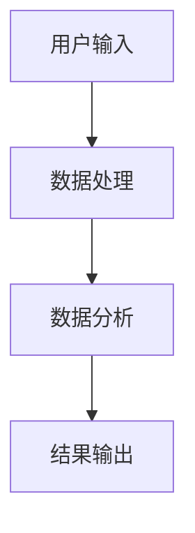

                 


```markdown
# 价值投资中的新型高效光通信材料技术前景

---

## 关键词
光通信材料，价值投资，技术前景，投资策略，市场分析，技术壁垒

---

## 摘要
随着信息技术的飞速发展，光通信材料作为信息传输的核心技术，其重要性日益凸显。本文从价值投资的角度，深入分析了新型高效光通信材料的技术特性、市场前景和投资价值。通过对光通信材料的技术壁垒、市场需求和财务指标的全面评估，结合实际案例分析，提出了基于价值投资策略的投资建议。同时，本文还探讨了未来技术发展趋势和投资机会，为投资者提供了科学的决策依据。

---

# 第1章: 光通信材料与价值投资概述

## 1.1 光通信材料的基本概念
### 1.1.1 光通信材料的定义
光通信材料是指用于光信号传输和处理的材料，主要包括光纤材料、光放大器材料、激光器材料等。这些材料通过光信号的折射、反射和放大，实现高速、大容量的信息传输。

### 1.1.2 光通信材料的分类
光通信材料主要分为光纤材料、光放大器材料和光开关材料三类。光纤材料主要用于信号传输，光放大器材料用于信号增强，光开关材料用于信号路由。

### 1.1.3 光通信材料的重要性
光通信材料是光通信系统的核心组成部分，其性能直接决定了光通信系统的传输容量、传输距离和传输质量。

## 1.2 价值投资的基本概念
### 1.2.1 价值投资的定义
价值投资是一种以低于内在价值的价格买入优质资产的投资策略，强调长期持有，关注企业的基本面和内在价值。

### 1.2.2 价值投资的核心理念
价值投资的核心理念是寻找具有持续竞争优势和良好财务状况的企业，以低于其内在价值的价格买入并长期持有，获得超额收益。

### 1.2.3 价值投资与科技行业的结合
科技行业的价值投资需要结合技术创新、市场需求和企业财务状况等因素，寻找具有长期增长潜力和竞争优势的科技企业。

## 1.3 光通信材料技术与价值投资的结合
### 1.3.1 光通信技术的发展趋势
光通信技术正朝着高速化、大容量化和智能化方向发展，新型高效光通信材料是推动这一发展的关键。

### 1.3.2 光通信材料在投资中的潜在价值
新型高效光通信材料技术壁垒高、市场需求大，具有较高的投资价值。投资者可以通过分析企业的技术优势、市场地位和财务状况，找到具有长期增长潜力的企业。

### 1.3.3 价值投资视角下的光通信材料技术前景
从价值投资的角度来看，新型高效光通信材料具有较高的技术壁垒和市场前景，是值得长期关注的投资领域。

---

# 第2章: 新型高效光通信材料的技术特性

## 2.1 新型高效光通信材料的分类
### 2.1.1 高折射率材料
高折射率材料具有较高的光折射能力，适用于光纤制造和光信号传输。

### 2.1.2 低折射率材料
低折射率材料具有较低的光折射能力，适用于光信号的反射和控制。

### 2.1.3 光纤材料
光纤材料是光通信系统的核心材料，主要包括二氧化硅、掺杂光纤等。

## 2.2 光通信材料的性能指标
### 2.2.1 折射率
折射率是光通信材料的重要性能指标，决定了光信号的传输路径和速度。

### 2.2.2 衰减系数
衰减系数是衡量光信号传输过程中能量损失的重要指标，决定了光通信系统的传输距离。

### 2.2.3 稳定性
稳定性是光通信材料在复杂环境下的性能表现，决定了系统的可靠性和使用寿命。

## 2.3 新型高效光通信材料的制备工艺
### 2.3.1 晶体生长技术
晶体生长技术是制造高折射率光通信材料的关键工艺，包括提拉法、熔融法等。

### 2.3.2 薄膜沉积技术
薄膜沉积技术是制造低折射率光通信材料的重要工艺，包括蒸镀、溅射等方法。

### 2.3.3 光纤预制棒技术
光纤预制棒技术是制造光纤材料的核心工艺，决定了光纤的性能和成本。

---

# 第3章: 光通信材料技术的市场分析与投资价值

## 3.1 光通信行业的市场规模与发展趋势
### 3.1.1 全球光通信市场规模分析
全球光通信市场规模持续增长，预计未来几年将以年均8%的速度增长。

### 3.1.2 中国光通信市场的现状与未来
中国光通信市场发展迅速，已成为全球最大的光通信市场之一，未来将继续保持快速增长。

### 3.1.3 光通信材料技术的市场需求
随着5G、数据中心等需求的增加，新型高效光通信材料的市场需求将持续增长。

## 3.2 新型高效光通信材料的技术壁垒与竞争优势
### 3.2.1 技术壁垒分析
新型高效光通信材料具有较高的技术壁垒，需要企业具备较强的研发能力和技术储备。

### 3.2.2 市场竞争优势
具有技术优势的企业在市场竞争中占据主导地位，能够获得更高的市场份额和利润率。

### 3.2.3 技术创新对企业价值的影响
技术创新能够提高企业的竞争力，增强企业的市场地位，从而提升企业的内在价值。

## 3.3 光通信材料技术的财务分析与投资评估
### 3.3.1 财务指标分析
通过对企业的收入、利润、研发投入等财务指标的分析，评估企业的财务健康状况和成长潜力。

### 3.3.2 投资回报率评估
通过计算投资回报率，评估投资项目的经济效益和可行性。

### 3.3.3 风险分析与风险管理
分析投资中的各种风险因素，包括市场风险、技术风险、财务风险等，并制定相应的风险管理策略。

---

# 第4章: 价值投资策略与光通信材料技术的结合

## 4.1 价值投资策略的基本原则
### 4.1.1 价值投资的核心原则
价值投资强调以合理的价格买入具有持续竞争优势的企业，长期持有，获得稳定的收益。

### 4.1.2 投资策略的制定
根据企业的基本面和技术优势，制定长期投资策略，注重企业的内在价值和成长潜力。

## 4.2 光通信材料技术的投资策略
### 4.2.1 技术领先企业的选择
选择具有技术领先优势的企业，关注企业的研发投入和技术储备。

### 4.2.2 市场地位的评估
评估企业的市场地位和竞争优势，选择具有强大市场地位的企业。

### 4.2.3 财务状况的分析
通过分析企业的财务状况，选择财务健康、具有稳定收益能力的企业。

## 4.3 投资组合的构建与优化
### 4.3.1 投资组合的构建
根据企业的技术优势、市场地位和财务状况，构建多元化投资组合。

### 4.3.2 投资组合的优化
定期评估投资组合的表现，优化投资组合，降低风险，提高收益。

---

# 第5章: 项目实战与案例分析

## 5.1 项目背景与目标
### 5.1.1 项目背景
本项目旨在通过分析新型高效光通信材料的技术特性和市场前景，寻找具有投资价值的企业。

### 5.1.2 项目目标
通过案例分析，验证价值投资策略在光通信材料技术投资中的有效性。

## 5.2 系统架构与功能设计
### 5.2.1 系统架构设计
使用Mermaid绘制系统架构图，展示系统的功能模块和数据流。



### 5.2.2 功能模块设计
系统主要包括数据采集、数据分析、投资评估和结果输出四个功能模块。

## 5.3 项目实现与代码分析
### 5.3.1 环境安装
需要安装Python、Pandas、Matplotlib等工具。

### 5.3.2 核心代码实现
```python
import pandas as pd
import matplotlib.pyplot as plt

# 数据加载
data = pd.read_csv('通信材料数据.csv')

# 数据分析
data['增长率'] = data['收入'].pct_change()

# 图表绘制
plt.plot(data['年份'], data['增长率'])
plt.xlabel('年份')
plt.ylabel('增长率')
plt.title('光通信材料市场增长率')
plt.show()
```

### 5.3.3 代码解读与分析
上述代码实现了数据加载、增长率计算和图表绘制，帮助投资者直观了解市场增长趋势。

## 5.4 实际案例分析
### 5.4.1 成功案例
分析某光通信材料企业的投资案例，展示价值投资策略的成功应用。

### 5.4.2 失败案例
分析某光通信材料企业的投资失败案例，总结教训，避免类似错误。

## 5.5 项目小结
通过案例分析，验证了价值投资策略在光通信材料技术投资中的有效性，为投资者提供了实际操作的参考。

---

# 第6章: 光通信材料技术的未来趋势与投资机会

## 6.1 光通信材料技术的未来发展趋势
### 6.1.1 新材料的开发
未来将开发更多新型材料，进一步提升光通信系统的性能。

### 6.1.2 智能化技术的应用
智能化技术将推动光通信系统的智能化发展，提高系统的自适应能力和效率。

## 6.2 光通信材料技术的投资机会
### 6.2.1 新材料的投资机会
新型材料的研发和应用将带来新的投资机会。

### 6.2.2 智能化技术的投资机会
智能化技术的应用将推动光通信系统的升级，带来新的投资机会。

## 6.3 未来投资策略的调整
### 6.3.1 技术创新的关注
未来投资应更加关注技术创新，选择具有技术优势的企业。

### 6.3.2 市场需求的把握
准确把握市场需求，选择符合市场趋势的企业。

---

# 第7章: 总结与展望

## 7.1 全文总结
本文从价值投资的角度，深入分析了新型高效光通信材料的技术特性、市场前景和投资价值，提出了基于价值投资策略的投资建议。

## 7.2 对未来展望
随着光通信技术的不断发展，新型高效光通信材料的投资价值将更加显著，未来将有更多的投资机会。

---

## 小结与注意事项

### 小结
新型高效光通信材料技术前景广阔，具有较高的投资价值。投资者应结合企业的技术优势、市场地位和财务状况，制定科学的投资策略，选择具有长期增长潜力的企业。

### 注意事项
1. 投资者应关注企业的技术创新和研发投入，选择具有技术优势的企业。
2. 投资者应注重企业的财务健康状况，避免投资于财务状况不佳的企业。
3. 投资者应分散投资，降低投资风险，提高投资收益。

---

## 拓展阅读

1. 光通信材料技术的最新研究进展
2. 价值投资在其他科技领域的应用
3. 光通信系统的未来发展趋势

---

# 附录

## 附录A: 相关术语解释
- 光通信材料：用于光信号传输和处理的材料，包括光纤材料、光放大器材料等。
- 价值投资：一种以低于内在价值的价格买入优质资产的投资策略，强调长期持有。

## 附录B: 数据来源与参考文献
- 数据来源：公开市场数据、企业财报、行业研究报告等。
- 参考文献：略

---

# 结束语

通过本文的分析，投资者可以更好地理解新型高效光通信材料的技术前景和投资价值，制定科学的投资策略，实现长期稳定的投资收益。
```

