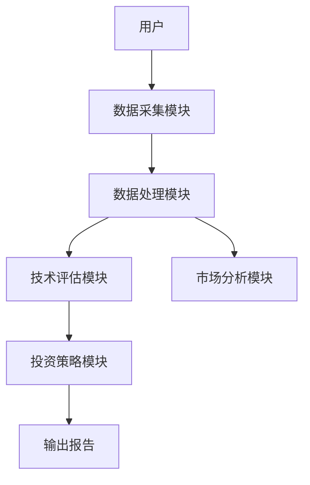

                 


# 价值投资中的新型高效太阳能电池技术

> 关键词：价值投资，太阳能电池，高效技术，投资策略，技术分析，市场趋势

> 摘要：本文深入探讨了高效太阳能电池技术在价值投资中的应用潜力。通过分析技术原理、市场趋势和投资策略，揭示了如何将技术创新与投资机会相结合，为投资者提供科学的决策依据。

---

## 第一部分：背景介绍

### 第1章：高效太阳能电池技术的核心概念

#### 1.1 太阳能电池的基本概念
高效太阳能电池是一种能够将 sunlight 转化为 electricity 的设备。随着技术的进步，其效率不断提高，成为可再生能源领域的重要组成部分。

#### 1.2 高效太阳能电池的分类
- 单晶硅电池
- 多晶硅电池
- 薄膜电池
- 铜铟镓硒电池

#### 1.3 技术进步对投资的影响
技术进步降低了成本，提高了效率，从而增加了投资回报。

---

### 第2章：价值投资与高效太阳能电池技术的结合

#### 2.1 价值投资的基本概念
价值投资是一种通过分析企业基本面，寻找被市场低估的投资标的。

#### 2.2 高效太阳能电池技术的市场价值
高效技术意味着更低的成本和更高的收益，提升了企业的竞争力。

#### 2.3抽高效技术对投资决策的影响
技术进步是影响企业价值的关键因素，投资者需要关注技术路线和发展潜力。

---

## 第二部分：核心概念与联系

### 第3章：高效太阳能电池技术的核心原理

#### 3.1 光电转换的基本原理
光线进入半导体材料，产生电子-空穴对，通过 PN 结分离，形成电流。

#### 3.2 影响效率的关键因素
- 材料质量
- 结构设计
- 制造工艺

#### 3.3 技术路线对比分析
| 技术路线 | 优点 | 缺点 |
|----------|------|------|
| 单晶硅 | 高效 | 成本高 |
| 多晶硅 | 成本低 | 效率低 |
| 薄膜 | 灵活性高 | 衰退率高 |

---

## 第三部分：算法原理讲解

### 第4章：高效太阳能电池的数学模型

#### 4.1 能量转换效率的公式
$$ E_{eff} = \frac{P_{out}}{P_{in}} $$

#### 4.2 优化算法
使用遗传算法优化电池结构参数，如厚度和掺杂浓度。

#### 4.3 代码实现
```python
import numpy as np
from sklearn import linear_model

# 数据准备
X = np.array([1, 2, 3, 4, 5])
y = np.array([2, 4, 5, 4, 6])

# 线性回归模型
model = linear_model.LinearRegression()
model.fit(X.reshape(-1, 1), y)

# 预测
print(model.predict([[3]]))
```

---

## 第四部分：系统分析与架构设计

### 第5章：系统架构设计

#### 5.1 项目背景
随着能源需求增长，高效太阳能技术成为投资热点。

#### 5.2 功能模块设计
- 技术评估模块
- 市场分析模块
- 投资策略模块

#### 5.3 系统架构图


---

## 第五部分：项目实战

### 第6章：高效太阳能电池技术的项目实战

#### 6.1 环境安装
安装必要的数据分析库，如Pandas和Matplotlib。

#### 6.2 核心代码实现
```python
import pandas as pd
import matplotlib.pyplot as plt

# 数据读取
data = pd.read_csv('solar_efficiency.csv')

# 数据可视化
plt.plot(data['Year'], data['Efficiency'])
plt.xlabel('年份')
plt.ylabel('效率')
plt.title('太阳能效率变化趋势')
plt.show()
```

#### 6.3 案例分析
分析某公司技术路线和市场表现，制定投资策略。

---

## 第六部分：最佳实践

### 第7章：高效太阳能电池技术投资的注意事项

#### 7.1抽小结
技术进步是投资的关键，但需关注市场和政策风险。

#### 7.2 投资建议
- 关注技术创新型企业
- 分散投资风险
- 长期持有优质标的

#### 7.3 拓展阅读
推荐相关书籍和报告，深入学习技术与投资知识。

---

通过以上步骤，我们可以清晰地看到，高效太阳能电池技术在价值投资中的应用潜力。投资者需结合技术分析和市场趋势，制定科学的投资策略，以实现长期收益。

