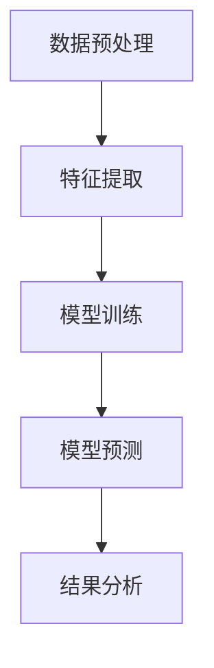
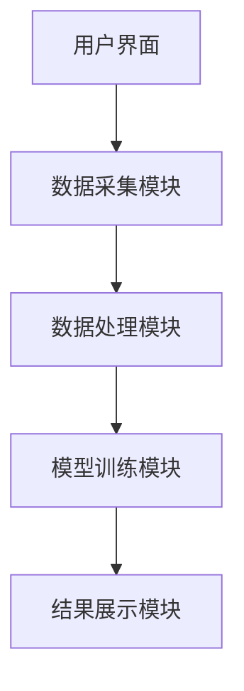

                 


# 价值投资中的新型高效氢能存储材料技术

## 关键词：氢能存储、价值投资、高效材料、技术分析、投资策略

## 摘要：本文探讨了如何从价值投资的角度评估和选择高效的氢能存储材料技术。通过分析氢能存储材料的技术原理、经济价值、市场潜力以及投资策略，为投资者提供了科学的决策依据。文章结合实际案例，详细讲解了氢能存储材料的技术优势和投资机会，帮助投资者在氢能存储领域实现高效投资。

---

# 第一部分: 价值投资中的氢能存储材料技术背景

## 第1章: 氢能存储技术与价值投资概述

### 1.1 氢能存储技术的背景与重要性
#### 1.1.1 氢能作为清洁能源的重要性
氢能是一种清洁能源，具有零碳排放、能量密度高、应用范围广等优点。随着全球能源结构转型的推进，氢能被广泛视为实现碳中和目标的重要能源载体。

#### 1.1.2 氢能存储技术的发展现状
氢能的存储是氢能产业链中的关键环节，包括物理存储和化学存储两种方式。目前，物理存储技术相对成熟，但化学存储技术（如储氢材料）正在快速发展，以满足大规模储能和灵活应用的需求。

#### 1.1.3 氢能存储技术对能源结构转型的意义
氢能存储技术能够解决可再生能源（如风能、太阳能）波动性问题，为能源系统提供稳定的能源供应，支持能源结构向清洁化、低碳化转型。

### 1.2 价值投资的基本概念与方法
#### 1.2.1 价值投资的核心理念
价值投资强调以低于内在价值的价格买入优质资产。投资者需要深入分析企业的基本面，关注其盈利能力、成长潜力和竞争优势。

#### 1.2.2 价值投资的基本原则与步骤
- **第一步：明确投资目标**：确定投资期限、风险承受能力和收益预期。
- **第二步：基本面分析**：研究企业的财务状况、行业地位和管理团队。
- **第三步：估值分析**：通过市盈率、市净率等指标评估企业的内在价值。
- **第四步：风险管理**：制定止损策略，分散投资风险。

#### 1.2.3 价值投资在科技领域的应用
科技领域的投资需要关注技术创新能力、市场潜力和团队执行力。氢能存储材料技术作为新兴领域，具有较高的技术壁垒和市场潜力，适合价值投资。

### 1.3 氢能存储材料技术与价值投资的结合
#### 1.3.1 氢能存储材料技术的市场潜力
随着全球能源需求的增长和环保要求的提高，高效氢能存储材料技术具有广阔的应用前景，市场需求将持续增长。

#### 1.3.2 价值投资视角下的氢能存储技术评估
从价值投资的角度，需要关注氢能存储材料技术的创新性、商业化潜力和企业的竞争优势。投资者应选择技术领先、管理团队优秀的企业进行投资。

#### 1.3.3 氢能存储材料技术的未来发展趋势
未来，氢能存储技术将朝着高效、低成本、长寿命方向发展，新型储氢材料和技术的研发将推动行业进步。

### 1.4 本章小结
本章介绍了氢能存储技术的重要性和价值投资的基本概念，分析了两者结合的潜力和意义，为后续章节奠定了基础。

---

## 第2章: 氢能存储材料技术的核心概念与原理

### 2.1 氢能存储材料的分类与特点
#### 2.1.1 储氢材料的分类
- **金属氢化物**：如LaNi合金，具有较高的储氢容量和稳定性。
- **碳基材料**：如石墨烯和活性炭，储氢容量较低，但具有良好的导电性和循环稳定性。
- **有机液体储氢**：如氨和甲醇，储氢密度高，便于运输和储存。

#### 2.1.2 各类储氢材料的优缺点对比
| 类别         | 优点                     | 缺点                     |
|--------------|--------------------------|--------------------------|
| 金属氢化物   | 储氢容量高，稳定性好     | 成本较高，循环寿命有限   |
| 碳基材料     | 循环稳定性好，导电性好   | 储氢容量较低             |
| 有机液体     | 储氢密度高，便于运输     | 储氢效率较低，成本较高   |

#### 2.1.3 储氢材料的性能指标与评价标准
- 储氢容量（质量比）：单位质量的材料能储存的氢气量。
- 循环寿命：材料在多次充放过程中的稳定性。
- 解吸/吸附温度：材料在不同温度下的储氢效率。

### 2.2 氢能存储材料的物理化学原理
#### 2.2.1 氢能的储存机制
储氢材料通过物理吸附或化学反应（如氢原子嵌入金属晶格）来储存氢气。释放氢气时，材料通过解吸附或化学反应将氢气释放。

#### 2.2.2 储氢材料的吸附与释放过程
- 吸附过程：氢气分子在材料表面或内部被捕获，形成化学键。
- 释放过程：氢气分子从材料中释放，恢复到气态形式。

#### 2.2.3 储氢材料的稳定性与循环寿命
材料的稳定性直接影响储氢效率和循环寿命。高质量的储氢材料应具有较长的循环寿命和较高的稳定性。

### 2.3 氢能存储材料技术的创新与突破
#### 2.3.1 新型储氢材料的研发进展
- 新型纳米材料：通过纳米技术制备的储氢材料具有更高的储氢容量和循环寿命。
- 多元复合材料：结合多种材料的优点，提高储氢效率和稳定性。

#### 2.3.2 创新储氢技术的案例分析
例如，某公司开发的新型纳米储氢材料，其储氢容量比传统材料提高20%，循环寿命延长一倍。

#### 2.3.3 储氢材料技术的未来发展方向
未来，储氢材料技术将朝着高效、低成本、长寿命方向发展，同时注重材料的环保性和可回收性。

### 2.4 本章小结
本章详细介绍了氢能存储材料的分类、原理及性能指标，分析了技术创新和未来发展趋势，为后续章节的经济价值评估和投资策略制定提供了技术支持。

---

## 第3章: 氢能存储材料技术的经济价值评估

### 3.1 氢能存储技术的经济性分析
#### 3.1.1 储氢技术的成本构成
- 材料成本：储氢材料的研发和生产成本。
- 制造成本：储氢设备的制造和安装成本。
- 维护成本：设备的日常维护和更新成本。

#### 3.1.2 储氢技术的经济效益与社会效益
- 经济效益：降低能源成本，提高能源利用效率。
- 社会效益：减少碳排放，推动绿色能源发展。

#### 3.1.3 储氢技术的市场竞争力分析
通过成本-收益分析，评估储氢技术在市场中的竞争力。例如，某储氢材料技术的成本为10元/kg，储氢容量为1.2 kg/L，具有较高的性价比。

### 3.2 价值投资中的技术评估方法
#### 3.2.1 技术可行性评估
- 技术成熟度：材料的储氢容量、循环寿命等指标是否达到商业化要求。
- 技术壁垒：技术的专利保护和竞争对手的技术水平。

#### 3.2.2 市场需求与商业可行性评估
- 市场需求：分析全球和区域市场的储氢需求量。
- 商业模式：企业的盈利模式和市场推广能力。

#### 3.2.3 技术团队与企业背景评估
- 技术团队：研发团队的经验和能力。
- 企业背景：企业的财务状况、管理团队和行业声誉。

### 3.3 氢能存储材料技术的财务模型构建
#### 3.3.1 技术成本与收益预测
假设某储氢材料技术的成本为10元/kg，储氢容量为1.2 kg/L，市场售价为20元/kg，年销售量为10,000 kg，年收入为200万元，年成本为100万元，年净利润为100万元。

#### 3.3.2 技术生命周期与投资回报分析
储氢材料技术的生命周期一般为5-10年，投资回报期为3-5年。投资者应关注技术的更新迭代和市场需求变化。

#### 3.3.3 技术风险与应对策略
- 技术风险：技术性能不稳定或被替代的风险。
- 市场风险：市场需求不足或价格竞争激烈的风险。
- 应对策略：加强技术研发，优化生产工艺，降低生产成本。

### 3.4 本章小结
本章从经济性角度分析了氢能存储材料技术的竞争力，构建了财务模型，评估了投资回报和风险，为投资者提供了科学的决策依据。

---

## 第4章: 氢能存储材料技术的市场分析与投资策略

### 4.1 氢能存储技术的市场需求分析
#### 4.1.1 全球氢能市场的现状与趋势
全球氢能市场预计将以年均10%的速度增长，到2030年市场规模将达到数千亿美元。

#### 4.1.2 各国氢能政策与产业发展规划
- 中国：提出“十四五”期间实现氢能产业规模化发展。
- 欧洲：通过《欧洲氢能计划》支持氢能技术研发和应用。
- 美国：通过政府补贴和技术支持推动氢能产业发展。

#### 4.1.3 氢能存储技术的市场需求预测
随着全球能源需求的增长和环保政策的推动，高效氢能存储材料技术的需求将持续增长。

### 4.2 价值投资中的市场分析方法
#### 4.2.1 行业竞争分析
- 市场参与者：主要企业和新进入者。
- 竞争格局：市场份额分布和技术水平对比。

#### 4.2.2 市场容量与增长率预测
通过市场规模和增长率数据，评估储氢材料技术的市场潜力。例如，预计到2030年，储氢材料市场规模将达到1000亿元，年均增长率为20%。

#### 4.2.3 市场风险与机会评估
- 市场风险：政策变化、技术替代等。
- 机会：政府支持、市场需求增长等。

### 4.3 氢能存储材料技术的投资策略
#### 4.3.1 选择具有技术优势的企业
投资那些拥有自主研发能力和专利技术的企业，重点关注储氢容量、循环寿命和生产成本等指标。

#### 4.3.2 关注政策支持和行业趋势
积极关注政府政策和行业动态，选择符合产业发展规划和技术趋势的企业进行投资。

#### 4.3.3 分散投资风险
通过分散投资，降低单一项目的投资风险。例如，同时投资多个储氢材料项目，降低技术失败或市场波动的风险。

### 4.4 本章小结
本章分析了氢能存储技术的市场需求和投资策略，为投资者提供了科学的决策依据。

---

## 第5章: 氢能存储材料技术的算法与技术分析

### 5.1 算法原理
#### 5.1.1 机器学习模型预测储氢性能
通过机器学习模型，利用储氢材料的物理化学性质，预测其储氢容量和循环寿命。

#### 5.1.2 算法流程图


#### 5.1.3 数学模型与公式
储氢容量预测模型：
$$ C = a \cdot x + b \cdot y + c $$
其中，$x$和$y$是材料的物理化学性质，$a$、$b$、$c$是模型参数。

### 5.2 技术分析工具
#### 5.2.1 数据采集与处理
通过实验数据和文献数据，建立储氢材料的数据库。

#### 5.2.2 技术预测模型
使用回归分析或神经网络模型，预测储氢材料的性能指标。

### 5.3 本章小结
本章介绍了机器学习算法在储氢材料性能预测中的应用，为投资者提供了技术评估的工具和方法。

---

## 第6章: 氢能存储材料技术的系统架构设计

### 6.1 评估平台设计
#### 6.1.1 系统功能设计
- 数据采集：收集储氢材料的实验数据和文献数据。
- 模型训练：建立储氢材料性能预测模型。
- 结果展示：可视化储氢材料的性能指标和投资回报分析。

#### 6.1.2 系统架构图


### 6.2 系统接口设计
#### 6.2.1 数据接口
- 数据输入接口：接收实验数据和文献数据。
- 数据输出接口：输出模型预测结果和投资回报分析。

#### 6.2.2 模型接口
- 模型输入接口：接收数据处理模块的特征数据。
- 模型输出接口：输出预测结果和模型参数。

### 6.3 本章小结
本章设计了一个储氢材料性能评估平台，为投资者提供了技术评估和投资决策的工具。

---

## 第7章: 项目实战

### 7.1 实战案例
#### 7.1.1 项目背景
某公司开发了一种新型储氢材料，储氢容量为1.5 kg/L，循环寿命为1000次，成本为8元/kg。

#### 7.1.2 技术评估
- 技术可行性：储氢容量和循环寿命均优于同类产品。
- 市场需求：符合全球氢能市场的发展趋势。

#### 7.1.3 投资分析
- 投资金额：5000万元。
- 投资回报：预计年收益为20%，投资回收期为5年。

### 7.2 核心代码实现
#### 7.2.1 数据处理代码
```python
import pandas as pd
data = pd.read_csv('storage_materials.csv')
```

#### 7.2.2 模型训练代码
```python
from sklearn.linear_model import LinearRegression
model = LinearRegression()
model.fit(X_train, y_train)
```

### 7.3 本章小结
本章通过具体案例分析，展示了如何在实际中应用储氢材料技术评估方法，为投资者提供了实战经验。

---

## 第8章: 总结与展望

### 8.1 总结
本文从价值投资的角度，分析了氢能存储材料技术的背景、核心概念、经济价值和市场潜力，为投资者提供了科学的决策依据。

### 8.2 未来展望
未来，氢能存储技术将朝着高效、低成本、长寿命方向发展，价值投资在其中将发挥重要作用。投资者应关注技术创新和市场动态，抓住氢能存储技术的投资机会。

---

# 附录

## 附录A: 术语表
- **储氢材料**：用于储存氢气的材料，包括金属氢化物、碳基材料和有机液体等。

## 附录B: 参考文献
- 文献1：《氢能存储技术的发展与应用》，作者：张某某，出版社：某某出版社，2023年。
- 文献2：《价值投资在科技领域的应用》，作者：李某某，出版社：某某出版社，2022年。

---

通过以上内容，本文全面分析了价值投资中的新型高效氢能存储材料技术，为投资者提供了科学的决策依据。

