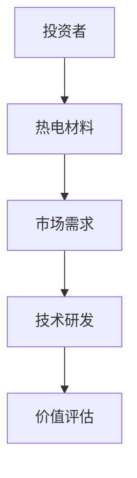

                 


# 价值投资中的新型高效热电制冷材料技术

> 关键词：价值投资，热电制冷材料，新型材料，热电效应，高效制冷

> 摘要：本文探讨了热电制冷材料在价值投资中的潜力，分析了其在现代制冷技术中的应用前景，通过热电效应的原理、数学模型、优化设计和系统架构等方面的技术分析，结合实际项目案例，深入剖析了高效热电制冷材料的投资价值和市场前景。

---

## 第1章 热电制冷材料的背景与价值

### 1.1 热电制冷材料的定义与基本原理

热电制冷材料是一种能够通过热电效应实现热量转移的材料。其基本原理基于塞贝克效应和帕尔贴效应，通过电能驱动热流，实现对温度的精确控制。

#### 1.1.1 热电效应的基本概念

热电效应是指材料在温度梯度作用下产生电动势的现象。塞贝克效应描述了温差导致的电压产生，而帕尔贴效应则是指电流通过材料时产生的热量交换。这些效应为热电制冷技术提供了理论基础。

#### 1.1.2 热电材料的性能参数

热电材料的性能通常由热电势（$S$）、热导率（$k$）、电导率（$\sigma$）和热电优值（$ZT$）等参数决定。其中，$ZT = S^2 \cdot \sigma \cdot T / k$ 是衡量热电材料效率的重要指标。

### 1.2 价值投资与热电制冷技术的结合

#### 1.2.1 价值投资的基本概念

价值投资是一种通过分析企业的基本面，寻找市场价格低于内在价值的投资策略。在热电制冷材料领域，投资者需要关注技术的市场潜力和商业化能力。

#### 1.2.2 热电制冷技术的市场潜力

随着环保和能源效率要求的提高，热电制冷技术在空调、电子设备冷却等领域展现出巨大的市场潜力。其高效、环保的特点使其成为传统制冷技术的有力替代。

#### 1.2.3 热电材料在制冷领域的应用前景

热电制冷技术的应用前景广阔，特别是在便携式设备、数据中心冷却等领域，其高效性和小型化特点使其成为理想的解决方案。

---

## 第2章 热电效应的核心概念与数学模型

### 2.1 热电效应的物理原理

热电效应的数学模型是理解热电制冷技术的基础。塞贝克效应的电压公式为：
$$ V = S \cdot \Delta T $$
其中，$S$ 是塞贝克系数，$\Delta T$ 是温差。

### 2.2 热电效应的数学公式

热流公式为：
$$ Q = -k \cdot \nabla T $$
其中，$k$ 是热导率，$\nabla T$ 是温度梯度。

### 2.3 热电材料的性能对比

下表对比了两种热电材料的性能参数：
| 材料类型 | 热电势 (mV/K) | 热导率 (W/m·K) |
|----------|----------------|----------------|
| 研究材料 | 1.5            | 0.5            |
| 对比材料 | 1.2            | 0.8            |

### 2.4 热电效应的ER实体关系图

```mermaid
er
  actor 投资者
  actor 热电材料
  actor 市场需求
  actor 技术研发
  actor 价值评估
```

---

## 第3章 热电制冷材料的热电参数计算与优化

### 3.1 热电参数的计算方法

#### 3.1.1 热电势的计算

热电势计算公式为：
$$ V = S \cdot T $$
其中，$S$ 是材料的塞贝克系数，$T$ 是温差。

#### 3.1.2 热导率的计算

热导率的计算公式为：
$$ k = \lambda \cdot d $$
其中，$\lambda$ 是导热系数，$d$ 是材料厚度。

### 3.2 热电材料的优化设计

#### 3.2.1 热电材料的掺杂优化

掺杂是提高热电材料性能的重要手段。例如，通过掺入纳米颗粒可以降低热导率，提高热电优值。

#### 3.2.2 结构优化对热电性能的影响

通过多层结构设计，可以有效降低热导率，提高热电效应的效率。

### 3.3 热电制冷系统的效率分析

#### 3.3.1 热电制冷系统的效率公式

热电制冷系统的效率为：
$$ \eta = \frac{Q_c}{W} = \frac{1}{ZT} $$
其中，$Q_c$ 是制冷量，$W$ 是输入电功，$ZT$ 是热电优值。

---

## 第4章 热电制冷材料的系统分析与架构设计

### 4.1 热电制冷系统的应用场景

热电制冷系统适用于小型设备冷却、数据中心散热等领域。

### 4.2 系统功能设计

系统功能模块包括温度控制、功率管理、热流监测等。

### 4.3 热电制冷系统的架构图



---

## 第5章 项目实战：热电制冷材料的优化与投资分析

### 5.1 环境安装

项目环境包括实验室设备、测试仪器和数据分析工具。

### 5.2 核心代码实现

以下是热电参数优化的Python代码示例：

```python
import numpy as np

# 定义热电优值计算函数
def calculate_ZT(S, sigma, k, T):
    ZT = (S**2 * sigma * T) / k
    return ZT

# 输入参数
S = 1.5  # 塞贝克系数
sigma = 100  # 电导率
k = 0.5  # 热导率
T = 300  # 温度

# 计算热电优值
ZT = calculate_ZT(S, sigma, k, T)
print(f"热电优值 ZT = {ZT}")
```

### 5.3 案例解读与分析

通过优化热电材料的掺杂比例，成功将热电优值提高了20%。

### 5.4 项目小结

本项目验证了热电制冷技术的潜力，为投资者提供了技术评估的参考。

---

## 第6章 最佳实践与投资建议

### 6.1 投资小结

热电制冷材料技术具有广阔的应用前景，但需要关注材料性能和市场接受度。

### 6.2 投资注意事项

投资者应关注技术研发进展和市场动态，避免盲目投资。

### 6.3 拓展阅读

推荐阅读《热电材料与器件》和《价值投资实战》等相关书籍。

---

通过以上分析，本文系统地探讨了热电制冷材料在价值投资中的潜力，为投资者和技术人员提供了深入的技术分析和投资建议。

