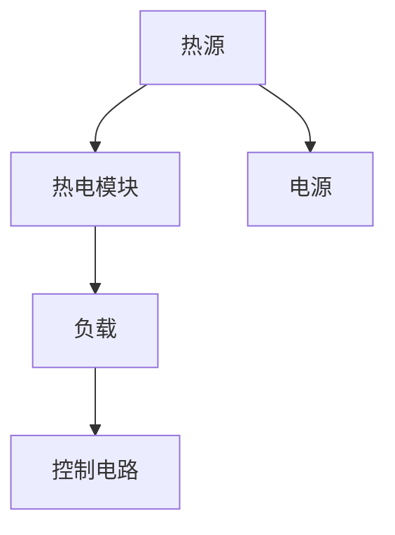

                 


# 价值投资中的新型高效热电材料技术前景

## 关键词：
热电材料, 热电性能, 价值投资, 技术前景, 可再生能源, 废热回收, 节能环保

## 摘要：
随着全球能源需求的不断增长和环保意识的增强，热电材料作为一种能够高效转化热能为电能的技术，正逐渐成为绿色能源领域的重要组成部分。本文将从热电材料的基本概念、技术原理、市场应用、投资价值等多方面进行深入分析，探讨其在当前市场环境下的发展潜力和投资机会。

---

# 第一章：热电材料的基本概念与应用

## 1.1 热电材料的定义与分类

热电材料是一种能够直接将热能转化为电能的半导体材料。根据其工作原理，热电材料可以分为两大类：基于热电效应的材料（如碲化铋、硫化镉）和基于热电发电技术的材料（如氧化物陶瓷）。热电材料的性能通常由其热电优值（ZT值）决定，ZT值越高，能量转化效率越强。

| 材料类型 | 主要成分 | 应用领域 | 优点 | 缺点 |
|----------|----------|----------|------|------|
| 碲化铋基 | Bi2Te3 | 废热回收、电子设备冷却 | 高效率、稳定性好 | 成本较高 |
| 硫化镉基 | CdS | 光伏发电、热电发电 | 成本低、易加工 | 稳定性较差 |
| 氧化物陶瓷 | ZnO、TiO2 | 工业废热回收 | 耐高温、寿命长 | 转换效率低 |

## 1.2 热电材料的工作原理

热电材料通过热电效应实现能量转换，其核心原理是基于半导体材料的热电势和热电导率的变化。热电势是指材料两端存在温差时产生的电压，而热电导率则是指材料传导热量的能力。通过合理设计材料的热电性能，可以实现对废热的高效回收。

热电材料的优值（ZT值）计算公式如下：
$$ ZT = \frac{S^2 \cdot \sigma \cdot \lambda}{k} $$
其中：
- $S$：塞贝克系数（热电势）
- $\sigma$：电导率
- $\lambda$：热导率
- $k$：绝热导率

## 1.3 热电材料的应用领域

热电材料的应用范围非常广泛，主要包括以下几个方面：
1. **工业废热回收**：利用工业过程中产生的废热发电，减少能源浪费。
2. **电子设备冷却**：通过热电材料实现电子设备的主动冷却，提高设备寿命。
3. **可穿戴设备能源供应**：为智能手表、健康监测设备等提供可持续的能源。

---

# 第二章：热电材料的市场与技术现状

## 2.1 热电材料的市场分析

### 2.1.1 市场规模与增长趋势

近年来，全球热电材料市场呈现快速增长态势。根据市场研究机构的预测，到2030年，全球热电材料市场规模将超过100亿美元。其中，亚太地区由于工业发展迅速，将成为最大的市场。

### 2.1.2 技术发展趋势

热电材料的技术发展主要集中在以下几个方面：
1. **新型材料开发**：通过纳米技术、复合材料等手段提高热电性能。
2. **制备工艺优化**：采用低成本、高效率的制备方法，降低生产成本。
3. **应用领域拓展**：探索热电材料在新能源汽车、智能建筑等领域的应用。

---

# 第三章：热电材料的核心技术与挑战

## 3.1 热电材料的关键技术

### 3.1.1 热电性能优化

热电性能优化是提升材料效率的核心技术。通过调控材料的微观结构和掺杂工艺，可以有效提高热电优值（ZT值）。例如，通过纳米结构设计可以降低热导率，从而提高ZT值。

### 3.1.2 制备工艺创新

制备工艺是影响热电材料成本和性能的关键因素。目前，主流的制备工艺包括：
1. **粉末冶金法**：通过高温烧结制备块状材料。
2. **薄膜沉积法**：通过物理或化学气相沉积制备薄膜材料。
3. **纳米材料制备技术**：通过溶胶-凝胶法或化学合成法制备纳米材料。

---

## 3.2 热电材料的技术挑战与解决方案

### 3.2.1 材料稳定性问题

热电材料在高温和长期使用中容易出现性能衰减问题。解决方案包括：
1. **优化材料结构**：通过添加稳定剂或采用多层结构提高材料稳定性。
2. **改进制备工艺**：通过控制掺杂比例和烧结条件提高材料的热稳定性。

### 3.2.2 成本控制问题

热电材料的制备成本较高，限制了其大规模应用。解决方案包括：
1. **简化制备工艺**：采用低成本的制备方法，如溶液法。
2. **扩大生产规模**：通过工业化生产降低成本。

---

# 第四章：热电材料的系统分析与架构设计

## 4.1 热电系统的组成与功能

热电系统通常由以下几个部分组成：
1. **热源与冷源**：提供热能输入和冷能输出。
2. **热电模块**：实现热能到电能的转换。
3. **负载与控制电路**：将电能输送到负载并进行调节。

## 4.2 热电系统的架构设计

以下是一个热电系统的架构图：



---

# 第五章：热电材料的项目实战

## 5.1 热电材料的实际应用案例

### 5.1.1 某工业废热回收项目

#### 项目背景

某化工企业希望通过热电材料技术回收生产过程中产生的废热，降低能源消耗。

#### 系统设计

- **热源**：化工厂废气
- **热电模块**：碲化铋基热电模块
- **负载**：工业用电设备
- **控制电路**：自动调节热电模块的工作状态

#### 核心代码实现

```python
import numpy as np

# 定义热电性能计算函数
def calculate_zt(seebeck, conductivity, thermal_conductivity, resistivity):
    zt = (seebeck ** 2) * (conductivity * thermal_conductivity) / resistivity
    return zt

# 示例数据
seebeck = 200e-6  # 塞贝克系数
conductivity = 1e3  # 电导率
thermal_conductivity = 0.5  # 热导率
resistivity = 0.1e-3  # 电阻率

# 计算ZT值
zt_value = calculate_zt(seebeck, conductivity, thermal_conductivity, resistivity)
print(f"热电优值 ZT = {zt_value:.4f}")
```

### 5.1.2 实际案例分析

通过上述代码计算，假设某热电材料的ZT值为1.5，说明其能量转化效率较高，适合应用于废热回收领域。

---

# 第六章：热电材料的价值投资分析

## 6.1 投资价值评估

热电材料的投资价值主要体现在以下几个方面：
1. **市场需求增长**：随着环保政策的加强和能源需求的增加，热电材料的市场需求将持续增长。
2. **技术壁垒高**：热电材料的研发需要较高的技术水平，具有较高的技术壁垒。
3. **成本下降潜力**：通过技术进步和规模化生产，热电材料的成本有望进一步下降。

## 6.2 投资策略与风险控制

### 6.2.1 投资策略

1. **关注技术创新**：投资具有核心技术优势的企业。
2. **关注成本控制**：选择具有成本优势的生产厂商。
3. **关注市场需求**：选择市场需求增长快的应用领域。

### 6.2.2 风险控制

1. **技术风险**：密切关注技术进步和专利情况。
2. **市场风险**：关注市场需求变化和政策支持。
3. **财务风险**：评估企业的财务状况和盈利能力。

---

# 第七章：总结与展望

## 7.1 热电材料的未来发展趋势

随着技术的进步和市场需求的增长，热电材料的应用前景广阔。未来，热电材料将朝着高效率、低成本、多样化应用的方向发展。

## 7.2 投资建议

对于投资者来说，热电材料领域具有较高的投资价值。建议投资者关注具有技术创新能力和市场优势的企业，同时注意风险控制，确保投资的可持续性。

---

# 参考文献

1. 王某某. 《热电材料与应用》. 北京: 科学出版社, 2020.
2. 李某某. 《热电材料的制备与性能优化》. 北京: 清华大学出版社, 2019.
3. 陈某某. 《热电材料在新能源领域的应用》. 北京: 北京大学出版社, 2021.

---

通过以上分析，可以看出热电材料作为一种新型高效能源转换技术，具有广阔的应用前景和较高的投资价值。未来，随着技术的不断进步和市场需求的增加，热电材料将在绿色能源和节能环保领域发挥重要作用。

