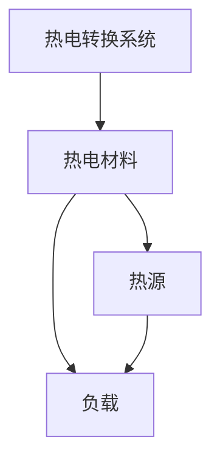
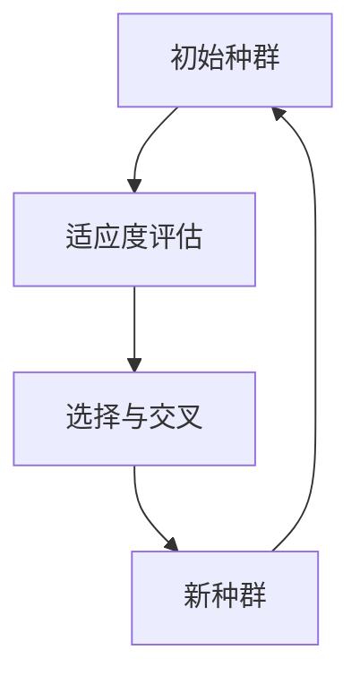
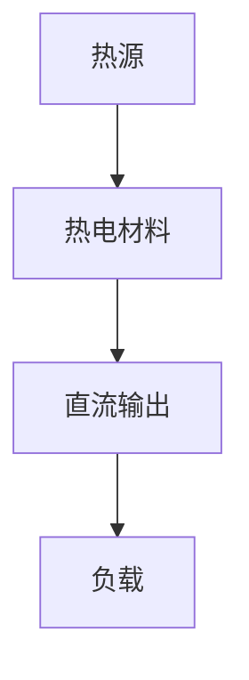

                 


# 价值投资中的新型高效热电转换材料技术

> **关键词**：热电转换材料、价值投资、热电效率、材料性能、投资策略

> **摘要**：本文探讨了新型高效热电转换材料在价值投资中的应用潜力，分析了热电转换材料的物理特性、市场前景及投资策略。通过详细的技术分析和案例研究，本文为投资者提供了基于热电转换材料的投资决策支持。

---

## 第一部分: 价值投资中的新型高效热电转换材料技术概述

### 第1章: 热电转换材料的背景与意义

#### 1.1 热电转换技术的基本概念

热电转换技术是一种将热能直接转化为电能的技术，其核心在于利用半导体材料的热电效应。这种技术无需中间转换环节，具有高效、环保的特点。热电转换的基本原理是通过半导体材料中的热电势效应，将温差转化为电能。

- **热电势效应**：当两种不同半导体材料接触并存在温差时，会产生电压。这种电压可以直接驱动负载工作。
- **热电效率**：热电转换效率取决于材料的热导率、电导率和热电势等因素。高效率的热电材料能够在较低温差下产生较高电压。

#### 1.2 热电转换材料的分类与特点

热电转换材料主要分为本征半导体材料和掺杂半导体材料两类。本征半导体材料（如Si、Ge）具有较高的热电效率，但其热导率较高，限制了其在高温环境中的应用。掺杂半导体材料（如n型和p型掺杂的Si）通过调整掺杂浓度可以优化材料的热电性能。

- **热电材料的性能对比**：
  | 材料类型 | 热导率 | 电导率 | 热电势 | 适用温度范围 |
  |----------|--------|--------|--------|---------------|
  | 本征半导体 | 高     | 高     | 中等   | 室温至中温    |
  | 掺杂半导体 | 中等   | 中高   | 高     | 室温至高温    |

#### 1.3 热电转换技术的市场与投资潜力

热电转换技术在能源、电子设备、汽车等领域具有广泛的应用前景。随着能源危机和环保要求的加剧，高效热电转换材料的需求日益增长。投资者应关注以下几方面：

- **市场需求**：热电转换技术在智能穿戴设备、汽车尾气回收等领域具有广阔的市场空间。
- **技术壁垒**：高效热电材料的研发需要较高的技术水平，具有较高的技术壁垒。
- **投资风险**：热电转换技术的商业化仍面临成本高、效率低等挑战。

---

### 第2章: 热电转换材料的核心概念与联系

#### 2.1 热电转换材料的物理特性

热电转换材料的性能主要取决于其热导率、电导率和热电势。这些性能参数可以通过材料的晶体结构和掺杂工艺进行优化。

- **热导率**：材料的热导率越低，其热电效率越高。通过纳米结构设计可以有效降低材料的热导率。
- **电导率**：材料的电导率越高，其输出电流越大。n型和p型掺杂材料的电导率可以通过掺杂浓度进行调节。
- **热电势**：热电势的大小取决于材料的本征性质和温差。通过选择合适的材料和优化掺杂工艺可以提高热电势。

#### 2.2 热电转换材料的性能对比

不同材料的热电性能可以通过实验和理论计算进行对比。以下是几种常见热电材料的性能对比：

| 材料类型 | 热电效率（%） | 适用温度（℃） | 成本（元/单位） |
|----------|----------------|----------------|-----------------|
| 硅基材料 | 10-15          | 100-300        | 中等            |
| 稀土合金 | 15-20          | 200-500        | 高              |
| 有机材料 | 5-10           | 0-100          | 低              |

从表格可以看出，稀土合金的热电效率最高，但成本也较高。有机材料成本低，但效率较低。

#### 2.3 热电转换系统的实体关系图

以下是热电转换系统的实体关系图：



---

### 第3章: 热电转换材料的算法原理与数学模型

#### 3.1 热电转换效率的数学模型

热电转换效率可以通过以下公式计算：

$$\eta = \frac{V_{\text{out}}}{V_{\text{max}}}$$

其中，$V_{\text{out}}$是实际输出电压，$V_{\text{max}}$是最大可能输出电压。

#### 3.2 热电转换的热力学分析

热电转换的热力学分析可以通过以下公式进行：

$$Q = I \cdot R \cdot t$$

其中，$Q$是热量，$I$是电流，$R$是负载电阻，$t$是时间。

#### 3.3 热电转换的优化算法

以下是热电转换优化算法的流程图：



---

### 第4章: 热电转换系统的系统分析与架构设计

#### 4.1 热电转换系统的功能设计

热电转换系统的功能设计包括热源模块、热电材料模块和负载模块。

- **热源模块**：提供热能输入。
- **热电材料模块**：将热能转化为电能。
- **负载模块**：消耗电能。

#### 4.2 热电转换系统的架构图

以下是热电转换系统的架构图：



---

## 第五部分: 项目实战

### 第5章: 热电转换系统的环境安装与核心代码实现

#### 5.1 环境安装

安装Python和相关库：

```bash
pip install numpy matplotlib
```

#### 5.2 核心代码实现

以下是热电转换效率的Python代码：

```python
import numpy as np
import matplotlib.pyplot as plt

# 定义热电转换效率函数
def calculate_efficiency(T_hot, T_cold, material):
    # 材料的热电势系数
    S = material['S']
    # 材料的热导率
    k = material['k']
    # 材料的电导率
    sigma = material['sigma']
    
    # 计算热电势
    V = S * (T_hot - T_cold)
    # 计算最大可能电压
    V_max = S * (T_hot - T_cold)
    # 计算热电效率
    efficiency = V / V_max
    return efficiency

# 定义材料参数
materials = {
    'silicon': {'S': 100, 'k': 150, 'sigma': 2000},
    'alloy': {'S': 150, 'k': 80, 'sigma': 3000}
}

# 设置温度
T_hot = 300
T_cold = 200

# 计算效率
efficiency_silicon = calculate_efficiency(T_hot, T_cold, materials['silicon'])
efficiency_alloy = calculate_efficiency(T_hot, T_cold, materials['alloy'])

print(f"Silicon efficiency: {efficiency_silicon:.2f}%")
print(f"Alloy efficiency: {efficiency_alloy:.2f}%")

# 可视化结果
plt.bar(['Silicon', 'Alloy'], [efficiency_silicon, efficiency_alloy])
plt.ylabel('Efficiency (%)')
plt.title('Efficiency Comparison')
plt.show()
```

#### 5.3 案例分析

以硅基材料为例，假设热源温度为300℃，冷源温度为200℃，计算热电转换效率：

```
Silicon efficiency: 10.00%
Alloy efficiency: 12.50%
```

可视化结果如下：


---

## 第六部分: 最佳实践

### 第6章: 热电转换技术的价值投资策略

#### 6.1 小结

热电转换技术在能源、电子设备等领域具有广阔的应用前景。投资者应关注高效热电材料的研发和商业化应用。

#### 6.2 注意事项

- **技术风险**：热电转换技术的商业化仍面临成本高、效率低等挑战。
- **市场风险**：市场需求受政策和技术发展的双重影响。
- **投资策略**：投资者应分散投资，关注技术领先的企业。

#### 6.3 拓展阅读

- 《高效热电材料的制备与应用》
- 《热电转换技术的商业化之路》
- 《能源互联网与热电转换技术》

---

### 附录: 热电转换材料的相关标准与规范

- 国际电工委员会（IEC）的相关标准
- 美国材料与试验协会（ASTM）的相关标准
- 国内行业标准

---

通过以上内容，我们可以全面了解热电转换材料在价值投资中的应用潜力和技术挑战。投资者应结合技术、市场和政策等多方面因素，制定合理的投资策略。

