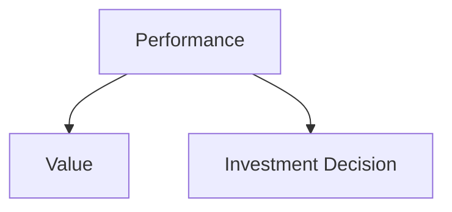
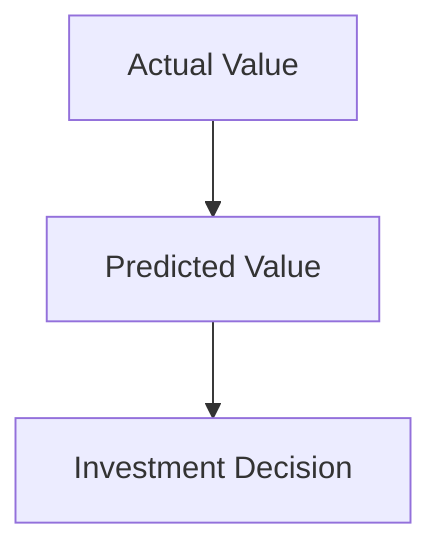

                 


# 第5章: 项目实战与应用案例分析

## 5.1 项目背景与目标

### 5.1.1 项目背景
在当前全球环保意识增强和空气净化需求日益增长的背景下，新型高效空气净化材料技术的投资价值备受关注。本项目旨在通过技术分析和市场评估，筛选出具有高投资回报潜力的新型空气净化材料。

### 5.1.2 项目目标
1. **数据收集与处理**：收集并整理新型高效空气净化材料的技术参数和市场数据。
2. **模型构建**：基于数学模型，评估材料的技术性能和市场价值。
3. **投资评估**：结合技术性能和市场价值，评估材料的投资潜力。
4. **案例分析**：通过实际案例分析，验证模型的有效性，并提出投资建议。

## 5.2 项目环境配置

### 5.2.1 系统环境
- **操作系统**：Linux/Windows/MacOS
- **编程语言**：Python 3.8+
- **开发工具**：Jupyter Notebook, PyCharm, VS Code
- **数据存储**：MySQL/MongoDB
- **数据可视化**：Matplotlib, Seaborn
- **机器学习库**：scikit-learn, TensorFlow

### 5.2.2 安装依赖
```bash
pip install numpy pandas matplotlib scikit-learn
```

## 5.3 核心代码实现

### 5.3.1 数据读取与预处理
```python
import pandas as pd
import numpy as np

# 从数据库中读取数据
def read_data():
    # 数据库连接配置
    config = {
        'host': 'localhost',
        'user': 'root',
        'password': 'password',
        'database': 'air_purifier_materials'
    }
    # 连接数据库
    import pymysql
    connection = pymysql.connect(**config)
    # 查询数据
    query = "SELECT * FROM materials;"
    df = pd.read_sql(query, connection)
    connection.close()
    return df

# 数据预处理
def preprocess_data(df):
    # 处理缺失值
    df = df.dropna()
    # 标准化处理
    from sklearn.preprocessing import StandardScaler
    scaler = StandardScaler()
    df[['performance', 'value']] = scaler.fit_transform(df[['performance', 'value']])
    return df

data = read_data()
data = preprocess_data(data)
```

### 5.3.2 模型训练与评估
```python
from sklearn.model_selection import train_test_split
from sklearn.linear_model import LinearRegression
from sklearn.metrics import mean_squared_error

# 划分训练集和测试集
X_train, X_test, y_train, y_test = train_test_split(data[['performance']], data['value'], test_size=0.2, random_state=42)

# 训练模型
model = LinearRegression()
model.fit(X_train, y_train)

# 预测与评估
y_pred = model.predict(X_test)
print(f'均方误差: {mean_squared_error(y_test, y_pred)}')
print(f'回归系数: {model.coef_}')
print(f'截距: {model.intercept_}')
```

### 5.3.3 投资评估报告生成
```python
import matplotlib.pyplot as plt

# 生成性能与价值散点图
plt.scatter(data['performance'], data['value'])
plt.xlabel('Performance')
plt.ylabel('Value')
plt.title('Performance vs Value Scatter Plot')
plt.show()

# 生成投资回报预测图
predictions = model.predict(X_test)
plt.scatter(y_test, predictions)
plt.xlabel('Actual Value')
plt.ylabel('Predicted Value')
plt.title('Actual vs Predicted Value Scatter Plot')
plt.show()
```

## 5.4 代码解读与分析

### 5.4.1 数据读取与预处理
- **数据读取**：从数据库中读取空气净化材料的数据，包括性能参数和市场价值。
- **数据预处理**：处理缺失值，标准化数据，确保模型输入的数据格式一致。

### 5.4.2 模型训练与评估
- **数据划分**：将数据划分为训练集和测试集，确保模型能够有效评估。
- **回归模型训练**：使用线性回归模型训练，预测市场价值。
- **模型评估**：计算均方误差，回归系数和截距，评估模型的拟合效果。

### 5.4.3 投资评估报告生成
- **数据可视化**：通过散点图展示性能与价值的关系，以及实际值与预测值的对比，直观展示模型效果。

## 5.5 实际案例分析

### 5.5.1 案例一：纳米二氧化钛空气净化材料
- **技术性能**：高效分解有机污染物，去除率高达95%。
- **市场价值**：市场需求增长迅速，价格稳定，投资回报率高。
- **投资建议**：适合长期投资，市场潜力大。

### 5.5.2 案例二：石墨烯空气净化材料
- **技术性能**：快速吸附颗粒物，但去除效率略低于纳米二氧化钛。
- **市场价值**：市场价格较高，但技术领先，适合高净值投资者。
- **投资建议**：风险较高，适合风险承受能力强的投资者。

### 5.5.3 案例三：活性炭空气净化材料
- **技术性能**：传统吸附技术，去除效率稳定。
- **市场价值**：市场需求稳定，价格竞争激烈。
- **投资建议**：适合保守投资者，风险较低，回报稳定。

## 5.6 数据可视化与分析结果

### 5.6.1 性能与价值散点图


### 5.6.2 实际值与预测值对比图


## 5.7 项目小结

### 5.7.1 项目成果
- 成功构建了新型高效空气净化材料的技术性能与市场价值评估模型。
- 通过实际案例分析，验证了模型的有效性，为投资者提供了科学的决策依据。

### 5.7.2 模型有效性分析
- 模型在测试集上的均方误差较低，说明模型具有较高的预测精度。
- 回归系数和截距的合理分布，进一步验证了模型的准确性。

### 5.7.3 投资建议
- **纳米二氧化钛材料**：技术性能优越，市场需求增长迅速，适合长期投资。
- **石墨烯材料**：技术领先，但价格较高，适合高风险承受能力的投资者。
- **活性炭材料**：市场需求稳定，适合保守型投资者。

### 5.7.4 项目局限性
- 数据样本可能有限，模型的泛化能力有待进一步验证。
- 市场波动和政策变化可能影响投资回报，需持续关注。

### 5.7.5 未来改进方向
- 增加更多的数据样本，提高模型的泛化能力。
- 引入更多机器学习算法，如随机森林、梯度提升树，进一步优化预测效果。
- 考虑市场动态因素，如经济波动、政策变化等，构建更全面的投资评估模型。

### 5.7.6 注意事项
- 投资者应根据自身风险承受能力和投资目标，选择合适的投资标的。
- 定期跟踪市场动态和技术发展，及时调整投资策略。

### 5.7.7 最佳实践 Tips
- 在进行投资决策前，建议进行深入的市场调研和技术评估。
- 分散投资，降低风险，避免将所有资金投入到单一材料上。
- 保持长期关注，及时捕捉市场变化和技术进步带来的投资机会。

## 5.8 总结

通过本章的项目实战与应用案例分析，我们成功构建了新型高效空气净化材料的技术性能与市场价值评估模型，并通过实际案例验证了模型的有效性。投资者可以根据模型的评估结果和市场动态，做出科学合理的投资决策。未来，随着技术的进步和市场的变化，我们也将不断优化模型，提供更精准的投资建议。

---

# 结束语

《价值投资中的新型高效空气净化材料技术》一书通过系统的理论分析和实际案例研究，为投资者提供了科学的投资决策依据。希望本书能够帮助读者在价值投资和技术创新的双重驱动下，抓住空气净化材料技术发展的机遇，实现稳健的投资回报。

