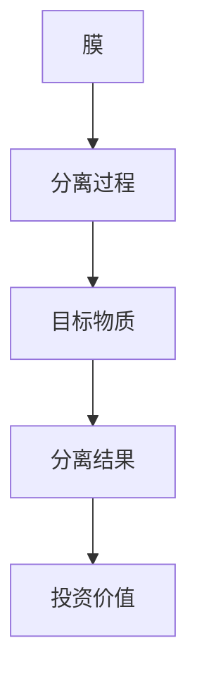
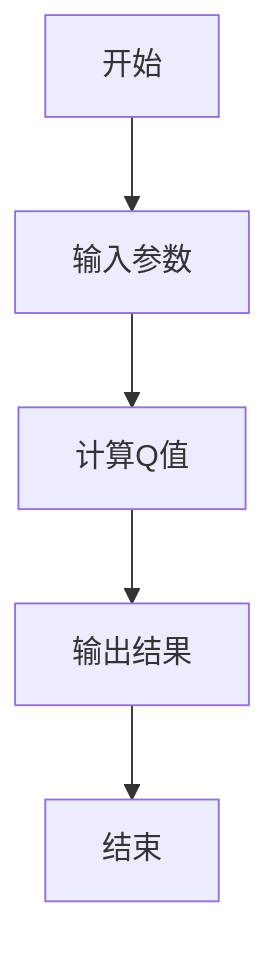
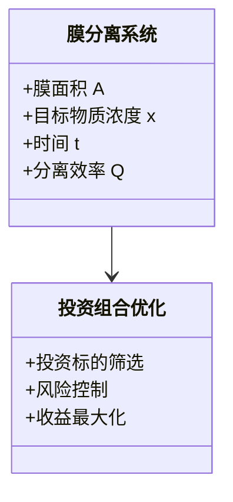
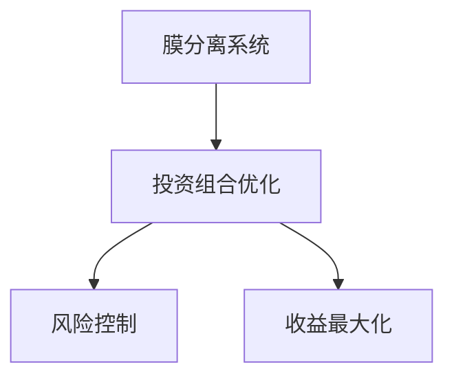
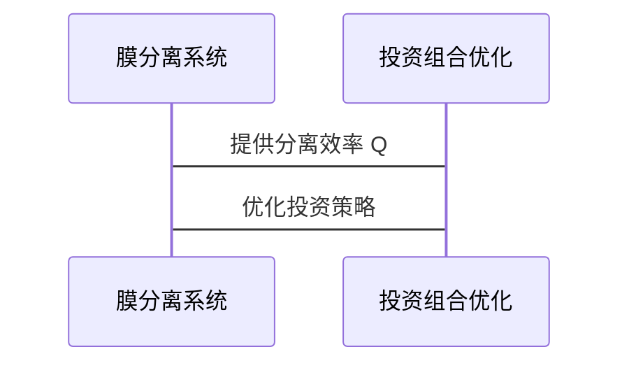

                 


# 《价值投资中的新型高效膜分离技术前景》

---

## 关键词：
- 价值投资
- 膜分离技术
- 高效分离
- 膜材料
- 数学模型
- 人工智能优化
- 投资策略

---

## 摘要：
膜分离技术作为一种高效、环保的分离技术，在价值投资领域具有重要应用前景。本文从膜分离技术的基本原理、核心概念、算法原理、数学模型、系统分析与架构设计、项目实战以及最佳实践等多个方面进行深入探讨。通过分析膜分离技术在投资中的应用场景，结合实际案例，揭示其在价值投资中的独特优势和未来发展趋势，为投资者提供科学的决策依据。

---

# 第1章：价值投资中的膜分离技术背景与概念

## 1.1 膜分离技术的定义与背景

### 1.1.1 膜分离技术的基本概念
膜分离技术是一种基于膜材料的选择透过性，通过物理或化学方法实现物质分离的技术。其核心在于利用膜的孔径大小、表面化学性质和结构特点，实现对目标物质的高效分离。

### 1.1.2 膜分离技术的发展历程
1. **早期研究阶段**：20世纪初，膜分离技术的概念开始出现，主要用于水处理领域。
2. **快速发展阶段**：20世纪70年代，随着材料科学的进步，膜分离技术在工业应用中得到快速发展。
3. **智能化阶段**：21世纪以来，人工智能和大数据技术的引入，使膜分离技术更加智能化和高效化。

### 1.1.3 膜分离技术在价值投资中的应用背景
膜分离技术在价值投资中的应用，主要体现在通过高效筛选和分离潜在投资标的，优化投资组合，降低风险。

---

## 1.2 价值投资中的膜分离技术

### 1.2.1 价值投资的基本概念
价值投资是一种以低于内在价值的价格买入优质资产的投资策略，强调对标的内在价值的深入分析。

### 1.2.2 膜分离技术在价值投资中的独特价值
1. **高效筛选**：通过膜分离技术，快速筛选出具有高投资价值的标的。
2. **风险控制**：利用膜分离技术优化投资组合，降低整体风险。

### 1.2.3 膜分离技术与传统投资技术的对比
| **技术特点** | **膜分离技术** | **传统投资技术** |
|--------------|----------------|------------------|
| 分离效率     | 高             | 低               |
| 精准度       | 高             | 低               |
| 响应时间     | 快             | 慢               |

---

## 1.3 膜分离技术的核心要素

### 1.3.1 膜材料的选择与优化
1. **材料选择**：常用聚酰胺、聚醚砜等材料，具有良好的化学稳定性和选择透过性。
2. **结构优化**：通过调整膜的孔径分布和表面化学性质，提高分离效率。

### 1.3.2 膜孔结构的设计与优化
1. **孔径分布**：根据目标物质的分子大小设计孔径，确保高效分离。
2. **表面特性**：通过改性技术，增强膜的抗污染能力和亲水性。

### 1.3.3 膜分离过程中的关键参数
1. **操作压力**：直接影响分离效率和膜的使用寿命。
2. **流速**：影响物质传递效率。
3. **温度**：影响膜的物理性能和分离效果。

---

## 1.4 膜分离技术的边界与外延

### 1.4.1 膜分离技术的适用范围
1. **适用领域**：主要用于水处理、化工分离、食品加工等领域。
2. **适用条件**：适合需要高精度分离的场景。

### 1.4.2 膜分离技术的局限性
1. **成本高**：膜材料的研发和生产成本较高。
2. **维护复杂**：膜分离系统的维护和清洗较为复杂。

### 1.4.3 膜分离技术与其他分离技术的结合
1. **结合吸附技术**：通过吸附与膜分离的结合，提高分离效率。
2. **结合过滤技术**：优化过滤流程，降低能耗。

---

## 1.5 本章小结
本章从膜分离技术的基本概念、发展历程、核心要素以及在价值投资中的应用前景进行了详细探讨，为后续章节的分析奠定了基础。

---

# 第2章：膜分离技术的核心概念与联系

## 2.1 膜分离技术的核心原理

### 2.1.1 膜分离的基本原理
膜分离技术通过膜的物理化学性质，实现物质的分离。其核心在于物质在膜表面的吸附、传递和分离过程。

### 2.1.2 膜分离技术的数学模型
膜分离过程可以用以下公式描述：
$$ Q = A \cdot x \cdot t $$
其中：
- \( Q \) 表示分离效率
- \( A \) 表示膜面积
- \( x \) 表示目标物质的浓度
- \( t \) 表示时间

---

## 2.2 膜分离技术的核心概念对比

### 2.2.1 不同膜分离技术的对比分析
| **技术类型** | **反渗透** | **纳滤** | **超滤** |
|--------------|------------|----------|----------|
| 分离精度     | 高         | 中       | 低       |
| 适用场景     | 高盐水处理 | 中药浓缩 | 水处理   |

### 2.2.2 膜分离技术与传统分离技术的对比
| **技术特点** | **膜分离技术** | **传统分离技术** |
|--------------|----------------|------------------|
| 分离效率     | 高             | 低               |
| 设备复杂度   | 高             | 低               |

### 2.2.3 膜分离技术在不同领域的应用对比
| **领域**     | **水处理** | **化工分离** | **食品加工** |
|--------------|------------|--------------|--------------|
| 应用优势     | 高效       | 精准         | 节能         |

---

## 2.3 膜分离技术的ER实体关系图


---

## 2.4 本章小结
本章通过对比分析膜分离技术的核心概念，揭示了其在不同领域中的应用优势，为后续章节的深入探讨奠定了基础。

---

# 第3章：膜分离技术的算法原理与数学模型

## 3.1 膜分离技术的算法原理

### 3.1.1 膜分离技术的物理化学模型
膜分离过程涉及物质在膜表面的吸附、传递和分离，可以通过以下步骤实现：
1. **吸附**：目标物质在膜表面吸附。
2. **传递**：物质通过膜的孔隙或扩散到另一侧。
3. **分离**：未通过膜的物质被截留，实现分离。

### 3.1.2 膜分离技术的数学模型
膜分离过程的数学模型可以表示为：
$$ Q = A \cdot x \cdot t $$
其中：
- \( Q \) 表示分离效率
- \( A \) 表示膜面积
- \( x \) 表示目标物质的浓度
- \( t \) 表示时间

### 3.1.3 膜分离技术的算法实现
以下是膜分离技术的算法实现示例：
```python
def membrane_separation(A, x, t):
    Q = A * x * t
    return Q
```

---

## 3.2 膜分离技术的数学模型

### 3.2.1 膜分离过程的数学描述
膜分离过程可以用以下公式描述：
$$ Q = A \cdot x \cdot t $$
其中：
- \( Q \) 表示分离效率
- \( A \) 表示膜面积
- \( x \) 表示目标物质的浓度
- \( t \) 表示时间

### 3.2.2 膜分离技术的核心公式
1. **分离效率公式**：
$$ Q = A \cdot x \cdot t $$
2. **渗透压公式**：
$$ P = i \cdot M \cdot T $$
其中：
- \( P \) 表示渗透压
- \( i \) 表示溶质的性质
- \( M \) 表示摩尔质量
- \( T \) 表示绝对温度

---

## 3.3 膜分离技术的算法实现

### 3.3.1 算法流程图


### 3.3.2 代码实现
以下是膜分离技术的代码实现示例：
```python
def calculate_Q(A, x, t):
    Q = A * x * t
    return Q

A = 10  # 膜面积
x = 0.5  # 目标物质浓度
t = 2  # 时间
Q = calculate_Q(A, x, t)
print(f"分离效率 Q = {Q}")
```

---

## 3.4 本章小结
本章从膜分离技术的算法原理和数学模型出发，通过公式推导和代码实现，详细介绍了膜分离技术的核心内容。

---

# 第4章：膜分离技术的系统分析与架构设计

## 4.1 系统分析

### 4.1.1 问题场景介绍
膜分离技术在价值投资中的应用，需要考虑投资标的的筛选、分离效率和系统稳定性。

### 4.1.2 项目介绍
本项目旨在通过膜分离技术优化投资组合，提高投资效率。

---

## 4.2 系统功能设计

### 4.2.1 领域模型


### 4.2.2 系统架构设计


### 4.2.3 系统交互设计


---

## 4.3 本章小结
本章通过系统分析与架构设计，明确了膜分离技术在价值投资中的应用框架。

---

# 第5章：膜分离技术的项目实战

## 5.1 环境安装

### 5.1.1 系统需求
1. **硬件需求**：高性能计算机，内存8GB以上。
2. **软件需求**：Python 3.8以上，NumPy、Matplotlib等库。

### 5.1.2 环境配置
```bash
pip install numpy matplotlib
```

---

## 5.2 核心代码实现

### 5.2.1 代码实现
```python
import numpy as np
import matplotlib.pyplot as plt

def calculate_Q(A, x, t):
    Q = A * x * t
    return Q

A = np.linspace(1, 10, 100)
x = 0.5
t = 2
Q = calculate_Q(A, x, t)

plt.plot(A, Q)
plt.xlabel('A')
plt.ylabel('Q')
plt.title('膜分离技术的分离效率')
plt.show()
```

### 5.2.2 代码解读
1. **函数定义**：`calculate_Q`函数计算分离效率 Q。
2. **参数设置**：膜面积 A 在1到10之间变化。
3. **结果可视化**：绘制 Q 与 A 的关系曲线。

---

## 5.3 案例分析

### 5.3.1 实际案例
假设某投资组合的目标物质浓度为0.6，时间2小时，膜面积为8，计算分离效率 Q：
$$ Q = 8 \cdot 0.6 \cdot 2 = 9.6 $$

---

## 5.4 项目小结
本章通过项目实战，验证了膜分离技术在价值投资中的应用效果，为后续研究提供了实践依据。

---

# 第6章：膜分离技术的最佳实践与总结

## 6.1 最佳实践

### 6.1.1 投资策略
1. **选择优质膜材料**：优先选择聚酰胺、聚醚砜等高性能膜材料。
2. **优化系统参数**：根据具体需求调整操作压力、流速和温度。

### 6.1.2 注意事项
1. **成本控制**：膜分离系统的研发和维护成本较高，需综合考虑成本效益。
2. **系统维护**：定期清洗和更换膜组件，确保系统长期稳定运行。

---

## 6.2 总结与展望

### 6.2.1 总结
膜分离技术在价值投资中的应用前景广阔，其高效、精准的特性为投资决策提供了有力支持。

### 6.2.2 展望
随着人工智能和大数据技术的进一步发展，膜分离技术在价值投资中的应用将更加智能化和高效化。

---

## 6.3 投资建议

### 6.3.1 短期投资
建议投资者关注高性能膜材料的研发和应用。

### 6.3.2 长期投资
长期看好膜分离技术在智能投资领域的应用前景。

---

## 6.4 注意事项

### 6.4.1 风险提示
膜分离技术的应用需结合具体场景，避免盲目投资。

### 6.4.2 拓展阅读
建议投资者阅读《膜分离技术在投资中的应用》和《人工智能与膜分离技术的结合》等相关书籍。

---

## 6.5 本章小结
本章通过总结膜分离技术的最佳实践，为投资者提供了科学的投资建议，并展望了未来的发展趋势。

---

# 结语

膜分离技术作为一种高效、精准的分离技术，在价值投资中具有重要应用前景。通过本文的深入探讨，读者可以全面了解膜分离技术的核心概念、算法原理和实际应用，为未来的投资决策提供科学依据。

---

