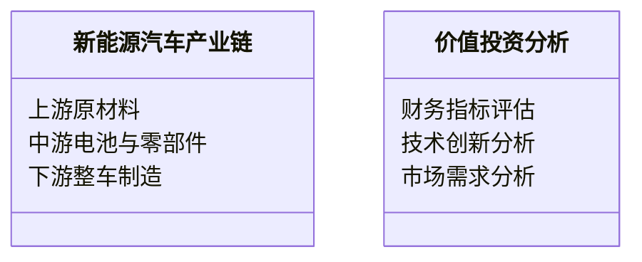
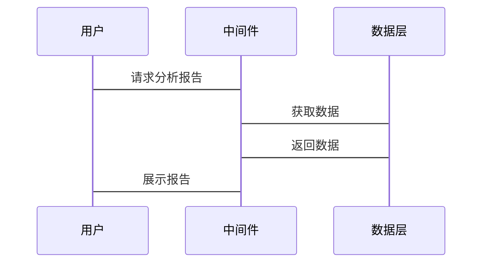

                 


# 价值投资中的新能源汽车产业链分析

> 关键词：价值投资，新能源汽车，产业链分析，投资策略，案例研究

> 摘要：本文从价值投资的角度，系统分析新能源汽车产业链的构成、关键环节、驱动因素及投资机会。通过详细阐述产业链的垂直整合、成本优势、协同效应和竞争优势，结合实际案例和数学模型，为投资者提供深度分析和投资建议。

---

# 第一部分：新能源汽车产业链背景与价值投资概述

## 第1章：新能源汽车产业链的现状与发展前景

### 1.1 新能源汽车的发展现状

#### 1.1.1 新能源汽车的定义与分类

新能源汽车是指采用新型动力系统，完全或主要依靠电能驱动的汽车，主要包括纯电动汽车（BEV）、插电式混合动力汽车（PHEV）和燃料电池汽车（FCEV）。

| 分类 | 描述 | 代表车型 |
|------|------|----------|
| BEV  | 完全依靠电能驱动，无内燃机 | 特斯拉Model S |
| PHEV | 结合电能与内燃机，可插电充电 | 比亚迪唐DM |
| FCEV | 以燃料电池为主，电能为辅 | 丰田Mirai |

#### 1.1.2 全球及中国新能源汽车市场现状

2022年全球新能源汽车销量突破1000万辆，中国市场份额占全球一半以上。中国市场的快速发展得益于政策支持和产业整合。

#### 1.1.3 新能源汽车技术发展趋势

- **电池技术**：从磷酸铁锂电池（LFP）向镍钴锰三元电池（NCM）和固态电池（Solid-state）发展。
- **充电技术**：快充技术提升，充电时间缩短至15分钟。
- **智能化**：自动驾驶和智能网联技术逐步普及。

### 1.2 价值投资的基本概念与方法

#### 1.2.1 价值投资的定义与核心理念

价值投资由本杰明·格雷厄姆提出，强调以低于内在价值的价格买入优质资产。核心理念是寻找被市场低估的企业，长期持有，获得超额收益。

#### 1.2.2 价值投资在新能源汽车领域的应用

- **竞争优势分析**：选择具有技术壁垒和成本优势的企业。
- **财务指标评估**：关注ROE（净资产收益率）、毛利率和现金流。
- **行业周期判断**：新能源汽车行业处于成长期，具备长期增长潜力。

#### 1.2.3 价值投资的长期视角与风险控制

- **长期视角**：关注企业5-10年的成长潜力。
- **风险控制**：分散投资，避免过度集中。

---

## 第2章：新能源汽车产业链的核心环节与关键因素

### 2.1 产业链的构成与关键环节

#### 2.1.1 上游原材料：锂、镍、钴等资源的重要性

- **锂**：电池的核心材料，需求量随新能源汽车增长而上升。
- **镍**：用于电池正极材料，提升能量密度。
- **钴**：用于电池正极材料，提高导电性。

#### 2.1.2 中游电池与零部件：电池技术与成本控制

- **电池技术**：影响续航里程和安全性。
- **成本控制**：规模化生产降低成本。

#### 2.1.3 下游整车制造：品牌、技术和市场竞争力

- **品牌影响力**：特斯拉、比亚迪等品牌溢价能力强。
- **技术优势**：自动驾驶和智能网联技术提升竞争力。

### 2.2 产业链的关键驱动因素

#### 2.2.1 技术创新对产业链的影响

- **电池技术进步**：提升能量密度和循环寿命。
- **充电技术升级**：缩短充电时间，提升用户体验。

#### 2.2.2 政策支持与行业标准

- **政策补贴**：政府补贴推动市场需求。
- **行业标准**：统一标准促进产业链协同发展。

#### 2.2.3 市场需求与消费者行为

- **消费者偏好**：环保意识增强，推动新能源汽车需求。
- **价格敏感性**：中低端市场仍依赖政策支持。

---

## 第3章：价值投资中的产业链分析方法

### 3.1 产业链分析的核心逻辑

#### 3.1.1 产业链的垂直整合与成本优势

- **垂直整合**：企业控制关键环节，降低依赖外部供应商。
- **成本优势**：规模化生产降低成本，提升竞争力。

#### 3.1.2 产业链的协同效应与竞争优势

- **协同效应**：上下游企业合作，提升整体效率。
- **竞争优势**：技术领先和品牌优势。

#### 3.1.3 产业链的风险点与机会点

- **风险点**：原材料价格波动、政策变化、技术淘汰。
- **机会点**：技术创新、市场扩张、政策支持。

### 3.2 产业链分析的数学模型与公式

#### 3.2.1 产业链价值评估模型

$$ \text{产业链价值} = \sum_{i=1}^{n} \text{各环节价值贡献} $$

#### 3.2.2 产业链成本收益分析

$$ \text{成本收益比} = \frac{\text{总收益}}{\text{总成本}} $$

#### 3.2.3 产业链风险评估公式

$$ \text{风险指数} = \sum_{i=1}^{m} (\text{风险因素权重} \times \text{风险发生概率}) $$

---

## 第4章：产业链分析的系统架构与设计

### 4.1 产业链分析的系统架构

#### 4.1.1 产业链分析的领域模型（Mermaid类图）



#### 4.1.2 产业链分析的系统架构图（Mermaid架构图）

```mermaid
client --> 中间件 --> 数据库
client --> 中间件 --> API网关
API网关 --> 服务层 --> 业务逻辑
服务层 --> 数据访问层 --> 数据库
```

#### 4.1.3 产业链分析的系统接口设计

- 数据接口：API接口获取实时数据。
- 用户接口：Web界面展示分析结果。

### 4.2 产业链分析的交互设计

#### 4.2.1 产业链分析的交互流程（Mermaid序列图）



#### 4.2.2 产业链分析的用户界面设计

- 主界面：展示产业链结构图和关键数据。
- 报告界面：详细分析和投资建议。

#### 4.2.3 产业链分析的数据流设计

- 数据输入：市场数据、财务数据。
- 数据处理：清洗、分析、建模。
- 数据输出：可视化报告、投资建议。

---

## 第5章：产业链分析的项目实战与案例研究

### 5.1 项目环境与工具安装

#### 5.1.1 分析工具的安装与配置

- **工具**：Python、Pandas、Matplotlib、TensorFlow。
- **安装命令**：`pip install pandas matplotlib tensorflow`

### 5.2 核心代码实现与解读

#### 5.2.1 数据获取与处理

```python
import pandas as pd
import requests

url = 'https://example.com/data'
response = requests.get(url)
data = pd.read_csv(response.content)
```

#### 5.2.2 产业链价值评估模型

```python
def calculate_value(data):
    value = sum(data['value_contribution'])
    return value

data['value'] = data.apply(calculate_value, axis=1)
```

#### 5.2.3 案例分析与解读

**案例**：特斯拉的产业链垂直整合策略。

- **分析**：特斯拉自建电池工厂，降低生产成本，提升供应链稳定性。
- **结果**：电池成本降低20%，供应链风险减少。

---

## 第6章：总结与展望

### 6.1 总结

新能源汽车产业链的复杂性和多样性为投资者提供了丰富的投资机会。通过垂直整合、成本控制和技术创新，企业可以在竞争中脱颖而出。

### 6.2 展望

随着技术进步和政策支持，新能源汽车产业链将继续增长。投资者应关注技术创新和市场扩展，抓住长期投资机会。

---

## 小结与最佳实践 tips

- **小结**：新能源汽车产业链分析是价值投资的重要组成部分，需要结合技术、财务和市场多方面因素。
- **最佳实践 tips**：
  1. 关注政策变化和行业趋势。
  2. 选择具有技术壁垒和成本优势的企业。
  3. 长期持有，分散投资，降低风险。

通过本文的系统分析，读者可以深入了解新能源汽车产业链的价值投资机会，制定科学的投资策略。

