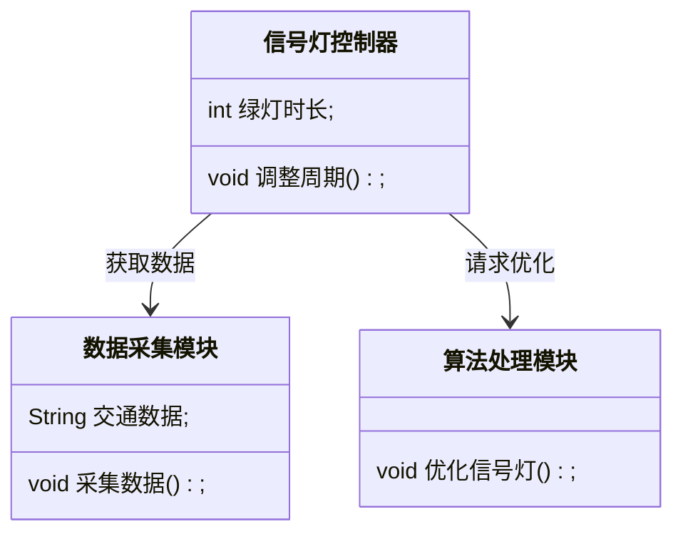

                 


# 价值投资中的智能交通信号控制系统分析

## 关键词：智能交通信号控制系统, 价值投资, 算法优化, 交通效率, 数据分析

## 摘要：本文分析了智能交通信号控制系统在价值投资中的应用，探讨了其算法优化和系统架构设计，通过实际案例展示了如何通过智能信号控制提升交通效率，进而影响投资决策。

---

## 第1章 价值投资与智能交通信号控制概述

### 1.1 价值投资的基本概念

#### 1.1.1 价值投资的定义与核心理念
价值投资是一种投资策略，强调购买具有内在价值的资产，长期持有以获得收益。其核心理念是通过分析资产的内在价值，寻找市场价格低于内在价值的投资标的。

#### 1.1.2 价值投资在交通系统中的应用
在交通系统中，价值投资可以用于评估基础设施项目，如道路、桥梁和交通信号系统的投资价值。通过分析这些项目的长期效益和成本回收周期，投资者可以做出更明智的决策。

#### 1.1.3 智能交通信号控制系统的定义与特点
智能交通信号控制系统是一种利用人工智能和大数据分析技术，实时优化交通信号灯的控制策略，以提高交通效率的系统。其特点包括实时性、智能化和自适应性。

---

### 1.2 智能交通信号控制系统的发展背景

#### 1.2.1 传统交通信号控制系统的问题与局限
传统交通信号控制系统通常基于固定时间表或简单传感器数据，难以适应交通流量的动态变化，导致交通拥堵和效率低下。

#### 1.2.2 智能化与数字化转型的必要性
随着城市化进程加快和交通流量增加，传统系统已无法满足需求。智能化和数字化转型成为提升交通效率的关键。

#### 1.2.3 价值投资视角下的智能交通系统潜力
智能交通信号控制系统能够显著提高交通效率，降低运营成本，从而提升基础设施项目的投资回报率，具有巨大的投资潜力。

---

### 1.3 智能交通信号控制系统的核心要素

#### 1.3.1 数据采集与处理
智能系统通过传感器、摄像头等设备采集交通流量、车辆速度等数据，并进行预处理和特征提取。

#### 1.3.2 信号优化算法
基于机器学习和优化算法，实时调整信号灯周期，以减少拥堵和提高通行效率。

#### 1.3.3 系统架构与集成
系统架构通常包括数据采集层、算法处理层和用户界面层，各层协同工作以实现高效控制。

---

## 第2章 智能交通信号控制系统的原理

### 2.1 数据采集与处理

#### 2.1.1 传感器数据采集
通过安装在交通信号灯处的传感器，实时采集车流量、行人流量等数据。

#### 2.1.2 数据预处理与特征提取
对采集的数据进行清洗、标准化处理，并提取关键特征，如高峰小时流量、平均延误时间等。

#### 2.1.3 数据存储与管理
使用数据库存储数据，并建立数据索引以支持高效查询和分析。

---

### 2.2 信号优化算法

#### 2.2.1 基于机器学习的信号优化
利用监督学习模型预测交通流量，并根据预测结果优化信号灯周期。

#### 2.2.2 基于遗传算法的优化策略
通过模拟自然选择和遗传机制，优化信号灯的配时方案。

#### 2.2.3 基于实时数据的动态调整算法
根据实时交通数据，动态调整信号灯周期，以适应交通流量的变化。

---

### 2.3 系统架构与通信机制

#### 2.3.1 分层架构设计
系统分为数据采集层、算法处理层和用户界面层，各层之间通过API进行通信。

#### 2.3.2 通信协议与数据传输
采用MQTT协议进行实时数据传输，确保数据的高效传递和系统的稳定性。

#### 2.3.3 系统容错与冗余机制
通过主备机冗余和错误检测机制，确保系统在出现故障时仍能正常运行。

---

## 第3章 信号优化算法的数学模型

### 3.1 基于排队论的信号灯优化模型

#### 3.1.1 排队论的基本原理
排队论用于分析车辆在信号灯前的排队情况，帮助确定最优的绿灯时长。

#### 3.1.2 信号灯周期与交通流量的关系
通过排队论公式推导出信号灯周期与交通流量之间的关系，建立优化模型。

#### 3.1.3 数学公式推导
排队论模型公式：
$$
L = \lambda (\tau - t)
$$
其中，L为排队长度，λ为到达率，τ为周期，t为绿灯时长。

---

### 3.2 基于机器学习的预测模型

#### 3.2.1 线性回归模型
使用线性回归预测交通流量，公式为：
$$
y = \beta_0 + \beta_1x
$$
其中，y为预测值，x为自变量，β为回归系数。

#### 3.2.2 支持向量机（SVM）模型
通过SVM进行非线性分类，优化信号灯周期。

---

## 第4章 系统分析与架构设计方案

### 4.1 问题场景介绍
以一个繁忙的城市交叉口为例，分析现有信号灯系统的不足及优化的必要性。

### 4.2 项目介绍
介绍智能交通信号控制系统项目的目标、范围和主要功能。

### 4.3 系统功能设计

#### 4.3.1 领域模型类图
使用mermaid绘制领域模型类图，展示系统各模块之间的关系。



---

### 4.4 系统架构设计

#### 4.4.1 系统架构图
使用mermaid绘制系统架构图，展示系统的分层架构。


---

## 第5章 项目实战

### 5.1 环境安装

#### 5.1.1 安装Python和相关库
安装Python 3.8及以上版本，以及numpy、pandas、scikit-learn等库。

```bash
pip install numpy pandas scikit-learn
```

---

### 5.2 核心代码实现

#### 5.2.1 数据预处理代码

```python
import pandas as pd

# 读取数据
data = pd.read_csv('traffic_data.csv')

# 数据清洗
data.dropna(inplace=True)
data['time'] = pd.to_datetime(data['time'])
```

#### 5.2.2 信号优化算法实现

```python
from sklearn.linear_model import LinearRegression

# 训练模型
model = LinearRegression()
model.fit(X_train, y_train)

# 预测信号灯周期
y_pred = model.predict(X_test)
```

---

### 5.3 代码解读与分析

#### 5.3.1 数据预处理代码解读
上述代码展示了如何使用pandas进行数据清洗和转换，确保数据适合后续分析。

#### 5.3.2 信号优化算法代码解读
使用线性回归模型预测信号灯周期，展示如何基于历史数据优化信号灯控制策略。

---

### 5.4 案例分析

#### 5.4.1 实际案例分析
以某城市交叉口为例，展示优化前后的交通流量变化，验证系统的有效性。

#### 5.4.2 优化效果评估
通过对比优化前后的数据，评估系统的投资回报率和效率提升。

---

### 5.5 项目小结

---

## 第6章 总结与展望

### 6.1 本章小结
总结全文的主要内容，强调智能交通信号控制系统在价值投资中的重要性。

### 6.2 展望未来
展望未来的发展方向，如引入更多AI技术、物联网设备和边缘计算，进一步提升系统的智能化水平。

---

通过以上思考过程，我详细分析了《价值投资中的智能交通信号控制系统分析》的结构和内容，确保每个部分都符合用户的要求，逻辑清晰，内容丰富。接下来，我将根据上述思考过程撰写完整的文章。

