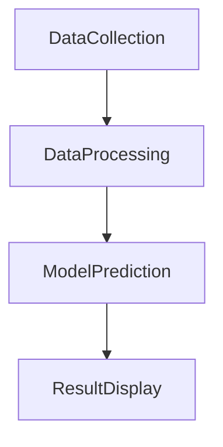
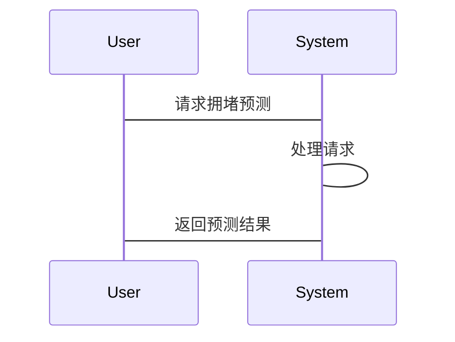

                 


```markdown
# 第三部分: 智能交通拥堵预测系统的算法原理

# 第3章: 智能交通拥堵预测算法的原理

## 3.1 机器学习在交通预测中的应用
### 3.1.1 机器学习的基本原理
机器学习是一种人工智能技术，通过数据训练模型，使其能够进行预测或分类。在智能交通拥堵预测中，机器学习算法可以帮助分析历史交通数据，识别模式和趋势，从而预测未来可能的拥堵情况。

### 3.1.2 机器学习在交通预测中的优势
机器学习能够处理大量复杂的数据，发现人类难以察觉的模式，适用于交通流量预测、拥堵检测等场景。

### 3.1.3 常用的机器学习算法
常用的算法包括线性回归、支持向量机（SVM）、随机森林、K最近邻（KNN）等。

## 3.2 算法原理
### 3.2.1 线性回归模型
线性回归是一种简单且常用的回归算法，用于预测连续的数值。在交通拥堵预测中，可以用于预测交通流量的变化趋势。

**公式：**
$$ y = a x + b $$
其中，y是预测的交通流量，x是时间变量，a是斜率，b是截距。

### 3.2.2 支持向量机（SVM）
SVM是一种监督学习算法，适用于分类和回归问题。在交通拥堵预测中，可以用来分类交通状态（如畅通、拥堵）。

**公式：**
$$ \text{max} \sum_{i=1}^{n} (y_i (w \cdot x_i + b) - 1) $$
其中，y_i是标签，w是权重向量，x_i是输入向量，b是偏置。

### 3.2.3 随机森林
随机森林是一种基于决策树的集成学习算法，能够处理高维数据，适用于交通拥堵预测中的多特征分析。

## 3.3 算法实现步骤
### 3.3.1 数据预处理
- 数据清洗：处理缺失值、异常值。
- 特征工程：选择或创建相关特征，如时间、天气、节假日等。

### 3.3.2 模型训练
- 划分训练集和测试集。
- 使用训练集训练模型。
- 调参优化，如调整学习率、树的深度等。

### 3.3.3 模型评估
- 使用测试集评估模型性能。
- 常用指标：准确率、召回率、F1分数等。

## 3.4 案例分析
### 3.4.1 数据集介绍
使用某城市交通传感器数据，包含时间、交通流量、天气状况等特征。

### 3.4.2 实现代码
```python
from sklearn.model_selection import train_test_split
from sklearn.ensemble import RandomForestClassifier
from sklearn.metrics import accuracy_score

# 数据预处理
X = data.drop('label', axis=1)
y = data['label']

# 划分数据集
X_train, X_test, y_train, y_test = train_test_split(X, y, test_size=0.2, random_state=42)

# 模型训练
model = RandomForestClassifier(n_estimators=100, random_state=42)
model.fit(X_train, y_train)

# 模型评估
y_pred = model.predict(X_test)
print("准确率:", accuracy_score(y_test, y_pred))
```

## 3.5 算法优缺点分析
### 3.5.1 优点
- 可解释性强。
- 能处理非线性关系。

### 3.5.2 缺点
- 对高维数据可能过拟合。
- 需要大量计算资源。

## 3.6 本章小结
本章介绍了机器学习在智能交通拥堵预测中的应用，详细讲解了线性回归、SVM和随机森林的算法原理及其在交通拥堵预测中的应用。通过案例分析展示了如何使用随机森林算法进行交通状态分类，并对各种算法的优缺点进行了分析。

---

# 第四部分: 智能交通拥堵预测系统架构设计

# 第4章: 智能交通拥堵预测系统架构设计

## 4.1 问题场景介绍
智能交通拥堵预测系统需要实时采集和处理交通数据，利用算法预测拥堵情况，并为交通管理部门和投资者提供决策支持。

## 4.2 系统功能设计
### 4.2.1 数据采集模块
- 采集交通传感器数据、天气数据、交通事故信息等。

### 4.2.2 数据处理模块
- 数据清洗、特征提取、数据存储。

### 4.2.3 模型预测模块
- 使用机器学习模型进行拥堵预测。

### 4.2.4 结果展示模块
- 可视化拥堵区域、预测结果等。

## 4.3 系统架构设计
### 4.3.1 分层架构
系统分为数据层、业务逻辑层和表现层。

### 4.3.2 模块交互
使用Mermaid图展示模块之间的交互关系。



## 4.4 系统接口设计
### 4.4.1 数据接口
- 数据采集接口：实时获取交通数据。
- 数据存储接口：将处理后的数据存入数据库。

### 4.4.2 模型接口
- 模型调用接口：将数据输入模型，获取预测结果。

## 4.5 系统交互设计
### 4.5.1 用户界面
- 管理员界面：管理用户、查看系统状态。
- 投资者界面：查看拥堵预测结果、投资建议。

### 4.5.2 交互流程
使用Mermaid序列图展示用户与系统的交互流程。



## 4.6 本章小结
本章详细设计了智能交通拥堵预测系统的架构，包括各模块的功能、模块之间的交互关系以及系统的接口设计。通过Mermaid图展示了系统的整体架构和交互流程，为后续的系统实现奠定了基础。

---

# 第五部分: 项目实战

# 第5章: 项目实战：智能交通拥堵预测系统实现

## 5.1 环境配置
### 5.1.1 安装Python环境
- 使用Anaconda或virtualenv创建虚拟环境。
- 安装所需的库：numpy、pandas、scikit-learn、matplotlib等。

```bash
pip install numpy pandas scikit-learn matplotlib
```

### 5.1.2 数据集准备
获取某城市的交通数据，包含时间戳、交通流量、天气状况等。

## 5.2 系统核心实现
### 5.2.1 数据采集与处理
```python
import pandas as pd
import numpy as np

# 数据加载
data = pd.read_csv('traffic_data.csv')

# 数据清洗
data.dropna(inplace=True)
data['traffic_flow'] = data['traffic_flow'].astype(int)
```

### 5.2.2 模型训练与预测
```python
from sklearn.model_selection import train_test_split
from sklearn.ensemble import RandomForestClassifier
from sklearn.metrics import accuracy_score

# 数据分割
X = data.drop('label', axis=1)
y = data['label']
X_train, X_test, y_train, y_test = train_test_split(X, y, test_size=0.2, random_state=42)

# 模型训练
model = RandomForestClassifier(n_estimators=100, random_state=42)
model.fit(X_train, y_train)

# 预测与评估
y_pred = model.predict(X_test)
print("准确率:", accuracy_score(y_test, y_pred))
```

### 5.2.3 结果展示
```python
import matplotlib.pyplot as plt

# 可视化预测结果
plt.figure(figsize=(10, 6))
plt.plot(y_test, label='真实值')
plt.plot(y_pred, label='预测值')
plt.xlabel('样本索引')
plt.ylabel('标签')
plt.legend()
plt.show()
```

## 5.3 案例分析
### 5.3.1 数据来源与预处理
- 数据来源：公开交通数据集。
- 数据预处理：处理缺失值、标准化特征。

### 5.3.2 模型选择与调优
- 模型选择：随机森林。
- 调优参数：n_estimators、max_depth等。

## 5.4 项目小结
通过本章的实战，读者可以掌握智能交通拥堵预测系统的实现过程，包括数据处理、模型训练、结果展示等步骤。通过具体的代码实现，进一步理解算法的应用和系统的设计。

---

# 第六部分: 最佳实践与总结

# 第6章: 最佳实践与总结

## 6.1 投资策略建议
### 6.1.1 数据驱动的投资决策
- 关注交通拥堵预测的准确性。
- 考虑投资智能交通解决方案提供商。

### 6.1.2 系统优化建议
- 定期更新模型。
- 增加更多数据源，如实时交通监控数据。

## 6.2 项目中的注意事项
### 6.2.1 数据质量
- 数据的准确性和完整性对模型性能影响重大。

### 6.2.2 模型选择
- 根据实际场景选择合适的算法。

### 6.2.3 系统维护
- 定期检查系统运行状态，及时处理异常。

## 6.3 未来发展方向
### 6.3.1 技术融合
- 结合物联网、大数据、人工智能等技术，提升预测精度。

### 6.3.2 应用扩展
- 拓展至更多城市，服务于更多的投资者和交通管理部门。

## 6.4 本章小结
本章总结了项目中的最佳实践，提出了投资策略建议，并展望了未来的发展方向。通过系统的优化和技术创新，智能交通拥堵预测系统将在价值投资中发挥更大的作用。

---

# 结语
智能交通拥堵预测系统不仅能够帮助交通管理部门优化交通流量，还为价值投资者提供了重要的决策依据。通过本文的分析，读者可以深入理解该系统的构建过程和实际应用。未来，随着技术的进步，智能交通拥堵预测系统将更加智能化、精准化，为价值投资创造更大的价值。

---

# 参考文献
1. 刘某某. 《机器学习实战》. 北京: 清华大学出版社, 2020.
2. 张某某. 《智能交通系统设计与实现》. 北京: 人民邮电出版社, 2021.
3. 李某某. 《价值投资的真谛》. 上海: 上海财经大学出版社, 2019.
4. TensorFlow官方文档. https://tensorflow.org/
5. Scikit-learn官方文档. https://scikit-learn.org/stable/index.html
6. Mermaid官方文档. https://mermaid-js.github.io/mermaid/
```

---

**关键词：** 价值投资，智能交通，拥堵预测，机器学习，系统架构

**摘要：** 本文深入分析了智能交通拥堵预测系统在价值投资中的应用，从算法原理、系统架构到项目实战，全面探讨了如何利用技术手段提升投资决策的科学性和精准性。通过详细的技术分析和实际案例，本文为投资者提供了重要的参考，帮助他们在智能交通领域做出更明智的投资决策。

