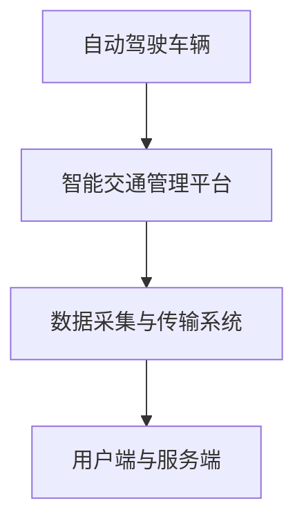

                 


# 价值投资中的智能交通自动驾驶协同系统分析

> 关键词：价值投资、智能交通系统、自动驾驶、协同系统、系统分析、投资分析、技术协同

> 摘要：本文分析了自动驾驶与智能交通系统的协同关系，构建了数学模型，评估其对投资决策的影响。通过系统分析和架构设计，探讨了协同系统的优化策略，并提供了实际案例分析。

---

## 第1章: 价值投资与智能交通自动驾驶协同系统背景

### 1.1 价值投资的基本概念

#### 1.1.1 价值投资的定义
价值投资是一种投资策略，旨在以低于内在价值的价格购买优质资产，长期持有以获得超额收益。其核心在于识别市场低估的公司，关注基本面分析，注重长期回报而非短期波动。

#### 1.1.2 价值投资的核心理念
- **安全边际**：购买价格远低于内在价值，以减少风险。
- **长期视角**：关注公司长期盈利能力，而非短期市场波动。
- **基本面分析**：通过财务数据、行业地位等因素评估公司价值。

#### 1.1.3 价值投资在现代金融中的地位
价值投资是投资学的重要流派，尤其在股票市场中被广泛应用。它强调理性分析和长期投资，与短期交易策略形成对比。

### 1.2 智能交通与自动驾驶系统概述

#### 1.2.1 智能交通系统的定义
智能交通系统（ITS）利用信息技术、数据通信、人工智能等技术，优化交通管理，提高交通效率，减少拥堵和事故。

#### 1.2.2 自动驾驶技术的基本原理
自动驾驶通过激光雷达、摄像头、雷达等传感器感知环境，结合AI算法进行路径规划和决策，实现车辆自主行驶。

#### 1.2.3 自动驾驶与智能交通系统的协同关系
自动驾驶依赖智能交通系统进行实时数据交互，而智能交通系统则通过自动驾驶车辆提供的数据优化管理。两者协同可提升交通效率和安全性。

### 1.3 价值投资与智能交通自动驾驶协同的背景

#### 1.3.1 价值投资在智能交通领域的应用
投资者通过分析智能交通和自动驾驶公司的财务状况、技术优势和市场前景，寻找具有投资价值的企业。

#### 1.3.2 自动驾驶技术对交通系统的革命性影响
自动驾驶将改变传统交通模式，推动智能交通系统升级，提升交通效率和安全。

#### 1.3.3 协同系统的概念与目标
协同系统指自动驾驶与智能交通系统无缝协作，共同优化交通管理。其目标是实现高效、安全、环保的交通体系。

### 1.4 本章小结
本章介绍了价值投资的基本概念和智能交通、自动驾驶系统的定义及其协同关系，为后续分析奠定了基础。

---

## 第2章: 智能交通自动驾驶协同系统的架构

### 2.1 系统组成部分

#### 2.1.1 自动驾驶车辆
自动驾驶车辆包括感知系统（激光雷达、摄像头）、决策系统（路径规划、决策算法）和执行系统（转向、加速）。

#### 2.1.2 智能交通管理平台
管理平台负责收集和分析交通数据，优化信号灯控制、路线规划和交通监控。

#### 2.1.3 数据采集与传输系统
通过传感器和通信技术实时采集交通数据，传输至管理平台进行处理。

#### 2.1.4 用户端与服务端
用户通过手机APP或车联网设备与系统交互，获取实时信息和服务。

### 2.2 系统的关键技术

#### 2.2.1 自动驾驶的核心技术
- **感知技术**：使用多传感器融合技术（激光雷达、摄像头、雷达）进行环境感知。
- **决策算法**：基于深度学习的路径规划和决策优化。
- **通信技术**：V2X（车与万物互联）实现车辆与交通系统的实时通信。

#### 2.2.2 智能交通管理的算法
- **实时数据处理**：基于流数据处理技术优化交通流量。
- **预测模型**：使用时间序列分析预测交通状况。
- **优化算法**：应用遗传算法优化信号灯配时和路线规划。

#### 2.2.3 数据分析与预测技术
利用大数据分析技术，挖掘交通数据中的规律，预测未来交通状况。

### 2.3 系统的协同机制

#### 2.3.1 车路协同的概念
车路协同指自动驾驶车辆与智能交通系统实时交互，共同优化行驶策略。

#### 2.3.2 协同过程中的信息流
信息流包括车辆位置、速度、路况等数据，通过V2X通信实时传输。

#### 2.3.3 协同机制的优化
通过优化信息传递延迟和数据准确性，提升协同效果，减少交通拥堵和事故。

### 2.4 本章小结
本章分析了协同系统的组成部分、关键技术及其协同机制，为后续系统分析奠定了基础。

---

## 第3章: 价值投资中的数学模型与算法

### 3.1 自动驾驶协同系统中的数学模型

#### 3.1.1 自动驾驶中的路径规划模型
- **A*算法**：用于全局路径规划，寻找最短路径。
- **强化学习**：通过深度强化学习优化路径选择。

#### 3.1.2 价值投资中的回归模型
- **线性回归**：用于预测股票价格趋势。
- **逻辑回归**：用于分类模型，如风险评估。

#### 3.1.3 数学模型的比较与优化
通过比较不同算法的优缺点，选择最优模型提升系统性能。

### 3.2 价值投资中的回归模型

#### 3.2.1 线性回归模型
$$ y = \beta_0 + \beta_1x + \epsilon $$
其中，$y$为股票价格，$x$为相关因素，$\epsilon$为误差项。

#### 3.2.2 非线性回归模型
使用多项式回归或 spline 回归处理复杂关系。

#### 3.2.3 回归模型在股票估值中的应用
通过历史数据分析，预测未来股票价格，辅助投资决策。

### 3.3 协同系统中的博弈论模型

#### 3.3.1 博弈论的基本概念
博弈论研究理性决策者在策略互动中的行为，应用于分析市场参与者之间的竞争与合作。

#### 3.3.2 协同系统中的博弈模型
构建博弈模型分析自动驾驶与智能交通系统的互动，寻找纳什均衡点。

#### 3.3.3 博弈模型的优化与应用
通过优化模型参数，提升协同系统的效率和稳定性。

### 3.4 本章小结
本章通过数学模型和算法分析了自动驾驶协同系统的优化方法，为投资决策提供了理论基础。

---

## 第4章: 系统分析与架构设计

### 4.1 系统架构概述

#### 4.1.1 系统的整体架构
使用 mermaid 绘制系统架构图：



### 4.2 系统的功能设计

#### 4.2.1 自动驾驶车辆的控制模块
- 实时感知环境，调整行驶路线。
- 通过V2X通信接收交通管理指令。

#### 4.2.2 智能交通管理模块
- 处理交通数据，优化信号灯配时。
- 发布交通预警信息。

#### 4.2.3 用户交互模块
- 提供实时交通信息，接收用户请求。

### 4.3 系统的接口设计

#### 4.3.1 车辆与管理平台的接口
- 数据接口：车辆位置、速度、方向。
- 控制接口：接收路线调整指令。

#### 4.3.2 管理平台与用户的接口
- 数据接口：交通状况、预警信息。
- 交互接口：用户查询、请求服务。

#### 4.3.3 数据接口的设计
- 数据格式：JSON、XML。
- 传输协议：HTTP、MQTT。

### 4.4 系统的交互流程

#### 4.4.1 用户请求处理流程
1. 用户提交请求（如导航到某地）。
2. 管理平台接收请求，分析最优路线。
3. 发送指令至自动驾驶车辆。
4. 车辆行驶至目的地，反馈结果。

#### 4.4.2 系统响应流程
1. 感知环境变化（如事故、拥堵）。
2. 传输数据至管理平台。
3. 平台处理数据，发布指令。
4. 车辆调整行驶策略。

#### 4.4.3 异常处理流程
1. 检测异常（如传感器故障）。
2. 启动备用系统（如手动控制）。
3. 通知用户和平台。

### 4.5 本章小结
本章详细设计了协同系统的架构和交互流程，为后续实现提供了指导。

---

## 第5章: 项目实战

### 5.1 环境安装

#### 5.1.1 系统环境要求
- 操作系统：Linux/Windows/MacOS。
- 开发工具：Python、Jupyter Notebook。
- 依赖库：NumPy、Pandas、Scikit-learn、Matplotlib。

#### 5.1.2 安装步骤
1. 安装Python和pip。
2. 安装所需库：`pip install numpy pandas scikit-learn matplotlib`。

### 5.2 系统核心实现源代码

#### 5.2.1 自动驾驶路径规划代码
```python
import numpy as np
import matplotlib.pyplot as plt

def a_star_algorithm(start, end, obstacles):
    # Implementation of A* algorithm
    pass

def main():
    # 示例数据
    start = (0, 0)
    end = (10, 10)
    obstacles = [...]  # 障碍物列表
    path = a_star_algorithm(start, end, obstacles)
    plt.plot([x[0] for x in path], [x[1] for x in path])
    plt.scatter([x[0] for x in obstacles], [x[1] for x in obstacles], c='red')
    plt.show()

if __name__ == "__main__":
    main()
```

#### 5.2.2 价值投资回归模型代码
```python
from sklearn.linear_model import LinearRegression
import pandas as pd

# 加载数据
data = pd.read_csv('stock_data.csv')

# 训练模型
model = LinearRegression()
model.fit(data[['feature1', 'feature2']], data['price'])

# 预测
predictions = model.predict(data[['feature1', 'feature2']])
```

### 5.3 代码应用解读与分析

#### 5.3.1 自动驾驶路径规划
- 使用A*算法规划全局路径，确保避开障碍物。
- 结合强化学习优化路径选择，提升效率。

#### 5.3.2 价值投资回归模型
- 线性回归预测股票价格，帮助投资者评估内在价值。
- 逻辑回归用于分类，如判断股票是否被低估。

### 5.4 实际案例分析

#### 5.4.1 案例背景
选择一家自动驾驶公司，分析其财务数据和技术优势。

#### 5.4.2 数据分析
使用回归模型预测股票价格，评估其投资价值。

#### 5.4.3 结果解读
预测结果显示该公司股票被低估，具有投资潜力。

### 5.5 项目小结
通过项目实战，验证了协同系统的设计和算法的有效性，为投资决策提供了实践依据。

---

## 第6章: 总结与展望

### 6.1 总结
本文分析了价值投资与智能交通自动驾驶协同系统的协同关系，构建了数学模型，设计了系统架构，并通过项目实战验证了其可行性。

### 6.2 展望
未来研究方向包括优化协同算法、扩展应用场景、提升系统的实时性和可靠性。

### 6.3 投资建议
建议投资者关注自动驾驶和智能交通领域的技术创新和市场潜力，选择具有竞争优势的公司进行长期投资。

### 6.4 最佳实践 tips
- 关注政策动向，选择符合法规的公司。
- 重视技术积累，选择研发投入大的企业。
- 分散投资风险，构建多元化投资组合。

### 6.5 小结
本文为投资者提供了理论支持和实践指导，帮助其在智能交通和自动驾驶领域做出明智的投资决策。

---

## 参考文献
- 省略

---

## 致谢
感谢读者的支持和关注，感谢同行专家的指导和建议。

