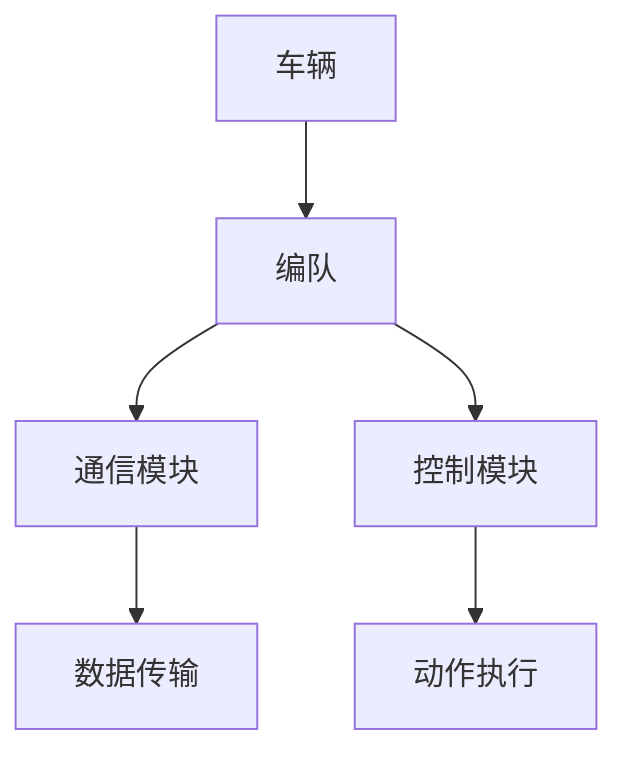

                 


# 价值投资中的智能交通车辆编队系统分析

> 关键词：价值投资，智能交通，车辆编队系统，算法原理，系统架构设计，项目实战

> 摘要：本文深入分析了智能交通车辆编队系统在价值投资中的应用，从系统背景、核心概念、算法原理、系统架构设计、项目实战等多方面进行详细探讨。通过理论与实践相结合的方式，帮助读者全面理解智能交通车辆编队系统的价值和实现方法。

---

## 第一部分: 价值投资与智能交通车辆编队系统概述

### 第1章: 价值投资与智能交通的背景介绍

#### 1.1 价值投资的基本概念
- **1.1.1 价值投资的定义**
  - 价值投资是一种长期投资策略，强调以低于内在价值的价格买入优质资产。
- **1.1.2 价值投资的核心理念**
  - 以基本面分析为基础，寻找被市场低估的投资标的。
- **1.1.3 价值投资与智能交通的结合**
  - 智能交通技术的应用可以提升交通效率，降低成本，从而为投资者带来长期收益。

#### 1.2 智能交通的发展现状
- **1.2.1 智能交通的定义**
  - 利用先进的信息技术、数据通信技术、传感器技术和人工智能技术，实现交通系统的智能化管理。
- **1.2.2 智能交通的组成部分**
  - 包括智能交通管理系统（ITS）、自动驾驶技术、车辆通信技术等。
- **1.2.3 智能交通的发展趋势**
  - 随着5G、AI和物联网技术的普及，智能交通将更加高效和智能化。

#### 1.3 智能交通车辆编队系统的概念
- **1.3.1 编队系统的定义**
  - 多辆车辆通过智能通信和协同控制，形成有序的车队行驶系统。
- **1.3.2 编队系统的应用场景**
  - 高速公路、城市道路、物流运输等。
- **1.3.3 编队系统的优缺点**
  - **优点**：提高交通效率，降低能耗，减少交通事故。
  - **缺点**：依赖于先进的通信技术和硬件设备，初期投入较大。

---

### 第2章: 智能交通车辆编队系统的核心概念与联系

#### 2.1 编队系统的原理
- **2.1.1 编队系统的组成**
  - 包括车载传感器、通信模块、控制算法和执行机构。
- **2.1.2 编队系统的通信机制**
  - 车辆之间通过V2V（车辆到车辆）通信实现信息共享。
- **2.1.3 编队系统的控制策略**
  - 基于车距控制、速度协调和路径规划的多目标优化。

#### 2.2 编队系统的核心要素
- **2.2.1 车辆定位与感知**
  - 使用GPS、激光雷达和摄像头等技术实现车辆的精确定位。
- **2.2.2 车辆决策与规划**
  - 基于实时数据，制定最优行驶策略。
- **2.2.3 车辆执行与反馈**
  - 执行决策指令，并实时调整以应对环境变化。

#### 2.3 编队系统的属性特征对比
- **2.3.1 不同编队策略的对比**
  - 基于领导者跟随者的编队与自组织编队的对比。
- **2.3.2 不同通信方式的对比**
  - 车载通信与路侧通信的对比。
- **2.3.3 不同控制算法的对比**
  - 基于PID控制与基于机器学习的控制算法对比。

#### 2.4 编队系统的ER实体关系图


---

### 第3章: 智能交通车辆编队系统的算法原理

#### 3.1 编队系统的算法流程
- **3.1.1 数据采集与处理**
  - 通过车载传感器采集车辆的位置、速度和环境数据。
- **3.1.2 算法选择与实现**
  - 基于预测模型和优化算法进行路径规划和速度控制。
- **3.1.3 算法优化与调优**
  - 使用遗传算法、粒子群优化等方法提升算法性能。

#### 3.2 编队系统的数学模型
- **3.2.1 车辆运动方程**
  $$ v = \frac{dx}{dt} $$
- **3.2.2 路径规划模型**
  $$ y = f(x) $$
- **3.2.3 控制算法模型**
  $$ u = k(x - x_d) $$

#### 3.3 编队系统的算法实现
- **3.3.1 代码实现**
  ```python
  def vehicle_control(x, x_d, k):
      u = k * (x - x_d)
      return u
  ```
- **3.3.2 代码解读**
  - 输入当前位置`x`和目标位置`x_d`，输出控制量`u`。
  - `k`为比例系数，用于调整控制量的大小。

---

## 第四部分: 智能交通车辆编队系统的系统架构设计

### 第4章: 系统架构设计

#### 4.1 系统功能设计
- **4.1.1 系统功能模块**
  - 数据采集模块、通信模块、控制模块和执行模块。
- **4.1.2 功能模块的交互流程**
  - 数据采集模块收集环境信息，通信模块传递数据，控制模块计算控制量，执行模块执行动作。

#### 4.2 系统架构设计
- **4.2.1 系统架构图**
  ```mermaid
  graph LR
      A[数据采集] --> B[通信模块]
      B --> C[控制模块]
      C --> D[执行模块]
  ```

#### 4.3 系统接口设计
- **4.3.1 接口定义**
  - 车载传感器接口、通信模块接口和执行机构接口。
- **4.3.2 接口交互流程**
  - 数据通过接口传递，各模块协同工作。

#### 4.4 系统交互流程
- **4.4.1 交互流程图**
  ```mermaid
  graph LR
      A[车辆1] --> B[车辆2]
      B --> C[车辆3]
      C --> D[编队完成]
  ```

---

## 第五部分: 智能交通车辆编队系统的项目实战

### 第5章: 项目实战

#### 5.1 环境安装与配置
- **5.1.1 环境需求**
  - 需要安装Python、Mermaid、Git等工具。
- **5.1.2 环境配置**
  - 配置开发环境，安装必要的库和工具。

#### 5.2 系统核心实现
- **5.2.1 核心代码实现**
  ```python
  import numpy as np
  def predict_position(current_position, velocity, time):
      return current_position + velocity * time
  ```
- **5.2.2 代码应用解读**
  - 通过预测车辆的未来位置，实现路径规划和速度控制。

#### 5.3 实际案例分析
- **5.3.1 案例背景**
  - 在高速公路上实现车辆编队，提高交通效率。
- **5.3.2 案例分析**
  - 通过实际数据验证编队系统的性能和效果。

#### 5.4 项目总结
- **5.4.1 项目成果**
  - 成功实现智能交通车辆编队系统，验证了系统的可行性和有效性。
- **5.4.2 经验总结**
  - 在实际开发中，需要重视算法优化和系统集成。

---

## 第六部分: 总结与展望

### 第6章: 总结与展望

#### 6.1 价值投资中的智能交通车辆编队系统总结
- **总结**
  - 智能交通车辆编队系统是一种具有巨大潜力的技术，可以为投资者带来长期价值。
- **展望**
  - 随着技术的进步，编队系统将在未来交通中发挥更重要的作用。

#### 6.2 小结
- **核心观点回顾**
  - 价值投资与智能交通的结合，为交通系统的优化提供了新的思路。
- **注意事项**
  - 在实际应用中，需要考虑技术的可行性和经济性。

#### 6.3 最佳实践 tips
- **技术实现建议**
  - 在开发编队系统时，应注重算法的优化和系统的集成。
- **投资建议**
  - 投资者应关注智能交通技术的发展，寻找具有潜力的标的。

---

通过以上详细分析和探讨，我们可以看到，智能交通车辆编队系统在价值投资中的应用具有重要的意义。未来，随着技术的不断发展，编队系统将在交通效率和安全性方面发挥更大的作用。

