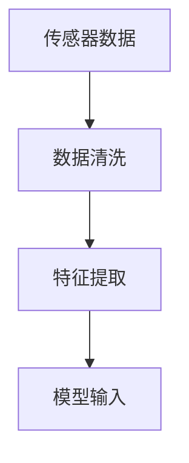
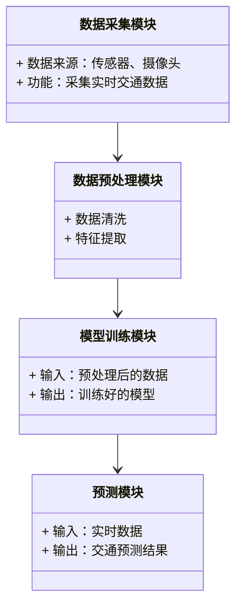
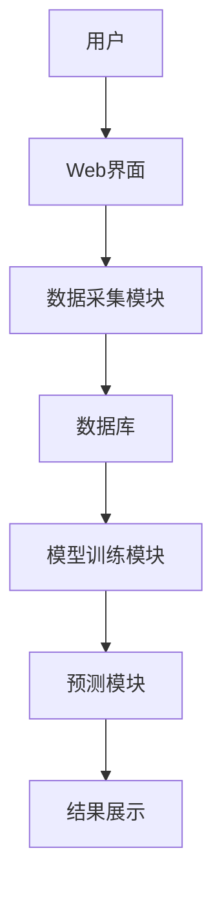
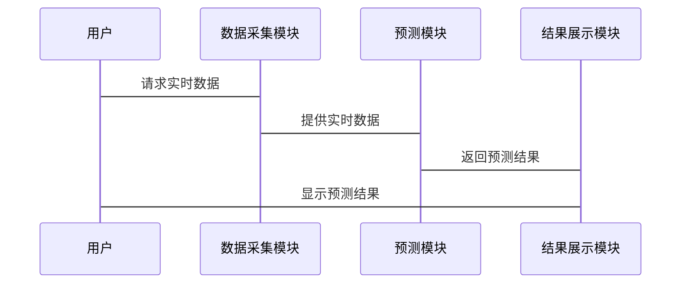

                 


# 价值投资中的智能交通预测系统分析

> 关键词：价值投资，智能交通预测，机器学习，时间序列分析，深度学习，投资决策

> 摘要：本文探讨了如何利用智能交通预测系统辅助价值投资决策，通过分析交通数据、构建预测模型、优化投资策略，展示了技术与金融的深度融合。

---

## 第1章: 价值投资与智能交通预测系统背景

### 1.1 价值投资的基本概念

#### 1.1.1 价值投资的定义与核心理念
价值投资是一种长期投资策略，强调以低于内在价值的价格购买优质资产。其核心理念是寻找市场低估的公司，通过长期持有实现收益。

#### 1.1.2 价值投资在现代金融中的地位
价值投资是投资学的重要流派，强调基本面分析和长期视角。在现代金融中，它与技术分析、量化投资等方法并行，为投资者提供了多样化的选择。

#### 1.1.3 价值投资与智能交通预测的结合
通过智能交通预测系统，投资者可以更准确地评估交通流量、基础设施状况等对相关行业（如房地产、物流）的影响，从而优化投资决策。

### 1.2 智能交通预测系统的基本概念

#### 1.2.1 智能交通预测系统的定义
智能交通预测系统利用先进的数据采集、分析和预测技术，对交通流量、拥堵情况等进行实时预测，帮助优化交通管理。

#### 1.2.2 智能交通预测系统的核心技术
- 数据采集技术：通过传感器、摄像头等设备获取交通数据。
- 数据分析技术：利用机器学习、深度学习等方法对数据进行分析。
- 预测模型：构建时间序列模型、LSTM等预测模型。

#### 1.2.3 智能交通预测系统在交通管理中的应用
- 实时监控交通流量。
- 预测交通拥堵情况。
- 优化交通信号灯配置。

### 1.3 价值投资与智能交通预测系统的关联

#### 1.3.1 交通预测对投资决策的影响
交通状况直接影响房地产、物流等行业的发展。通过智能交通预测，投资者可以更准确地评估这些行业的潜在价值。

#### 1.3.2 智能交通预测系统如何辅助价值投资
- 提供交通流量数据，帮助评估房地产项目的潜在收益。
- 预测物流成本，优化供应链管理。
- 优化城市交通规划，提升城市整体价值。

#### 1.3.3 价值投资视角下的交通预测系统优化
- 强化预测模型的准确性，提升投资决策的可靠性。
- 结合市场趋势，动态调整预测参数。

### 1.4 本章小结
本章介绍了价值投资和智能交通预测系统的背景，分析了它们的定义、核心技术及其在投资决策中的应用。

---

## 第2章: 智能交通预测系统的核心概念与原理

### 2.1 智能交通预测系统的数据流分析

#### 2.1.1 数据来源与处理流程
- 数据来源：交通传感器、摄像头、历史交通数据。
- 数据预处理：清洗、归一化、特征提取。
- 数据流展示（mermaid图）：


#### 2.1.2 数据特征提取与分析
- 时间序列特征：周期性、趋势、随机性。
- 空间特征：交通节点、道路网络结构。

#### 2.1.3 数据预处理与标准化
- 数据清洗：去除异常值。
- 数据标准化：归一化处理。

### 2.2 智能交通预测系统的算法选择

#### 2.2.1 时间序列分析方法
- ARIMA模型：适用于线性时间序列预测。
- GARCH模型：适用于波动性预测。

#### 2.2.2 机器学习算法在交通预测中的应用
- 支持向量回归（SVR）：适合非线性关系。
- 随机森林：适用于多特征数据。

#### 2.2.3 深度学习模型的优劣势对比
| 模型 | 优势 | 劣势 |
|------|------|------|
| LSTM | 长期依赖关系处理能力强 | 训练时间长，参数多 |
| CNN  | 局部特征提取能力强 | 需要特定的输入结构 |

### 2.3 智能交通预测系统的数学模型构建

#### 2.3.1 时间序列模型（ARIMA）
ARIMA模型通过自回归和移动平均部分拟合时间序列数据。其公式为：
$$ ARIMA(p, d, q) $$
其中，p为自回归阶数，d为差分阶数，q为移动平均阶数。

#### 2.3.2 长短期记忆网络（LSTM）
LSTM通过细胞状态和门控机制处理长序列数据。其核心公式为：
$$
f_t = \sigma(g_t \\
c_t = f_t * c_{t-1} + i_t * g_t \\
o_t = \sigma(h_t)
$$
其中，$f_t$、$i_t$、$o_t$分别为遗忘门、输入门和输出门。

#### 2.3.3 模型评估与优化方法
- 评估指标：均方误差（MSE）、R²值。
- 优化方法：网格搜索、随机搜索。

### 2.4 本章小结
本章详细讲解了智能交通预测系统的数据流、算法选择和数学模型构建，为后续分析奠定了基础。

---

## 第3章: 价值投资中的交通预测系统应用分析

### 3.1 交通预测在房地产投资中的应用

#### 3.1.1 房地产投资与交通流量的关系
交通流量直接影响房地产项目的可达性和价值。例如，交通便利的区域通常房价较高。

#### 3.1.2 智能交通预测对房地产价值的影响
- 预测交通流量变化，评估区域发展潜力。
- 优化商业地产选址。

#### 3.1.3 案例分析：某城市交通预测与房地产投资决策
通过智能交通预测系统，某房地产公司成功预测出某区域未来交通流量的增长，提前布局该区域的房地产开发，获得了超额收益。

### 3.2 交通预测在物流投资中的应用

#### 3.2.1 物流行业与交通流量的关联
交通流量影响物流成本和运输效率。通过智能交通预测，物流公司可以优化配送路线和时间。

#### 3.2.2 智能交通预测对物流成本的影响
- 预测交通拥堵情况，优化配送路径。
- 降低运输成本。

#### 3.2.3 案例分析：某物流公司基于交通预测的优化策略
某物流公司利用智能交通预测系统，成功预测出某区域的交通高峰时段，调整配送策略，降低了物流成本。

### 3.3 交通预测在城市交通规划中的应用

#### 3.3.1 城市交通规划的现状与挑战
城市化进程中，交通拥堵、资源浪费等问题日益突出。

#### 3.3.2 智能交通预测在城市交通规划中的作用
- 优化交通信号灯配置。
- 合理规划道路扩建。

#### 3.3.3 案例分析：某城市智能交通规划的实施效果
某城市通过智能交通预测系统优化了交通信号灯配置，显著降低了交通拥堵率。

### 3.4 本章小结
本章通过多个案例展示了智能交通预测系统在房地产、物流和城市交通规划中的应用，强调了其在价值投资中的重要性。

---

## 第4章: 智能交通预测系统的算法实现与优化

### 4.1 时间序列分析模型的实现

#### 4.1.1 ARIMA模型的实现步骤
1. 数据预处理：清洗、归一化。
2. 模型参数选择：通过网格搜索确定p、d、q。
3. 模型训练与验证。
4. 预测与评估。

#### 4.1.2 ARIMA模型的Python代码实现
```python
from statsmodels.tsa.arima_model import ARIMA
import pandas as pd

# 数据加载与预处理
data = pd.read_csv('traffic_data.csv')
data = data['traffic_volume'].values

# 模型训练
model = ARIMA(data, order=(5, 1, 0))
model_fit = model.fit()

# 预测
forecast = model_fit.forecast(steps=10)
print(forecast)
```

### 4.2 LSTM模型的实现与优化

#### 4.2.1 LSTM模型的实现步骤
1. 数据预处理：归一化、分割训练集和测试集。
2. 模型构建：定义LSTM结构。
3. 模型训练：使用GPU加速训练。
4. 预测与评估。

#### 4.2.2 LSTM模型的Python代码实现
```python
import numpy as np
from tensorflow.keras.models import Sequential
from tensorflow.keras.layers import LSTM, Dense, Dropout

# 数据加载与预处理
data = pd.read_csv('traffic_data.csv')
data = data['traffic_volume'].values
data = data.reshape(-1, 1)
data = data.astype('float32')

# 数据归一化
scaler = MinMaxScaler(feature_range=(0, 1))
data_normalized = scaler.fit_transform(data)

# 数据分割
train_size = int(len(data_normalized) * 0.7)
train_data = data_normalized[:train_size]
test_data = data_normalized[train_size:]

# 创建数据集
def create_dataset(data, look_back=1):
    X, Y = [], []
    for i in range(len(data) - look_back):
        X.append(data[i:i+look_back])
        Y.append(data[i+look_back])
    return np.array(X), np.array(Y)

look_back = 10
X_train, Y_train = create_dataset(train_data, look_back)
X_test, Y_test = create_dataset(test_data, look_back)

X_train = X_train.reshape(X_train.shape[0], X_train.shape[1], 1)
X_test = X_test.reshape(X_test.shape[0], X_test.shape[1], 1)

# 模型构建
model = Sequential()
model.add(LSTM(50, input_shape=(look_back, 1)))
model.add(Dropout(0.2))
model.add(Dense(1))
model.compile(loss='mean_squared_error', optimizer='adam')

# 模型训练
model.fit(X_train, Y_train, epochs=50, batch_size=64, validation_data=(X_test, Y_test))

# 预测与评估
Y_pred = model.predict(X_test)
Y_pred = scaler.inverse_transform(Y_pred)
Y_test_real = scaler.inverse_transform(Y_test.reshape(-1, 1))

print('均方误差:', np.mean((Y_pred - Y_test_real)**2))
```

### 4.3 本章小结
本章详细讲解了ARIMA和LSTM模型的实现步骤，并通过Python代码展示了模型的构建与训练过程，为后续分析提供了技术基础。

---

## 第5章: 智能交通预测系统的架构设计

### 5.1 系统功能设计（领域模型mermaid类图）


### 5.2 系统架构设计（mermaid架构图）


### 5.3 系统接口设计
- 数据采集模块接口：提供实时数据接口。
- 预测模块接口：提供交通预测结果接口。

### 5.4 系统交互（mermaid序列图）


### 5.5 本章小结
本章通过系统架构设计，展示了智能交通预测系统的整体结构和各模块之间的交互关系。

---

## 第6章: 项目实战——基于智能交通预测系统的价值投资分析

### 6.1 项目背景与目标
通过智能交通预测系统，分析某城市交通流量变化，评估其对房地产和物流行业的影响，优化投资决策。

### 6.2 项目环境与工具
- 环境：Python 3.8+
- 工具：TensorFlow、Keras、Pandas、Matplotlib。

### 6.3 项目核心实现

#### 6.3.1 数据采集与预处理
```python
import pandas as pd
import numpy as np

# 数据加载
data = pd.read_csv('traffic_data.csv')

# 数据清洗
data.dropna(inplace=True)

# 特征提取
features = data[['hour', 'day', 'month', 'year']]
target = data['traffic_volume']
```

#### 6.3.2 模型训练与预测
```python
from tensorflow.keras.models import Sequential
from tensorflow.keras.layers import LSTM, Dense, Dropout

# 模型构建
model = Sequential()
model.add(LSTM(50, input_shape=(look_back, 1)))
model.add(Dropout(0.2))
model.add(Dense(1))
model.compile(loss='mean_squared_error', optimizer='adam')

# 模型训练
model.fit(X_train, Y_train, epochs=50, batch_size=64, validation_data=(X_test, Y_test))
```

#### 6.3.3 投资分析与决策
通过预测的交通流量，评估某区域房地产项目的潜在收益，优化投资组合。

### 6.4 实际案例分析
某房地产公司通过智能交通预测系统，预测某区域未来交通流量将大幅增加，决定提前布局该区域的房地产开发，最终获得了超额收益。

### 6.5 项目小结
本章通过一个实际项目展示了智能交通预测系统的应用，证明了其在价值投资中的有效性。

---

## 第7章: 总结与展望

### 7.1 本章总结
智能交通预测系统通过先进的数据采集、分析和预测技术，为价值投资提供了有力的技术支持。通过本文的分析，投资者可以更准确地评估交通状况对相关行业的影响，优化投资决策。

### 7.2 未来展望
未来，随着人工智能和大数据技术的不断发展，智能交通预测系统将更加智能化和精准化。投资者可以利用这些技术，进一步优化投资策略，实现更高的投资收益。

### 7.3 最佳实践 tips
- 结合市场趋势，动态调整预测模型。
- 定期更新数据，保持模型的准确性。
- 多维度分析，全面评估投资风险。

### 7.4 本章小结
本文总结了智能交通预测系统在价值投资中的应用，并展望了未来的发展方向，为投资者提供了宝贵的参考。

---

## 关键词
价值投资，智能交通预测，机器学习，时间序列分析，深度学习，投资决策

---

## 摘要
本文探讨了如何利用智能交通预测系统辅助价值投资决策，通过分析交通数据、构建预测模型、优化投资策略，展示了技术与金融的深度融合。文章详细讲解了智能交通预测系统的数据流、算法实现、系统架构，并通过实际案例展示了其在房地产、物流和城市交通规划中的应用。未来，随着人工智能技术的不断发展，智能交通预测系统将在价值投资中发挥更大的作用。

