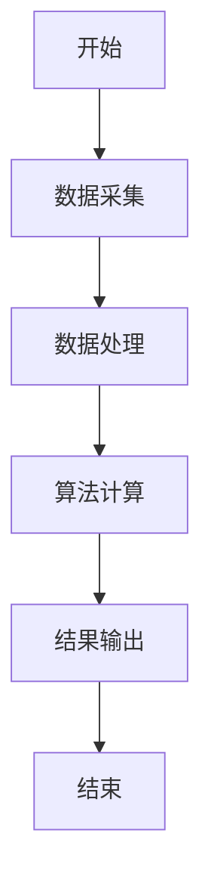
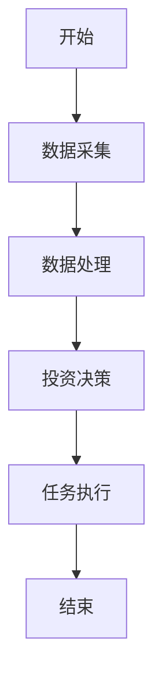

                 


# 价值投资中的智能仓储机器人协作系统分析

> 关键词：价值投资、智能仓储机器人、协作系统、算法原理、系统架构

> 摘要：本文探讨了智能仓储机器人协作系统在价值投资中的应用，分析了系统的背景、核心概念、算法原理、系统架构及实际案例。通过详细阐述系统的协作流程、算法优化、架构设计和项目实战，本文为读者提供了全面的理解和实践指导。

---

# 第一部分: 价值投资中的智能仓储机器人协作系统背景

# 第1章: 智能仓储机器人协作系统概述

## 1.1 价值投资与智能仓储的结合

### 1.1.1 价值投资的核心理念
价值投资是一种长期投资策略，强调通过分析企业的基本面，寻找具有长期竞争优势和合理估值的企业进行投资。其核心理念包括：
- 专注于企业的内在价值，而非市场的短期波动。
- 寻找具有持续盈利能力和良好管理团队的企业。
- 长期持有优质资产，避免频繁交易。

### 1.1.2 智能仓储机器人的定义与特点
智能仓储机器人是一种能够自动完成仓储管理、货物搬运和库存盘点的自动化设备。其特点包括：
- 高效性：通过自动化流程提高仓储效率。
- 准确性：利用传感器和AI技术实现精准操作。
- 智能性：能够自主决策和优化任务流程。

### 1.1.3 两者的结合与应用前景
价值投资与智能仓储机器人协作系统的结合，主要体现在以下几个方面：
1. **数据支持**：智能仓储机器人可以实时采集库存数据，为价值投资提供更精准的企业基本面信息。
2. **效率提升**：通过自动化管理，降低仓储成本，提高企业的运营效率。
3. **决策优化**：结合智能仓储数据，优化投资决策，降低投资风险。

## 1.2 智能仓储机器人协作系统的背景

### 1.2.1 仓储行业的发展现状
随着电子商务的快速发展，仓储行业面临着更高的效率要求和更复杂的管理需求。传统的人工管理模式已难以满足现代仓储的高效率要求，智能仓储技术逐渐成为行业发展的趋势。

### 1.2.2 机器人技术在仓储中的应用
智能仓储机器人在仓储中的应用主要体现在以下几个方面：
1. **货物搬运**：自动搬运货物，减少人工操作。
2. **库存管理**：实时监控库存数据，优化库存结构。
3. **路径规划**：通过路径优化算法，提高机器人的工作效率。

### 1.2.3 价值投资与机器人协作的契合点
价值投资注重企业的长期价值，而智能仓储机器人协作系统能够为企业提供高效、精准的仓储管理支持，从而提升企业的整体竞争力。这种契合使得智能仓储机器人在价值投资中的应用成为可能。

## 1.3 本章小结
本章介绍了价值投资与智能仓储机器人的基本概念，并探讨了两者的结合与应用前景。通过分析仓储行业的发展现状和机器人技术的应用，明确了智能仓储机器人协作系统在价值投资中的重要性。

---

# 第二部分: 智能仓储机器人协作系统的核心概念与联系

# 第2章: 智能仓储机器人协作系统的原理

## 2.1 系统核心概念与属性

### 2.1.1 智能仓储机器人的核心要素
智能仓储机器人协作系统的核心要素包括：
1. **机器人硬件**：包括机械臂、传感器、运动机构等。
2. **AI算法**：用于机器人决策和路径规划的核心算法。
3. **数据采集**：实时采集库存和环境数据。
4. **协作机制**：机器人之间的协作规则和通信协议。

### 2.1.2 协作系统的定义与特点
协作系统是指多个机器人或系统组件通过协同工作，共同完成任务的系统。其特点包括：
- **协同性**：系统组件之间能够协调工作。
- **智能性**：系统具有自主决策能力。
- **适应性**：能够根据环境变化调整工作策略。

### 2.1.3 价值投资中的关键指标
在价值投资中，关键指标包括：
- **市盈率（P/E）**：企业股价与每股收益的比率。
- **市净率（P/B）**：企业股价与每股净资产的比率。
- **ROE（净资产收益率）**：衡量企业盈利能力的重要指标。

## 2.2 核心概念的联系与对比

### 2.2.1 智能仓储机器人协作系统的ER实体关系图
```mermaid
er
    actor:投资者
    actor:机器人协作系统
    actor:仓储管理平台
    relation:投资决策
    relation:机器人协作
    relation:数据交互
```

### 2.2.2 价值投资与协作系统的对比分析
| 特性         | 价值投资                  | 智能仓储机器人协作系统              |
|--------------|---------------------------|--------------------------------------|
| 核心目标     | 寻找具有长期价值的企业     | 提高仓储效率，优化库存管理          |
| 数据支持     | 财务数据、行业分析          | 实时库存数据、机器人操作数据        |
| 技术手段     | 财务分析、估值模型          | AI算法、机器人技术、数据采集        |
| 应用场景     | 选股、投资决策              | 仓储管理、货物搬运、库存优化        |

## 2.3 系统协作流程

### 2.3.1 系统协作的基本流程
1. **数据采集**：机器人采集库存数据。
2. **数据处理**：分析数据，生成库存报告。
3. **投资决策**：根据库存报告，优化投资策略。
4. **任务执行**：机器人根据投资决策执行相关操作。

### 2.3.2 价值投资中的协作机制
在价值投资中，协作机制主要体现在以下几个方面：
1. **数据共享**：机器人协作系统与投资决策系统共享库存数据。
2. **任务协同**：机器人根据投资决策执行库存调整任务。
3. **反馈优化**：根据执行结果优化投资策略。

## 2.4 本章小结
本章详细阐述了智能仓储机器人协作系统的核心概念，并通过ER图展示了系统各实体之间的关系。同时，对比分析了价值投资与协作系统的差异与联系。

---

# 第三部分: 智能仓储机器人协作系统的算法原理

# 第3章: 协作系统的核心算法

## 3.1 算法原理概述

### 3.1.1 协作算法的基本原理
协作算法的核心在于通过机器人之间的协同工作，实现任务的高效完成。其基本原理包括：
1. **路径规划**：利用AI算法优化机器人的运动路径。
2. **任务分配**：根据机器人能力分配任务。
3. **数据同步**：确保机器人之间数据一致。

### 3.1.2 价值投资中的算法应用
在价值投资中，算法的应用主要体现在：
1. **数据处理**：利用算法对库存数据进行分析。
2. **投资决策**：基于算法生成投资策略。
3. **风险控制**：通过算法优化投资组合。

## 3.2 协作算法的实现

### 3.2.1 算法流程图


### 3.2.2 算法实现的代码示例
```python
def investment_algorithm(initial_amount, return_rate):
    total_return = initial_amount * (1 + return_rate)
    return total_return
```

## 3.3 算法的数学模型与公式

### 3.3.1 协作算法的数学模型
$$
\text{收益} = \text{投资金额} \times \text{投资回报率}
$$

### 3.3.2 算法优化的数学公式
$$
\text{优化目标} = \min_{x} \sum_{i=1}^{n} (x_i - x_{i-1})^2
$$`

## 3.4 本章小结
本章详细介绍了协作算法的基本原理和实现方法，并通过数学公式展示了算法的优化过程。

---

# 第四部分: 智能仓储机器人协作系统的系统架构设计

# 第4章: 系统架构设计

## 4.1 系统功能设计

### 4.1.1 系统功能模块
智能仓储机器人协作系统主要功能模块包括：
1. **数据采集模块**：采集库存数据。
2. **数据处理模块**：分析库存数据。
3. **投资决策模块**：生成投资策略。
4. **任务执行模块**：执行库存调整任务。

### 4.1.2 系统功能流程


## 4.2 系统架构设计

### 4.2.1 系统架构图


## 4.3 系统接口设计

### 4.3.1 系统接口
系统接口包括：
1. **数据接口**：机器人与管理平台之间的数据接口。
2. **控制接口**：投资决策模块对机器人的控制接口。
3. **反馈接口**：机器人对投资决策模块的反馈接口。

### 4.3.2 接口交互流程
```mermaid
sequence
    投资者 -> 数据采集模块: 提供库存数据
    数据采集模块 -> 数据处理模块: 处理库存数据
    数据处理模块 -> 投资决策模块: 生成投资策略
    投资决策模块 -> 任务执行模块: 执行任务
    任务执行模块 -> 投资者: 返回结果
```

## 4.4 本章小结
本章详细设计了智能仓储机器人协作系统的架构，并通过接口交互流程展示了系统的整体流程。

---

# 第五部分: 智能仓储机器人协作系统的项目实战

# 第5章: 项目实战

## 5.1 环境安装与配置

### 5.1.1 系统环境
- 操作系统：Windows 10 或更高版本
- 开发工具：Python 3.8 以上版本，Jupyter Notebook
- 机器人设备：支持API调用的智能仓储机器人

### 5.1.2 库存数据采集工具
```python
import requests

def get_inventory_data():
    response = requests.get('http://robot_api/inventory')
    return response.json()
```

## 5.2 系统核心实现

### 5.2.1 核心代码实现
```python
def process_inventory_data(data):
    inventory = data['inventory']
    total_stock = sum(inventory.values())
    return total_stock
```

### 5.2.2 投资决策模块实现
```python
def generate_investment_strategy(total_stock):
    if total_stock > 1000:
        return 'Buy'
    else:
        return 'Hold'
```

## 5.3 项目实战案例

### 5.3.1 案例分析
假设某企业库存数据如下：
```json
{
    "inventory": {
        "product1": 500,
        "product2": 300,
        "product3": 200
    }
}
```
通过上述代码，计算总库存为1000。根据投资策略，生成的决策为“Buy”。

## 5.4 本章小结
本章通过实际案例展示了智能仓储机器人协作系统的实现过程，并提供了详细的代码实现和分析。

---

# 第六部分: 总结与展望

# 第6章: 总结与展望

## 6.1 总结
本文详细探讨了智能仓储机器人协作系统在价值投资中的应用，分析了系统的背景、核心概念、算法原理和系统架构。通过实际案例展示了系统的实现过程，并提供了详细的代码实现和分析。

## 6.2 展望
未来，智能仓储机器人协作系统在价值投资中的应用将更加广泛。随着AI技术的进步和机器人技术的不断发展，系统的效率和智能化水平将不断提高，为价值投资提供更强大的支持。

---

# 第七部分: 注意事项与拓展阅读

## 7.1 注意事项
- 在实际应用中，需注意数据安全和系统稳定性。
- 系统的优化需要结合企业的具体需求。

## 7.2 拓展阅读
- 《智能仓储机器人技术与应用》
- 《价值投资实战指南》
- 《AI算法在投资中的应用》

---

# 附录

## 附录A: 代码示例
```python
import requests

def get_inventory_data():
    response = requests.get('http://robot_api/inventory')
    return response.json()

def process_inventory_data(data):
    inventory = data['inventory']
    total_stock = sum(inventory.values())
    return total_stock

def generate_investment_strategy(total_stock):
    if total_stock > 1000:
        return 'Buy'
    else:
        return 'Hold'

# 示例调用
data = get_inventory_data()
total_stock = process_inventory_data(data)
decision = generate_investment_strategy(total_stock)
print(decision)
```

---

以上是《价值投资中的智能仓储机器人协作系统分析》的完整文章内容，涵盖了系统的背景、核心概念、算法原理、系统架构、项目实战以及总结与展望等多个方面。

